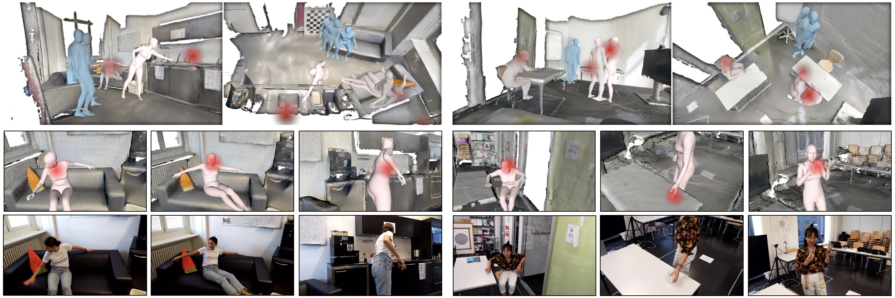
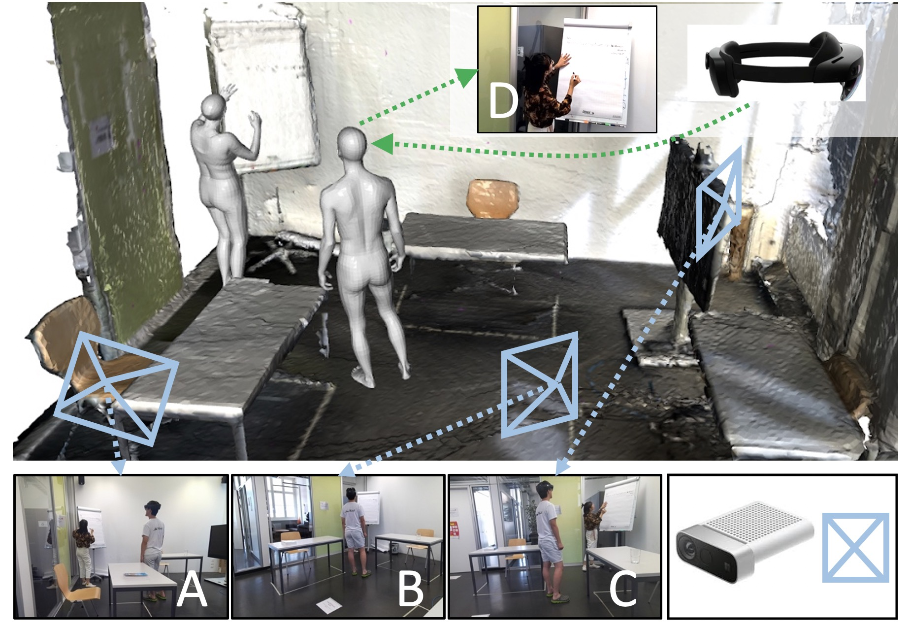

# EgoBody

目标：理解 EgoBody 为什么适合研究第一视角下的人体 3D 姿态、人体形状和社交交互；能看懂 HoloLens2、Azure Kinect、SMPL-X、camera wearer、interactee 这些概念，也能判断它和手-物操作数据集的区别。

> 先修：[Ego-Exo4D](02-ego-exo4d.md) → [HoloAssist](12-holoassist.md)
> 建议：这一节重点看“机器人或头戴设备如何从自己的视角理解周围的人”，不要把 EgoBody 当成手-物交互数据集
> 数据集规模：EgoBody 包含 125 个交互序列、36 名参与者和约 42 万帧同步第一/第三视角数据，同时提供 RGB-D、眼动、手/头部追踪以及 3D 人体姿态和形状标注。

EgoBody 是 ECCV 2022 的数据集，论文题目是 **EgoBody: Human Body Shape and Motion of Interacting People from Head-Mounted Devices**。它研究的不是“手拿物体怎么操作”，而是另一个对具身 AI 同样重要的问题：如果一个机器人、AR 眼镜或头戴设备从自己的视角观察周围的人，能不能估计对方的 3D 身体姿态、身体形状、运动和人与场景的关系？

这类能力在家庭机器人、服务机器人和人机协作里很关键。机器人不能只识别桌上的杯子，还要知道旁边的人站在哪里、身体朝向哪里、手臂是否伸向某个物体、是否正在和自己互动。EgoBody 正是围绕这种“第一视角下的人体理解”设计的。

先看一张整体效果图。图中既有重建出的 3D 场景，也有人体 SMPL-X mesh 和第一视角 RGB 画面。红色区域表示 gaze，也就是头戴设备佩戴者的视线关注区域。



一句话概括 EgoBody：

```text
EgoBody 用 HoloLens2 记录第一视角 RGB、depth、gaze、head/hand tracking，
同时用 3-5 台 Azure Kinect 从外部同步采集 RGB-D，
为交互中的两个人提供 SMPL-X/SMPL 3D 人体姿态、形状和运动标注。
```

## 它到底收集了什么

EgoBody 采集的是室内场景中两个人互动的数据。一个人戴着 HoloLens2，记录第一视角多模态数据；周围布置 3 到 5 台 Azure Kinect，从外部同步记录 RGB-D。研究者再利用多视角 RGB-D 拟合 SMPL-X/SMPL 人体模型，得到较准确的 3D 姿态和身体形状标注。

数据规模可以这样记：

| 项目 | 数量或形式 | 怎么理解 |
|---|---:|---|
| sequences | 125 段 | 不同互动片段 |
| subjects | 36 人 | 参与交互的人 |
| indoor 3D scenes | 15 个 | 室内三维场景 |
| 第三人称 RGB-D 帧 | 219,731 帧 | 3-5 台 Azure Kinect 同步采集 |
| 第一人称 RGB 帧 | 199,111 帧 | HoloLens2 采集，并和 Kinect 同步 |
| HoloLens2 模态 | RGB、depth、eye gaze、head tracking、hand tracking | 第一视角多模态输入 |
| 人体标注 | SMPL-X / SMPL | 3D body pose、shape、motion |
| 额外文本 | Motion-X 提供 motion text labels | 可用于动作文本关联 |

这组数据有两个层次。

第一层是第一视角观测：

```text
HoloLens2:
  RGB image
  depth
  eye gaze
  head tracking
  hand tracking
```

这相当于一个可穿戴设备或机器人自己能看到、能测到的东西。

第二层是真值标注：

```text
multi-view Azure Kinect:
  synchronized RGB-D
  scene geometry
  SMPL-X / SMPL body mesh
  3D pose, shape and motion
```

这部分不是未来部署时一定能拿到的输入，而是训练和评估模型时使用的监督信号。

## 采集系统是怎么搭起来的

下面这张图展示了 EgoBody 的采集设置。A、B、C 是外部 Azure Kinect 视角，D 是 HoloLens2 第一视角。HoloLens2 戴在其中一个参与者头上，它记录自己看到的画面，同时保存 depth、head、hand 和 eye gaze 信息。



这个设计解决了一个很现实的问题：第一视角数据很适合模拟机器人或 AR 设备的输入，但第一视角下很难直接得到准确的全身 3D 真值。比如对方身体可能被桌子挡住，腿部可能不在画面里，近距离时人体会被裁切。

所以 EgoBody 采用了“两套系统同步”的方式：

```text
HoloLens2:
  提供第一视角输入，接近实际使用时的感知条件。

Azure Kinect rig:
  从多个外部视角提供 RGB-D，用来恢复更完整的 3D 人体和场景。

标定与同步:
  把头戴设备和多相机系统放到同一个坐标关系里。
```

这样做的好处是，模型可以学习“只看第一视角输入时，如何预测周围人的 3D 身体状态”，同时评估时又有多视角系统生成的 3D 标注作为参考。

## camera wearer 和 interactee 是什么

读 EgoBody 时，先要分清两类人。

`camera wearer` 是戴 HoloLens2 的人。他是第一视角相机的携带者，也就是数据里“自己视角”的来源。

`interactee` 是和 camera wearer 互动的人。很多任务的核心是从 camera wearer 的第一视角里估计 interactee 的身体姿态和运动。

可以把一段交互理解成：

```text
camera wearer:
  戴着 HoloLens2
  看向另一个人
  和对方交流、移动或协作
  产生第一视角 RGB、depth、gaze、head/hand tracking

interactee:
  出现在 camera wearer 的视野里
  可能站立、坐下、走动、指向物体或做手势
  需要被估计 3D 身体姿态和运动
```

EgoBody 的标注覆盖 interacting people，也包括 camera wearer 和 interactee 的 SMPL-X/SMPL 姿态与形状。只是从第一视角任务的角度看，最典型的问题是：给定 camera wearer 看到的画面，估计视野里另一个人的 3D 状态。

这和手-物数据集的关注点很不一样。HOI4D、ARCTIC、EgoDex 关心的是手和物体；EgoBody 关心的是人和人，以及人体与场景。

## SMPL-X 是什么

`SMPL-X` 是一种参数化人体模型。可以把它理解成一个可调节的 3D 人体 mesh：通过一组参数控制身体形状、身体姿态、手部姿态和面部表情等。相比只给 17 个或 25 个 3D 关节点，SMPL-X 更完整，因为它提供的是一个人体表面模型。

在 EgoBody 里，SMPL-X / SMPL 标注的意义是：

```text
不是只知道“头、肩、肘、膝盖在哪里”，
而是能得到一个和场景对齐的人体 3D mesh，
包括身体形状、姿态和随时间变化的运动。
```

这对人机交互很有用。比如机器人需要判断一个人是否靠得太近、手臂是否伸向自己、身体是否挡住通道、对方是否正在坐下或站起。只有 2D 检测框往往不够，3D 身体姿态和身体朝向会更可靠。

不过也要注意，SMPL-X 是拟合出来的人体模型，不等于真实扫描出来的完整人体。它提供的是结构化、可学习、可评估的 3D 表示。

## 它适合研究哪些任务

EgoBody 最直接支持的是第一视角人体姿态、身体形状和运动估计。也就是给模型第一视角图像或多模态输入，让它预测周围人的 3D 身体状态。

可以拆成几个任务：

| 任务 | 问的问题 | 为什么重要 |
|---|---|---|
| 3D human pose estimation | 对方身体各部分在三维空间哪里 | 机器人需要理解人的姿态和动作 |
| body shape estimation | 对方身体形状大致是什么 | 影响空间占用和人机距离判断 |
| human motion estimation | 对方随时间如何移动 | 支持轨迹预测和避障 |
| human-scene interaction | 人体和场景如何接触或靠近 | 判断坐下、站起、靠近桌面等状态 |
| social interaction understanding | 两个人如何互动 | 支持服务机器人、协作机器人和 AR 助手 |

这里的“第一视角人体理解”比普通人体姿态估计更难。第三人称相机通常能看到整个人，第一视角相机则经常只看到对方的一部分身体，而且画面会随着 camera wearer 的头部运动剧烈变化。

所以 EgoBody 研究的是一个更贴近具身系统的问题：

```text
当相机装在自己身上，而且自己也在动时，
如何理解身边另一个人的 3D 姿态和运动？
```

## 和具身 AI 的关系

EgoBody 对具身 AI 的价值不在于训练机械臂抓取，而在于让具身系统理解周围的人。

第一，它接近机器人第一视角感知。移动机器人、服务机器人、AR 眼镜和头戴设备都可能从类似的视角观察人类。EgoBody 提供了从这种视角估计人体 3D 状态的训练数据。

第二，它包含人和场景的关系。人不是漂浮在空中的骨架，而是在室内场景中站立、坐下、靠近桌子、转身、交流。对机器人来说，理解这些关系比单独检测一个人更有用。

第三，它提供 gaze 和 head tracking。camera wearer 看向哪里、头部如何转动，会影响第一视角画面，也能帮助理解交互注意力。

第四，它有多视角系统生成的 3D 真值。真实部署时机器人可能只有自己的相机，但训练阶段可以利用多视角真值学习更准确的 3D 人体理解。

典型应用可以包括：

```text
服务机器人判断人是否在向自己求助
移动机器人在人群中安全避让
AR 助手理解用户正在看谁或看哪里
协作机器人估计人的手臂和身体运动趋势
家庭机器人理解坐下、站起、靠近、转身等人体状态
```

但边界也要说清楚：

```text
EgoBody 不是机器人操作数据集。
它没有机器人 action、夹爪命令、力控数据或任务成功标注。

它也不是手-物精细操作数据集。
它的核心是第一视角下的人体、场景和社交交互。
```

## 下载和使用时要注意什么

EgoBody 的数据下载需要签署 license。第一次使用时，建议先阅读代码仓库里的数据格式说明，再决定下载哪些部分。

使用时要特别注意三件事。

第一，区分输入和标注。HoloLens2 的 RGB、depth、gaze、head/hand tracking 更接近模型部署时可能拿到的输入；SMPL-X/SMPL 则通常作为训练或评估标签。

第二，注意坐标系。EgoBody 涉及 HoloLens2、Azure Kinect、多视角标定、3D 场景和人体 mesh。如果代码里没有处理好坐标变换，就会出现人体位置和场景对不上的问题。

第三，明确你研究的是谁的身体。是估计 camera wearer 自己的身体，还是估计 interactee 的身体？是预测单帧姿态，还是预测一段 motion？这些任务设置要写清楚。

实验记录里建议写成：

```text
使用 EgoBody 哪个下载部分
使用 HoloLens2 RGB / depth / gaze 中哪些模态
是否使用 SMPL-X 或 SMPL 标注
预测对象是 camera wearer 还是 interactee
坐标系是在 camera frame、scene frame 还是 body frame
是否使用 Motion-X 的 motion text labels
```

## 和前面数据集的区别

| 数据集 | 主要关注点 | EgoBody 的区别 |
|---|---|---|
| Ego-Exo4D | 多视角技能活动、3D 点云、语言和身体动作 | EgoBody 更专注于室内社交交互中的 3D 人体姿态和形状 |
| HoloAssist | 执行者和指导者协作完成任务 | EgoBody 没有远程指导结构，更强调人体 3D 真值和场景对齐 |
| ARCTIC | 双手、全身和铰接物体操作 | EgoBody 不是物体操作数据，重点是人和人 |
| EgoPAT3D | 第一视角下的 3D 动作目标预测 | EgoBody 关注人体姿态和运动，不是手到达目标点 |

如果你的问题是“人手如何抓物体”，EgoBody 不是首选；如果你的问题是“机器人从自己的视角如何理解周围人的身体状态”，EgoBody 就非常相关。

## 常见误解

**误解一：EgoBody 是手-物交互数据集。**

不准确。它的核心是人体姿态、身体形状、人体运动和社交交互，不是物体抓取或工具操作。

**误解二：HoloLens2 数据本身就是真值 3D 姿态。**

不对。HoloLens2 提供第一视角多模态输入。高质量 3D 真值主要来自同步的多 Azure Kinect RGB-D 和 SMPL-X/SMPL 拟合。

**误解三：SMPL-X 就是普通骨架点。**

不对。SMPL-X 是参数化人体 mesh，包含身体形状和姿态，比简单 3D keypoints 更丰富。

**误解四：EgoBody 可以直接训练机器人控制策略。**

不可以。它没有机器人动作和执行反馈。它更适合训练人体感知、社交交互理解和安全协作相关模块。

**误解五：第一视角人体姿态估计和第三人称人体姿态估计差不多。**

差别很大。第一视角相机会运动、遮挡多、视野窄，还可能看不到完整人体。EgoBody 正是为了这个困难场景设计的。

## 小结

EgoBody 是“第一视角人体 3D 理解数据集”。它的价值不在手-物操作，而在于让模型学会从头戴设备或机器人视角理解周围人的身体姿态、运动和人与场景的关系。对具身 AI 来说，它补的是人机共处和安全协作这一环：机器人不只要看懂物体，也要看懂人。

进一步阅读可以看：
- [EgoBody 网站](https://sanweiliti.github.io/egobody/egobody.html)
- [EgoBody paper](https://arxiv.org/pdf/2112.07642.pdf)
- [EgoBody GitHub 仓库](https://github.com/sanweiliti/EgoBody)
- [EgoBody 数据下载入口](https://egobody.ethz.ch)
