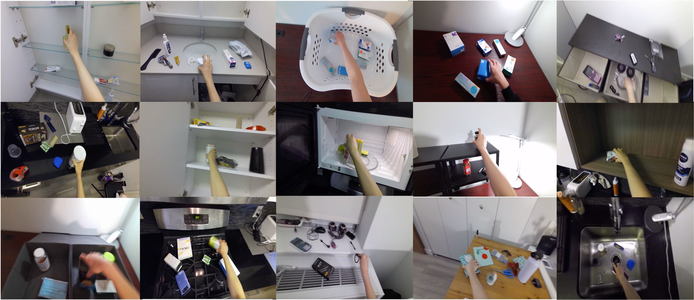
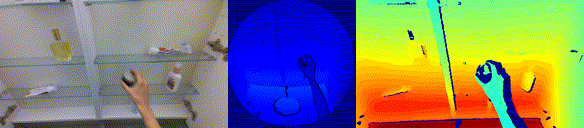

# EgoPAT3D

目标：理解 EgoPAT3D 为什么适合研究第一视角下的 3D action target prediction，能看懂 RGB-D、IMU、hand-object action、action frame、3D target 和 hand trajectory 这些概念，也能判断它和 EgoBody、EgoObjects、手-物交互数据集的区别。

> 先修：[EgoBody](15-egobody.md) → [HOI4D](06-hoi4d.md)
> 建议：这一节重点看“从当前第一视角观察预测手会伸向哪里”，不要把 EgoPAT3D 当成普通动作分类数据集
> 数据集规模：EgoPAT3D 包含约 108 万 RGB-D 第一视角视频帧和 15,000 个手-物交互动作序列，同时提供深度、IMU 和 3D 场景点云信息。

EgoPAT3D 是 CVPR 2022 论文 **Egocentric Prediction of Action Target in 3D** 提出的数据集。它研究的问题很具体：一个人从第一视角看到当前场景，手正在运动，模型能不能尽早预测这只手最后会到达哪个 **3D 位置**？

这个问题叫 `action target prediction`。它不是问“这段视频是什么动作”，也不是问“手现在在哪里”，而是问：

```text
根据当前看到的 RGB-D 画面和已经发生的一小段手部运动，
预测这次手-物交互最终会指向哪个 3D 目标点。
```

对具身 AI 来说，这个问题很实用。机器人如果能提前判断人的手要伸向哪里，就能提前避让、递送物体、协作抓取，或者预测人下一步的操作意图。

下面这张图展示了不同家庭场景里的第一视角手-物交互：打开柜子、伸手拿物体、靠近洗手池、从桌面取物等。它和 EgoBody 最大的区别是，EgoBody 关心周围人的身体姿态；EgoPAT3D 更关心第一视角中手的未来目标。



一句话概括 EgoPAT3D：

```text
EgoPAT3D 用 15 个家庭场景中的 150 段 RGB-D/IMU recording，
收集 15,000 个 hand-object actions 和约 108 万 RGB 帧，
研究如何从第一视角预测手部动作的 3D 目标位置。
```

## 它到底收集了什么

EgoPAT3D 的采集单位是 `recording`。每个家庭场景有 10 段 recording，每段大约 4 分钟。每段 recording 里包含多个手-物交互动作。

规模可以这样记：

| 项目 | 数量或形式 | 怎么理解 |
|---|---:|---|
| scenes | 15 个 | 家庭环境中的不同场景 |
| recordings | 150 段 | 每个 scene 有 10 段 recording |
| hand-object actions | 15,000 个 | 每段 recording 约 100 个动作 |
| RGB-D video | 约 600 分钟 | 每段约 4 分钟 |
| RGB frames | 约 1,080,000 帧 | 30 fps |
| hand action frames | 约 900,000 帧 | 按每个动作约 2 秒估算 |
| 传感器 | RGB-D + IR + IMU + temperature | 原始数据压缩在 Matroska `.mkv` 中 |
| 标注 | 2D / 3D labels + hand/action frames | 用于 action target prediction |

EgoPAT3D 的数据不只是 RGB 视频。主要包括：

```text
RGB color frames
depth
IR
IMU
temperature
RGB videos
labeled hand/action frames
MediaPipe Hands 推理结果
2D / 3D action target labels
```

这里要注意，MediaPipe Hands 的结果是手部姿态推理结果，不等同于人工逐帧标注的完美真值。真正做实验时，要看代码和标注文件里每个字段的来源，不要把所有 `.txt` 都当成同一种标签。

## action target prediction 是什么

`action target` 可以理解成这次手部动作最终要到达的目标位置。这个位置是三维空间中的点，而不是图像里的一个 2D 像素。

例如在第一视角画面中，手正在伸向柜子里的牙膏。模型不能等手已经碰到牙膏再判断，而是希望尽早预测： 这只手最终会到达柜子里某个 3D 位置， 也就是目标物体或目标接触区域所在的位置。

这个任务和普通动作识别很不一样：

| 任务 | 输入 | 输出 |
|---|---|---|
| Action recognition | 一段视频 | 动作类别 |
| Hand pose estimation | 一帧或多帧图像 | 当前手部关键点 |
| Trajectory prediction | 已观察到的运动 | 未来轨迹 |
| Action target prediction | 第一视角 RGB-D + 已观察运动 | 未来要到达的 3D 目标点 |

EgoPAT3D 更接近第四种。它关心的是“手会去哪里”，而不是只给动作取一个名字。

## 为什么一定要 3D

如果只在 2D 图像上预测目标点，会遇到一个问题：图像里的同一个像素位置，可能对应不同深度的空间位置。比如手看起来伸向柜子中间，但目标可能在前面的杯子上，也可能在后面的架子上。

EgoPAT3D 使用 RGB-D，是因为 depth 可以把图像点提升到三维空间。对于机器人来说，这一点很重要。机器人要避让或协作时，不能只知道“目标在画面右上角”，还要知道目标离自己多远、在空间中哪个位置。

可以把 2D 和 3D 的区别理解成：

```text
2D target:
  图像坐标中的一个点，例如 (u, v)

3D target:
  相机或场景坐标系中的一个点，例如 (x, y, z)
```

只有后者才能更自然地接到机器人坐标、避障规划和抓取空间里。

## RGB-D 示例

它把同一个动作从 RGB、深度和红外/深度相关视图中展示出来，可以直观看到第一视角手部运动和场景深度。



读这种数据时，不要只看手的外观。更重要的是同时看三件事：

```text
第一，手当前在哪里。
第二，手已经朝哪个方向运动。
第三，目标物体或目标区域在 3D 空间里在哪里。
```

这三件事合在一起，才构成 action target prediction 的输入线索。很多情况下，手刚开始运动时目标还不明显；随着手的轨迹逐渐展开，模型对目标的预测应该越来越准确。

## action frame 和 hand-object action 是什么

EgoPAT3D 里有 `hand-object action` 和 `hand action frames` 这类说法。可以这样理解：

`hand-object action` 是一次完整的手-物交互，比如伸手拿起一个物体、把手伸向柜子里的某个东西、把物体放到桌面某处。

`hand action frames` 是这次交互在视频中对应的帧段。它们告诉模型哪些帧属于这次动作，而不是让模型在整段 4 分钟视频里盲目搜索。

两者关系可以写成：

```text
recording_001:
  action_000:
    start_frame: ...
    end_frame: ...
    observed hand motion
    action target 2D / 3D label

  action_001:
    start_frame: ...
    end_frame: ...
    observed hand motion
    action target 2D / 3D label
```

这里的重点不是“每一帧是什么动作类别”，而是“这段动作最终要到达哪里”。所以它和 temporal action segmentation 不是一类任务。

## 它和具身 AI 的关系

EgoPAT3D 对具身 AI 的价值主要在预测人类短期操作意图。

第一，它帮助机器人提前判断人的手要去哪里。比如人手伸向桌面某个物体时，机器人可以提前预测目标，避免挡住路径，或者准备递送/接取物体。

第二，它把目标放到 3D 空间里。机器人规划需要空间坐标，单纯 2D 图像点不够用。EgoPAT3D 的 3D target 设定更接近机器人可用的表示。

第三，它使用第一视角。第一视角更接近头戴设备、胸前相机或部分服务机器人视角，也更接近“自己正在参与交互”的观察条件。

第四，它强调提前预测。很多机器人协作任务不能等动作完成后再反应，必须在动作早期就估计对方目标。

可以对应到这些场景：

```text
人伸手拿杯子，机器人提前让开路径。
人伸向抽屉，机器人预测他要打开抽屉。
人伸向桌面某个区域，机器人准备递送相关物体。
AR 助手根据手部目标提前显示提示。
```

但边界也要说清楚：

```text
EgoPAT3D 不是机器人遥操作数据集。
它没有机器人 joint action、末端执行器命令、夹爪状态或力控数据。

它预测的是人的手部动作目标，
不是直接输出机器人控制策略。
```

所以它更适合做人类动作目标预测、协作机器人意图理解、机器人避让和辅助交互，而不是直接训练机械臂抓取策略。

## 下载和使用时要注意什么

EgoPAT3D 的数据和代码在 GitHub 上分不同分支提供。第一次使用时，建议先看数据访问说明，再看预测模型代码。

使用时要重点检查几件事：

```text
使用的是原始 .mkv，还是已抽出的 RGB frames / mp4。
depth、IR、IMU 是否参与训练。
动作片段的 start/end frame 如何定义。
2D target 和 3D target 分别在哪个坐标系中。
MediaPipe Hands 结果是否作为输入特征，还是仅用于辅助。
训练/验证/测试划分是否使用原始设置。
```

其中最容易出错的是坐标系。3D target 可能处在相机坐标系、深度相机坐标系或经过处理后的场景坐标系里。写代码时要确认单位、轴方向和相机内参/外参，否则模型预测看起来有数值输出，但投回图像或场景时会对不上。

实验记录建议写清楚：

```text
使用哪些模态：RGB / depth / IMU / hand pose
预测的是 2D target 还是 3D target
输入使用动作开始后的多少帧
是否使用完整 hand trajectory
坐标系和单位是什么
评价指标是什么
```

这样读者才能知道你的结果是在做“早期目标预测”，还是已经看到了接近动作结束的大部分轨迹。

## 和前面数据集的区别

| 数据集 | 主要关注点 | EgoPAT3D 的区别 |
|---|---|---|
| EgoBody | 第一视角下的人体 3D 姿态和社交交互 | EgoPAT3D 关注手部动作未来目标，不关注完整人体 mesh |
| HOI4D | RGB-D 手-物交互和 4D 点云 | EgoPAT3D 更专注 action target prediction |
| EgoObjects | 第一视角物体检测/分割 | EgoPAT3D 不只是找物体，还预测手会到达哪里 |

如果你的问题是“画面里有哪些物体”，看 EgoObjects；如果是“手和物体当前如何交互”，看 HOI4D 或 ARCTIC；如果是“这只手接下来要伸向哪里”，EgoPAT3D 更合适。

## 常见误解

**误解一：EgoPAT3D 是动作分类数据集。**

不准确。它的核心任务是 3D action target prediction，也就是预测手部动作的未来目标位置。

**误解二：action target 就是当前手的位置。**

不对。当前手的位置只是输入线索之一。action target 是动作将要到达的未来目标。

**误解三：2D target 和 3D target 没区别。**

区别很大。2D 是图像坐标，3D 是空间位置。机器人协作和避障更需要 3D。

**误解四：MediaPipe Hands 结果就是人工真值。**

不一定。它是手部姿态推理结果，使用时要区分推理特征、半自动标注和最终评价标签。

**误解五：预测到人的目标点，机器人就能直接完成任务。**


## 小结

EgoPAT3D 是“第一视角 3D 动作目标预测数据集”。它的价值不是提供机器人控制数据，而是让模型从 RGB-D、IMU 和手部运动中提前判断人的手将要到达哪个 3D 位置。对具身 AI 来说，它补的是短期意图预测和人机协作预判这一环：在动作完成之前，机器人就应该知道人可能要操作哪里。

进一步阅读可以看：
- [EgoPAT3D 网站](https://ai4ce.github.io/EgoPAT3D/)
- [EgoPAT3D paper](https://arxiv.org/abs/2203.13116)
- [EgoPAT3D 数据访问说明](https://github.com/ai4ce/EgoPAT3D/tree/Readme_dataset_access)
- [EgoPAT3D predictor code](https://github.com/ai4ce/EgoPAT3D/tree/Predictor-code)
