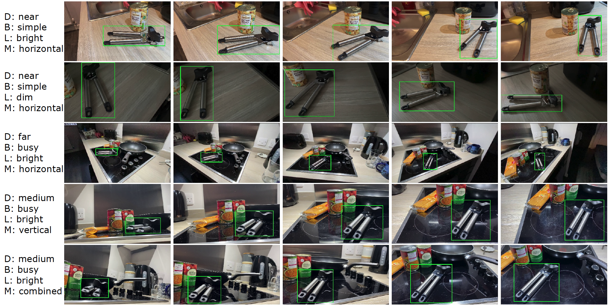
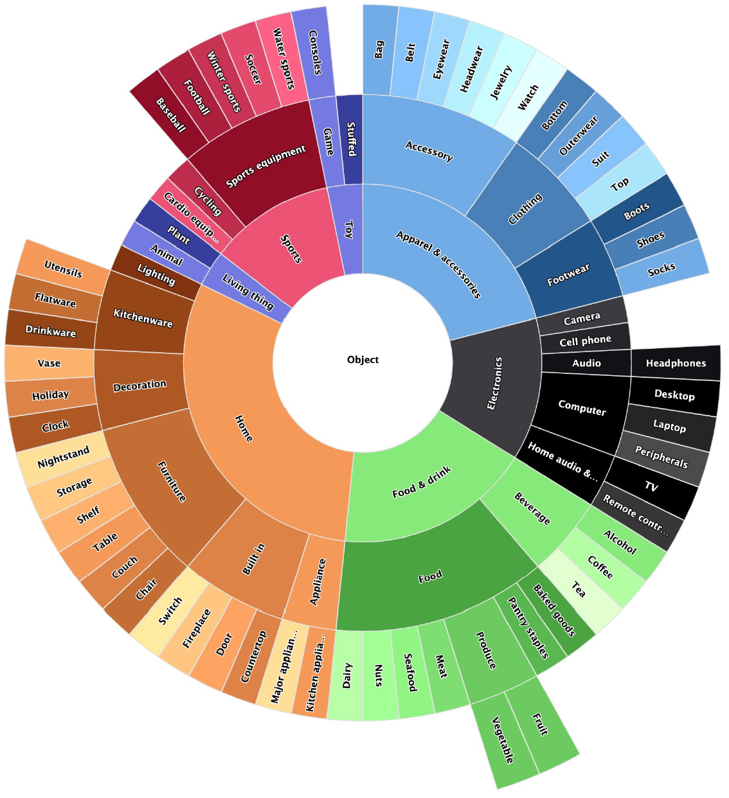

# EgoObjects

目标：理解 EgoObjects 为什么适合研究第一视角下的细粒度物体理解，能看懂 category-level detection、instance-level detection、main object、secondary object 和 LVIS-like annotation 这些概念，也能判断它和 EgoHOS、EgoPAT3D、普通目标检测数据集的区别。

> 先修：[Ego4D](01-ego4d.md) → [EgoPAT3D](16-egopat3d.md)
> 建议：这一节重点看“第一视角下同一个物体实例如何在不同条件中被识别”，不要把 EgoObjects 当成动作预测或机器人控制数据集
> 数据集规模：EgoObjects Pilot 版本包含超过 9,000 个第一视角视频和 65 万个物体标注，覆盖 368 类物体和 14,000 多个实例。

EgoObjects 是 ICCV 2023 的数据集，论文题目是 **EgoObjects: A Large-Scale Egocentric Dataset for Fine-Grained Object Understanding**。它来自 Meta AI，目标不是识别动作，也不是估计手的轨迹，而是研究第一视角下的物体理解。

第一视角里的物体识别比普通图片检测更麻烦。相机戴在人身上，画面会晃动；物体会离镜头很近，也可能在远处；同一个物体会在不同光照、背景、角度和遮挡下反复出现。EgoObjects 关注的正是这种情况：模型能不能不仅识别“这是一个杯子”，还进一步识别“这是同一个杯子实例”。

先看一张样例图。绿色框标出了同一个物体实例在不同条件下的出现：距离有近有远，背景有简单有复杂，光照有明有暗，物体方向也会变化。



一句话概括 EgoObjects：

```text
EgoObjects v1.0 标注了 114K 帧第一视角图像，
来自 9K+ 视频和 250 名参与者，
覆盖 14.4K 个唯一物体实例、368 个类别，
用于 category-level 和 instance-level object detection。
```

## 它到底收集了什么

EgoObjects 的 v1.0 版本标注了 114K 帧，来自全球 250 名参与者采集的 9K+ 第一视角视频。数据中的物体来自室内环境常见类别，比如家居用品、厨房物品、食品饮料、电子设备、服饰配件等。

规模可以这样记：

| 项目 | 数量或形式 | 怎么理解 |
|---|---:|---|
| annotated frames | 114K 帧 | 被标注的第一视角图像 |
| train / val / test | 79K / 5.7K / 29.5K 帧 | v1.0 标准划分 |
| videos | 9K+ 段 | 从第一视角视频中采样图像 |
| participants | 250 人 | 不同采集者、地点和设备 |
| unique object instances | 14.4K 个 | 具体物体实例，不只是类别 |
| categories | 368 类 | 室内常见物体类别 |
| main object instances | 1.3K 个，206 类 | 视频中重点关注的物体 |
| secondary object instances | 13.1K 个，353 类 | 伴随出现的周围物体 |
| 平均每张图 | 5.6 个 instances，4.8 个 categories | 一张图里通常有多个物体 |
| 平均每个实例 | 出现在 44.8 张图中 | 同一物体有多视角、多条件样本 |

这里最关键的是 `unique object instance`。普通目标检测数据集通常只要求模型判断类别，比如“杯子”“遥控器”“鞋”。EgoObjects 进一步关心：同一个具体杯子，在不同距离、角度、光照、背景里出现时，模型能不能把它认出来。

这对具身 AI 很重要。家庭机器人不只要知道“这是杯子”，还要知道“这是用户常用的那个杯子”“这是刚才放在桌上的同一个遥控器”。这种能力更接近长期服务和个性化记忆。

## category-level 和 instance-level 有什么区别

EgoObjects 支持两种检测任务：`category-level object detection` 和 `instance-level object detection`。

`category-level` 是普通目标检测。模型需要输出物体框和类别：

```text
这个框里是 cup。
那个框里是 remote control。
另一个框里是 laptop。
```

`instance-level` 更细。模型不仅要知道类别，还要识别具体实例：

```text
这个框里是 cup_001。
下一张图里那个杯子也是 cup_001。
另一个相似杯子是 cup_017。
```

可以把两者对比成：

| 层级 | 问的问题 | 例子 |
|---|---|---|
| Category-level | 这是什么类别？ | 这是一个 mug |
| Instance-level | 这是哪个具体物体？ | 这是厨房台面上那只蓝色 mug |

EgoObjects 的价值就在这里。它不只是扩大了第一视角检测数据量，还把同一物体实例在不同拍摄条件下的样子组织起来，让模型能学习更细粒度的物体一致性。

## main object 和 secondary object 是什么

EgoObjects 里有 `main object` 和 `secondary object` 的区分。

`main object` 可以理解为视频中重点关注的物体。数据说明里给出的规模是 1.3K 个 main object instances，覆盖 206 个类别。

`secondary object` 是伴随 main object 一起出现在画面里的其他物体。它们不是当前视频的核心对象，但仍然会被标注。v1.0 中有 13.1K 个 secondary object instances，覆盖 353 个类别。

举一个第一视角厨房画面的例子：

```text
画面中心反复出现一个开罐器：
  openers_001 可能是 main object

旁边同时出现罐头、锅、台面、杯子：
  这些可能是 secondary objects
```

这个设计很贴近真实第一视角。人看一个物体时，画面里不会只有这个物体，周围环境会一起出现。对机器人来说，secondary objects 也很有用，因为它们提供了场景上下文：物体在哪里、和哪些东西一起出现、是否被遮挡、是否在可操作区域附近。

## 类别体系怎么看

下面这张 taxonomy 图展示了 EgoObjects 的类别结构。最外层是具体类别，内层是更粗的上位类别，比如 Home、Food & drink、Electronics、Apparel & accessories、Sports 等。



这张图说明一个问题：EgoObjects 不是只收集桌面小物体。它覆盖了室内日常生活中经常出现的多类物品：

```text
Home:
  furniture, kitchenware, decoration, appliance

Food & drink:
  food, beverage, baked goods, produce

Electronics:
  camera, cell phone, audio, computer, TV

Apparel & accessories:
  bag, belt, eyewear, footwear, clothing

Sports:
  sports equipment, cycling, cardio equipment
```

对于具身 AI 来说，这种类别结构有两个意义。

第一，它更接近日常服务机器人会遇到的环境。机器人在家里或办公室看到的不是 COCO 里孤立的物体，而是混在一起的日用品、食品、服饰和电子设备。

第二，它适合测试细粒度泛化。比如 Food 类下面有 dairy、nuts、seafood、meat、produce；Electronics 下面有 phone、audio、computer、remote control。模型需要在相似外观和复杂背景中区分它们。

## 标注格式大概是什么样

它使用和 LVIS 相同的数据格式，并做了 EgoObjects 自己的修改。实际下载时会看到统一的 JSON 标注文件，例如：

```text
EgoObjectsV1_unified_train.json
EgoObjectsV1_unified_eval.json
EgoObjectsV1_unified_metadata.json
```

可以把一条检测标注理解成：

```text
image:
  image_id
  file_name
  width
  height

annotation:
  bbox
  category_id
  instance_id
  object role: main / secondary

metadata:
  category names
  instance names
  split information
```


需要特别注意两点。

第一，EgoObjects 主要服务 object detection。不要看到 LVIS-like format 就默认它和 LVIS 的每一个任务完全一样。

第二，category id 和 instance id 不是一回事。category id 表示类别，instance id 表示具体物体实例。做 instance-level detection 时，如果把这两个混了，实验结果就没有意义。

## 为什么第一视角检测更难

EgoObjects 很适合用来说明第一视角物体检测的困难。

普通第三人称检测数据里，物体通常由别人拍摄，视角相对稳定，图像更像“观察者看一个场景”。第一视角则不一样：

```text
相机跟着人头或身体运动，画面容易晃。
物体经常离镜头很近，形变和裁切更明显。
手、身体、桌面和其他物体经常遮挡目标。
同一个物体会在不同光照和背景中反复出现。
被关注物体不一定在图像中心，也可能被快速扫过。
```

这正是具身 AI 会遇到的输入条件。机器人或可穿戴设备看到的世界不是干净的商品图，而是近距离、遮挡、动态和长尾物体混在一起的场景。

EgoObjects 的样例图里标出了距离、背景、光照、朝向等变化：

```text
D: distance
B: background
L: lighting
M: object orientation / motion condition
```

这些变化让 instance-level detection 更有挑战。模型不能只记住一个固定角度的物体外观，而要学会在多种条件下保持对象一致性。

## 和具身 AI 的关系

EgoObjects 对具身 AI 的价值主要在感知层。

第一，它能训练第一视角物体检测。机器人在执行任务前，首先要知道哪些物体在场景里，位置大概在哪里。

第二，它支持实例级物体识别。长期服务机器人需要记住具体物品，而不是每次都只说“一个杯子”。比如用户说“拿我的黑色保温杯”，机器人需要把当前画面里的实例和记忆里的实例对应起来。

第三，它覆盖多条件、多视角。真实机器人看到物体时，角度、距离、背景和光照都在变化。EgoObjects 用同一物体实例的多次出现来训练这种鲁棒性。

第四，它可以和动作数据互补。EgoObjects 不告诉你怎么抓、怎么放，但它能帮助模型先找到“要操作的东西”。

典型用途可以包括：

```text
第一视角物体检测预训练
日常物体类别泛化
个体物品重识别
家庭机器人长期物品记忆
操作任务前的目标物体定位
```

但边界也要说清楚：

```text
EgoObjects 不是操作轨迹数据集。
它没有机器人 action、手部 3D 轨迹、力控数据或任务成功标签。

它也不是动作预测数据集。
它主要回答“物体在哪里、是什么、是不是同一个实例”，
不是“手接下来会怎么动”。
```

## 下载和使用时要注意什么

EgoObjects v1.0 的图片数据约 40G，标注文件包括 train、eval 和 metadata。第一次使用时，不建议直接把全部图片解压后就开始训练，最好先检查标注和类别映射。

使用时要重点确认：

```text
图片根目录是否和 JSON 里的 file_name 对得上
使用的是 category-level 还是 instance-level detection
category_id 和 instance_id 是否正确区分
train / val / test 是否使用 v1.0 标准划分
main object 和 secondary object 是否都纳入训练
评价脚本使用的是哪个任务设置
```

如果只是学习数据结构，可以先读取 metadata 和少量图片，打印几条样本：

```text
image_id
file_name
bbox
category name
instance id
main / secondary
```

等确认字段含义后，再接 Detectron2 或其他检测框架。README 中也给了基于 Detectron2 的环境设置和 `example.py`，可以用来确认代码环境和标注读取流程是否正常。

## 和前面数据集的区别

| 数据集 | 主要关注点 | EgoObjects 的区别 |
|---|---|---|
| EgoHOS | 手和被操作物体的像素级分割 | EgoObjects 更关注大规模第一视角物体检测和实例级识别 |
| EgoPAT3D | 手部未来 3D action target | EgoObjects 不预测手会去哪，只检测物体 |
| HOI4D | RGB-D 手-物交互和 4D 标注 | EgoObjects 不是交互过程数据，重点是物体识别泛化 |
| COCO / LVIS | 通用第三人称图像检测 | EgoObjects 是第一视角，强调同一实例在不同条件中的出现 |

如果你的任务是“找出第一视角画面里有哪些日常物体”，EgoObjects 很合适；如果你的任务是“估计抓取姿态”或“预测手要伸到哪里”，它就不是最直接的数据集。

## 常见误解

**误解一：EgoObjects 是动作数据集。**

不对。它主要是第一视角物体理解数据集，核心任务是 object detection，尤其是 category-level 和 instance-level detection。

**误解二：instance-level detection 就是 instance segmentation。**

不准确。这里的 instance-level 更强调识别具体物体实例，不等同于一定有像素级 mask 分割任务。写实验时要以标注文件和评测代码为准。

**误解三：category id 和 instance id 可以混用。**

不可以。category id 表示类别，instance id 表示具体物体。一个类别下面可以有很多不同实例。

**误解四：只要在 COCO 上训练好，第一视角物体检测就自然解决了。**

不一定。第一视角有近距离、晃动、遮挡、光照变化和相同实例反复出现的问题，和普通第三人称检测差别很大。

**误解五：EgoObjects 可以直接训练机器人完成抓取。**

不够。它能帮助机器人找到目标物体，但抓取还需要姿态估计、深度、接触、控制和执行反馈。

## 小结

EgoObjects 是“第一视角细粒度物体理解数据集”。它的价值不在动作轨迹，而在于让模型学会在真实第一视角条件下检测日常物体，并识别同一个具体物体在不同视角、距离、光照和背景中的多次出现。对具身 AI 来说，它补的是感知和物品记忆这一环：机器人先要看懂眼前是什么，才谈得上后续操作。

进一步阅读可以看：
- [EgoObjects GitHub 仓库](https://github.com/facebookresearch/EgoObjects)
- [EgoObjects paper](https://arxiv.org/abs/2309.08816)
- [EgoObjects 数据下载入口](https://ai.meta.com/datasets/egoobjects-downloads)
