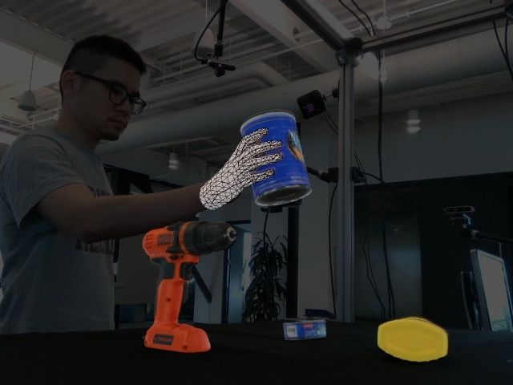
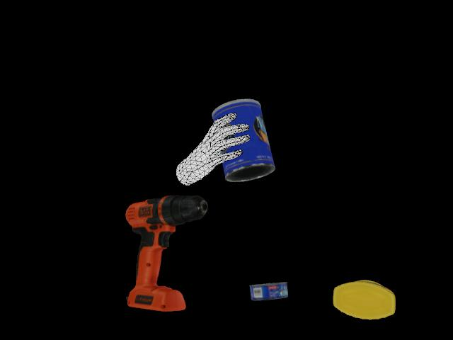
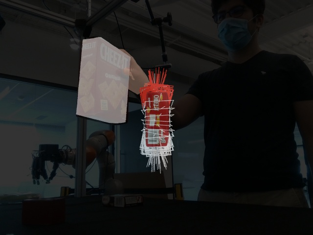
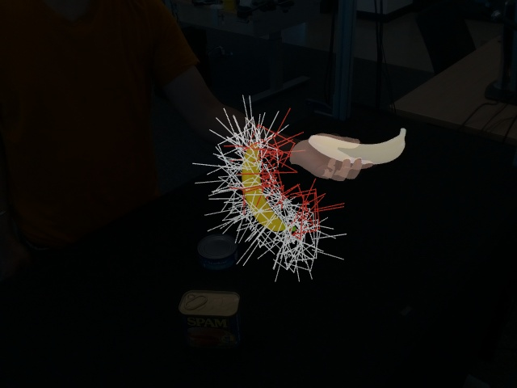

# DexYCB

目标：理解 DexYCB 为什么是手-物体 3D 感知和人到机器人交接研究里的经典基准，能看懂 YCB objects、RGB-D、6D object pose、MANO hand pose、segmentation、BOP / HPE / Grasp benchmark 这些概念，也能判断它适合哪些任务、不适合哪些任务。

> 先修：[HOI4D](../02-egocentric-video-datasets/06-hoi4d.md) → [ARCTIC](../02-egocentric-video-datasets/07-arctic.md)
> 建议：这一节重点看“同一帧里手、物体、深度、相机参数和 3D 位姿怎么对齐”，不要把 DexYCB 当成普通抓取视频合集
> 数据集规模：DexYCB 包含 1,000 个 RGB-D 抓取序列和约 46 万级图像样本，同时提供高精度手部和物体姿态标注。

DexYCB 是 NVIDIA 等团队在 CVPR 2021 发布的数据集，论文题目是 **DexYCB: A Benchmark for Capturing Hand Grasping of Objects**。它记录的是人手抓取 YCB 标准物体的过程，并提供多视角 RGB-D、物体 6D pose、手部 MANO 参数、2D/3D 手关键点和像素级分割。

它和上一节的 egocentric 视频数据集不一样。DexYCB 不是头戴相机记录生活流，也不是用来做长程活动理解；它是在受控桌面环境里，用 8 个 Intel RealSense D415 RGB-D 相机同步记录抓取过程。它的价值在于把“手”和“物体”都标到同一个 3D 坐标关系里，让模型能研究抓取时的几何关系。

先看两张 toolkit 里的姿态可视化图。第一张是原始 RGB-D 画面上叠加了手部关键点和物体姿态，第二张是把同一帧中的手和物体放到 3D 中看。读 DexYCB 时，要同时看这两层：图像里看得见什么，3D 里手和物体到底在哪里。





一句话概括 DexYCB：

```text
DexYCB 用 8 个 RGB-D 相机同步记录 10 名参与者抓取 20 个 YCB 物体，
形成约 58.2 万帧 RGB-D 数据，
并为每帧提供手部姿态、物体 6D 位姿、分割图和相机参数。
```

## 它到底收集了什么

DexYCB 采集的是桌面抓取。参与者坐在多相机系统中，桌面上摆放 YCB 标准物体，然后用手去抓取指定物体。每一帧不只是 RGB 图片，还配有深度、标签和相机参数。

规模可以这样记：

| 项目 | 数量或形式 | 怎么理解 |
|---|---:|---|
| subjects | 10 人 | 不同参与者执行抓取 |
| sequences | 1,000 段 | 每名参与者多段抓取序列 |
| RGB-D frames | 约 582K 帧 | 8 个 RealSense 相机同步采集 |
| cameras | 8 个 | Intel RealSense D415 |
| YCB objects | 20 个 | 机器人抓取研究常用标准物体 |
| hand model | MANO | 用参数化手模型表示手部姿态 |
| object pose | 6D pose | 物体在相机坐标系中的位置和朝向 |
| segmentation | 背景 / 物体 / 手 | 每个像素属于哪一类 |
| benchmark | COCO / BOP / HPE / Grasp | 检测、姿态、手部估计和交接抓取 |

这里的关键不是“视频有多少”，而是每个样本里的信息放得很整齐。一个样本会告诉你：RGB 图在哪里，深度图在哪里，标签文件在哪里，相机内参是什么，场景里有哪些 YCB 物体，当前抓的是哪个物体，手是左手还是右手。


## YCB objects 是什么

`YCB objects` 是机器人抓取和物体姿态估计里很常用的一组标准物体。它们包括罐头、食品盒、香蕉、杯子、碗、电钻、剪刀、夹子、积木等。DexYCB 使用其中 20 个物体。

使用 YCB 物体有几个好处。

第一，很多物体有公开 3D model，方便做 6D pose 估计和渲染。第二，这些物体形状差异比较大，能覆盖盒子、圆柱、杯子、工具、软硬不同的物体。第三，YCB 在机器人抓取研究中使用很广，DexYCB 的结果更容易和机器人抓取、BOP 物体姿态估计等任务对接。

但也要注意，YCB 不是无限开放的真实家居物体集合。DexYCB 的物体种类比较标准，场景也比较受控，所以它更适合研究“手-物体几何和抓取姿态”，不是研究家庭长尾物体识别。

## 6D object pose 是什么

DexYCB 里最核心的标签之一是 `pose_y`，也就是 YCB 物体的 6D pose。这里的 6D 不是六维图像，而是物体在 3D 空间里的位置和朝向。

可以拆成两部分：

```text
rotation:
  物体的朝向，例如杯子把手朝左还是朝右

translation:
  物体在相机坐标系里的 xyz 位置
```

在 label 文件里，物体 pose 通常以 `[R | t]` 的形式保存：

```text
pose_y: [num_obj, 3, 4]

R: 3 x 3 rotation matrix
t: 3 x 1 translation vector
```

这对机器人很关键。只知道图像里有一个杯子还不够，机器人要抓它，还要知道杯子的 3D 位置、朝向、大小和遮挡情况。DexYCB 正是把这些信息和真实抓取画面对齐起来。

## MANO hand pose 是什么

DexYCB 使用 `MANO` 表示手部。MANO 是参数化 3D 手模型，可以通过一组参数生成手的 3D mesh 和关节位置。

在 DexYCB 的 label 文件中，手部相关字段主要包括：

| 字段 | 形式 | 含义 |
|---|---|---|
| `pose_m` | `[1, 51]` | MANO 手部 pose 和 translation |
| `joint_3d` | `[1, 21, 3]` | 21 个手关节在相机坐标系里的 3D 坐标 |
| `joint_2d` | `[1, 21, 2]` | 21 个手关节投影到图像上的 2D 坐标 |
| `mano_side` | left / right | 当前是哪只手 |
| `mano_betas` | shape parameters | 这只手的形状参数 |

这里要分清两件事。`joint_2d / joint_3d` 更像直接可读的关键点；`pose_m / mano_betas` 是用 MANO 模型生成手部形状和姿态的参数。做 3D hand pose estimation 时，通常更关心关节误差；做手-物体重建时，MANO mesh 会更有用。

## segmentation 标的是什么

DexYCB 的 label 文件里还有 `seg`，也就是分割图。它是一个 `[H, W]` 的数组，每个像素有一个类别值。

README 里给出的规则可以这样理解：

```text
0:
  background

1-21:
  YCB object label

255:
  hand
```

所以这里的 segmentation 不是只标手，也不是只标物体，而是同时把背景、YCB 物体和手区分开。它对两个任务很有用：一是检测/分割手和物体，二是为物体 pose 估计和机器人抓取提供遮挡信息。

## 四类 benchmark 分别在评什么

DexYCB 配套了 toolkit，不只是把数据放出来。它围绕四类任务提供评估。

| benchmark | 输入/输出 | 评估重点 |
|---|---|---|
| COCO | bbox / segmentation / keypoints | 2D object 和 hand keypoint 检测 |
| BOP | 6D object pose | 物体姿态估计 |
| HPE | 3D hand joints | 3D hand pose estimation |
| Grasp | object pose + hand segmentation | 人到机器人交接中的安全抓取 |

前三类比较容易理解。COCO 看 2D 检测和关键点，BOP 看物体 6D pose，HPE 看手部 3D 关节。

第四类 `Grasp` 更有 DexYCB 的特色。它不是只问模型能不能看懂图像，而是进一步问：如果人把物体拿在手里，机器人能不能生成一个安全的抓取姿态，从人手里接过这个物体？

下面两张图来自 toolkit 的 grasp evaluation 可视化。它们展示了预测抓取在物体和手附近的位置关系。读这类图时，重点不是“抓取姿态画得好不好看”，而是看机器人抓取是否避开了人的手、是否对准了物体可抓区域。





## 数据结构大概长什么样

下载完整数据后，根目录大致是：

```text
dex-ycb/
  20200709-subject-01/
  20200813-subject-02/
  ...
  20201022-subject-10/
  calibration/
  models/
```

每个 subject 下面有多段 sequence。toolkit 创建 dataset 后，一个样本会包含类似这些信息：

```text
color_file:
  RGB 图像路径

depth_file:
  对齐到 RGB 的深度图路径

label_file:
  labels_*.npz，里面放 seg、pose_y、pose_m、joint_2d、joint_3d

intrinsics:
  相机内参 fx、fy、ppx、ppy

ycb_ids:
  当前场景中出现的 YCB object ID

ycb_grasp_ind:
  当前要抓取的物体索引

mano_side:
  left 或 right
```

这类结构对新手很友好，因为视觉文件、几何标签和相机参数都在同一个 sample 里。只要相机内参和位姿用对，就可以把 3D hand / object 信息投影回 2D 图像，也可以把图像预测结果拿去做 3D 评价。

## 它和具身 AI 的关系

DexYCB 对具身 AI 的价值主要在感知和交接两个环节。

第一，它提供手和物体的 3D 几何关系。机器人抓取前需要知道物体在哪里、朝向如何、手是否遮挡了物体。DexYCB 把这些关系标得比较清楚。

第二，它使用 YCB 标准物体。很多机器人抓取、仿真和物体位姿估计工作都使用 YCB 物体，因此 DexYCB 更容易和机器人研究对接。

第三，它有多视角 RGB-D。虽然不是机器人自身采集的数据，但 RGB-D 相机是机器人感知里常见传感器，DexYCB 的数据形式很接近抓取前感知模块需要处理的信息。

第四，它专门评估 human-to-robot handover grasp。这一点让它不只是视觉 benchmark，还和机器人如何从人手中安全接物体有关。

不过边界也要说清楚：

```text
DexYCB 不是机器人遥操作数据。
它没有机器人关节状态、机器人 action、控制频率、力反馈或真实机器人执行成功标签。
```

所以它适合做 2D/3D 手-物体感知、物体 6D pose、手部姿态估计、人手遮挡下的物体理解和 handover grasp 评估；不适合直接训练机器人低层控制策略。

## 和 HOI4D、ARCTIC、OakInk 的区别

| 数据集 | 重点 | DexYCB 的区别 |
|---|---|---|
| HOI4D | 第一视角 RGB-D、4D 点云、类别级手-物交互 | DexYCB 更聚焦标准 YCB 物体抓取和 6D pose benchmark |
| ARCTIC | 双手、全身、铰接物体、动态接触 | DexYCB 主要是手抓刚体物体，不强调铰接状态和全身 mesh |
| OakInk | 手-物交互、intent、affordance 和功能区域 | DexYCB 更偏几何标注和标准抓取评估，意图/功能标注不是核心 |

如果你关心“第一视角里一个物体类别如何被操作”，HOI4D 更合适；如果你关心“双手如何让铰接物体状态变化”，ARCTIC 更合适；如果你关心“为什么这么抓、抓哪里有功能意义”，OakInk 更合适；如果你关心“手和标准物体在 3D 中如何对齐，物体 6D pose 和手部姿态能否估准”，DexYCB 更直接。

## 下载和使用前要注意什么

DexYCB 数据下载有两种方式：一个完整压缩包，或者按 subject 分块下载。完整包约 119 GB；分块下载时，每个 subject 大约 12 GB，另外还有 `bop`、`calibration` 和 `models` 等部分。

第一次使用前建议先确认这些问题：

```text
是否下载了 calibration 和 models
是否设置了 DEX_YCB_DIR
是否安装了 MANO / manopth
使用哪个 setup：s0、s1、s2 还是 s3
使用哪个 split：train、val 还是 test
评价的是 COCO、BOP、HPE 还是 Grasp
```

其中 `setup` 很重要。DexYCB 不是只有一种划分，不同 setup 对应不同泛化设置。如果论文里只写“在 DexYCB 上测试”，但没写 setup 和 split，结果很难复现。

实验记录里建议写清楚：

```text
DexYCB version / download date
setup and split
used cameras or all views
whether depth is used
whether MANO model is used
whether BOP keyframes are used
metric and evaluation script
```

## 常见误解

**误解一：DexYCB 是机器人操作数据集。**

不准确。DexYCB 记录的是人手抓物体，有机器人相关的 grasp evaluation，但没有机器人动作和控制数据。

**误解二：有 6D object pose 就等于能直接抓。**

不够。6D pose 只是告诉你物体在哪里、朝向如何。真正抓取还要考虑手的遮挡、可抓区域、碰撞、安全距离、机器人末端执行器形状和控制约束。

**误解三：有 RGB-D 就不需要相机内参。**

不对。2D 图像、深度图、3D 关节和物体 pose 之间的投影关系仍然依赖相机内参。

**误解四：segmentation 只标手。**

不准确。DexYCB 的 `seg` 同时标背景、YCB 物体和手。

**误解五：DexYCB 适合研究长程任务规划。**

不适合。它是抓取级别的受控数据，更适合几何感知、姿态估计和交接抓取，不适合研究复杂生活任务流程。

## 小结

DexYCB 是“标准物体抓取中的手-物体 3D 感知基准”。它的核心不是视频时长，也不是复杂生活场景，而是用多相机 RGB-D、YCB 标准物体、MANO 手模型、6D object pose 和 segmentation，把人手抓取这个基础问题标得足够清楚。对具身 AI 来说，它补的是抓取前感知和人到机器人交接中的几何基础。

进一步阅读可以看：
- [DexYCB 网站](https://dex-ycb.github.io/)
- [DexYCB toolkit](https://github.com/NVlabs/dex-ycb-toolkit)
- [DexYCB paper](https://arxiv.org/abs/2104.04631)