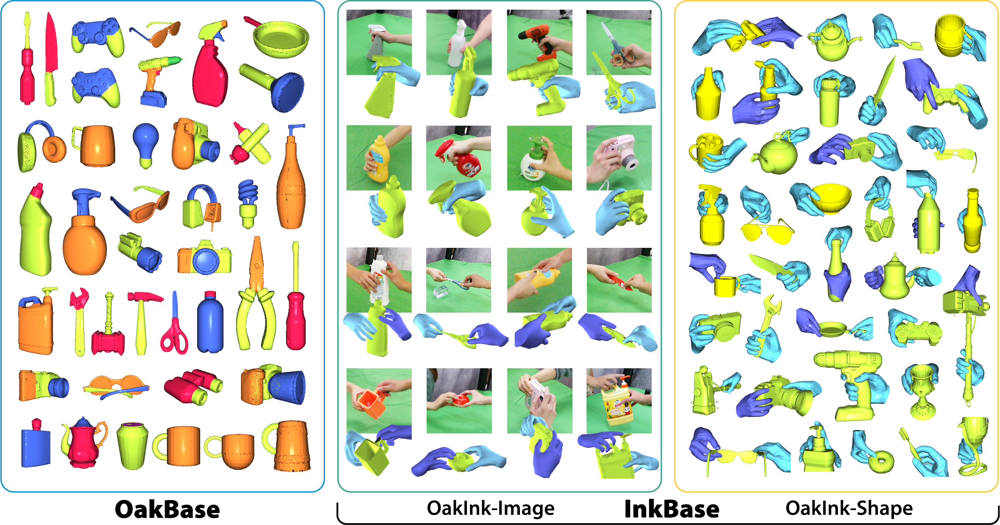

# OakInk

目标：理解 OakInk 为什么不只是一个手部姿态数据集，而是一个把物体 affordance、交互意图和手-物体几何放在一起的数据集。读完这一节后，你应该能分清 OakBase、OakInk-Image、OakInk-Shape 三部分，也能判断它适合哪些手-物交互任务、不适合哪些机器人控制任务。

> 先修：[HOI4D](../02-egocentric-video-datasets/06-hoi4d.md) → [DexYCB](01-dexycb.md)
> 建议：这一节不要只盯着 hand pose，要重点看“物体的哪个部分能被怎样使用”和“人在什么意图下这样抓”
> 数据集规模：OakInk-v1 数据规模约 124 GB，包含物体模型、交互视频、3D 手部姿态以及抓取姿态标注。

OakInk 是上海交通大学等团队在 CVPR 2022 发布的数据集，论文题目是 **OakInk: A Large-scale Knowledge Repository for Understanding Hand-Object Interaction**。它关注的是手和物体之间的交互，但它比普通 HOI 数据集多了一层语义：物体的 affordance 和人的 interaction intent。

先看一张概览图。左边是 OakBase，强调物体、部件和功能区域；中间是 OakInk-Image，是真实多视角采集的人手交互；右边是 OakInk-Shape，包含大量手和物体 mesh 对齐后的抓取姿态。



一句话概括 OakInk：

```text
OakInk 先建立常见家居物体的 affordance 知识，
再记录人在不同意图下如何和这些物体交互，
最后把真实交互迁移到更多虚拟物体上，形成大规模手-物体姿态数据。
```

## 为什么它叫 OakInk

OakInk 这个名字可以拆开理解。

`Oak` 指物体知识。它不是只给一个物体类别名，而是关心物体的部件、属性和可交互区域。比如一个杯子不是只有 `cup` 这个类别，还可以继续看杯身、杯口、把手这类区域分别适合怎样被拿、倒、握或使用。

`Ink` 指人的交互。它记录人在不同意图下怎么把手放到物体上，手的姿态是什么，物体姿态是什么，以及这种交互能不能迁移到形状相近、功能相近的其他物体上。

所以 OakInk 的核心问题不是：

```text
图像里有没有一只手？
```

而是：

```text
这只手为什么这样抓？
它抓的是物体的哪个功能区域？
如果换一个相似物体，这种交互是否还能成立？
```

这也是它和 DexYCB 的主要区别。DexYCB 更像标准物体抓取中的几何基准；OakInk 更强调 affordance、intent 和可迁移的交互知识。

## 三部分分别是什么

OakInk 可以按三部分来读：`OakBase`、`OakInk-Image`、`OakInk-Shape`。


| 部分 | 主要内容 | 适合看什么 |
|---|---|---|
| OakBase | 物体 3D model、part segmentation、part-level attributes / affordance | 物体由哪些部件组成，哪些部件有功能意义 |
| OakInk-Image | 多视角真实交互图像，带 3D hand-object pose 和 shape annotation | 人在真实采集里如何操作物体 |
| OakInk-Shape | 手和物体 mesh 对齐后的 3D grasping pose 数据 | 生成手部抓取姿态、intent-based grasp、handover |

这三个部分不要混在一起。OakBase 更像“物体知识库”；OakInk-Image 是真实采集数据；OakInk-Shape 是在真实交互基础上，通过 interaction transfer 扩展出来的大规模 3D 抓取姿态数据。

## 它到底收集了什么

OakInk 的规模可以这样记：

| 项目 |                          数量或形式 | 怎么理解 |
|---|-------------------------------:|---|
| OakBase objects |                约 1,800 个常见家居物体 | 带 3D model、部件分割和 affordance 标注 |
| OakInk-Image objects |                    100 个真实采集物体 | 从 OakBase 中选出，用来录制人手交互 |
| categories |                           32 类 | 覆盖常见可操作物体类别 |
| subjects |                           12 人 | 执行不同 intent 的手-物体交互 |
| views |                        4 个第三视角 | 不是第一视角，不是头戴相机 |
| OakInk-Shape |                           50K+ | 发布版本和统计口径不同，不能混写 |
| intents | use / hold / liftup / handover | 交互目的，不只是动作类别 |
| hand model |                           MANO | 用参数化手模型表示手部姿态和形状 |


## affordance 是什么

`affordance` 在这里可以理解为“物体或物体部件能支持什么交互”。

它不是单纯的物体类别。例如同样是水杯，杯身可以被握住，杯口和内部空间与盛放、倒出有关，把手适合手指穿过或握住。机器人如果只知道“这是杯子”，还不够；它还需要知道“为了完成某个目的，应该接触杯子的哪个区域”。

OakInk 把这件事放在数据集设计的中心：先建立物体部件和 affordance 知识，再记录人在这些 affordance 上发生的交互。这样做的好处是，模型不仅可以学“手长什么样”，还可以学“手为什么放在这里”。

在具身 AI 里，这一点很重要。因为真实任务往往不是让机器人随便抓住物体，而是让它按目的去操作：

```text
拿起杯子:
  重点是稳定抓取

把杯子递给别人:
  重点是留出对方可接触的位置

使用工具:
  重点是抓住不影响功能的区域
```

OakInk 适合研究的正是这种带有功能含义的手-物体关系。

## intent 是什么

`intent` 是交互意图。OakInk-Image 的 `seq_id` 里就编码了 intent。数据文档给出的映射是：

```text
0001: use
0002: hold
0003: liftup
0004: handover
```

这几个词不要翻成完全一样的“动作”。它们更像“人为什么这样操作物体”。

| intent | 可以怎样理解 | 和手姿态的关系 |
|---|---|---|
| use | 使用物体 | 手通常会避开功能输出区域，或贴合可操作部件 |
| hold | 拿住物体 | 重点是稳定持握，不一定要完成具体功能 |
| liftup | 抬起物体 | 重点是能承受重量、保持物体稳定 |
| handover | 递交物体 | 重点是既能拿稳，也要给接收者留下空间 |

尤其是 `handover`。它不是简单的“把物体拿起来”，而是人到人或人到机器人交接时很关键的交互场景。后面如果做机器人接物体，这类数据能提供一些有用的手-物体相对关系，但它本身仍然不是机器人控制数据。

## OakInk-Image 的一条样本大概长什么样

OakInk-Image 的数据目录大致是：

```text
OAKINK_DIR/
  image/
    anno/
      general_info/
      cam_intr/
      hand_j/
      hand_v/
      obj_transf/
      split/
      seq_all.json
      seq_status.json
    obj/
      A01001.obj
      ...
    stream_release_v2/
      A01001_0001_0000/
        2021-09-26-19-59-58/
          cam01_000000.png
          ...
```

其中 `anno/general_info` 下面的 `.pkl` 文件会保存一帧的核心信息。文档里列出的字段包括：

| 字段 | 含义 |
|---|---|
| `hand_tsl` | 手在 world space 中的 3D translation |
| `hand_shape` | MANO hand shape，10 维 |
| `hand_pose` | MANO hand pose，文档中以 quaternion 形式保存 |
| `cam_extr` | 相机外参，也就是 world 到 camera 的变换关系 |
| `cam_intr` | 相机内参，也就是投影用的 K 矩阵 |
| `obj_anno` | 物体从 canonical object space 到 world space 的 SE(3) 变换 |

另外还有更直接的标注目录：

```text
hand_j:
  21 个手关节，camera space

hand_v:
  778 个 MANO hand vertices，camera space

obj_transf:
  物体从 canonical object space 到 camera space 的 4x4 变换矩阵
```

这里要注意坐标系。`world space`、`camera space`、`object canonical space` 不是同一个东西。你如果要把 3D hand mesh 投影到图像上，就要用对相机内外参；如果要比较手和物体的相对姿态，就要确认它们是否已经在同一个坐标系里。

## seq_id 怎么读

OakInk 的 `seq_id` 不是随便起的名字，它编码了物体、意图和参与者。

文档里给了两种形式：

```text
A01001_0001_0000
A01001_0004_0001_0003
```

可以这样拆：

```text
A01001_0001_0000
  A01001: obj_id
  0001: intent_id，表示 use
  0000: subject_id

A01001_0004_0001_0003
  A01001: obj_id
  0004: intent_id，表示 handover
  0001: giver subject_id
  0003: receiver subject_id
```

第二种多了一个 subject，是因为 handover 可能涉及两个人：一个递出物体，一个接收物体。这个细节很重要，因为 handover 的手姿态和普通 hold / liftup 不一样，它天然包含“给别人留位置”的约束。

## OakInk-Shape 是怎么来的

OakInk-Shape 不是简单地把图像帧拿出来再标一次。它的关键在于 interaction transfer。

大致流程可以理解成：

```text
真实采集物体上的手-物体交互
  ↓
根据物体 affordance 找到可迁移的功能区域
  ↓
把手姿态迁移到相似 affordance 的虚拟物体上
  ↓
形成更多 hand-object pose pairs
```

这就是 OakInk 里 `Tink` 的作用。它不是生成一段机器人动作，而是把真实交互中的手部姿态和物体几何关系迁移到更多物体上，让数据规模从真实采集的对象扩展到更大的物体集合。

所以 OakInk-Shape 很适合做：

```text
grasp generation
intent-based grasp generation
handover generation
hand-object interaction synthesis
```

但它不等于真实机器人轨迹。它没有机器人关节、控制频率、力传感器读数和执行成功率。它提供的是“人手如何和物体形成合理接触”的几何与语义数据。

## split 该怎么选

OakInk-Image 和 OakInk-Shape 的 split 不是一回事。

OakInk-Image 主要支持 Hand Mesh Recovery 和 Hand-Object Pose Estimation。文档里提供了不同 split mode：

| split mode | 划分依据 | 适合测试什么 |
|---|---|---|
| SP0 | views | 换视角泛化 |
| SP1 | subjects | 换人泛化 |
| SP2 | objects | 换物体泛化 |

如果你关心模型看到新人的手还能不能估准，应该看 subject split；如果关心换一个没见过的物体，应该看 object split。只写“用了 OakInk train/test”是不够的。

OakInk-Shape 则主要面向 grasp generation、intent-based grasp generation 和 handover generation。它的 split 按 object ID 的 hash 取模来划分。这个做法的目的是避免同一个物体同时出现在 train 和 test 中，让评估更像“能不能迁移到新物体”。

## 和 DexYCB、HOI4D 的区别

| 数据集 | 重点 | OakInk 的区别 |
|---|---|---|
| DexYCB | 标准 YCB 物体、多视角 RGB-D、6D object pose、MANO hand pose | OakInk 更强调物体 affordance 和 interaction intent |
| HOI4D | 第一视角 RGB-D、4D 点云、真实日常交互过程 | OakInk 不是第一视角视频集，更偏部件功能、手-物体 mesh 和 grasp generation |
| ARCTIC | 双手、全身、铰接物体、动态接触 | OakInk 更强调对象 affordance 和可迁移的 intent-oriented grasp |

如果你要研究“图像里手和物体的 3D 姿态能不能估准”，DexYCB 很直接；如果要研究“人在日常第一视角中如何操作物体”，HOI4D 更合适；如果要研究“一个物体的某个功能区域应该被怎样抓、怎样用于生成抓取姿态”，OakInk 更合适。

## 它和具身 AI 的关系

OakInk 对具身 AI 的价值主要在三个层面。

第一，它提供 affordance-aware 的物体表示。机器人不应该只识别物体类别，还要知道哪个部位能拿、哪个部位适合递交、哪个部位和功能有关。

第二，它把 intent 放进交互里。同一个物体在 `hold`、`use`、`liftup`、`handover` 下，手的姿态和接触区域可能不同。这个信息对语言条件下的抓取生成很有用。

第三，它有 OakInk-Shape 这种大规模 hand-object pose 数据。虽然这些不是机器人 action，但可以作为抓取姿态生成、手-物体接触建模、handover pose 生成的训练来源。

边界也要写清楚：

```text
OakInk 不是遥操作数据集。
它不提供机器人状态、机器人动作、控制频率或真实机器人执行闭环。
```

所以它更适合放在“具身感知、手-物体交互建模、抓取姿态生成”的位置，而不是放在“模仿学习动作数据”的位置。

## 常见误解

**误解一：OakInk 是第一视角数据集。**

不准确。OakInk-Image 使用的是 4 个第三视角相机，不是头戴相机的 egocentric 数据。

**误解二：OakInk 只适合做 hand pose estimation。**

不完整。它确实可以用于 hand mesh recovery 和 hand-object pose estimation，但更重要的是 affordance-aware、intent-oriented 的手-物体交互建模。

**误解三：affordance 就是物体类别。**

不对。类别回答“这是什么物体”，affordance 更关心“这个部件能支持什么操作”。

**误解四：intent 就是动作标签。**

不完全是。`use`、`hold`、`liftup`、`handover` 表示交互目的。它会影响手放在哪里、怎样接触物体，以及是否要给别人留下可接触空间。

**误解五：OakInk-Shape 可以直接训练机器人控制策略。**

不合适。OakInk-Shape 提供的是人手和物体的几何姿态，不是机器人动作序列。它可以帮助生成合理抓取，但不能替代机器人遥操作数据。

**误解六：50K 和 62,046 是互相矛盾的错误。**

不一定。50K 是论文和简介中常用的概括口径；62,046 是数据文档 v2 split 中发布的 grasping poses 统计。写实验时不要混用，应该注明使用的数据版本和 split。

## 小结

OakInk 是“带 affordance 和 intent 的手-物体交互知识库”。它把物体部件、功能区域、真实人手交互、MANO 手模型、物体 mesh 和可迁移抓取姿态放在一起。对具身 AI 来说，它补的不是低层控制数据，而是机器人理解“应该抓哪里、为什么这样抓、怎样递给别人”所需要的几何和语义基础。

进一步阅读可以看：
- [OakInk 网站](https://oakink.net/)
- [OakInk toolkit](https://github.com/oakink/OakInk)
- [OakInk paper](https://arxiv.org/abs/2203.15709)
- [OakInk data documentation](https://github.com/oakink/OakInk/blob/main/docs/datasets.md)