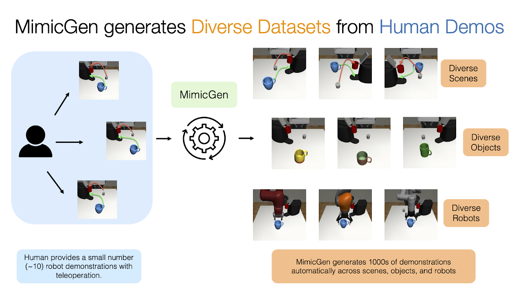

# MimicGen

目标：理解 MimicGen 为什么能从少量人类示教中自动生成大量机器人操作轨迹，能分清 source demonstrations、generated demonstrations、reset distribution、TaskSpec、DatagenInfo、environment interface 这些概念，也能判断它适合哪些仿真数据扩增任务、不适合哪些真机数据采集任务。

> 先修：[robomimic / HDF5 数据格式](../../01-common-data-formats/02-hdf5.md) → [数据转换工作流](../../02-data-conversion/02-lerobot-data-workflow.md)
> 建议：这一节重点看“少量示教如何被拆开、变换、重新执行”，不要把 MimicGen 理解成简单的视频增强或离线复制
> 数据集规模：MimicGen 发布的数据规模约 48,000 条机器人任务轨迹，完整数据约 149 GB。同时，MimicGen 生成系统可以基于少量人类示范继续扩展更多机器人训练数据。

MimicGen 是 NVIDIA 等团队在 CoRL 2023 发布的数据生成系统，论文题目是 **MimicGen: A Data Generation System for Scalable Robot Learning using Human Demonstrations**。它的目标很直接：人类示教贵，能不能只采少量示教，然后在仿真里自动生成更多可用于 imitation learning 的成功轨迹？

先看 MimicGen 的整体概览图。图里想表达的不是“把一条轨迹复制很多遍”，而是把源示教中的关键操作片段迁移到新的场景、物体或机器人设置里，再在仿真中实际执行，最终留下成功的 demonstrations。



一句话概括 MimicGen：

```text
MimicGen 先从少量人类示教中提取 object-centric 的操作片段，
再把这些片段根据新场景中的物体位姿进行变换，
最后在仿真环境中执行并筛选成功轨迹，得到大规模训练数据。
```

## 它解决的是什么问题

模仿学习需要 demonstrations。问题是，真实采集很慢，复杂任务还容易失败。一个长程任务可能包含抓取、移动、对准、插入、放置等多个阶段，示教者每录一条都要从头做到尾。数据一多，成本就上来了。

MimicGen 的思路是：不要每次都让人重新做完整任务，而是把人类示教拆成可复用的操作片段，再在仿真里组合、变换和执行。这样可以把少量人工示教扩成大量训练轨迹。

论文摘要中的大口径是：从约 200 条人类示教出发，在 18 个任务上生成超过 50K 条 demonstrations。代码仓库当前发布的数据集口径则是：12 个任务、超过 48K 条 task demonstrations。两者不是一个数字写错了，而是论文实验全集和公开发布数据集的统计范围不同。写实验记录时要说明自己用的是论文口径、仓库发布数据，还是自己重新生成的数据。

## 它到底生成了什么

MimicGen 生成的是机器人操作 demonstrations，不是普通视频，也不是图像增强后的样本。

一条生成数据通常包含：

```text
observations:
  机器人和环境观测，可以是 lowdim，也可以是 image

actions:
  控制动作，供 imitation learning 使用

states:
  仿真器状态，便于回放和调试

datagen_infos:
  数据生成需要的中间信息，例如 eef pose、object poses、subtask signals

success:
  这条轨迹是否完成任务
```

生成后的 `demo.hdf5` 与 robomimic 兼容，因此可以继续用 robomimic 的行为克隆、RNN policy、image policy 等训练流程。这一点很关键：MimicGen 的输出不是给人看的素材，而是可以直接进入策略训练的数据。

## 它为什么不是简单复制示教

如果只是把一条示教轨迹复制 1000 次，模型学不到新场景下的泛化。MimicGen 真正做的是 object-centric 的轨迹变换。

可以把一个任务想成几个子任务：

```text
拿起方块:
  接近方块
  抓住方块
  移动到目标位置
  放下方块
```

每个子任务都和某个对象坐标系有关。比如“抓住方块”这段动作，不应该只记成机械臂在世界坐标中的绝对轨迹，而应该理解成“末端相对于方块应该怎么移动”。当新场景里方块换了位置，MimicGen 就可以根据新的 object pose，把这段操作迁移过去。


## 关键概念一：source demonstrations

`source demonstrations` 是少量人类示教。MimicGen 的文档里通常以每个任务 10 条 source demos 为例。它们一般来自 teleoperation，并以 robomimic 兼容的 HDF5 形式保存。

source demos 的作用不是直接作为最终训练集，而是提供操作模板。MimicGen 会从中提取每个时间步的末端位姿、物体位姿、夹爪动作和子任务完成信号，后面生成新轨迹时会反复引用这些信息。

这里要注意，source demos 质量当然重要，但 MimicGen 的实验也展示过一个有意思的现象：在大规模生成数据后，来自不同质量操作者的少量源示教也可能训练出相近表现的策略。这不等于“示教质量无所谓”，而是说明数据生成能在一定程度上缓解人工示教不足的问题。

## 关键概念二：DatagenInfo

`DatagenInfo` 是 MimicGen 数据生成时需要的中间信息。它不是普通观测，而是为了“把轨迹迁移到新场景”准备的结构化信息。

文档中列出的核心字段包括：

| 字段 | 含义 | 为什么需要 |
|---|---|---|
| `eef_pose` | robot end effector pose | 知道末端当前在哪里 |
| `object_poses` | 物体名称到 4x4 pose 的映射 | 根据物体坐标系变换操作片段 |
| `subtask_term_signals` | 子任务是否完成的二值信号 | 用来切分源示教 |
| `target_pose` | 控制器目标末端位姿 | 执行 waypoint 时转成 action |
| `gripper_action` | 夹爪动作 | 保留开合夹爪的时序 |

可以这样理解：HDF5 里的 `obs` 和 `actions` 是训练策略需要的；`DatagenInfo` 是 MimicGen 自己生成新数据时需要的。

## 关键概念三：TaskSpec

`TaskSpec` 描述一个任务由哪些 object-centric subtasks 组成。每个 subtask 都会指定：参考哪个物体、用哪个信号判断子任务结束、如何选择源示教片段、插值多少步、要不要加动作噪声等。

一个简化版任务可以这样理解：

```text
TaskSpec:
  subtask 1:
    object_ref: cube
    subtask_term_signal: grasp
    selection_strategy: nearest_neighbor_object

  subtask 2:
    object_ref: target_bin
    subtask_term_signal: place
    selection_strategy: random

  subtask 3:
    object_ref: target_bin
    subtask_term_signal: null
```

这不是实际配置文件，只是帮助理解。真实配置会更详细，但核心就是告诉 MimicGen：任务分几段，每段围绕哪个物体坐标系操作，段与段之间怎样接起来。

## 关键概念四：environment interface

`environment interface` 是仿真环境和 MimicGen 之间的适配层。不同仿真器、不同任务，内部状态和动作接口可能完全不同；MimicGen 需要一个统一入口来拿到 object pose、eef pose、subtask signal，并把目标末端位姿转换成环境 action。

文档里提到，robosuite 环境有对应的 `RobosuiteInterface`。如果你想把 MimicGen 用到新仿真器或新任务上，就要实现相应的 environment interface。

这也是很多人第一次用 MimicGen 会卡住的地方。MimicGen 不是“给任意 HDF5 都能自动扩增”。它要求环境能被重置、能读取物体位姿、能执行控制动作，还要能判断任务成功。

## 公开数据集有哪些类型

MimicGen 文档把发布数据分成几类：

| 类型 | 内容 | 用途 |
|---|---|---|
| `source` | 人类源示教，通常每任务 10 条 | 用来生成其他数据，也是理解流程的起点 |
| `core` | 在不同 reset distribution 上生成的数据 | 论文主实验使用的核心数据 |
| `object` | 针对不同物体生成的数据 | 测试换物体泛化 |
| `robot` | 针对不同机器人手臂生成的数据 | 测试换机器人硬件设置 |
| `large_interpolation` | 使用更大插值段生成的数据 | 更难的 imitation learning 设置 |

文档中的发布统计是：

| 类型 | 规模 |
|---|---:|
| `source` | 12 个任务共 120 条人类示教 |
| `core` | 12 个任务、26 个任务变体，共 26,000 条 |
| `object` | Mug Cleanup 不同杯子，共 2,000 条 |
| `robot` | 2 个任务、4 种机器人手臂设置，共 16,000 条 |
| `large_interpolation` | 6 个任务，共 6,000 条 |

这些加起来就是仓库文档里“超过 48,000 条 task demonstrations”的来源。

## reset distribution 是什么

MimicGen 里经常会看到 `D0`、`D1`、`D2`。它们表示不同的 reset distribution，也就是任务初始状态分布。

可以这样理解：

```text
D0:
  初始状态比较接近源示教，变化较小

D1:
  初始状态更分散，物体位置、姿态或场景条件变化更大

D2:
  变化更强，生成和学习都更难
```

具体每个任务的 D0 / D1 / D2 怎么定义，要看对应任务配置和 reset visualization。不要把 D1、D2 理解成固定的难度标签；它们是相对于某个任务而言的初始状态分布设置。

## 它适合什么任务

MimicGen 适合有清晰物体位姿、可以拆成 object-centric subtasks、并且能在仿真中判断成功的机器人操作任务。

典型例子包括：

```text
Stack / Stack Three:
  堆叠方块或多个物体

Square:
  把 nut 放到 peg 上

Coffee / Coffee Preparation:
  包含抓取、对准、放置或更长程操作

Threading:
  高精度穿线或插入类任务

Mug Cleanup:
  换不同 mug 的物体泛化任务

Nut-and-Bolt / Gear / Frame Assembly:
  更高精度的装配任务
```

它也展示过换 reset distribution、换物体、换机器人手臂和部分真实任务的结果。但要注意，MimicGen 的强项是“在可控环境里自动生成成功 demonstrations”，不是凭空解决任意开放世界任务。

## 和 RoboCasa、DexMimicGen 的区别

| 数据集 / 工具 | 重点 | 和 MimicGen 的关系 |
|---|---|---|
| MimicGen | 从少量示教生成大量操作轨迹 | 本节核心，通用数据生成框架 |
| RoboCasa | 家庭/厨房场景仿真和任务集合 | 更强调丰富家庭场景和任务环境，可结合数据生成流程使用 |
| DexMimicGen | 双臂、灵巧手、高维动作空间 | 是 MimicGen 思路在灵巧操作上的扩展 |

如果你的任务是普通机械臂在 robosuite 里做装配、摆放、咖啡等操作，先理解 MimicGen 更合适；如果你关心家庭厨房任务环境，下一节 RoboCasa 更相关；如果你关心 humanoid、双臂和多指灵巧手，就要看 DexMimicGen。

## 它和真实机器人数据是什么关系

MimicGen 可以减少人工示教成本，但它不能替代真实机器人数据的全部作用。

它的优势是：

```text
可以快速扩大 demonstrations 数量
可以系统改变初始分布、物体和机器人设置
可以保留成功 / 失败统计
可以生成 robomimic 兼容的训练数据
```

它的风险也很明显：

```text
仿真物理不等于真实接触
相机、纹理、摩擦和控制延迟可能不匹配
任务成功判定来自仿真环境，不等于真实执行成功
生成轨迹仍然依赖源示教和任务设计
```

所以在课程里，MimicGen 应该放在“仿真生成数据”这一类，而不是放在“真实机器人遥操作数据”里。它对策略预训练、数据增强、方法验证很有价值；如果要上真机，还需要 sim-to-real、少量真实微调或真实评估来闭环。

## 常见误解

**误解一：MimicGen 是一个现成的大型真实机器人数据集。**

不准确。MimicGen 首先是数据生成系统，也发布了仿真 demonstrations。它不是 Open X-Embodiment 那类真实机器人遥操作数据集。

**误解二：它只是把源示教复制很多遍。**

不对。MimicGen 会按 object pose 变换子任务片段，并在仿真环境中执行新轨迹；失败轨迹不会直接当作成功数据使用。

**误解三：只要有 HDF5 就能用 MimicGen 扩增。**

不够。源 HDF5 还需要环境元数据、物体位姿、末端位姿、子任务信号等信息，并且要有对应的 environment interface。

**误解四：生成 1000 条就一定比人工 1000 条好。**

不一定。生成数据质量取决于源示教、任务切分、初始分布、插值和仿真环境。生成数量只是条件之一，不是保证。

**误解五：MimicGen 解决了 sim-to-real gap。**

没有。它可以在仿真中高效扩展数据，也展示了部分真实任务结果，但真实部署仍然要处理视觉、物理和控制差异。

**误解六：D0、D1、D2 是所有任务通用的固定难度。**

不是。它们是每个任务自己的 reset distribution 设置。写实验时要同时写任务名和 distribution，例如 `Square D1`、`Coffee D2`。

## 小结

MimicGen 是“从少量示教自动生成大量仿真 demonstrations 的系统”。它的关键不是视频增强，而是 object-centric subtask、DatagenInfo、TaskSpec、environment interface 和仿真执行筛选。对具身 AI 来说，它补的是数据规模和任务变化；对真机学习来说，它仍然需要和真实数据、真实评估以及 sim-to-real 方法配合使用。

进一步阅读可以看：
- [MimicGen 网站](https://mimicgen.github.io/)
- [MimicGen toolkit](https://github.com/NVlabs/mimicgen)
- [MimicGen paper](https://arxiv.org/abs/2310.17596)
- [MimicGen documentation](https://mimicgen.github.io/docs/introduction/overview.html)
- [MimicGen datasets](https://mimicgen.github.io/docs/datasets/mimicgen_corl_2023.html)