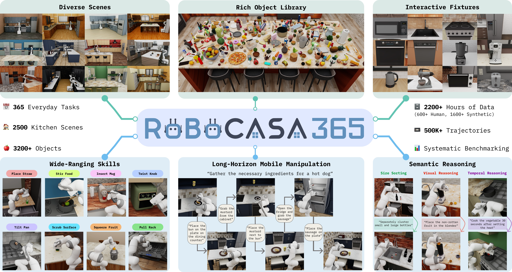

# RoboCasa

目标：理解 RoboCasa 为什么不是单纯的“厨房图片数据集”，而是一个面向通用机器人学习的仿真环境、任务集合、资产库、示教数据集和 benchmark。读完这一节后，你应该能分清 RoboCasa、RoboCasa365、MimicGen 数据、human demonstration、pretrain / target split、LeRobot 格式这些概念，也能判断它适合哪些家庭操作研究、不适合哪些真实机器人结论。

> 先修：[MimicGen](01-mimicgen.md) → [LeRobot 数据格式](../../01-common-data-formats/01-lerobot-data-format.md)
> 建议：这一节重点看“仿真环境怎么变成可训练数据”，不要只把 RoboCasa 当成一个 robosuite 任务包
> 数据集规模：原始 RoboCasa 包含 100 个家庭任务、120+ 个厨房场景和 2,500+ 个 3D 资产；其扩展版本 RoboCasa365 进一步扩展到 365 个任务、2,500+ 个厨房环境、600+ 小时人类示范数据以及 1,600+ 小时自动生成机器人轨迹数据。

RoboCasa 是 UT Austin 等团队发布的大规模家庭厨房仿真框架。原始 RoboCasa 论文发表于 RSS 2024，题目是 **RoboCasa: Large-Scale Simulation of Everyday Tasks for Generalist Robots**。后来发布的 RoboCasa365 在这个平台上继续扩展，把任务、厨房场景、物体资产和示教数据都做得更大，更适合做系统性的 benchmark。

先看 RoboCasa365 的总览图。图里能看到几个关键词：多样厨房、日常任务、物体资产、人类示教、合成示教、benchmark。RoboCasa 的重点不是某一个任务，而是把“家庭厨房里的大量任务”做成一个可以重复训练和评测的平台。



一句话概括 RoboCasa：

```text
RoboCasa 用 MuJoCo / robosuite 构建大量可交互厨房场景，
在这些场景里定义日常家庭操作任务，
再配套人类遥操作示教和 MimicGen 生成示教，
用于训练和评测通用机器人策略。
```

## 它解决的是什么问题

真实家庭任务很难采集。厨房布局不同，柜门、抽屉、灶台、微波炉、咖啡机、食物包装、杯碗盘的位置都可能变。一个只在单一桌面上训练的策略，很难说明它真的学会了“家庭操作”。

RoboCasa 试图把这个问题放到仿真里系统化处理。它不是只做一个 pick-and-place 环境，而是提供大量厨房 layout、style、fixture、object 和 task，让模型在可控但多样的环境里学习。

这里的核心不是“仿真比真实更真实”，而是：

```text
真实数据难以大规模覆盖环境变化。
仿真可以系统控制 layout、style、object、task 和 split。
这样就能更清楚地评估模型到底泛化到了哪里。
```

## RoboCasa 和 RoboCasa365 是什么关系

这两个名字很容易混。

| 名称 | 时间 / 论文 | 可以怎样理解 |
|---|---|---|
| RoboCasa | RSS 2024 | 原始发布，提出面向日常厨房任务的大规模仿真框架 |
| RoboCasa365 | ICLR 2026 | 基于 RoboCasa 平台扩展后的 1.0 版本，强调 365 个任务、2500+ 厨房和 2200+ 小时示教数据 |

原始 RoboCasa 论文中常见的口径是：100 个任务、120 个厨房场景、100 个物体类别级别的任务设计和数据生成实验。当前文档和仓库首页更多使用 RoboCasa365 的口径：365 个任务、2500+ kitchen scenes、3200+ 物体、600+ 小时人类示教和 1600+ 小时自动生成示教。

本节后面主要按当前 RoboCasa 1.0 / RoboCasa365 文档来讲。

## 它到底包含什么

RoboCasa 可以分成五层看。

| 层级 | 内容 | 为什么重要 |
|---|---|---|
| simulator | 基于 MuJoCo / robosuite 的机器人仿真 | 提供物理、控制和渲染环境 |
| scenes | 厨房 layout + style | 控制环境泛化，不只是换物体 |
| assets | fixture、appliance、object | 让柜门、抽屉、炉灶、微波炉等真正可交互 |
| tasks | atomic tasks + composite tasks | 覆盖基础技能和长程日常任务 |
| datasets | human demonstrations + MimicGen demonstrations | 用于 imitation learning 和 benchmark |

所以 RoboCasa 不是“一个数据集文件”。它更像一个数据生产和评测平台：你可以直接下载公开 LeRobot 数据，也可以在环境中重新采集、生成或评测策略。

## 厨房场景为什么重要

RoboCasa 的场景由 `layout` 和 `style` 组成。

`layout` 决定厨房的基本结构，比如一字型、L 型、U 型、G 型、带岛台的厨房等。它会影响柜子、台面、水槽、微波炉、炉灶这些 fixture 的空间位置。

`style` 决定视觉和局部属性，比如材质、颜色、柜门样式、把手类型、纹理、某些设备外观等。它会影响视觉泛化。

RoboCasa365 文档写到，pretraining kitchens 有 50 个 layouts 和 50 个 styles，可以组合成 2500 个 pretraining kitchen scenes；另外还有 10 个 distinct target kitchen scenes。这里的 `pretrain` 和 `target` 不只是训练/测试名字，而是场景集合本身不同。

可以把这件事理解成下面的表：

| 维度 | 例子 | 对学习的影响 |
|---|---|---|
| layout | one-wall、L-shaped、U-shaped、G-shaped、island kitchen | 改变柜子、台面、炉灶、水槽、微波炉的位置关系 |
| style | industrial、modern、farmhouse、rustic、coastal 等 | 改变纹理、材质、把手、门板和视觉外观 |
| split | pretrain kitchens / target kitchens | 控制训练场景和测试场景是否重合 |


这对评估很关键。一个策略如果只在见过的厨房里成功，不代表它能在新厨房里成功。RoboCasa 通过 split 把这个问题显式暴露出来。

## 物体和 fixture 是什么

RoboCasa 里的 object 和 fixture 需要分开理解。

`object` 是可以被移动或操作的日常物品，比如水果、蔬菜、杯子、碗、盘子、包装食品、饮料、工具、清洁用品等。当前文档写到，RoboCasa 提供 3200+ objects，覆盖 150+ object categories，来源包括 Objaverse、LightWheel AI 和 AI 生成物体。

`fixture` 更像厨房里的固定设施或可交互设备，比如 cabinet、drawer、stove、sink、microwave、coffee machine、counter。它们不只是背景。柜门可以开关，抽屉可以拉出，炉灶旋钮可以转动，微波炉门可以打开，这些都会影响任务状态。

这也是 RoboCasa 和普通桌面仿真任务的差别。家庭任务经常不是“把一个物体放到另一个物体旁边”，而是要和环境设施交互：

```text
打开柜门
把杯子放进去
关上柜门
打开微波炉
把食物放进去
调节炉灶旋钮
把物体从抽屉里取出来
```

如果仿真环境里没有可交互 fixture，这类任务很难被真正评测。

## 任务分成哪几类

RoboCasa365 当前文档把任务分成 atomic tasks 和 composite tasks。

`atomic tasks` 是基础技能任务。文档中写到当前版本有 65 个 atomic tasks，覆盖 10 类 macro skill sets 和 14 种 unique fixtures。可以把它理解成机器人需要掌握的基础动作单元。

常见基础技能包括：

```text
pick and place
open / close doors
open / close drawers
twist knobs
turn levers
press buttons
insertion
navigation
sliding racks
open / close lids
```

`composite tasks` 是由多个基础技能组合出来的更长程任务。当前文档写到有 300 个 composite tasks，覆盖 6 类活动。比如整理厨房物品、准备咖啡、处理食材、使用电器等，通常需要多个步骤串起来。

所以 RoboCasa 的任务不是越长越好，而是要分清：

```text
atomic task:
  适合测试某个基础技能是否学会

composite task:
  适合测试多个技能组合后的长程泛化
```

## 数据集规模

它提供超过 2200 小时 demonstration data，包括人类遥操作数据和 synthetic data。数据大体分成 pretraining datasets 和 target datasets。

| 数据类型 | 任务 / 场景 | 规模 | 怎么理解 |
|---|---|---:|---|
| Pretraining Human | 300 tasks，2500 pretraining kitchens | 482 小时 | 人类遥操作采集，用于预训练 |
| Pretraining MimicGen | 60 atomic tasks，2500 pretraining kitchens | 1615 小时 | 用 MimicGen 自动生成的大规模合成示教 |
| Target Human | 50 target tasks，10 heldout target kitchens | 193 小时 | 人类遥操作采集，用于目标任务评测和适配 |

这里要特别注意：RoboCasa 的 synthetic data 不是“渲染出来的图片集合”，而是可以训练策略的 demonstrations。它和上一节 MimicGen 连起来了：MimicGen 是生成方法，RoboCasa 把这种方法用在大规模厨房任务上，形成 pretraining synthetic datasets。

## pretrain 和 target 是什么

`pretrain` 和 `target` 在 RoboCasa 里不是随便起的名字。

`pretrain` 侧重规模。它包含 300 个任务和 2500 个 pretraining kitchens，适合训练一个更通用的策略或作为 foundation model 的数据来源。

`target` 侧重 heldout 评估。它包含 50 个 target tasks 和 10 个与 pretraining 不同的 target kitchens。文档把 target tasks 分成三组：

| target 组别 | 数量 | 含义 |
|---|---:|---|
| Atomic-Seen | 18 | 原子任务，任务类型在 pretraining 中出现过 |
| Composite-Seen | 16 | 组合任务，任务类型在 pretraining 中出现过 |
| Composite-Unseen | 16 | 组合任务，只在 target 中出现，pretraining 中没有 |

这套划分的用意是测试不同层面的泛化：见过技能但没见过厨房、见过任务组合但换环境、以及没见过的组合任务。

## 数据格式长什么样

当前 RoboCasa 数据集使用 LeRobot 格式。这一点对本章很重要，因为前面已经讲过 LeRobot 数据结构。RoboCasa 数据大致是：

```text
lerobot/
  meta/
    info.json
    tasks.jsonl
    episodes.jsonl
    episodes_stats.jsonl
    stats.json
    modality.json
    embodiment.json

  data/
    chunk-000/
      episode_000000.parquet
      ...

  videos/
    chunk-000/
      observation.images.robot0_agentview_left/
        episode_000000.mp4
      observation.images.robot0_agentview_right/
        episode_000000.mp4
      observation.images.robot0_eye_in_hand/
        episode_000000.mp4

  extras/
    dataset_meta.json
    episode_000000/
      ep_meta.json
      model.xml.gz
      states.npz
```

前半部分是标准 LeRobot 结构：`meta`、`data`、`videos`。后面的 `extras` 是 RoboCasa / MuJoCo 相关信息，不属于通用 LeRobot 标准，但对复现实验很有用。

几个字段要特别留意：

| 字段 / 目录 | 含义 |
|---|---|
| `tasks.jsonl` | 语言任务指令和 task index |
| `episodes.jsonl` | 每条 episode 的长度、索引和任务信息 |
| `episode_*.parquet` | action、proprioception、timestamp 等低维轨迹数据 |
| `videos/...agentview_left` | 左侧第三视角相机视频 |
| `videos/...agentview_right` | 右侧第三视角相机视频 |
| `videos/...eye_in_hand` | 末端相机视频 |
| `ep_meta.json` | 每条 episode 的 layout、style、fixture、objects 等信息 |
| `states.npz` | 原始 MuJoCo states，主要用于 replay，不建议直接当训练观测 |

这说明 RoboCasa 数据不是只给一段视频。它同时给了动作、状态、语言指令、相机视频和环境元数据，适合直接进入 imitation learning 流程。

## 它和 MimicGen 的关系

上一节讲的 MimicGen 是数据生成方法，RoboCasa 是更大的家庭厨房仿真平台。两者关系可以这样理解：

| 项目 | 重点 | 在 RoboCasa 中的角色 |
|---|---|---|
| MimicGen | 从少量示教生成更多成功轨迹 | 用来扩展 RoboCasa 的 pretraining synthetic demonstrations |
| RoboCasa | 场景、资产、任务、数据和 benchmark | 提供厨房任务环境和评测体系 |

RoboCasa 里的 pretraining MimicGen 数据覆盖 60 个 atomic tasks，每个任务约 10K demonstrations，共 1615 小时。它不是另一个独立数据集，而是 RoboCasa 平台上用 MimicGen 生成出来的一部分训练数据。

所以如果你想研究“数据生成算法本身”，看 MimicGen；如果你想研究“家庭厨房任务里，多任务、多场景、多物体如何训练和评测”，看 RoboCasa。

## 适合什么研究

RoboCasa 适合下面几类问题：

```text
多任务 imitation learning:
  一个策略同时学习大量厨房任务

视觉泛化:
  训练和测试厨房的 layout / style / object 不同

foundation model training:
  用大量仿真 demonstration 训练通用策略

lifelong learning:
  按任务或环境持续增加数据，观察模型是否遗忘

sim-to-real 研究:
  在仿真里训练，再用真实任务验证迁移能力
```

它不太适合用来回答这些问题：

```text
某个真实机器人硬件的精确控制误差是多少
真实厨房里人类实际采集数据有多少
真实接触、摩擦、柔性物体和液体是否完全可信
开放世界家庭服务机器人是否已经解决
```

RoboCasa 能让我们更系统地研究这些问题，但不能直接替代真实世界评测。

## 和真实机器人数据是什么关系

RoboCasa 的价值在于规模和可控性。你可以控制场景、物体、任务、split、数据来源和评测设置，这是真实采集很难做到的。

但它仍然是仿真。使用时要把下面几个边界写清楚：

```text
视觉渲染不等于真实相机
MuJoCo 接触不等于真实接触
厨房资产不等于真实家庭全部长尾物体
任务成功判定来自仿真逻辑
合成示教依赖 MimicGen 和任务脚本设计
```

因此，更稳妥的用法是把 RoboCasa 当作预训练、算法开发和系统评测平台。如果要声称策略能在真实厨房里工作，还需要真实机器人实验来验证。

## 常见误解

**误解一：RoboCasa 只是一个厨房场景渲染库。**

不准确。它包含可交互 fixture、任务定义、人类示教、MimicGen 生成示教、LeRobot 数据和 benchmark。

**误解二：RoboCasa365 的 365 个任务就是原始 RoboCasa 的 100 个任务。**

不对。100 tasks 是 RSS 2024 原始 RoboCasa 的常见口径；365 tasks 是 RoboCasa365 / 1.0 文档中的扩展口径。写作时要说明版本。

**误解三：pretrain 和 target 只是数据文件名不同。**

不只是。它们对应不同任务集合和厨房场景集合。target kitchens 是 heldout 场景，用来评估泛化。

**误解四：RoboCasa 的 synthetic data 就是图片合成。**

不准确。这里的 synthetic demonstrations 是可用于策略训练的机器人轨迹数据，包含观测、动作、任务和环境信息。

**误解五：下载 LeRobot 数据后就不需要 extras。**

看训练可能暂时不需要，但复现实验、回放 MuJoCo 状态、检查 layout/style/object 时，`extras` 很重要。

**误解六：在 RoboCasa 上成功就等于真实厨房成功。**

不能这么说。RoboCasa 提供的是仿真 benchmark，真实部署还要处理 sim-to-real gap。

## 小结

RoboCasa 最适合被看成“面向家庭厨房任务的大规模仿真训练和评测平台”。它把可交互厨房场景、日常任务、物体资产、人类示教、MimicGen 合成示教和 LeRobot 格式数据放在一起。对具身 AI 来说，它补的是任务多样性、场景多样性和大规模仿真训练数据；对真实机器人来说，它仍然需要和真实数据、真实评测以及 sim-to-real 方法配合使用。

进一步阅读可以看：
- [RoboCasa 网站](https://robocasa.ai/)
- [RoboCasa toolkit](https://github.com/robocasa/robocasa)
- [RoboCasa documentation](https://robocasa.ai/docs/build/html/introduction/overview.html)
- [RoboCasa paper](https://arxiv.org/abs/2406.02523)
- [RoboCasa365 paper](https://arxiv.org/abs/2603.04356)