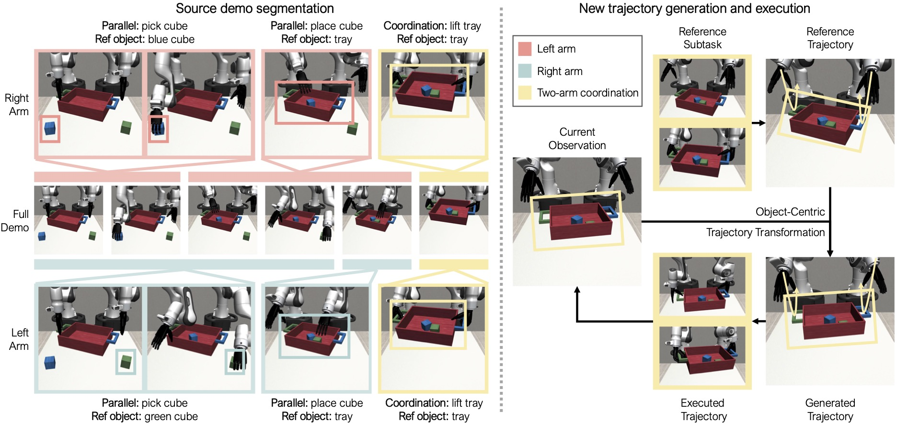
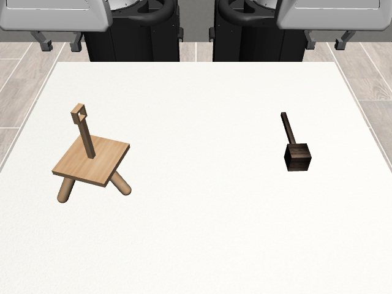
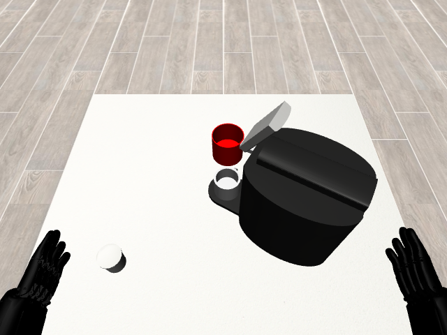
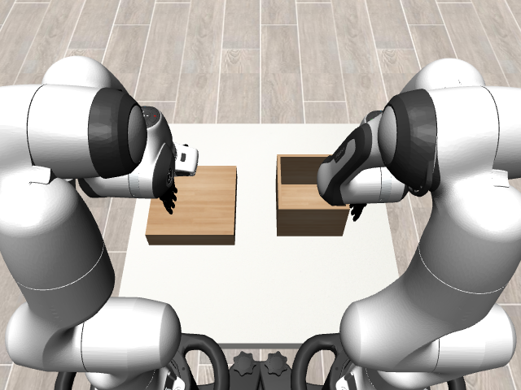

# DexMimicGen

目标：理解 DexMimicGen 为什么是 MimicGen 思路在双臂和灵巧手操作上的扩展，能分清 bimanual manipulation、dexterous hands、source demonstrations、generated demonstrations、reset distribution、robosuite / BiGym 环境和 robomimic 训练流程，也能判断它适合哪些研究、不适合哪些结论。

> 先修：[MimicGen](01-mimicgen.md) → [RoboCasa](02-robocasa.md)
> 建议：这一节重点看“为什么双臂灵巧操作的数据生成更难”，不要把 DexMimicGen 简单理解成 MimicGen 改了一个名字
> 数据集规模：DexMimicGen 发布的数据规模约 21,000 条双臂灵巧操作轨迹，公开数据约 60 GB，并提供对应仿真环境和数据生成工具。

DexMimicGen 是 NVIDIA Research、UT Austin、UC San Diego 等团队在 ICRA 2025 发表的工作，论文题目是 **DexMimicGen: Automated Data Generation for Bimanual Dexterous Manipulation via Imitation Learning**。它延续了 MimicGen 的核心思路：从少量人类示教出发，在仿真中自动生成更多成功 demonstrations。但它面对的对象更难：双臂、灵巧手、类人机器人，以及需要两只手协调完成的任务。

先看一张 pipeline 图。图里最重要的是两件事：第一，源示教仍然是数据生成的起点；第二，生成目标不再只是单臂末端轨迹，而是双臂和多指手在复杂任务里的协调操作。



一句话概括 DexMimicGen：

```text
DexMimicGen 把 MimicGen 的少样本数据生成思路扩展到双臂和灵巧手，
从 60 条人类源示教出发，
在 9 个任务、多种机器人形态和仿真环境中生成 20K+ 条 demonstrations，
用于训练双臂灵巧操作策略。
```

## 它和 MimicGen 的关系

MimicGen 解决的是“少量示教如何放大成大量机器人操作数据”。DexMimicGen 解决的是同一个问题的更难版本：当机器人有两只手、多个手指，并且任务要求两只手协调时，数据怎么生成？

可以这样对比：

| 项目 | MimicGen | DexMimicGen |
|---|---|---|
| 主要对象 | 单臂或较常规机械臂任务 | 双臂、灵巧手、humanoid dexterous robots |
| 动作空间 | 通常是末端位姿 + 夹爪 | 双臂末端、双手手指、更多自由度 |
| 任务结构 | object-centric subtasks | 双臂协调、手指接触、长程操作 |
| 数据规模口径 | 论文约 200 source demos → 50K+ demos | 60 source demos → 20K+ demos，论文摘要写 21K |
| 代表任务 | stacking、coffee、threading、assembly 等 | can sorting、pouring、tray lift、box cleanup、drawer cleanup 等 |

所以 DexMimicGen 不是替代 MimicGen，而是把它推到更复杂的 embodiment 上。前一节里讲过的 source demonstrations、reset distribution、generated demonstrations、robomimic training，在这里仍然有用；只是机器人形态和任务难度变了。

## 为什么双臂灵巧操作更难

单臂夹爪任务里，很多动作可以粗略理解成“末端接近物体、夹住、移动、放下”。双臂灵巧操作就不一样。

第一，双臂要协调。比如端起托盘时，两只手的位置和受力要配合；一只手先到、另一只手没跟上，任务可能直接失败。

第二，灵巧手不是简单开合。多指手有更多关节，接触点、手指弯曲、掌心朝向都会影响能不能稳定拿住物体。

第三，任务更长。整理盒子、清理抽屉、倒液体、穿线、装配，这些任务通常包含多个阶段，不是一个 pick-and-place 就能完成。

第四，示教更贵。遥操作双臂和灵巧手比遥操作单臂夹爪难得多。如果每个任务都靠人录几千条示教，成本很快就不可接受。

DexMimicGen 要解决的就是这个瓶颈：只采少量高质量源示教，然后在仿真中生成更多可训练轨迹。

## 它到底包含哪些任务

DexMimicGen 仓库的 `environments.md` 列出了 9 个任务，并给出建议使用的机器人形态。可以分成三类看。

| 任务 | 建议机器人形态 | 任务特点 |
|---|---|---|
| `TwoArmThreading` | 两个 Panda arms + parallel grippers | 双臂穿线 / 插入类任务 |
| `TwoArmThreePieceAssembly` | 两个 Panda arms + parallel grippers | 三件套装配，强调对准和长程步骤 |
| `TwoArmTransport` | 两个 Panda arms + parallel grippers | 双臂搬运，强调协调移动 |
| `TwoArmDrawerCleanup` | 两个 Panda arms + dexterous hands | 打开/整理抽屉，强调手指和环境交互 |
| `TwoArmBoxCleanup` | 两个 Panda arms + dexterous hands | 整理盒子，强调双手抓取和放置 |
| `TwoArmLiftTray` | 两个 Panda arms + dexterous hands | 抬托盘，强调两手同步和稳定 |
| `TwoArmCoffee` | humanoid robot + dexterous hands | 类人双臂咖啡相关操作 |
| `TwoArmPouring` | humanoid robot + dexterous hands | 倾倒任务，强调姿态控制 |
| `TwoArmCanSortRandom` | humanoid robot + dexterous hands | 罐子分类，论文里也用于 real-to-sim-to-real 演示 |

下面两张图来自仓库的环境说明。第一张是双臂 Panda 的 threading 任务，第二张是 humanoid dexterous hands 的 coffee 任务。放在一起看，能直观看出 DexMimicGen 覆盖的不是单一机器人形态。





再看一张使用 dexterous hands 的 box cleanup 环境。它和普通夹爪任务的差别在于：手指姿态和接触关系会真正影响策略能不能拿稳和放准。



## 数据规模

研究团队从 60 条 source human demonstrations 出发，在 9 个任务、多种仿真器和真实世界设置中自动生成 20,000+ demonstrations。

```text
60 条 source human demonstrations
  ↓
9 个双臂 / 灵巧操作任务
  ↓
约 21K 条 generated demonstrations
```

这里要注意，DexMimicGen 的重点不是“比 MimicGen 数量更大”，而是“在更复杂的机器人形态和任务上仍然能放大数据”。双臂和多指手的示教成本更高，所以从 60 条源示教生成 20K+ 条数据，本身就很有意义。

## generated demonstrations 是什么

DexMimicGen 生成的是可用于 imitation learning 的机器人 demonstrations，不是单纯视频。

从公开仓库的使用方式看，数据以 HDF5 形式发布，并可以用 `playback_datasets.py` 回放，用 robomimic 训练 BC-RNN。也就是说，一条 demonstration 至少需要包含策略训练所需的观测和动作，并保留环境回放需要的信息。

可以把它理解成：

```text
source human demos:
  少量人类遥操作示教，用来提供操作模板

generated demos:
  在仿真中生成并筛选出的成功轨迹，用于训练策略

playback:
  用仿真环境回放 HDF5 里的轨迹，检查数据是否正确

training:
  用 robomimic 读取数据，训练 BC-RNN 等模仿学习策略
```

这和上一节 RoboCasa 的 LeRobot 数据不同。DexMimicGen 当前公开流程更接近 robomimic / HDF5 生态，不要默认它是 LeRobot 格式。

## reset distribution 怎么理解

DexMimicGen 也使用不同 reset distribution 来展示生成数据的多样性。DexMimicGen 网站中展示了 Pouring、Box Cleanup、Three Piece Assembly、Drawer Cleanup 等任务在不同 reset distribution 下生成的数据。

这里的 `D0`、`D1`、`D2` 可以沿用 MimicGen 那一节的理解：它们表示不同初始状态分布，而不是固定的绝对难度等级。

```text
D0:
  初始状态更接近源示教

D1:
  初始状态变化更大

D2:
  初始状态进一步扩展，生成和学习通常更难
```

但不同任务里的 D0 / D1 / D2 具体含义要看任务设置。写实验时不能只写“用了 D1”，还要写任务名、环境名和机器人形态，例如 `TwoArmPouring D1` 或 `TwoArmThreePieceAssembly D2`。

## real-to-sim-to-real 是什么

DexMimicGen 还展示了 real-to-sim-to-real pipeline，并在真实 humanoid can sorting 任务上部署策略。

这个流程可以拆开理解：

```text
real:
  从真实任务中获得少量源示教或任务设定

sim:
  在仿真中建立对应任务，并用 DexMimicGen 生成大量 demonstrations

real:
  用生成数据训练策略，再部署回真实机器人任务
```

这说明 DexMimicGen 不只是离线仿真 benchmark，也尝试把生成数据用于真实机器人。不过这不等于它“解决了 sim-to-real”。真实部署仍然依赖任务建模、机器人校准、视觉/控制接口、仿真资产和真实评估。

课程里更稳妥的说法是：DexMimicGen 展示了 real-to-sim-to-real 的可行案例，而不是证明所有双臂灵巧任务都能自动迁移到真实世界。

## 和 RoboCasa、MimicGen 的区别

| 项目 | 重点 | DexMimicGen 的位置 |
|---|---|---|
| MimicGen | 少量示教到大规模仿真 demonstrations | 方法源头，主要讲自动数据生成逻辑 |
| RoboCasa | 家庭厨房场景、任务、资产和大规模 LeRobot 数据 | 大规模家庭任务平台 |
| DexMimicGen | 双臂、灵巧手、humanoid dexterous manipulation | 把数据生成推到更复杂 embodiment 和协调操作 |

如果你想理解“数据生成算法怎么从源示教放大轨迹”，先看 MimicGen；如果你想做厨房多任务学习，看 RoboCasa；如果你关心两只手、多指手和类人机器人如何用少量示教扩展数据，看 DexMimicGen。

## 它适合什么研究

DexMimicGen 适合下面几类问题：

```text
bimanual imitation learning:
  两只手协同完成任务

dexterous manipulation:
  多指手抓取、整理、倒液体、拿托盘等

humanoid manipulation:
  类人机器人上半身和双手操作

data generation for hard tasks:
  少量源示教扩展成可训练数据

real-to-sim-to-real:
  用仿真生成数据帮助真实任务学习
```

它不适合直接回答这些问题：

```text
所有真实 humanoid 任务都能零样本迁移吗
真实多指手接触是否和仿真完全一致
只靠 DexMimicGen 数据就能训练通用家务机器人吗
任意 HDF5 数据都能自动变成双臂灵巧数据吗
```

这些问题仍然需要真实机器人评测、仿真校准、任务工程和更多数据来回答。

## 常见误解

**误解一：DexMimicGen 只是 MimicGen 换了几个任务名。**

不准确。它面向的是双臂和灵巧手，动作空间、协调要求和接触复杂度都更高。

**误解二：DexMimicGen 数据是 LeRobot 格式。**

不建议这样默认。公开仓库的回放和训练流程使用 HDF5、robosuite 和 robomimic；RoboCasa365 才是当前章节里明确使用 LeRobot 数据格式的例子。

**误解三：有 21K demos 就说明数据问题彻底解决了。**

不对。21K 是在 9 个任务和特定仿真环境中的生成规模。换机器人、换真实场景、换任务，仍然需要重新建模和评估。

**误解四：real-to-sim-to-real 等于无 sim-to-real gap。**

不是。它展示了真实部署案例，但不代表仿真和真实完全一致。真实系统仍然需要校准、接口适配和实机验证。

**误解五：双臂任务都必须用 humanoid。**

不对。DexMimicGen 里既有两个 Panda arms 的任务，也有 humanoid robot with dexterous hands 的任务。要看具体环境和研究问题。

**误解六：公开仓库包含所有自动生成细节，可以直接生成任意新任务数据。**

要谨慎。仓库 README 明确说它发布的是项目使用的仿真环境和数据集，并提供下载、回放和训练流程。把它用于新任务时，仍然要处理环境、任务信号、控制接口和数据生成配置。

## 小结

DexMimicGen 最适合被看成“面向双臂灵巧操作的数据生成和仿真实验平台”。它继承了 MimicGen 的少样本扩增思想，但把问题推进到双臂协调、多指手接触和 humanoid manipulation。对具身 AI 来说，它补的是复杂 embodiment 下的数据规模；对真实机器人来说，它仍然需要和 real-to-sim-to-real、真实评测和 sim-to-real 方法一起看。

进一步阅读可以看：
- [DexMimicGen 网站](https://dexmimicgen.github.io/)
- [DexMimicGen toolkit](https://github.com/NVlabs/dexmimicgen)
- [DexMimicGen paper](https://arxiv.org/abs/2410.24185)
- [DexMimicGen datasets](https://huggingface.co/datasets/MimicGen/dexmimicgen_datasets/tree/main)