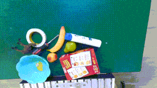
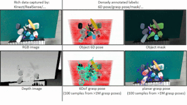

# GraspNet-1Billion

目标：理解 GraspNet-1Billion 为什么是平行夹爪 6DoF 抓取检测里的经典 benchmark，能分清 RGB-D 图像、点云、6D object pose、6DoF grasp pose、grasp width、collision checking、AP 评测这些概念，也能判断它适合哪些抓取研究、不适合哪些模仿学习任务。

> 先修：[HDF5 数据格式](../../01-common-data-formats/02-hdf5.md) → [DexYCB](../03-hand-object-interaction-datasets/01-dexycb.md)
> 建议：这一节重点看“一个 RGB-D 场景如何变成大量可评测的抓取候选”，不要把 GraspNet-1Billion 当成机器人遥操作轨迹数据
> 数据集规模：GraspNet-1Billion 包含约 97,280 个 RGB-D 图像和超过 10 亿个抓取姿态标注，公开数据规模超过 120 GB，是目前机器人通用抓取研究中规模最大的真实 RGB-D 抓取数据集之一。

GraspNet-1Billion 是上海交通大学 MVIG 团队在 CVPR 2020 发布的大规模通用物体抓取 benchmark，论文题目是 **GraspNet-1Billion: A Large-Scale Benchmark for General Object Grasping**。后来扩展论文 **Robust grasping across diverse sensor qualities: The GraspNet-1Billion dataset** 发表在 IJRR 2023。

它关注的问题很具体：给机器人一张真实杂乱场景的 RGB-D 图像或点云，能不能预测一批 6DoF 抓取位姿，让平行夹爪从合适的位置、方向和宽度去抓物体？

GraspNet-1Billion 的核心不是“视频有多少”，而是大规模真实 RGB-D 场景、密集抓取标注和统一评测协议。


一句话概括 GraspNet-1Billion：

```text
GraspNet-1Billion 采集 190 个真实杂乱场景，
用 Azure Kinect 和 RealSense D435 两种 RGB-D 相机得到 97,280 张图像，
覆盖 88 个物体，
并为场景中的物体提供超过 11 亿个平行夹爪抓取位姿标注。
```

## 它解决的是什么问题

抓取检测和普通目标检测不一样。目标检测只要告诉你“物体在哪里”；抓取检测要告诉你“夹爪应该从哪里进、朝哪个方向、张开多宽、会不会碰撞、成功概率大不大”。

传统抓取数据集有两个常见问题。

第一，标注不够密。很多数据集只在 2D 图像上标一个矩形抓取框，适合平面桌面任务，但很难覆盖真实 3D 场景里的多方向抓取。

第二，评测不统一。不同论文可能用不同机器人、不同场景、不同阈值和不同成功标准，很难公平比较。

GraspNet-1Billion 的价值就在这里：它提供真实 RGB-D 场景、海量 6DoF grasp labels、物体 6D pose、instance masks，以及统一的 offline evaluation。这样研究者可以在同一套数据和指标下比较不同抓取检测方法。

## 它到底收集了什么

GraspNet 官网给出的核心规模是：

| 项目 | 数量或形式 | 怎么理解 |
|---|---:|---|
| scenes | 190 个 | 杂乱堆叠的真实桌面场景 |
| images | 97,280 张 | 每个场景从多个视角采集 RGB-D |
| objects | 88 个 | 覆盖不同形状、大小和材质的真实物体 |
| cameras | 2 种 | Azure Kinect 和 RealSense D435 |
| grasp labels | 1.1B+ | 超过 11 亿个抓取姿态标注 |
| annotations | 6DoF grasp、planar grasp、6D pose、instance mask 等 | 同时支持 3D 抓取、2D 抓取和物体理解 |
| benchmark | seen / similar / novel | 测试见过、相似、未见物体上的泛化 |

下面这张动态图来自 GraspNet 网站，展示的是数据本身：真实杂乱场景、不同物体和多视角 RGB-D 采集。



这里要注意两个关键词：`真实场景` 和 `密集标注`。GraspNet 不是在纯合成模型上随便采样抓取，也不是只给少量人工标注矩形。它先采集真实 RGB-D 场景，再结合物体模型、6D pose 和分析式抓取评价生成密集 grasp annotations。

## 6DoF grasp pose 是什么

GraspNet 面向的是平行夹爪抓取。一个 6DoF grasp pose 可以理解为夹爪在 3D 空间中的位姿：

```text
translation:
  夹爪中心点在三维空间的位置

rotation:
  夹爪接近物体的方向和夹爪开口方向

width:
  夹爪需要张开的宽度

score / quality:
  这个抓取候选在几何和碰撞意义上是否可靠
```

严格说，`6DoF` 指位置和朝向：3 个平移自由度 + 3 个旋转自由度。实际抓取时还需要 `width`，因为同一个姿态下，夹爪张开太窄会夹不到物体，张开太宽可能碰到周围物体。

这和 2D 抓取矩形不同。2D 矩形通常只在图像平面里描述抓取位置、角度和宽度；6DoF grasp pose 可以表达从侧面、斜上方或其他三维方向接近物体，更接近真实机器人抓取需要的表示。

## 标注为什么能达到 10 亿级

如果 11 亿个抓取都靠人工逐个标，几乎不可能。GraspNet 的思路是利用已知物体模型、物体 6D pose 和抓取分析来生成密集标注。

可以把流程理解成：

```text
真实 RGB-D 场景
  ↓
估计 / 标定场景中每个物体的 6D pose
  ↓
把物体 CAD model 放回场景坐标系
  ↓
在物体表面和附近采样大量平行夹爪候选
  ↓
检查夹爪宽度、接触、碰撞和可行性
  ↓
得到密集 6DoF grasp labels
```

下面这张动态图展示的是 GraspNet 的 dense annotations。它不是只标一个“最佳抓取”，而是给出大量可选抓取候选，后续模型可以学习从 RGB-D / point cloud 中预测这些候选。



这也是为什么数据集名字里有 `1Billion`。它强调的是 grasp pose annotation 的数量级，而不是图片数量达到十亿。

## 数据里一张图大概有什么

下载完整 GraspNet 数据后，一条样本通常会围绕 `scene`、`camera` 和 `frame` 组织。不同工具读出来的字段会有差异，但你可以先按下面的结构理解：

```text
graspnet/
  scenes/
    scene_0000/
      kinect/
        rgb/
        depth/
        label/
        meta/
      realsense/
        rgb/
        depth/
        label/
        meta/

  models/
    物体模型

  grasp_label/
    每个物体对应的抓取标注

  collision_label/
    场景级碰撞相关标注
```

一帧里常用的信息包括：

| 信息 | 作用 |
|---|---|
| RGB image | 提供纹理和颜色信息 |
| depth image | 生成点云，恢复 3D 几何 |
| camera intrinsics | 把 depth 投影成点云 |
| instance mask / label | 知道像素属于哪个物体 |
| object 6D pose | 把物体模型放到场景里 |
| grasp labels | 候选抓取姿态、宽度和质量 |
| collision labels | 判断抓取是否会和场景发生碰撞 |

第一次读数据时，建议先不要直接训练模型，而是用 `graspnetAPI` 的 examples 检查数据能不能正确加载和可视化。

## Kinect 和 RealSense 为什么都要有

GraspNet-1Billion 使用了两种 RGB-D 相机：Azure Kinect 和 RealSense D435。这个设计很重要，因为不同深度相机的噪声、缺失、视角和深度质量会不同。

如果一个方法只在某一种相机上有效，换另一种相机性能就明显下降，那它的泛化能力就有限。GraspNet 在数据和 baseline 里都区分 `kinect` 和 `realsense`，可以让研究者分别训练、测试和比较。

所以写实验时不要只写“用了 GraspNet”。至少要写清楚：

```text
camera: kinect or realsense
split: seen / similar / novel
input: RGB-D, depth-only, point cloud, or RGBD point cloud
metric: AP, AP0.8, AP0.4
whether collision checking is used
```

## seen / similar / novel 是什么

GraspNet 的测试结果通常按 `seen`、`similar`、`novel` 三组报告。它们关注的是物体泛化。

| split | 含义 | 想测试什么 |
|---|---|---|
| seen | 测试物体在训练中见过 | 模型是否能在熟悉物体上抓得准 |
| similar | 测试物体和训练物体相似 | 模型能否泛化到相似形状 / 类别 |
| novel | 测试物体是新的 | 模型能否泛化到未见物体 |

这三个指标一起看才有意义。一个方法在 `seen` 上高，不代表它能抓新物体；`novel` 往往更能反映通用抓取能力。

## AP、AP0.8、AP0.4 是什么

GraspNet baseline 的结果表里会看到 `AP`、`AP0.8`、`AP0.4`。这里的 AP 不是普通目标检测里的 IoU AP，而是基于抓取评价协议的 Average Precision。

可以简化理解成：模型会输出一批抓取候选，评测会根据碰撞和抓取质量判断哪些候选有效，然后统计不同质量阈值下的平均精度。

`AP0.8` 和 `AP0.4` 可以看作不同摩擦系数 / 抓取难度阈值下的指标。摩擦系数越小，说明要求抓取在更苛刻条件下也能稳定；指标通常也更难做高。

更实用的读法是：

```text
AP:
  综合指标，看整体抓取候选质量

AP0.8:
  较宽松条件下的抓取质量

AP0.4:
  较严格条件下的抓取质量

seen / similar / novel:
  分别看见过物体、相似物体和新物体
```

论文或代码结果表中如果同时给 Kinect 和 RealSense，不能随便混在一起比较。相机不同，输入深度质量也不同。

## 它和 DexYCB、DexGraspNet 的区别

| 数据集 | 重点 | 和 GraspNet-1Billion 的区别 |
|---|---|---|
| DexYCB | 人手抓取 YCB 物体，多视角 RGB-D，手和物体姿态 | 关注人手-物体几何，不是大规模平行夹爪抓取检测 benchmark |
| GraspNet-1Billion | 杂乱场景 RGB-D / 点云中的平行夹爪 6DoF 抓取 | 本节核心，强调通用物体抓取位姿检测和统一评测 |
| DexGraspNet | 多指灵巧手抓取 | 面向灵巧手，而不是两指平行夹爪 |

如果你要训练一个从点云里预测平行夹爪 grasp pose 的网络，GraspNet-1Billion 更合适；如果你要研究人手如何抓物体，DexYCB 更合适；如果你要研究 ShadowHand 或 AllegroHand 这类多指手的抓取姿态，下一节 DexGraspNet 更相关。

## 它和具身 AI 的关系

GraspNet-1Billion 对具身 AI 的价值在抓取前端。机器人执行复杂任务前，经常要先把一个物体可靠抓起来。抓取检测模块可以作为更大系统里的一个子模块：

```text
视觉感知:
  RGB-D / point cloud 输入

抓取检测:
  预测一批 6DoF grasp candidates

抓取选择:
  根据任务、碰撞、可达性和物体目标选择一个候选

运动规划和控制:
  让机器人末端执行器移动到抓取位姿

任务执行:
  抓起、移动、放置、递交或继续操作
```

但它本身不是完整操作策略数据。它不会告诉机器人“接下来应该做什么任务”，也不提供语言指令、机器人遥操作轨迹或长程动作序列。它更适合做抓取检测、抓取排序、抓取可行性评估和 perception-to-grasp 这一段。

## 常见误解

**误解一：1Billion 指 10 亿张图片。**

不对。这里指的是超过 11 亿个抓取位姿标注。图片规模是 97,280 张。

**误解二：GraspNet-1Billion 是灵巧手数据集。**

不准确。它主要面向平行夹爪的通用物体抓取。多指灵巧手抓取要看 DexGraspNet 这类数据集。

**误解三：有抓取 pose 就能直接完成机器人任务。**

不够。抓取 pose 只是一个候选末端位姿。真实执行还需要可达性、轨迹规划、碰撞检查、控制器、抓取后任务目标和失败恢复。

**误解四：只看 seen AP 就能说明通用抓取能力。**

不够。seen、similar、novel 要一起看。novel 物体上的表现更接近“能不能抓没见过的东西”。

**误解五：Kinect 和 RealSense 结果可以随便比较。**

不建议。两种相机的深度质量和噪声不同，训练和测试时要写清楚 camera 设置。

**误解六：GraspNet 是模仿学习轨迹数据。**

不是。它是抓取检测和评测数据，不提供长程遥操作 action 序列。

## 小结

GraspNet-1Billion 是“真实杂乱场景中的平行夹爪 6DoF 抓取检测 benchmark”。它的核心贡献不是图片数量，而是 190 个真实场景、两种 RGB-D 相机、88 个物体、超过 11 亿个 dense grasp labels，以及统一的 seen / similar / novel 评测协议。对具身 AI 来说，它补的是抓取前端能力；对完整操作策略来说，它还需要和任务规划、运动规划、控制和真实执行评估结合起来。

进一步阅读可以看：
- [GraspNet 网站](https://graspnet.net/)
- [GraspNet baseline](https://github.com/graspnet/graspnet-baseline)
- [GraspNet API](https://github.com/graspnet/graspnetAPI)
- [GraspNet API documentation](https://graspnetapi.readthedocs.io/en/latest/index.html)
- [GraspNet-1Billion paper](https://openaccess.thecvf.com/content_CVPR_2020/html/Fang_GraspNet-1Billion_A_Large-Scale_Benchmark_for_General_Object_Grasping_CVPR_2020_paper.html)