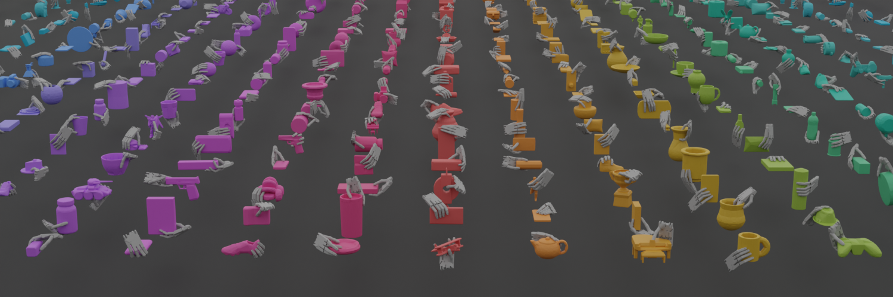
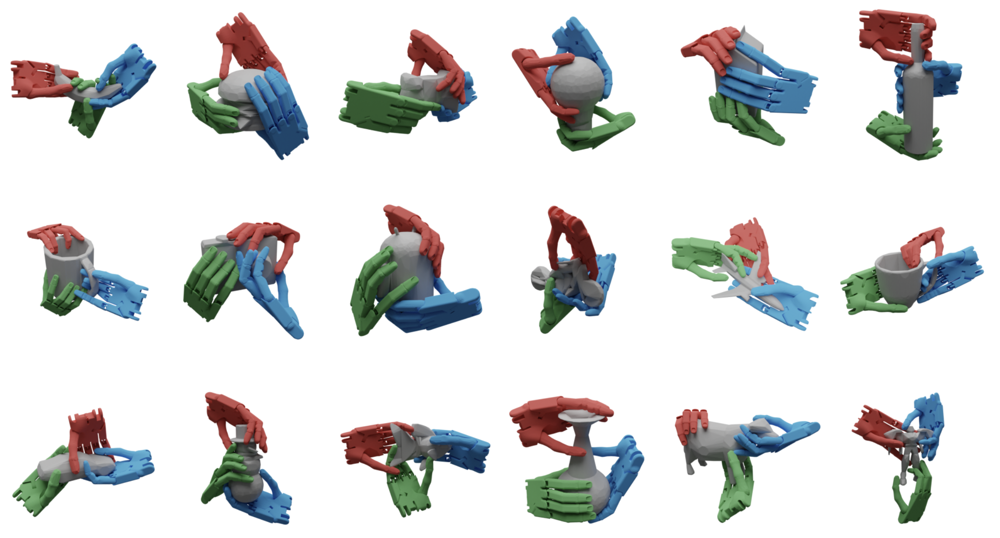

# DexGraspNet

目标：理解 DexGraspNet 为什么是多指灵巧手抓取研究里的重要数据集，能分清 parallel gripper grasp、dexterous grasp、ShadowHand、MANO、Allegro、force closure、Isaac Gym validation、object mesh 和 grasp synthesis 这些概念，也能判断它适合哪些灵巧抓取任务、不适合哪些机器人控制任务。

> 先修：[GraspNet-1Billion](01-graspnet-1billion.md) → [OakInk](../03-hand-object-interaction-datasets/02-oakink.md)
> 建议：这一节重点看“多指手抓取姿态和两指夹爪抓取姿态有什么不同”，不要把 DexGraspNet 当成 GraspNet-1Billion 的灵巧手版本简单替换
> 数据集规模：DexGraspNet 是一个大规模仿真灵巧抓取数据集，包含 5355 个物体、133 类物体以及 132 万个稳定抓取姿态。

DexGraspNet 是北京大学、北京通用人工智能研究院、清华大学等团队在 ICRA 2023 发布的数据集，论文题目是 **DexGraspNet: A Large-Scale Robotic Dexterous Grasp Dataset for General Objects Based on Simulation**。它关注的是 robotic dexterous grasping，也就是机器人多指灵巧手如何稳定抓住通用物体。

和上一节 GraspNet-1Billion 不同，DexGraspNet 不是给平行夹爪预测一个 6DoF grasp pose，而是给高自由度灵巧手生成完整的手部抓取姿态。这里的“抓取姿态”不只是手掌在什么位置，还包括每根手指怎么弯、手腕如何朝向、哪些部位接触物体，以及这个姿态能不能在物理仿真中稳定。

先看 teaser 图。图里展示的是 ShadowHand 在大量物体上的不同抓取姿态。重点不是一只手抓一个物体，而是同一个数据集覆盖了许多物体形状和许多不同类型的多指接触。



一句话概括 DexGraspNet：

```text
DexGraspNet 用高效的灵巧手抓取合成方法，
为 5355 个物体生成 1.32M 个 ShadowHand 抓取姿态，
覆盖 133+ 个物体类别，
每个物体实例有 200+ 个多样抓取，
并用 Isaac Gym 对抓取进行验证。
```

## 它解决的是什么问题

平行夹爪抓取已经有很多数据集和 benchmark。比如上一节 GraspNet-1Billion，重点是从 RGB-D / 点云中预测两指夹爪的 6DoF 抓取位姿。可是多指灵巧手不一样。

灵巧手的难点在于自由度高。ShadowHand 这类手有多个手指和大量关节，手掌姿态、每根手指的弯曲、接触点分布都会影响抓取是否稳定。一个物体可以有很多种合理抓法，比如捏、握、包覆、托举、侧向夹持，它们不是一个简单的 6DoF pose 能完全描述的。

DexGraspNet 要补的就是这一块：为通用物体提供大规模、多样、经过物理验证的灵巧手抓取姿态，让研究者可以训练 dexterous grasp synthesis 或抓取生成模型。

## 它到底收集了什么

核心规模是：

| 项目 | 数量或形式 | 怎么理解 |
|---|---:|---|
| hand | ShadowHand | 数据主体使用 ShadowHand 生成 |
| grasps | 1.32M | 约 132 万个灵巧手抓取姿态 |
| objects | 5355 个 | 大规模通用物体 mesh |
| categories | 133+ 类 | 覆盖多种日常物体类别 |
| grasps per object | 200+ | 每个物体实例有多个多样抓取 |
| validation | Isaac Gym | 所有抓取都经过物理仿真验证 |
| license | CC BY-NC 4.0 | 非商业许可，使用前要看清楚 |

下面这张图展示的是不同物体上的多样抓取姿态。看这张图时要注意：DexGraspNet 不是只给“最优一个抓取”，而是为同一个物体提供许多可能的稳定抓取。



这里的关键是 `diverse grasps`。灵巧手抓取如果只给一种姿态，模型很容易学成固定模板；多样抓取能让模型学到“同一个物体可以从不同区域、不同手势去抓”。

## dexterous grasp 和 parallel gripper grasp 有什么区别

可以先把两类抓取表示放在一起看。

| 抓取类型 | 主要表示 | 适合什么机器人 |
|---|---|---|
| parallel gripper grasp | 夹爪 6DoF pose + width + score | 两指平行夹爪 |
| dexterous grasp | 手腕姿态 + 多个手指关节角 + 接触关系 + 稳定性 | ShadowHand、AllegroHand、多指机器人手 |

平行夹爪可以粗略理解成“一个刚性夹爪从某个方向夹过去”。它的动作空间相对小，很多数据集都能用一个 6DoF pose 加夹爪宽度表示。

灵巧手抓取则更像“整只手如何围绕物体形成稳定接触”。同一个手腕位置下，手指张开程度不同，结果可能完全不一样；同一个物体，也可能需要拇指、食指、中指和掌心一起参与接触。

所以 DexGraspNet 不是把 GraspNet-1Billion 的 6DoF grasp 换成“灵巧手”四个字。它的数据对象本质上更复杂：要描述完整的 robot hand configuration。

## ShadowHand 是什么

DexGraspNet 的主体数据使用 `ShadowHand`。ShadowHand 是机器人灵巧手的一种经典硬件形态，有多个手指和较高自由度，常被用于灵巧操作研究。

在 DexGraspNet 里，ShadowHand 抓取姿态通常需要描述：

```text
hand global pose:
  手掌 / 手腕在物体坐标系或世界坐标系中的位置和朝向

joint configuration:
  每个手指关节的角度

object mesh:
  被抓物体的几何形状

contact / stability:
  手和物体之间的接触是否能形成稳定抓取
```

这和人手数据里的 MANO 不一样。MANO 是人手参数化模型；ShadowHand 是机器人手模型。它们都可以表示多指形态，但面向的对象不同：一个是人手，一个是机器人灵巧手。

## 抓取是怎么合成出来的

DexGraspNet 不是靠人工一条一条标注 132 万个灵巧手抓取。论文提出了高效的抓取合成方法，核心思路是用可微的 force closure estimator 来搜索稳定、多样的灵巧手抓取。

可以把流程理解成：

```text
输入物体 mesh
  ↓
初始化 ShadowHand 姿态和关节角
  ↓
优化手和物体之间的接触关系
  ↓
用 force closure 相关估计判断抓取稳定性
  ↓
筛选并保留多样抓取
  ↓
在 Isaac Gym 中验证抓取是否稳定
```

这里的 `force closure` 可以简单理解为：手指对物体的接触和施力是否足以抵抗外界扰动，让物体不会轻易滑落或转动。实际论文里的计算更复杂，但对读者来说，先记住它是“判断抓取是否稳定”的物理/几何条件就够了。

`Isaac Gym validation` 则意味着这些抓取不是只在几何上看起来像能抓，而是还放进物理仿真中验证稳定性。仿真验证当然不等于真实硬件成功，但它比纯几何打分更接近机器人抓取评估。

## 不同手形能不能用

DexGraspNet 主体数据使用 ShadowHand，但方法本身并不只想服务 ShadowHand。官网和仓库都提到，合成方法可以应用到其他 robotic dexterous hands 和 human hand；代码仓库说明中也提到提供了 Allegro 和 MANO 的完整 synthesis pipelines，分别在 `allegro` 和 `mano` 分支中。

下面这张图展示了不同 hand model 的抓取结果。从左到右包含 ShadowHand、MANO 和 Allegro 相关示例。它说明 DexGraspNet 的思想不只限于一种手，但具体数据、代码分支和实验设置要分开看。


这里有一个容易误解的地方：不能因为图里出现 MANO / Allegro，就说主数据集的 1.32M 抓取都是 MANO 或 Allegro。官网明确写的是为 ShadowHand 生成 1.32M grasps；其他手形是方法扩展和分支支持。

## 数据结构大概长什么样

代码仓库给出的工作目录结构是：

```text
DexGraspNet/
  asset_process/
  grasp_generation/
  data/
    meshdata/      # linked to object mesh output
    experiments/   # small-scale experimental results
    graspdata/     # generated grasps waiting for validation
    dataset/       # validated results
  thirdparty/
    pytorch_kinematics/
    CoACD/
    ManifoldPlus/
    TorchSDF/
```

这说明 DexGraspNet 的代码不只是“加载一个数据文件”，还包含物体资产处理、抓取生成、验证后数据组织和第三方几何/运动学工具。

从使用角度看，可以先把数据分成三类：

| 目录 / 数据 | 作用 |
|---|---|
| `meshdata` | 处理后的物体 mesh，用来做抓取合成 |
| `graspdata` | 生成中的抓取结果，等待验证 |
| `dataset` | 经过验证后可用的数据 |
| `grasp_generation` | 抓取合成和 quick example 相关代码 |
| `asset_process` | 物体 mesh 预处理 |

具体下载后的文件名和组织可能随发布包而变化，所以写实验记录时要注明下载来源、解压路径和使用的是哪个分支。

## 它适合什么任务

DexGraspNet 适合下面几类研究：

```text
dexterous grasp synthesis:
  输入物体 mesh，生成多指手抓取姿态

grasp pose optimization:
  优化手腕和手指关节，让抓取更稳定

hand-object contact modeling:
  研究手指和物体接触如何形成稳定抓取

multi-hand transfer:
  把合成方法扩展到 Allegro、MANO 等其他手形

simulation-based dexterous grasp learning:
  在仿真数据上训练灵巧抓取模型
```

它不适合直接解决这些问题：

```text
从 RGB-D 图像里直接预测真实机器人抓取动作
真实 ShadowHand 在真实世界里的全部控制问题
长程操作任务，例如打开抽屉后再整理物体
语言条件下的完整机器人策略
```

这不是 DexGraspNet 做得不好，而是它的定位不同。它是灵巧抓取姿态数据集，不是完整的遥操作轨迹数据集。

## 和 GraspNet-1Billion、OakInk 的区别

| 数据集 | 重点 | DexGraspNet 的区别 |
|---|---|---|
| GraspNet-1Billion | RGB-D / 点云中的平行夹爪 6DoF 抓取检测 | DexGraspNet 面向多指灵巧手，不是两指夹爪 |
| OakInk | 人手-物体交互、intent、affordance 和 hand-object pose | DexGraspNet 面向机器人灵巧手抓取合成，不强调人类交互意图 |
| DexGraspNet | ShadowHand 为主的大规模灵巧抓取姿态 | 本节核心，强调 simulation-based dexterous grasp synthesis |

如果你关心“从点云里预测两指夹爪抓哪里”，GraspNet-1Billion 更合适；如果你关心“人为什么这样抓、抓物体哪个功能区域”，OakInk 更合适；如果你关心“机器人多指手应该摆成什么姿态才能稳定抓住物体”，DexGraspNet 更直接。

## 它和具身 AI 的关系

DexGraspNet 对具身 AI 的价值在灵巧抓取前端。很多具身任务最终都需要手和物体形成稳定接触，而多指手比平行夹爪更接近人手，理论上能完成更多细粒度操作。

可以把它放在系统里的这个位置：

```text
物体感知:
  获得 object mesh、shape 或点云

灵巧抓取生成:
  用 DexGraspNet 类数据训练模型，生成 hand pose + joint configuration

仿真验证 / 碰撞检查:
  判断抓取是否稳定、是否可达、是否碰撞

机器人控制:
  把 hand configuration 转成真实手的控制命令

任务执行:
  抓起、递交、工具使用或后续操作
```

但它本身不提供完整闭环。真实灵巧手部署还要处理传感器噪声、手指摩擦、执行误差、控制延迟和接触反馈。用 DexGraspNet 训练出的模型，仍然需要在仿真和真实机器人上验证。

## 常见误解

**误解一：DexGraspNet 是 GraspNet-1Billion 的新版本。**

不对。两者关注对象不同。GraspNet-1Billion 面向平行夹爪，DexGraspNet 面向多指灵巧手。

**误解二：1.32M 指 132 万个物体。**

不对。1.32M 指抓取姿态数量。物体数量是 5355 个，类别是 133+。

**误解三：DexGraspNet 是真实采集数据。**

不准确。DexGraspNet 是 simulation-based 数据集，抓取由合成方法生成，并用 Isaac Gym 验证。

**误解四：有 Isaac Gym validation 就等于真实手一定能抓成功。**

不能这么说。Isaac Gym 验证说明抓取在仿真中稳定，但真实硬件还有摩擦、控制、校准和接触反馈差异。

**误解五：MANO、Allegro、ShadowHand 的数据可以混着说。**

不建议。主数据集明确是 ShadowHand 1.32M grasps。MANO 和 Allegro 是方法扩展和分支支持，写作时要分开。

**误解六：DexGraspNet 可以直接训练完整机器人策略。**

不完整。它提供抓取姿态数据，不提供长程 action、语言指令、任务阶段和真实机器人闭环执行轨迹。

## 小结

DexGraspNet 是“面向机器人多指灵巧手的 simulation-based grasp pose dataset”。它的核心贡献是用高效合成和 Isaac Gym 验证，为 5355 个物体生成 1.32M 个 ShadowHand 抓取姿态，覆盖 133+ 类物体，并提供每个物体 200+ 个多样抓取。对具身 AI 来说，它补的是灵巧抓取姿态生成能力；对完整机器人任务来说，它还需要和感知、规划、控制和真实执行评估结合。

进一步阅读可以看：
- [DexGraspNet 网站](https://pku-epic.github.io/DexGraspNet/)
- [DexGraspNet toolkit](https://github.com/PKU-EPIC/DexGraspNet)
- [DexGraspNet paper](https://arxiv.org/abs/2210.02697)
- [DexGraspNet dataset mirror](https://mirrors.pku.edu.cn/dl-release/DexGraspNet-ICRA2023/)