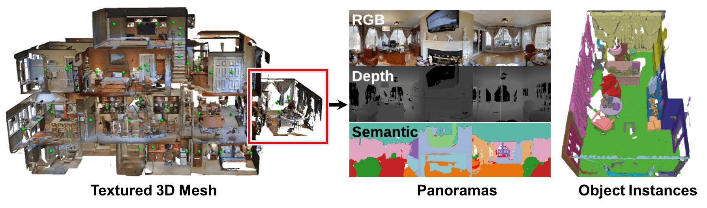

# Matterport3D

目标：理解 Matterport3D 为什么是室内 3D 场景理解和视觉导航研究里的基础数据集，能分清 panoramic viewpoint、RGB-D scan、camera pose、textured mesh、region annotation、object instance annotation、Matterport3DSimulator 和 R2R 这些概念，也能判断它适合哪些导航/场景理解任务、不适合哪些机器人操作任务。

> 先修：[RoboCasa](../04-simulation-generated-datasets/02-robocasa.md) → [Ego4D](../02-egocentric-video-datasets/01-ego4d.md)
> 建议：这一节重点看“场景数据集”和“导航任务数据集”的区别，不要把 Matterport3D 当成机器人 action 数据
> 数据集规模：Matterport3D 包含 90 个建筑级室内场景、10,800 个全景视角以及 194,400 个 RGB-D 图像，同时提供完整 3D 重建和语义标注。

Matterport3D 是 Princeton、Stanford、Technical University of Munich、Matterport 等团队在 3DV 2017 发布的大规模室内 RGB-D 场景数据集，论文题目是 **Matterport3D: Learning from RGB-D Data in Indoor Environments**。它采集的不是桌面操作片段，而是整栋建筑级别的室内 3D 扫描。

Matterport3D 后来成为很多导航和场景理解工作的底座。比如 Room-to-Room (R2R) 使用 Matterport3D 中的真实室内全景图构建视觉语言导航任务；Matterport3DSimulator 让 agent 在这些真实全景节点之间移动；Habitat 等仿真平台也经常使用 Matterport3D / Gibson / HM3D 这类室内 3D 场景作为导航环境。

先看 Matterport3D 的 teaser 图。图里能看到 RGB-D 全景、几何重建、房间区域和语义标注的关系。它的价值不是“某条轨迹怎么走”，而是给研究者提供可复用的真实室内空间。



一句话概括 Matterport3D：

```text
Matterport3D 扫描了 90 个真实室内建筑级场景，
包含约 10,800 个全景视点和 194,400 张 RGB-D 图像，
提供 camera poses、textured 3D meshes、floor plans、region annotations、object instance semantic annotations，
常被用作视觉导航、室内 3D 理解和具身 AI 仿真的场景底座。
```

## 它解决的是什么问题

很多视觉数据集只给单张图像或短视频。对移动机器人来说，这还不够。机器人要在室内行走，需要理解空间结构：房间怎么连通，门在哪里，走廊通向哪里，物体和墙面的位置关系是什么，当前位置到目标点怎么走。

Matterport3D 解决的是“真实室内空间数据不足”的问题。它提供整栋建筑的 RGB-D 扫描、相机位姿、三维网格和语义标注，让模型可以在真实室内结构上学习：

```text
这个位置看到什么？
相邻位置在哪里？
房间之间如何连通？
墙面、地板、家具和物体在哪里？
从一个视点走到另一个视点需要经过哪些路径？
```

这和操作数据集的关注点不一样。Open X-Embodiment、DROID 这类数据更关心机器人如何抓取、移动和放置物体；Matterport3D 更关心空间、视点、房间、表面和导航。

## 它到底包含什么

Matterport3D 代码仓库说明里列出了几类核心数据：color and depth images、camera poses、textured 3D meshes、building floor plans、region annotations、object instance semantic annotations。

可以按下面这张表理解：

| 数据 | 含义 | 用途 |
|---|---|---|
| RGB images | 真实室内图像 | 视觉导航、场景识别、语义理解 |
| depth images | 每个像素到相机的距离 | 点云、几何理解、可通行区域分析 |
| camera poses | 每张图像/视点的相机位姿 | 把图像、深度和 3D mesh 对齐 |
| textured 3D meshes | 带纹理的室内三维网格 | 渲染、导航、碰撞和空间理解 |
| floor plans | 建筑平面布局 | 房间连通、路径规划和区域理解 |
| region annotations | 房间/区域级标注 | 区分卧室、厨房、走廊、客厅等区域 |
| object instance semantic annotations | 物体实例和语义标注 | 物体级场景理解和目标导航 |

这里的重点是“多模态对齐”。RGB、depth、camera pose、mesh 和 semantic annotation 不是孤立文件，而是描述同一个真实室内空间的不同层面。导航和场景理解模型之所以喜欢 Matterport3D，就是因为它既有真实视觉复杂度，也有几何和语义信息。

## panoramic viewpoint 是什么

Matterport3D 里经常会看到 `panoramic view` 或 `viewpoint`。它不是普通的一张窄视角图片，而是一个室内位置上的 360 度全景观察。

可以这样理解：

```text
building scene:
  一栋房子、办公室、教堂或酒店等真实室内空间

viewpoint:
  在这个空间里的一个可观察位置

panorama:
  在该位置向四周看的 360 度 RGB-D 观察

camera pose:
  这个观察位置和朝向在 3D 场景中的坐标
```

常用的规模口径是 90 个 building-scale scenes、约 10,800 个 panoramic views、194,400 张 RGB-D images。这里 194,400 张图像可以理解为从这些全景视点中采样出的多方向 RGB-D 图像，而不是 194,400 个独立房间。

## Matterport3D 和 Matterport3DSimulator 的关系

Matterport3D 是数据集，Matterport3DSimulator 是让 agent 在这些数据里“走起来”的仿真器。两者不要混在一起。

下面这张图来自 Matterport3DSimulator 仓库，展示的是 agent 在真实 360 度全景节点之间移动的概念。它不是在纯合成场景里实时渲染，而是基于 Matterport3D 真实采集的全景 RGB-D 图像。


可以把关系写成：

```text
Matterport3D:
  提供真实室内场景、全景 RGB-D、mesh、pose 和 annotation

Matterport3DSimulator:
  把这些全景视点组织成可导航图，让 agent 能观察、转头、前进

R2R / VLN:
  在 simulator 上定义自然语言导航任务
```

所以 Matterport3D 本身不是一个 reinforcement learning 环境，也不直接给语言指令；它是场景和视觉几何数据。R2R 这类任务才在它上面定义“根据语言指令走到目标位置”。

## Matterport3D 为什么适合导航

Matterport3D 适合导航研究，主要有四个原因。

第一，它是真实室内空间。全景图和深度来自真实扫描，不是简单的游戏资产或程序生成房间。真实世界里的光照、镜面、遮挡、家具摆放和杂乱程度都会保留下来。

第二，它是建筑级别的。一个 scene 不是一张桌子，而是一整栋建筑或一个完整室内环境，包含多个房间、走廊、门和楼层结构。导航研究需要这种空间连通性。

第三，它有几何信息。Depth、camera poses 和 textured meshes 让 agent 不只是看 RGB，也能理解 3D 空间和可行走结构。

第四，它有语义标注。Region annotation 和 object instance semantic annotation 让研究者可以做房间类型识别、物体目标导航、语义地图构建等任务。

## 数据结构怎么理解

完整 Matterport3D 数据需要申请访问权限后下载。不同下载选项会包含不同类型的数据，但从概念上可以这样理解：

```text
Matterport3D/
  scans/
    <scan_id>/
      matterport_skybox_images/
      undistorted_color_images/
      undistorted_depth_images/
      undistorted_camera_parameters/
      mesh/
      house_segmentations/
      region_segmentations/
      semantic_annotations/
```

这不是严格保证每个发布包都按这个名字出现，而是帮助理解不同数据类型的关系。

几个常见数据项可以这样读：

| 数据项 | 怎么理解 |
|---|---|
| `matterport_skybox_images` | 全景天空盒图像，Matterport3DSimulator 至少需要这类数据 |
| `undistorted_color_images` | 去畸变后的彩色图像 |
| `undistorted_depth_images` | 去畸变后的深度图像 |
| `undistorted_camera_parameters` | 相机内参/外参等参数 |
| `mesh` | 三维重建模型，用于几何和渲染 |
| `house_segmentations` | 房屋级分割/结构信息 |
| `region_segmentations` | 房间或区域级分割 |
| `semantic_annotations` | 物体实例和语义标注 |

如果只是跑 Matterport3DSimulator 的 R2R 任务，仓库说明里写到最少需要 `matterport_skybox_images`；如果要输出 depth，还需要 `undistorted_depth_images` 和 `undistorted_camera_parameters`。

## 它和 R2R、Habitat、HM3D 的关系

| 名称 | 类型 | 和 Matterport3D 的关系 |
|---|---|---|
| Matterport3D | 室内 RGB-D / 3D 场景数据集 | 场景底座，提供真实建筑扫描 |
| Matterport3DSimulator | 导航仿真器 | 让 agent 在 Matterport3D 全景节点之间移动 |
| Room-to-Room (R2R) | 视觉语言导航任务 | 基于 Matterport3D 和 simulator 构建语言导航 benchmark |
| Habitat | 具身 AI 仿真平台 | 可加载 Matterport3D 等 3D 场景进行导航和交互研究 |
| HM3D | 更大规模的 Habitat-Matterport 3D 场景数据 | 后续更大规模室内场景资源，不等同于 Matterport3D v1 |

这里最容易混的是 Matterport3D 和 R2R。Matterport3D 提供房子和全景图；R2R 提供路径和自然语言指令。没有 R2R，Matterport3D 仍然可以做场景理解和导航仿真；没有 Matterport3D，R2R 就失去了真实室内场景底座。

## 它适合什么任务

Matterport3D 适合下面几类任务：

```text
visual navigation:
  在真实室内空间中学习移动和转向

vision-and-language navigation:
  结合 R2R 等任务，根据语言指令导航

semantic mapping:
  构建房间、物体和可通行区域地图

3D scene understanding:
  识别房间区域、物体实例和场景几何

embodied question answering:
  agent 需要在场景中观察并回答问题

simulator pretraining:
  用真实扫描场景训练具身感知或导航策略
```

它不适合直接解决这些问题：

```text
机器人手臂如何抓取物体
真实机器人关节控制和低层动作学习
桌面操作轨迹模仿学习
物体被推动、打开、倒水后的动态变化
```

Matterport3D 的场景是真实扫描，但通常是静态场景。家具、墙、门、物体主要作为环境和语义对象存在，不是为机器人操作动力学准备的可交互资产。

## 常见误解

**误解一：Matterport3D 是机器人遥操作数据集。**

不是。它是室内 RGB-D / 3D 场景数据集，不提供机器人 action、关节状态或遥操作轨迹。

**误解二：Matterport3D 自带自然语言导航指令。**

不准确。自然语言指令来自 R2R 这类在 Matterport3D 上构建的任务。Matterport3D 本身主要提供场景、图像、深度、mesh 和标注。

**误解三：90 个 scenes 就表示只有 90 张图。**

不对。这里的 90 是建筑级场景数量；数据还包含约 10,800 个全景视点和 194,400 张 RGB-D 图像。

**误解四：它是完全合成的仿真数据。**

不对。Matterport3D 来自真实室内环境扫描。使用 simulator 时，agent 看到的是真实采集的全景图，而不是简单合成纹理。

**误解五：Matterport3D 可以随便下载和转发。**

不能这么做。数据需要同意 Terms of Use 并申请访问，不能随便把数据包上传到公开仓库。

**误解六：用 Matterport3D 训练的导航策略就能直接控制真实机器人。**

不一定。Matterport3D / simulator 主要提供视觉和拓扑导航环境。真实机器人还需要定位、避障、运动控制、传感器噪声和安全策略。

## 小结

Matterport3D 是“真实室内建筑级 RGB-D / 3D 场景底座”。它的核心不是轨迹数量，而是 90 个真实室内场景、约 10,800 个全景视点、194,400 张 RGB-D 图像、camera poses、textured meshes、floor plans、region annotations 和 object instance semantic annotations。对具身 AI 来说，它补的是空间理解和导航环境；对机器人操作来说，它还需要和可交互仿真、真实机器人控制和操作数据结合。

进一步阅读可以看：
- [Matterport3D 网站](https://niessner.github.io/Matterport/)
- [Matterport3D GitHub](https://github.com/niessner/Matterport)
- [Matterport3D paper](https://arxiv.org/abs/1709.06158)
- [Matterport3DSimulator](https://github.com/peteanderson80/Matterport3DSimulator)
- [R2R / VLN paper](https://arxiv.org/abs/1711.07280)