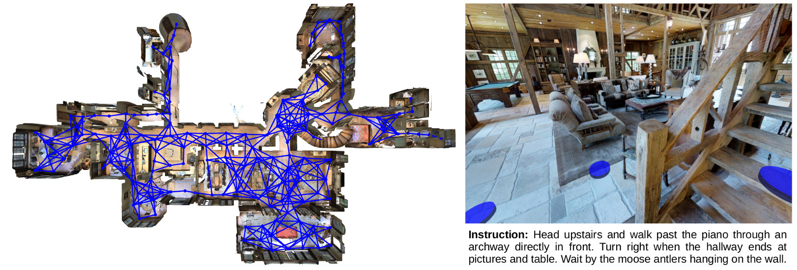
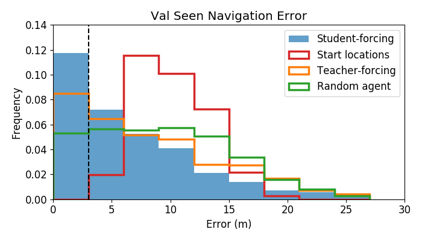

# Room-to-Room (R2R)

目标：理解 Room-to-Room (R2R) 为什么是视觉语言导航（Vision-and-Language Navigation, VLN）里的经典基准，能分清 Matterport3D、Matterport3DSimulator、path、viewpoint、instruction、val-seen、val-unseen、navigation error、success rate、SPL 这些概念，也能判断它适合哪些导航研究、不适合哪些机器人控制任务。

> 先修：[Matterport3D](01-matterport3d.md)
> 建议：这一节重点看“语言指令如何落到室内导航路径上”，不要把 R2R 当成另一个室内 3D 扫描数据集
> 数据集规模：R2R 标注数据规模较小，主要包含约 21.5K 条导航指令和 7,189 条路径；实际运行需要结合 Matterport3D 三维场景资源。

Room-to-Room (R2R) 是 CVPR 2018 论文 **Vision-and-Language Navigation: Interpreting visually-grounded navigation instructions in real environments** 提出的视觉语言导航基准。它基于 Matterport3D 的真实室内全景场景和 Matterport3DSimulator，把一条室内路径配上人工写的自然语言指令，让 agent 学会“听指令走路”。

这和上一节 Matterport3D 的关系很清楚：Matterport3D 提供真实室内场景和全景视点，R2R 在这些场景上定义路径、指令、训练/验证/测试划分和评测指标。

先看 Matterport3DSimulator 的示意图。R2R 中的 agent 不是拿到完整地图后直接规划，而是在离散 viewpoint graph 上观察、转向、移动，并根据语言指令决定下一步。



一句话概括 R2R：

```text
R2R 在 Matterport3D 的真实室内全景场景上，
选取 7,189 条导航路径，
为每条路径收集 3 条人工自然语言指令，
共 21,567 条指令，
用于训练和评测 agent 能否根据语言在未见过建筑中导航到目标位置。
```

## 它解决的是什么问题

视觉导航可以只给目标坐标，也可以只给目标类别，比如“去厨房”或“找沙发”。R2R 关注的是另一类更接近日常交互的问题：人用自然语言描述路线，机器人或 agent 要理解这段话并走到终点。

例如指令可能类似：

```text
走出卧室，沿着走廊向前，经过楼梯后右转，停在餐桌旁边。
```

这类任务难在三件事。

第一，语言是顺序性的。指令里有“先出去、再左转、经过某个物体、最后停下”这样的步骤。Agent 不能只识别一个目标词。

第二，视觉是局部的。Agent 每一步只能看到当前位置的全景观察，不能直接看到整栋建筑的所有区域。

第三，环境是未见过的。验证和测试里会有训练时没见过的建筑，模型不能只记住训练场景的路径。

所以 R2R 是语言理解、视觉感知和空间决策的交叉任务。

## 它到底包含什么

R2R 的核心不是 RGB-D 图像本身，而是导航路径和语言指令。图像和场景来自 Matterport3D，仿真和动作接口来自 Matterport3DSimulator。

规模可以这样记：

| 项目 | 数量或形式 | 怎么理解 |
|---|---|---|
| paths | 7,189 条 | 人工选取的室内导航路径 |
| instructions | 21,567 条 | 每条路径 3 条自然语言指令 |
| Matterport3D scenes | 90 个建筑级环境 | R2R 的 train / val / test 按建筑场景划分 |
| train / val-seen scenes | 61 个 scenes | 训练集和 val-seen 来自这些见过的建筑 |
| val-unseen / test scenes | 11 个 val-unseen scenes，18 个 test scenes | 用来测试 agent 能否泛化到未见建筑 |
| observation | RGB，后来 simulator 也支持 depth | Agent 在 viewpoint 上看到的视觉输入 |
| action space | 转向、调整俯仰、移动到相邻 viewpoint、停止 | 离散导航动作 |
| split | train / val-seen / val-unseen / test | 用来测试见过和未见建筑泛化 |

这里有一个细节：R2R 使用的是 Matterport3D 的 90 个建筑级环境，但 split 不是随机按 episode 混在一起切的。论文里写得很清楚：test 使用 18 个 scenes 和 4,173 条 instructions，val-unseen 使用 11 个 scenes 和 2,349 条 instructions，剩下 61 个 scenes 再切成 train 和 val-seen。

## 一条 R2R 样本长什么样

R2R 的任务说明给出的数据格式很简洁：

```json
{
  "distance": float,
  "scan": str,
  "path_id": int,
  "path": ["viewpoint_id_0", "viewpoint_id_1", "..."],
  "heading": float,
  "instructions": ["instruction 1", "instruction 2", "instruction 3"]
}
```

字段可以这样理解：

| 字段 | 含义 |
|---|---|
| `distance` | 这条路径的长度，单位是米 |
| `scan` | Matterport3D 的 scan id，也就是建筑/场景编号 |
| `path_id` | 路径的唯一编号 |
| `path` | viewpoint id 列表，第一个是起点，最后一个是目标点 |
| `heading` | agent 初始朝向，单位是弧度，默认 elevation 为 0 |
| `instructions` | 三条人工写的自然语言路线说明 |

这说明 R2R 的监督信号不是低层机器人 action，而是路径和语言。模型训练时常见做法是让 agent 学习在每个 viewpoint 选择下一步，最后在合适位置停止。

## viewpoint graph 是什么

R2R 里的导航不是连续控制。Agent 不是直接输出轮子速度或底盘位移，而是在 Matterport3DSimulator 提供的 viewpoint graph 上移动。

可以把它想象成：

```text
viewpoint A
  ├─ 可以转头看四周
  ├─ 可以调整相机俯仰
  ├─ 可以移动到相邻 viewpoint B
  ├─ 可以移动到相邻 viewpoint C
  └─ 可以 stop
```

每个 viewpoint 是 Matterport3D 中一个真实采集位置。边表示两个 viewpoint 之间可导航。这样做的好处是任务更容易标准化：不同方法都在同一个离散图上行动，评测时也能比较路径长度、终点误差和成功率。

缺点也很明显：它不等于真实机器人连续导航。真实机器人还要处理定位、避障、动力学、底盘控制和安全约束。R2R 主要评测语言条件下的视觉导航决策，不是底层运动控制。

## train / val-seen / val-unseen / test 是什么

R2R 的 split 设计很重要。数据说明里明确写到，它包含 train、val-seen、val-unseen 和 test。

| split | 含义 | 用途 |
|---|---|---|
| train | 训练路径和指令 | 训练 agent |
| val-seen | 验证路径来自训练中见过的建筑 | 看模型在熟悉建筑里的表现 |
| val-unseen | 验证路径来自训练中没见过的建筑 | 看模型能否泛化到新建筑 |
| test | 全部来自未见建筑 | 提交到服务器/leaderboard 评测 |

这里最关键的是 `val-unseen`。R2R 真正在意的是 agent 能不能把语言、视觉和空间决策能力迁移到新建筑，而不是只记住训练集里的房间布局。

所以实验报告里如果只写 val-seen，很容易高估模型能力。更稳妥的写法是同时报告 val-seen 和 val-unseen。

## 怎么评价一个 agent

R2R 论文和后续工作常用几个指标：

| 指标 | 含义 | 怎么看 |
|---|---|---|
| Navigation Error (NE) | 预测终点到真实目标点的最短路径距离 | 越低越好 |
| Success Rate (SR) | 终点距离目标小于阈值的比例，常用 3m | 越高越好 |
| Oracle Success Rate | 轨迹中任一点是否曾接近目标 | 判断 agent 有没有路过目标附近 |
| SPL | Success weighted by Path Length | 成功率和路径效率一起看 |
| Trajectory Length | agent 实际走了多远 | 太长可能绕路或迷失 |

下面这张图来自 R2R 仓库的 paper plots，展示的是 navigation error 的评测结果。读这类图时，重点不是只看训练集表现，而是看 unseen 环境上的误差有没有明显变差。



一个简单例子：如果 agent 最后停在离目标 1.5 米的位置，通常算成功；如果停在 8 米外，即使走过很多正确中间点，最终成功率也不会高。R2R 强调的是“按指令到达目标并停下”。

## 它和 Matterport3D 的区别

| 名称 | 类型 | 提供什么 |
|---|---|---|
| Matterport3D | 室内 RGB-D / 3D 场景数据集 | 全景图、depth、mesh、camera poses、语义标注 |
| Matterport3DSimulator | 导航仿真器 | viewpoint graph、观察接口、离散移动动作 |
| R2R | 视觉语言导航任务数据集 | 路径、自然语言指令、split、评测协议 |

一句话说清楚：Matterport3D 是房子，Matterport3DSimulator 是让 agent 在房子里移动的接口，R2R 是告诉 agent “从这里走到那里”的语言任务。

## 它和具身 AI 的关系

R2R 对具身 AI 的价值在语言条件导航。真实机器人经常会收到人类的自然语言指令，而不是坐标点：

```text
去卧室门口。
沿着走廊走到厨房。
在沙发旁边停下。
从楼梯前面右转。
```

这类指令需要模型把语言中的地标、方向、顺序和停止条件与当前视觉观察对齐。R2R 正是为这个问题设计的。

但边界也要说清楚。R2R 不是完整移动机器人数据集：

```text
它没有真实机器人底盘控制。
它没有连续动作轨迹。
它没有动态障碍物。
它不处理真实传感器定位误差。
它主要评测离散 viewpoint graph 上的语言导航。
```

因此，R2R 适合作为 VLN 方法研究和导航决策 benchmark；如果要部署到真实机器人，还需要把离散导航决策接到 SLAM、定位、避障和底盘控制系统上。

## 常见误解

**误解一：R2R 是一个室内 3D 扫描数据集。**

不准确。室内 3D 扫描来自 Matterport3D；R2R 是在这些场景上构建的路径和语言指令数据集。

**误解二：R2R 的 instruction 就是目标物体类别。**

不是。R2R 指令通常是路线描述，包含方向、地标、房间和停止位置，而不是简单的“去找椅子”。

**误解三：val-seen 表现好就说明模型会泛化。**

不够。val-seen 使用训练中见过的建筑，val-unseen 才更能说明模型是否能迁移到新建筑。

**误解四：R2R agent 输出真实机器人速度。**

不是。R2R agent 在离散 viewpoint graph 上选择动作，和真实机器人连续控制不是一回事。

**误解五：下载 R2R 数据就能直接跑完整任务。**

不一定。R2R JSON 只是路径和指令。要跑视觉导航，还需要 Matterport3D 场景数据和 simulator 环境。

**误解六：R2R 只考语言理解。**

不对。R2R 同时考语言、视觉观察和空间行动。只看懂句子但不会在场景中定位地标，仍然走不到终点。

## 小结

R2R 是“基于真实室内全景场景的视觉语言导航 benchmark”。它的核心不是 3D 扫描本身，而是 7,189 条路径、21,567 条人工自然语言指令、train / val-seen / val-unseen / test 划分，以及 Navigation Error、Success Rate、SPL 等评测协议。对具身 AI 来说，它补的是语言条件导航能力；对真实机器人来说，它还需要和连续导航、定位、避障和运动控制系统结合。

进一步阅读可以看：
- [Matterport3DSimulator](https://github.com/peteanderson80/Matterport3DSimulator)
- [R2R task documentation](https://github.com/peteanderson80/Matterport3DSimulator/tree/master/tasks/R2R)
- [R2R / VLN paper](https://arxiv.org/abs/1711.07280)
- [EvalAI R2R leaderboard](https://eval.ai/web/challenges/challenge-page/97/overview)