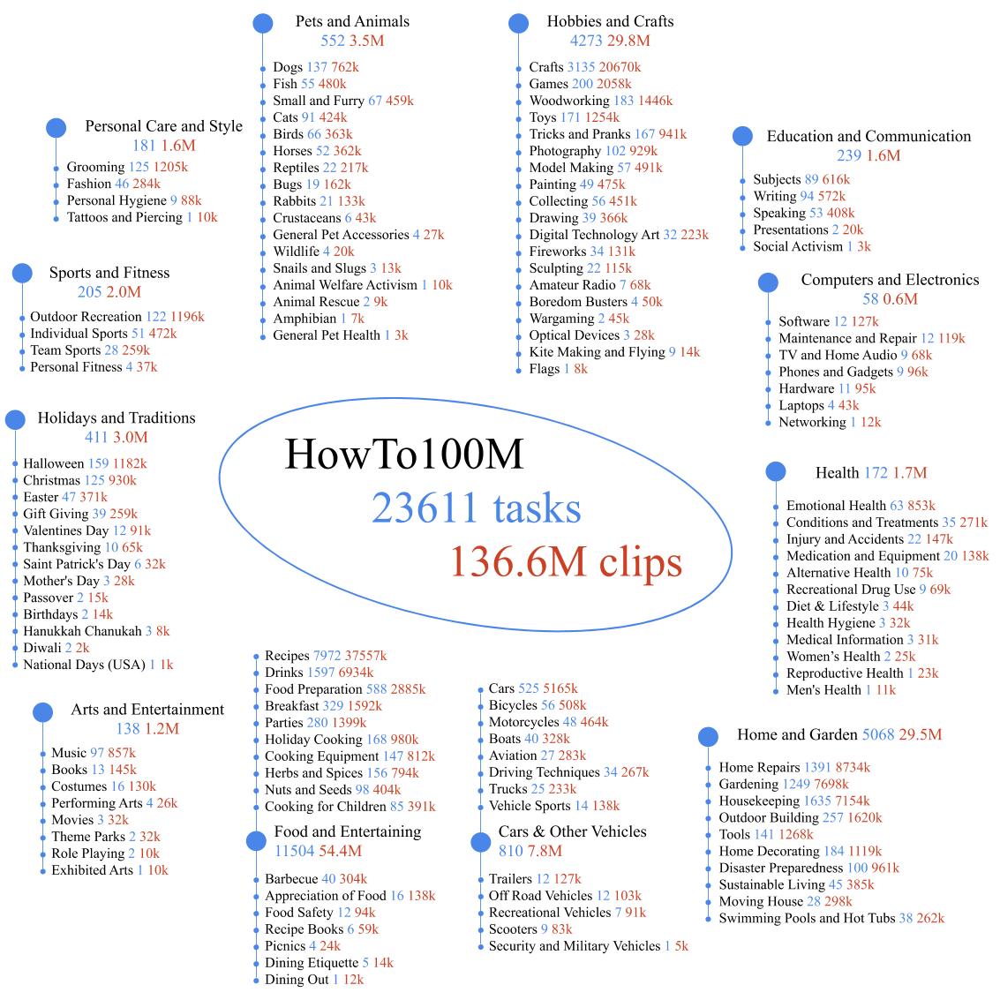

# HowTo100M

目标：理解 HowTo100M 为什么是视频-语言预训练里的经典大规模语料，能分清 instructional video、ASR narration、clip-caption pair、weak supervision、video-text embedding 这些概念，也能判断它适合哪些具身 AI 预训练任务、不适合哪些机器人控制任务。

> 先修：视频预训练、文本-视频对比学习、弱监督学习
> 建议：这一节重点看“如何从教学视频中得到弱监督的视频-文本对”，不要把 HowTo100M 当成有人工精标动作边界的数据集
> 数据集规模：HowTo100M 包含 136M 个视频片段，来源于约 120 万个 YouTube 教学视频，总时长约 15 年。

HowTo100M 是 ICCV 2019 论文 **HowTo100M: Learning a Text-Video Embedding by Watching Hundred Million Narrated Video Clips** 提出的视频-语言预训练数据集。它的思路很直接：互联网上有大量教学视频，人一边做事一边讲解，视频画面里有操作过程，语音转写文本里有步骤说明。虽然这些文本不是人工给每个片段写的精确 caption，但规模足够大，可以用来学习视频和语言之间的对应关系。

它和上一节 Something-Something V2 很不一样。Something-Something V2 是短视频动作分类数据，标签相对干净；HowTo100M 是从 YouTube 教学视频里自动挖出来的视频-文本弱监督语料，规模更大，但噪声也更大。

一句话概括 HowTo100M：

```text
HowTo100M 从 1.22M 个带旁白的教学视频中，
构造出约 136M 个视频片段，
覆盖超过 23K 个视觉任务，
用自动语音转写文本作为弱监督，
训练视频-语言表征模型。
```

## 它解决的是什么问题

人工给视频写 caption 很贵。尤其是教学视频，如果要人工标出“第 12.3 秒到第 18.6 秒是在切洋葱”“第 18.7 秒到第 25.1 秒是在把洋葱倒进锅里”，成本会非常高，很难做到千万级甚至亿级。

HowTo100M 选择了一条更现实的路：不追求每个片段都有完美标注，而是利用教学视频自带的讲解。比如一个视频标题是 `How to make pancakes`，视频里的人边做边说：

```text
now pour the batter into the pan
wait until bubbles appear
flip the pancake carefully
```

这些句子和画面不一定完全同步，但大体上和当前操作有关。把视频片段和附近的语音转写文本配起来，就可以得到很多弱监督训练样本。

这类数据适合训练模型回答这样的问题：

```text
这段视频大概在做什么？
这句话对应哪个视频片段？
视频里的操作步骤和文本描述能不能对上？
模型能不能从大量教程视频中学到通用的任务流程知识？
```

对具身 AI 来说，它补的是“看人类教程学任务语义”这一环，而不是“直接学习机器人动作输出”。

## 它到底包含什么

核心口径可以这样记：

| 项目 | 数量或形式 | 怎么理解 |
|---|---|---|
| source videos | 1.22M 个 narrated instructional videos | 来自 YouTube 的带旁白教学视频 |
| video clips | 约 136M 个 | 按旁白时间切出的片段级样本 |
| visual tasks | 超过 23K 个 | 来自 WikiHow 任务分类的教程主题 |
| video duration | 约 134K 小时 | 原始视频总时长量级 |
| text source | ASR narration | 自动语音识别得到的旁白文本 |
| supervision | weak video-text alignment | 文本和视频大致相关，但不是人工逐片段精标 |
| typical use | text-video embedding / retrieval / pretraining | 学视频和语言的共同表示 |

下图展示的是任务和片段在不同大类中的分布。它不是只做厨房，也不只是手工，还包含大量生活技能、维修、运动、家居、艺术等教程视频。



这里要注意两个口径。第一，`1.22M videos` 指的是原始教学视频数量；`136M clips` 指的是从这些视频里切出来的片段数量。第二，`23K tasks` 是任务主题规模，不是人工动作类别，也不是机器人可执行技能列表。

## 一条样本应该怎么看

HowTo100M 的样本不是“视频 + 人工 caption”这么干净。更接近下面这种结构：

```text
instructional_video
  ├─ video_id: YouTube 视频编号
  ├─ task: make pancakes
  ├─ transcript:
  │   ├─ [00:10, 00:14] pour the batter into the pan
  │   ├─ [00:18, 00:23] wait until bubbles appear
  │   └─ [00:24, 00:28] flip it over carefully
  └─ clips:
      ├─ clip_000: video segment around 00:10-00:14 + text sentence
      ├─ clip_001: video segment around 00:18-00:23 + text sentence
      └─ clip_002: video segment around 00:24-00:28 + text sentence
```

这里的 `text sentence` 来自 ASR，也就是自动语音识别。它的优点是规模大、成本低；缺点是会有识别错误、口语化表达、背景闲聊、时间错位，甚至文字说的是下一步而画面还在做上一步。

所以 HowTo100M 里的“标注”要理解成弱监督信号，不要理解成人工精确标注。

## weak supervision 是什么

`weak supervision` 可以理解成“不完美但有统计价值的监督”。在 HowTo100M 里，它主要弱在三点。

第一，文本不是人工 caption。它来自自动语音识别，可能会错词、漏词，也可能把专有名词识别错。

第二，文本和画面不是严格同步。人经常会先说“接下来我们要把它放进烤箱”，然后过几秒才真的放进去；也可能一边回顾上一步，一边画面已经进入下一步。

第三，视频本身是互联网视频。拍摄角度、剪辑方式、背景音乐、画质、字幕、镜头切换都不统一。

但它仍然有价值，因为规模足够大。单条样本可能有噪声，但当样本数达到上亿片段时，模型可以从大量重复模式中学到稳定的对应关系：比如 `cut the onion` 常常对应刀、砧板、洋葱和切割动作；`tighten the screw` 常常对应螺丝刀、螺丝和旋转动作。

## 它通常怎么用

HowTo100M 最经典的用法是学习 text-video embedding，也就是把视频片段和文本句子映射到同一个表示空间里。一个简单训练目标可以写成：

```text
输入：一个视频片段 + 一句 ASR 文本
目标：让匹配的视频和文本更接近，让不匹配的视频和文本更远
常见任务：text-to-video retrieval、video-to-text retrieval、视频-语言预训练
```

训练完之后，模型可以做这些事：

| 任务 | 输入 | 输出 |
|---|---|---|
| text-to-video retrieval | 一句文本，比如 "pour milk into bowl" | 找到相关视频片段 |
| video-to-text retrieval | 一个视频片段 | 找到最相关的文本描述 |
| action localization | 一个长视频和动作文本 | 找到可能发生该动作的时间段 |
| downstream fine-tuning | HowTo100M 预训练模型 + 小数据集 | 在 YouCook2、CrossTask、MSR-VTT 等任务上微调 |

它对具身 AI 的意义在于：机器人模型可以先从大量人类教程视频中学到任务步骤、动作词、物体关系和过程语义，再通过真实机器人数据把这些语义接到 action 上。

## 它和机器人数据有什么关系

HowTo100M 不是机器人数据集。它没有机器人状态、没有机械臂 action、没有夹爪命令、没有末端轨迹，也没有任务成功标签。它提供的是人类教学视频和旁白文本。

它适合做这些事：

| 用法 | 为什么合适 |
|---|---|
| 视频-语言预训练 | 大量 clip-caption pair 可以学跨模态表示 |
| 任务步骤理解 | 教学视频天然包含步骤顺序 |
| 动作词和物体关系学习 | 旁白里常有 cut、pour、mix、open、tighten 等动作词 |
| 视觉前端预训练 | 视频覆盖大量物体、场景和操作过程 |
| 机器人任务文本先验 | 可以帮助模型理解人类指令里的过程词 |

它不适合直接做这些事：

```text
不能直接训练 imitation learning policy。
不能当作机器人 action 轨迹。
不能提供可执行的控制频率。
不能评估机器人任务成功率。
不能保证每句话都和画面精确对齐。
```

更合理的迁移路线是：先用 HowTo100M 或类似数据训练视频-语言模型，再用机器人数据做 grounding。也就是先让模型知道“pour / cut / open / put into”大概对应什么视觉过程，再用真机数据告诉它这些语义在某个机器人上应该输出什么动作。

## 它和 Something-Something V2 有什么区别

这两个数据集都对具身 AI 有帮助，但帮助的是不同能力。

| 数据集 | 视频形态 | 标注来源 | 优点 | 主要局限 |
|---|---|---|---|---|
| Something-Something V2 | 几秒级短动作视频 | 人工模板化动作标签 | 动作类别干净，强调时序变化 | 语义覆盖比教程视频窄，没有长任务流程 |
| HowTo100M | 长教程视频切出的片段 | ASR 旁白弱对齐 | 规模巨大，覆盖大量任务步骤 | 文本噪声大，时间对齐不精确 |

如果你要训练模型区分“拿起”和“放下”这类短动作，Something-Something V2 更直接。如果你要让模型从大量教程里学“做一道菜、修一个物品、组装一个东西”的步骤知识，HowTo100M 更合适。

## 下载和使用时要注意什么

HowTo100M 的公开材料通常包含 metadata、字幕/旁白信息、预提取特征和相关代码。使用时要注意，互联网视频数据和传统打包数据集不同：视频源来自 YouTube，随着时间推移，部分原视频可能被删除、设为私有或地区不可访问。因此，复现实验时不能只写“用了 HowTo100M”，还要写清楚使用的是哪份 metadata、是否使用预提取特征、实际可下载的视频比例，以及过滤规则。

还要注意几件事。

第一，不要把 ASR 当成人工 caption。ASR 文本是弱监督，训练时要允许噪声存在。

第二，不要默认句子和画面严格同步。做 temporal localization 或步骤切分时，需要额外的对齐方法或后处理。

第三，不要把 task 当作动作类别。`make pancakes` 是教程主题，里面可能包含倒、搅拌、加热、翻面等很多子动作。

第四，注意许可和再分发。YouTube 视频、字幕和派生特征的使用边界要按数据说明和原视频平台规则检查，尤其是公开展示样例或商用训练时。

## 一个最小实验可以怎么设

如果只是入门理解 HowTo100M，可以从 retrieval 任务开始：

```text
输入：N 个视频片段和 N 条旁白文本
正样本：同一时间附近的视频片段和文本
负样本：batch 内其他视频片段和文本
目标：正样本相似度高，负样本相似度低
评估：文本检索视频的 Recall@K
```

如果目标更接近具身 AI，可以把下游任务设成：

```text
先在 HowTo100M 上预训练视频-语言 encoder，
再在少量机器人数据上微调，
观察模型是否更容易理解语言指令中的动作词和步骤顺序。
```

这里的关键不是让 HowTo100M 直接输出机器人动作，而是看它是否能改善视觉-语言表征，减少机器人数据对大规模语义覆盖的压力。

## 常见误解

**误解一：HowTo100M 有 1 亿个公开视频文件。**

不对。它是约 1.22M 个原始教学视频，切出了约 136M 个视频片段。`video` 和 `clip` 不是同一个数量级。

**误解二：HowTo100M 的 caption 是人工写好的。**

不是。文本主要来自自动语音识别的 narration，是弱监督，不是人工逐片段 caption。

**误解三：有旁白就说明文本和画面严格对齐。**

不一定。人说话和动作经常有提前、滞后和跳跃，ASR 时间戳只能提供近似对齐。

**误解四：HowTo100M 可以直接训练机器人策略。**

不可以。它没有机器人 action、state、控制频率和成功标签，只能作为视频-语言预训练或任务语义先验。

**误解五：23K tasks 等于 23K 个机器人技能。**

不等于。这里的 task 更像 WikiHow 教程主题，不是经过机器人动作空间定义和成功条件验证的技能。

## 小结

HowTo100M 是“大规模教学视频-语言弱监督预训练语料”。它的核心价值不是标注精细，而是规模和覆盖面：1.22M 个教程视频、约 136M 个 clip-caption pair、超过 23K 个任务主题，让模型能从人类教学视频里学习动作词、物体关系和任务步骤。对具身 AI 来说，它补的是视觉-语言语义和过程知识；真正落到机器人执行时，还必须依赖有状态、有动作、有控制接口的机器人数据。

进一步阅读可以看：
- [HowTo100M 数据与代码](https://github.com/antoine77340/howto100m)
- [HowTo100M 数据说明](https://www.di.ens.fr/willow/research/howto100m/)
- [HowTo100M 论文](https://arxiv.org/abs/1906.03327)