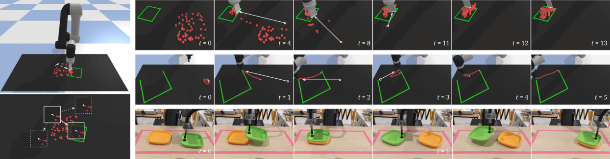

# 8.1.1 VLA 出现之前：视觉动作模型为什么不够用

在谈 VLA 之前，先把时间往回拨一点。机器人学习并不是等到大模型出现后才开始“看图做动作”。很长一段时间里，最直接也最有效的路线就是 **VA：Vision-Action**。摄像头看到当前画面，策略输出一个动作，机器人执行后再得到下一帧画面。这个**感知-动作闭环**朴素得像人学骑车：看一眼路，调一下车把，再看一眼，再调一下。

这种路线的吸引力也正在这里。它绕开了复杂的符号规划，不要求先把世界翻译成一堆对象、关系和规则，而是直接学习**“这种视觉状态下，专家会怎么动”**。对固定工作台、固定机械臂、固定任务来说，这往往比写一套规则更省事。早期的端到端抓取策略、视觉伺服、行为克隆策略，以及后来的 ACT 和 Diffusion Policy，都可以放在这条大脉络里理解：它们的输入里有视觉，输出里有动作，中间不一定需要显式语言推理。

## 本节目标

本节围绕三个问题展开：

1. VLA 出现前，视觉动作模型主要在解决什么问题。
2. ACT、Diffusion Policy 这类方法为什么已经能做不少机器人任务。
3. 如果 VA 模型已经能工作，为什么还需要 VLA。

## VA 模型的基本想法

最简单的 VA 策略可以写成一句话：

```text
当前图像 + 当前机器人状态 -> 策略网络 -> 下一步动作
```

<div class="concept-note concept-green">VA 的主语：视觉观测</div>

这里的“动作”可以是末端执行器的位移，也可以是关节目标、夹爪开合，或者一段 action chunk。策略并不关心“杯子”这个词在语言里是什么，它只需要从像素和状态中学到：当杯子出现在这个位置、夹爪在这个姿态时，下一步应该靠近、闭合、抬起，还是调整角度。


<div class="image-caption">Transporter Networks 论文 Figure 5。图中策略根据当前视觉观测预测推动、整理绳索或堆叠盘子的空间位移，展示了 VA 模型如何把视觉结构直接转成动作。</div>


这张图很好地说明了 VA 模型的策略直觉：模型不是先把场景翻译成完整的语言描述，再调用一个符号规划器，而是直接在视觉空间里寻找“应该移动哪里、移动到哪里”。以 Transporter Networks 为例，策略会从当前观测中选择一个局部区域，再预测它在目标状态中应当出现的位置；这个**空间位移**随后就可以参数化成一次推动、抓取或放置动作。换句话说，VA 的强项不是开放语义推理，而是把**局部视觉结构和可执行动作**绑定得很紧。

行为克隆是最常见的训练方式。我们收集人类遥操作或专家控制产生的轨迹，把每一帧观测和对应动作配成监督学习样本，让模型模仿专家。ACT 把动作看成一段连续片段，用 Transformer 和 latent variable 生成未来若干步动作；Diffusion Policy 则把动作片段当作需要逐步去噪的轨迹，用扩散模型生成更平滑的动作。这些方法并不“落后”，它们到今天仍然是许多机器人实验的**强基线**，尤其在**窄任务、固定平台和高质量数据**上非常可靠。

VA 的优势来自聚焦。模型不用理解互联网上的所有概念，也不用回答开放式问题，它只需要把当前任务里的视觉模式和动作模式对齐。对“把桌上的红杯子抓起来”这种任务，如果训练集里已经覆盖了相近场景，VA 策略可以表现得很稳。它还能把低层控制习惯学进去，例如抓取前末端应该如何微调、接触后夹爪应该怎样闭合、轨迹应该怎样保持平滑。

## VA 的天花板

问题从任务变开放时开始出现。假设你训练了一个只见过“红杯子”的 VA 策略，现在让它“把马克杯放到盘子旁边”，模型可能不知道“马克杯”和原来的杯子是否等价，也不知道“旁边”这种语言关系应该落到哪个空间位置。它可以从图像里提取模式，却没有足够强的**语言接口**把自然语言任务转成**动作意图**。

<div class="concept-note concept-green">VA 的瓶颈：语言与泛化</div>

更麻烦的是泛化。VA 策略通常很依赖数据分布：相机角度变了、物体外观变了、背景变了、机器人换了，动作分布也跟着变。模型学到的是**“在这些演示里这样动”**，而不是**“这个语言目标在当前世界中意味着什么”**。这就是很多 VA 策略离开实验桌后容易失效的原因：它们擅长复现见过的动作分布，却不擅长借用更大的语义知识去解释新任务。

可以把 VA 模型想成一个手艺很熟的学徒。师傅演示过的动作，它能模仿得很好；工具、材料、环境稍有变化，它也许还能凭局部相似性硬撑一下。但如果你突然说“把能盛水的东西放到水槽旁边”，它需要知道什么东西能盛水、什么是水槽、旁边是怎样的空间关系，这些知识并不天然包含在机器人演示数据里。

## VLA 如何填补 VA 的能力缺口

VLA 的出现不是因为 VA 完全失败，而是因为机器人任务开始要求更强的开放性。我们希望机器人不只是看见一个像素模式就输出动作，而是能把**“图像里有什么”“人用语言想让它做什么”“当前身体能怎样行动”**放到同一个推理回路里。

这就带来一个自然的想法：既然 VLM 已经能从互联网规模图文数据中学到丰富语义，能不能让机器人策略也继承这种知识？如果模型知道“苹果通常可以放进碗里”“海绵可以用来擦桌子”“Taylor Swift 是一个语义概念而不是训练集里的物体标签”，它在新指令、新物体和新场景里就不必完全依赖机器人演示数据。

VLA 就是在回答这个问题。它不再只学习视觉到动作的窄映射，而是把**视觉、语言和动作联合建模**。它既要像 VLM 那样理解图像和指令，又要像机器人策略那样输出能被控制器执行的动作。这一步看似只是多了一个 L，实际上改变了模型的知识来源：从“专家演示里的动作经验”，扩展到**“互联网语义知识 + 机器人动作数据”**的混合体。

## 小结

VA 模型给机器人学习打下了非常重要的底座：它证明了从视觉到动作可以通过数据学习，而不必把每个物体、每个接触过程都手写成规则。ACT、Diffusion Policy 等方法至今仍然是强基线，因为它们认真处理了动作片段、轨迹平滑和闭环执行这些机器人问题。

但 VA 的语言接口和语义泛化有限。它能学会“这个场景下怎么动”，却很难主动理解“这句话在这个世界里意味着什么”。VLA 的动机正是把语言和互联网语义知识接入动作生成，让机器人从只会模仿局部轨迹，向能理解任务意图的通用策略迈一步。

## 参考资料

- 【端到端视觉运动策略早期代表，展示从图像到动作的学习路径】[https://arxiv.org/abs/1504.00702](https://arxiv.org/abs/1504.00702)
- 【Transporter Networks 论文，展示从视觉观测预测空间位移的 VA 策略】[https://arxiv.org/abs/2010.14406](https://arxiv.org/abs/2010.14406)
- 【ACT / ALOHA 论文，低成本双臂操作和 action chunk 范式代表】[https://arxiv.org/abs/2304.13705](https://arxiv.org/abs/2304.13705)
- 【Diffusion Policy 论文，连续动作片段生成的重要基线】[https://arxiv.org/abs/2303.04137](https://arxiv.org/abs/2303.04137)
- 【Open X-Embodiment 论文，多机器人数据和 RT-X 模型来源】[https://arxiv.org/abs/2310.08864](https://arxiv.org/abs/2310.08864)
