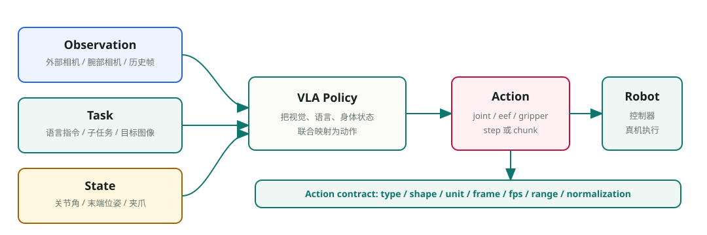
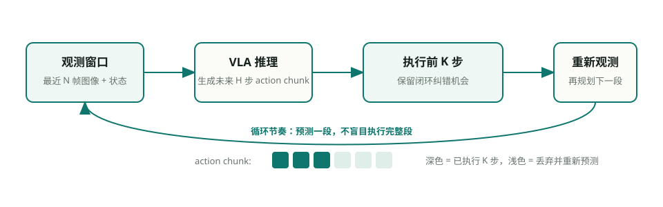
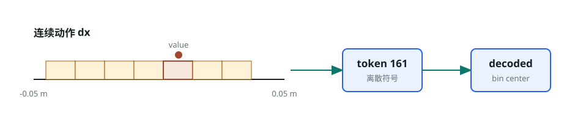

# 8.1.2 什么是 VLA：基础概念、接口规范与演进路线

VLA 是 Vision-Language-Action 的缩写，直译是视觉-语言-动作模型。这个名字很朴素，却带着一个很大的野心：机器人控制不再只是“看图输出动作”，而是把**视觉理解、语言理解和动作生成**放进同一个模型回路里。输入侧，模型看到相机图像、语言指令、机器人状态和历史观测；输出侧，它不生成文字回答，而是生成可以被控制器执行的动作。

这也是 VLA 和普通 VLM 最容易混淆的地方。VLM 可以看图回答“桌上有什么”，但回答完就结束了；**VLA 必须把这种理解落到物理行动上**。它输出的不是“杯子在左边”，而可能是末端执行器向左前方移动 2 厘米、腕部旋转一个小角度、夹爪逐渐闭合。文本生成错了，最多是语义不准；动作生成错了，机械臂可能撞到桌面、夹碎物体，或者在真实世界里把错误状态带到下一步。

## 本节目标

本节会先把 VLA 放到 VLM、planner、VA 策略和世界模型旁边，说明它到底处在系统里的哪一层；随后拆开一个最小 VLA 样本，看输入、任务、状态、动作和 metadata 分别承担什么角色。再往后，我们会依次讨论多模态输入、控制模式、动作表示规范、时序建模和动作生成头，最后回到多机器人数据里的跨本体对齐问题。你可以把这一节看成后续模型章节的“接口地图”：后面讲 OpenVLA、Octo、π0 时，很多架构差异其实都落在这些基础部件上。

本节会比普通小节长一些，因为它承担 8.1 的概念中枢。读完后，你应该能回答下面几个问题：

1. VLA 和 VLM、planner、VA、普通行为克隆策略分别有什么区别。
2. 一个 VLA 样本通常包含哪些输入、状态、动作和元数据字段。
3. 控制模式、动作表示规范和动作生成头为什么是三层不同的概念。
4. 动作 token、自回归动作、diffusion action chunk 和 flow matching action chunk 各自解决什么问题。
5. 多机器人数据混训为什么必须显式处理跨本体对齐，而不能只把数据堆到一起。

## VLA 的系统边界

先把 VLA 放在几个相近概念旁边看。VLM 负责理解图像和语言，它可以告诉我们“桌面上有杯子、碗和毛巾”；高层 planner 负责把任务拆成步骤，例如“先靠近杯子，再抓取，再移动到碗上方”；普通 VA 或行为克隆策略负责从当前观测直接预测动作；世界模型则更关心“如果我这样做，未来会怎样”。VLA 位于这些概念之间：它既要像 VLM 一样理解视觉和语言，又要像机器人策略一样输出可执行动作。

| 系统 | 输入 | 输出 | 关键问题 |
|---|---|---|---|
| VLM | 图像、文本 | 文本回答、标签、描述 | 看懂了什么 |
| 高层 planner | 任务、符号状态、可选视觉语义 | 子任务序列 | 先做哪一步 |
| VA / 行为克隆策略 | 图像、机器人状态 | 动作 | 当前状态下怎么模仿专家 |
| VLA | 图像、语言、状态、历史观测 | 可执行动作或动作片段 | 语言目标如何落到身体动作 |
| 世界模型 | 当前观测、候选动作 | 未来状态、未来视频或 latent | 这样做之后会发生什么 |

边界：理解要落到动作

这个边界非常重要。VLA 不是把 VLM 生成的文字再交给一个控制器，也不是只在普通行为克隆前面加一句语言指令。它的核心是把视觉、语言、状态和动作放进同一条训练链路里，让模型直接学习“这句话、这幅图、这个身体状态，对应什么动作”。所以读 VLA 论文时，不要只看模型能不能回答语义问题，更要看它的动作接口、控制频率、数据来源和真机执行方式。

## 一个最小 VLA 样本里有什么

一个 VLA 样本并不神秘。不同项目的字段名会不一样，OpenPI、LeRobot、OpenVLA、Octo 或 StarVLA 都可能有自己的命名习惯，但语义上通常要回答五个问题：模型看到了什么，听到了什么，知道自己身体处在什么状态，要预测什么动作，以及这条数据来自哪个机器人和哪个控制设置。

| 字段组 | 常见字段 | 作用 | 最容易出错的地方 |
|---|---|---|---|
| `observation` | 外部相机、腕部相机、历史帧、可选深度 | 提供当前场景和接触对象信息 | 相机顺序、分辨率、时间戳不一致 |
| `task` / `language` | 自然语言指令、任务描述、子任务文本 | 说明用户希望机器人完成什么 | 指令和动作片段没有对齐 |
| `state` | 关节角、末端位姿、夹爪状态、底盘状态 | 告诉模型身体在哪里、能怎么动 | 单位、坐标系、归一化混乱 |
| `action` | 关节目标、末端增量、夹爪开合、action chunk | 模型要预测并交给控制器执行的内容 | 控制模式、范围、夹爪语义没写清 |
| metadata | 机器人类型、相机布局、控制频率、数据集来源 | 让多机器人和多数据集能被区分 | 把不同本体数据当成同一种动作 |

一个最小 VLA 样本并不是“图像加一句话”这么简单。真正进入训练闭环的是观测、任务、身体状态、动作和数据来源共同组成的 contract。

这里最容易被低估的是**动作输出**。视觉和语言可以借用 VLM 的现成经验，但动作必须接到真实机器人控制接口上。同样一串 `[0.01, -0.02, 0.0, 1.0]`，如果它是末端位移，含义是一回事；如果它是关节角目标，含义完全不同。单位是米还是厘米、坐标系是机器人基座还是相机坐标、夹爪的 1 是打开还是闭合，这些都不是小细节，而是 VLA 能不能安全执行的合同。

可以把 VLA 和 TTS 做一个类比。TTS 把文本和说话人信息转成语音；VLA 把图像、语言和机器人状态转成动作。两者都在做“多模态输入到连续输出”的转换。区别在于，TTS 生成的 mel 频谱不准，听起来只是别扭；VLA 的动作不准，会改变真实世界，并且这个改变会成为下一轮输入。**VLA 是生成模型，但它生活在物理闭环里。**

## 多模态输入：图像、语言、状态与几何

VLA 的输入侧通常先从 RGB 图像开始。外部相机给出桌面、物体和机器人整体关系，腕部相机给出末端附近的局部细节，历史帧帮助模型判断物体是否已经被推动、夹爪是否正在接触。对许多桌面操作来说，单帧图像已经能提供大量信息，但只看单帧很容易丢掉动作趋势，尤其在推、擦、拉、折叠这类接触任务里。

语言输入承担的是任务条件。它可能是一句自然语言指令，例如“把杯子放到碗里”；也可能是更结构化的任务描述，或者由上层 planner 生成的子任务文本。语言的价值不只是提供类别标签，而是把目标、关系和约束告诉策略：哪个物体是目标，目标位置在哪里，动作完成的判断标准是什么。

机器人状态则补上图像看不全的身体信息。相机能看到夹爪大概在哪里，但很难稳定读出每个关节角、夹爪开合量、底盘速度或力传感器读数。很多 VLA 系统会把 proprioceptive state 和图像一起输入模型，让模型知道自己当前能不能继续靠近、是不是已经闭合夹爪、有没有进入某个关节限位附近。这里可以先记住一个很实用的判断：**图像告诉模型外部世界是什么样，状态告诉模型自己的身体正处在哪里，语言告诉模型应该把世界改成什么样。**

输入：看见任务和身体

几何信息要单独看。RGB-D、点云、深度图、6D pose 和相机外参都可以帮助空间操作，但它们不是所有 VLA 的必需输入。有些 VLA 直接从 RGB 学动作，有些系统会把检测、分割或位姿估计结果作为额外条件。关键不是“有没有 3D”，而是这些字段进入 policy 前必须和机器人坐标系、时间戳、动作坐标系对齐。感知模块输出得再漂亮，只要和动作 frame 对不上，模型仍然会学到错误关系。

如果把输入整理成一句话，VLA 的观测端通常由四类信号合成：外部 RGB 或腕部 RGB 负责场景和接触细节，历史帧负责短时运动趋势，proprioception 负责身体状态，语言或目标图像负责任务条件。它们不一定每个系统都齐全，但只要出现，就要在**时间戳、相机命名、坐标系和归一化方式**上保持一致。

## 控制模式：动作先要发给谁

在讲动作 token、diffusion 或 flow matching 之前，必须先问一个更朴素的问题：模型输出的动作到底发给谁？发给每个关节，还是发给末端执行器？发的是位置目标、速度目标，还是力矩？如果不先确定控制模式，后面的动作表示和动作生成头都没有落脚点。

关节空间控制更贴近机器人底层。模型可以输出每个关节的位置、速度或力矩目标，这种方式维度清楚、能直接绑定到机器人本体，但语义不一定直观。末端执行器空间更贴近操作任务：向左移动、向下靠近、旋转腕部、闭合夹爪都很好理解，但通常需要逆运动学、姿态表示和坐标系转换支持。

这两类控制接口背后其实是两种取舍。关节空间动作让控制器少做一层转换，但模型必须学习机器人本体本身；末端空间动作让任务表达更自然，但系统要额外处理 IK、姿态约定、奇异位形和安全限幅。移动机器人、双臂机器人或人形机器人还会继续增加底盘、躯干、头部、左右手协调等动作通道，所以**控制模式越贴近真实身体，跨机器人复用就越需要显式适配**。

教学上可以先记住一个常见入门格式：`eef_delta_7d`。前三维是末端平移增量，后三维是姿态增量，最后一维是夹爪。它对“拿起、放下、推开、靠近”这类桌面操作很直观，也方便不同机械臂数据做粗粒度对齐。但它并不是万能格式。真正部署前，动作还要经过反归一化、坐标系转换、限幅、IK 或底层控制器适配。

更具体地看，VLA 论文或代码里常见的控制模式大致可以分成下面几类。这里的“模型输出”不是最终电机命令，而是 policy 交给下一层控制器、IK 或执行器适配层的动作接口。

| 控制模式 | 模型常见输出 | 动作发给谁 | 适合任务 | 主要优点 | 主要风险 |
|---|---|---|---|---|---|
| 关节位置控制 `joint_position` | 每个关节的目标角度，或相对当前关节角的增量 | 关节轨迹控制器、位置控制器 | 固定机械臂、示教复现、轨迹跟踪 | 维度明确，容易和机器人本体绑定 | 跨机器人复用差；同一个语义动作在不同机械臂上对应不同关节变化 |
| 关节速度控制 `joint_velocity` | 每个关节的速度目标 | 速度控制器、伺服控制器 | 遥操作、局部闭环、连续跟随 | 响应直接，适合高频控制 | 积分后容易漂移；需要严格限速和稳定控制频率 |
| 关节力矩控制 `joint_torque` | 每个关节的 torque / effort | 力矩控制器、低层动力学控制器 | 接触丰富、动态操作、强化学习控制 | 最贴近底层动力学，表达能力强 | 安全风险高，对模型、频率和硬件接口要求很高，VLA 入门任务较少直接使用 |
| 末端绝对位姿 `eef_pose` | 末端在某个 frame 下的目标位置和姿态 | IK、笛卡尔规划器、运动规划框架 | pick-and-place、到达指定空间位姿 | 语义直观，容易和任务目标对应 | 强依赖标定和坐标系；目标可能不可达或姿态奇异 |
| 末端增量位姿 `eef_delta_pose` / `eef_delta_7d` | 末端平移增量、旋转增量、夹爪开合 | IK、局部控制器、动作适配层 | 桌面操作、模仿学习、VLA action chunk | 适合局部闭环，跨机械臂更容易粗对齐 | 必须写清 frame、单位、姿态表示和执行频率，否则同一数字会变成不同动作 |
| 夹爪控制 `gripper` | 打开 / 闭合、开合宽度、夹爪速度或力 | 夹爪控制器 | 抓取、释放、捏取 | 维度低，语义清楚 | 不同夹爪的“1”可能代表打开或闭合；宽度、力和二值开合不能混用 |
| 移动底盘控制 `base_velocity` | 线速度、角速度，例如 `[vx, vy, wz]` | 底盘速度控制器、导航局部控制器 | 移动操作、导航到操作位 | 适合连续移动和局部避障接口 | 坐标系和速度限制必须清楚；容易和导航栈职责混淆 |
| 双臂 / 全身控制 `dual_arm` / `whole_body` | 左右臂末端动作、躯干、头部、底盘或全身关节目标 | 多控制器协调层、全身控制器 | 双臂协作、人形机器人、loco-manipulation | 能表达复杂协同动作 | 动作维度高、同步难、跨本体差异大，通常需要显式 robot metadata 和控制器适配 |

这张表也解释了为什么“动作空间”不能只写成一个维度数字。比如同样是 7 维动作，可能是 `eef_delta_7d`，也可能是 6 个关节加 1 个夹爪；同样是末端动作，可能是相对 base frame，也可能是相对 eef frame。控制模式不写清，后面的动作 token、diffusion 或 flow matching 都只是悬在空中的生成方法。

## 动作表示规范：这串数字到底是什么意思

控制模式回答“动作发给谁”，动作表示规范回答“这串数字怎么解释”。旧版 8.1 里有一个很重要的观点值得保留：**action representation 不是实现细节，而是数据、训练、推理和真机控制之间的共同 contract**。模型训练得再漂亮，只要 contract 写错，就可能把相机坐标系里的“向右”当成机器人基座坐标系里的“向前”，或者把夹爪开合方向反过来。

一个合格的动作规范至少要写清几件事。首先是 `type` 和 `shape`：它到底是 `eef_delta_pose`、`joint_position`，还是别的控制格式，每一步动作有多少维，是否一次预测 `[T, A]` 的 action chunk。其次是 `unit`、`frame` 和 `fps`：平移单位是米还是厘米，姿态用欧拉角还是四元数，坐标参考 base frame、eef frame 还是 camera frame，动作发送频率是 10 Hz、20 Hz 还是 50 Hz。最后是 `range`、`normalization`、夹爪语义和 padding 规则：训练时怎么归一化，部署时怎么反归一化，夹爪的 `1` 代表打开还是闭合，变长动作片段如何补齐或裁剪。

规范：数字必须有语义

动作还常常分成 absolute、relative 和 delta 三种。Absolute action 给出绝对目标，例如末端应该到达某个世界坐标；relative action 给出相对当前状态的目标；delta action 更强调每一步小增量。它们没有绝对好坏，取决于任务、控制器和数据采集方式。相对或增量动作往往更适合局部闭环控制，绝对动作更依赖标定和全局状态一致性。

所以，当你读一篇 VLA 论文时，不要只看模型参数量，也要看**动作空间**。它输出的是 joint position、end-effector delta，还是完整 action chunk？动作坐标系在哪里？控制频率是多少？这些问题决定了模型能不能真正接到机器人上，也决定了不同论文之间的结果能不能公平比较。

## 时序建模：一步动作还是一段动作

机器人不是静态分类器。VLA 的数据通常以 episode 或 trajectory 组织：一次任务从开始到结束是一条轨迹，轨迹里每个 timestep 都有观测、状态和动作。训练时，模型可能只看当前帧，也可能看最近几帧；预测时，它可能只输出下一步动作，也可能一次输出未来一段 action chunk。

很多机器人策略不是一次只预测一步，是因为真实控制有节奏。大模型推理不可能每 1 毫秒跑一次，而机械臂控制又需要连续平滑。于是常见做法是让模型预测未来 `H` 步动作，但部署时只执行前 `K` 步，然后重新观测、重新预测。这就是滚动时域的直觉：模型先给出一个短期计划，系统只相信它的前半段，之后再用新的视觉反馈纠偏。

滚动时域执行的直觉：模型一次预测未来 H 步，但系统只执行前 K 步，然后重新观察世界并生成下一段动作。

时序：预测一段，执行几步

这里有几个词经常一起出现。`observation window` 是模型看到的历史长度，`prediction horizon` 是模型预测的未来动作长度，`execution horizon` 是每次实际执行多少步，`control frequency` 是动作发送给控制器的频率。它们共同决定延迟、平滑性和纠错能力。窗口太短，模型看不到趋势；chunk 太长，后半段容易过时；执行步数太多，闭环纠错变慢；执行步数太少，大模型推理压力又会变大。

## 动作生成头：连续回归、token自回归、扩散与 flow

当前面的输入、控制模式、动作规范和时序节奏都确定后，才轮到动作生成头。动作生成头不是在决定“机器人是什么”，而是在决定“模型用什么方式生成已经定义好的动作”。常见路线可以粗略分成五类。

| 动作头 | 直觉 | 优点 | 代价 |
|---|---|---|---|
| 连续回归 | 直接输出连续动作值 | 简洁、延迟低 | 多峰动作和复杂轨迹难学 |
| 自回归动作序列 | 像生成文本一样逐 token 生成动作 | 可复用语言模型解码 | 延迟和误差累积 |
| diffusion action chunk | 从噪声逐步去噪成动作片段 | 动作平滑，多峰表达好 | 采样成本和工程复杂度 |
| flow matching action chunk | 学从噪声到动作的连续流 | 更贴近连续轨迹生成 | 依赖清晰数据规范和适配 |

早期 VLA 很自然地借用了 LLM 的习惯：既然语言模型擅长预测 token，那能不能把动作也变成 token？这就是 **action tokenization**。最简单的做法是把连续动作范围切成若干 bin，例如把 `dx` 的合法范围 `[-0.05, 0.05]` 米切成 256 个桶。模型输出一个离散 token，部署时再把 token 解码回连续动作。

动作 token 化把连续控制值翻译成离散符号，优点是能接入语言模型，代价是量化误差、序列长度和推理延迟；因此 tokenizer 必须记录动作范围、bin 数、误差上界和 out-of-range 策略。

这种做法的好处是能复用语言模型的训练和解码框架。图像 token、文本 token 和动作 token 可以放进同一条序列里，模型像“说话”一样把动作一个个生成出来。RT-2 的历史意义就在这里：它证明了 VLM 里的语义知识可以通过动作 token 接到机器人控制上。

但机器人动作天然是连续的。抓取一个杯子不是跳跃式地输出几个互不相关的符号，而是一段有速度、有方向、有接触时机的轨迹。因此，另一条路线开始把重点放到连续 action chunk 上：模型一次生成未来若干步动作，让轨迹更平滑，也降低高频反复调用大模型的压力。Diffusion Policy 已经在 VA 范式里证明了生成式动作片段的价值；到了 VLA 里，问题变成：能不能既保留 VLM/LLM 的语义知识，又用连续生成方式输出动作？π0 的回答是 **flow matching**。

## 跨本体对齐：多机器人数据不是自动通用

Open X-Embodiment 这类多机器人数据让 VLA 看起来很像“只要数据足够多，就能自然泛化”。但在机器人里，多数据集混合不等于跨本体泛化。不同机器人即使任务语言相同，也可能有不同关节数、不同末端坐标系、不同夹爪语义、不同控制频率、不同相机布局和不同动作范围。把这些差异直接混在一起，模型可能学到的是一团互相冲突的 action contract。

多机器人共训前，至少要对齐几类信息。`robot metadata` 用来告诉模型这条轨迹来自哪一种本体，`camera layout` 用来说明每路图像的视角和缺失情况，`control mode` 和 `action range` 决定动作能不能被安全解释，`gripper semantics` 则要把开合方向统一到同一种约定。评测划分也很关键：如果只随机切 episode，训练集和测试集可能来自同一机器人、同一场景、同一任务变体，看起来泛化不错，实际上并没有真正跨本体。

跨本体：先对齐再混训

这也是 Octo、OpenVLA、π0 这些模型都绕不开的问题。OpenVLA 要把 OpenX 里的多机器人动作变成 token，Octo 要支持不同 observation 和 action space，π0/OpenPI 在连续动作空间里更依赖清晰的归一化统计和控制接口。模型规模可以帮我们吸收更多数据，但不能替我们消除本体差异。

## 一条简化的演进线

把这些基础部件放在一起，再看 VLA 的早期演进就清楚多了。RT-1 首次实现动作 token 化的机器人控制，RT-2 在其基础上接入了预训练 VLM 的大规模语义知识；OpenVLA 把这条路线做成开源基线；Octo 更强调通用 robot policy 的工程接口，试图把不同观测、任务条件和动作空间纳入一个策略系统；π0 则把 VLA 和 flow matching 连在一起，把连续 action chunk 放到更中心的位置。

RT-2 项目页中的示意图。它把机器人数据和网络规模视觉语言预训练结合起来，让模型把视觉、语言和动作放进同一条序列中学习。

这条线不是简单的“后者淘汰前者”。OpenVLA 仍然保留动作 token 路线的简洁性，Octo 借 diffusion action head 强调可适配的通用策略，π0 则把连续 flow action 推到更中心的位置。不同系统面对的是同一组难题：语义如何进入动作、动作如何保持平滑、模型如何适配不同机器人、推理频率如何跟上真实控制。

## 小结

VLA 的核心不是把 VLM 贴到机器人上，而是建立一条从图像和语言到物理动作的统一建模链路。它的难点集中在接口侧：输入要和时间、坐标、状态对齐；控制模式要先定清；动作表示规范必须成为训练和部署之间的 contract；时序节奏要兼顾平滑与闭环纠错；动作生成头要在精度、延迟和平滑性之间取舍；多机器人数据还要处理跨本体对齐。

理解这些基础部件后，再看 OpenVLA、Octo、π0/OpenPI，就不再是在背模型名字，而是在看同一个问题的不同回答：怎样把语言和视觉中的通用知识，变成机器人在真实世界中可执行、可纠错、可泛化的动作。

## 参考资料

- 【RT-2 论文，提出 Vision-Language-Action Models 并展示网络知识迁移到机器人控制】[https://arxiv.org/abs/2307.15818](https://arxiv.org/abs/2307.15818)
- 【RT-2 项目页，包含模型示意图和实验视频】[https://robotics-transformer2.github.io/](https://robotics-transformer2.github.io/)
- 【OpenVLA 论文，开源 7B VLA 基线】[https://arxiv.org/abs/2406.09246](https://arxiv.org/abs/2406.09246)
- 【Octo 论文，开源通用机器人策略】[https://arxiv.org/abs/2405.12213](https://arxiv.org/abs/2405.12213)
- 【π0 论文，VLA flow-action 范式代表】[https://arxiv.org/abs/2410.24164](https://arxiv.org/abs/2410.24164)
- 【Open X-Embodiment 论文，多机器人数据和 RT-X 系列的重要数据来源】[https://arxiv.org/abs/2310.08864](https://arxiv.org/abs/2310.08864)
