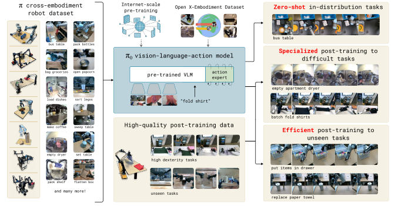

# 8.1.3 VLA 模型的架构演变：从动作 token 到连续 flow action

理解完 VLA 的接口以后，再看模型名字会清楚很多。OpenVLA、Octo、π0 并不是三张孤立的论文卡片，而是在回答同一组问题：动作能不能像语言 token 一样生成，通用机器人策略怎样适配不同观测和动作空间，连续轨迹又该怎样从 VLM 的语义能力中长出来。

本节把三个关键模型放在同一条架构演变线上讲。OpenVLA 代表动作 token VLA 的开源基线，Octo 代表通用策略接口和 diffusion action head，π0 代表预训练 VLM、action expert 和 flow matching 结合后的连续动作路线。它们不是简单的强弱替代关系，更像三次不同的架构取舍。

## 本节目标

读完本节后，你应该能回答：

1. OpenVLA、Octo、π0 分别继承了前一代模型的什么问题。
2. 三类模型的动作表示和动作生成方式有什么差异。
3. 为什么 OpenVLA 是开源 VLA 坐标系，Octo 是接口设计范式，π0 是连续 flow-action 路线代表。
4. 这些模型仍然没有解决哪些问题，为什么后面要引入世界模型。

## 为什么要从架构选择看模型演变

VLA 的模型演变不是“参数越来越大”这么简单。真正推动它变化的，是机器人动作本身的约束：动作要接到控制器上，要在真实时间里执行，要能处理不同机器人和不同传感器，还要在语言目标和连续控制之间保持一致。

演变：动作接口越来越具体

可以把这一段历史看成三步。第一步是把动作离散成 token，让 VLM/LLM 的序列建模能力可以直接参与控制；第二步是把通用策略的输入、任务条件和动作空间做成更灵活的接口；第三步是承认真实机器人需要连续轨迹，于是把 action chunk 和 flow matching 放到动作生成中心。

| 模型 | 核心架构取舍 | 动作生成方式 | 主要价值 | 主要代价 |
|---|---|---|---|---|
| OpenVLA | VLM backbone + action token | 离散动作 token，自回归预测 | 开源 VLA 基线，可下载、可微调、可比较 | 量化误差、自回归延迟、跨机器人动作对齐 |
| Octo | 通用 robot policy + 灵活接口 | diffusion action head | 支持多观测、任务条件和动作空间适配 | 语义知识不如大 VLM，接口配置复杂 |
| π0 | 预训练 VLM + action expert | flow matching action chunk | 连续轨迹生成，更贴近真实控制 | 数据规范和控制器适配要求更高 |

## OpenVLA：动作 token 路线的开源坐标系

RT-2 让大家看到了 VLA 的可能性，但它也留下一个现实问题：如果模型和训练细节主要停留在闭源系统里，社区很难真正围绕它做复现、微调和系统比较。OpenVLA 的意义首先不是“它一定比所有模型都强”，而是它把 VLA 研究从演示和论文，推向了**可下载、可微调、可对比的开源基线**。

OpenVLA 发布在 2024 年。项目页把它定义为一个 **7B 参数开源 VLA**，在 Open X-Embodiment 数据集的 97 万条机器人 episode 上预训练。它的目标很清楚：用较小的参数规模，尽量复现甚至超过闭源大 VLA 在通用操作任务上的效果，并让研究者能用自己的机器人数据继续微调。

RT-2 的核心启发是：**动作可以被表示成 token**，和文本 token 一起被 VLM 预测。这样一来，模型就有机会把网络规模视觉语言预训练学到的语义知识迁移到机器人控制里。OpenVLA 接过了这个思路，但把重点放到**开源和可复现**上。

OpenVLA：开源基线

它不是从零训练一个完全陌生的机器人模型，而是基于 Prismatic VLM。视觉侧使用 SigLIP 和 DINOv2 组成的 fused visual encoder，把图像变成 patch embeddings；中间用 projector 把视觉特征映射到 LLM 的输入空间；语言侧使用 Llama 2 7B backbone；输出侧预测 tokenized action，再把动作 token 解码成连续控制命令。

OpenVLA 项目页中的模型结构图。视觉编码器、投影层和 Llama 2 语言模型共同组成 VLA，最终输出动作 token。

动作 token：接上控制器

这张图背后的关键是“嫁接”。OpenVLA 并不把 VLM 当作外部解释器，而是把视觉、语言和动作都放进同一个可训练系统里。**动作 token 是它和机器人控制器之间的桥**：模型在 token 空间中预测，部署时再解码回连续动作。

OpenVLA 的训练数据来自 Open X-Embodiment 的多机器人操作轨迹。这样的数据混合让模型见过不同机器人、不同任务、不同场景，也让它不只是在单一桌面任务上拟合动作。项目页强调，OpenVLA 可以直接用于多个机器人平台，并能通过参数高效微调适配新机器人设置。

这套方法里有三个值得教学中特别指出的点。第一，OpenVLA 仍然是**动作 token 路线**，它延续了“动作可以像语言一样被离散化并预测”的范式，因此很适合解释 VLA 如何从 LLM/VLM 训练框架中借力。第二，它显式利用了**强视觉编码器**：SigLIP 带来图文对齐能力，DINOv2 带来更强的视觉表征。第三，它把微调放在重要位置，因为真实机器人设置千差万别，开源 VLA 如果不能微调，就很难成为研究工具。

OpenVLA 的重要性不只在指标。对一门课程来说，它更像一个坐标系：读者可以围绕它理解什么是 VLA checkpoint、什么是 OpenX 预训练、什么是动作 token、什么是新机器人微调，甚至什么叫“开源 VLA 和闭源 VLA 的可比性”。它还把 VLA 和普通行为克隆的边界拉得更清楚：当任务从“一个固定动作技能”变成“语言条件下的多任务操作”，VLA 的预训练价值就开始显现。

代价：离散化与延迟

OpenVLA 的局限也很有教学价值。动作 token 会带来**量化误差和自回归延迟**；不同机器人动作空间的对齐仍然依赖数据和 adapter；模型在真正需要互联网语义的困难开放概念上，也未必总能保留 VLM 的全部知识。因此，OpenVLA 更适合作为“开源 VLA 基准线”，而不是终点。

## Octo：通用策略接口与 diffusion action head

如果说 OpenVLA 更像一条“开源 VLA baseline”，Octo 更像一套**“通用机器人策略的接口实验”**。它同样来自 Open X-Embodiment 的大规模机器人数据，也同样希望预训练出能适配多个机器人和多个任务的策略，但它的叙事重心稍有不同：不是把所有东西都塞进一个语言模型式的 token 预测器，而是认真处理机器人策略中那些很工程、却绕不开的问题。

这些问题包括：机器人可以有**不同相机组合**，有的有腕部相机，有的没有；任务条件可以是语言，也可以是目标图像；动作空间可能是末端位姿，也可能是关节位置；新机器人数据很少时，模型能不能快速微调。Octo 的名字有“八爪”的意味，正好暗示它想伸向不同机器人设置。

OpenVLA 证明了开源 VLA 可以成为强基线，但真实机器人策略不只有模型权重这个问题。一个实验室的桌面机械臂可能只有外部 RGB 相机，另一个实验室的双臂平台可能有多个腕部相机和更复杂的 proprioception。语言指令也不是唯一任务条件，有些任务用目标图像更自然，例如“把当前场景整理成这张图的样子”。

Octo：通用策略接口

Octo 正是在这个背景下出现的。项目页把它称为 open-source generalist robot policy，预训练于 Open X-Embodiment 的 80 万条机器人 episode，并提供 Octo-Small 和 Octo-Base 两个初始版本。它的架构强调 flexibility and scale：既要能吃下多样数据，又要能在新机器人上微调。

Octo 项目页中的架构图。Octo 支持语言或目标图像条件、历史观测、多种传感器配置，并通过 diffusion decoding 输出动作分布。

diffusion：生成动作片段

Octo 可以被理解为一个 **Transformer-based diffusion policy**。它接收视觉观测、proprioceptive state、任务条件和历史上下文，输出动作分布。和单纯自回归动作 token 不同，Octo 使用 diffusion decoding 来生成动作，因此更接近 Diffusion Policy 那条连续动作片段路线。

这使 Octo 在教学上很适合做一个桥。前面讲 VA 时，我们已经知道 Diffusion Policy 擅长生成平滑动作片段；前面讲 VLA 时，我们又知道语言和视觉语义非常重要。Octo 把这两边连起来：它不是把动作完全当成文本 token，而是保留了扩散策略对动作连续性的处理，同时又用大规模多机器人数据训练通用策略。

Octo 还支持两类任务条件：**语言指令和目标图像**。语言适合表达“把杯子放进碗里”这种语义目标；目标图像适合表达“整理成这样”这种视觉目标。对机器人来说，这两者都很自然。只支持语言，很多空间细节要靠模型自己补；只支持图像，任务抽象又不够方便。Octo 把它们都纳入策略接口，是它的实用价值之一。

Octo 的重要性在于，它提醒我们“通用机器人策略”不是一句模型规模口号，而是一套接口设计。能不能支持不同 observation，能不能换 action space，能不能用少量目标数据微调，能不能在多个机构的真实机器人上评估，这些问题决定了模型是否真的能被社区使用。

项目页报告了它在多个真实机器人设置上的评估，并指出 Octo 可以适配新的观测输入和动作空间。例如在一些任务中加入 force-torque proprioception，或从末端空间换到关节位置控制。对课程来说，这些结果最适合用来说明：VLA 的泛化不仅是语义泛化，也包括**传感器、机器人和控制接口的泛化**。

Octo 的局限也来自它的定位。它参数规模比 OpenVLA 这类 7B VLA 小得多，语义知识主要来自机器人数据和任务条件接口，不应期待它像大型 VLM 一样处理非常开放的互联网概念。它更像一个设计良好的 generalist robot policy，而不是一个把世界知识全部塞进机器人的大语言模型。

代价：灵活接口也复杂

另外，灵活接口不是免费午餐。支持多种观测和动作空间，意味着**数据预处理、归一化、mask、adapter 和微调配置**都要写清楚。Octo 给了一个很好的开源范式，但读者在自己项目里使用时，仍然要回到动作表示、相机标定、控制频率和数据质量这些基础问题。

## π0：把动作从 token 拉回连续轨迹

到 OpenVLA 和 Octo 这里，我们已经看到了两条重要线索：一条线是用 **VLM/LLM 的语义能力**驱动机器人动作，另一条线是用 diffusion 这类生成式策略处理**连续动作片段**。π0 把这两条线进一步扣在一起。它的论文标题里直接写着 Vision-Language-Action Flow Model，重点不是再提出一个更大的 VLA 名字，而是把 flow matching 放到了动作生成的中心。

为什么这件事重要？因为真实机器人不是在 token 空间里移动的。末端轨迹要连续，夹爪接触要稳定，动作频率要跟上控制节奏。把动作离散成 token 能借用 LLM 框架，却会带来量化误差和自回归延迟。π0 选择在连续动作空间里生成 **action chunk**，本质上是在说：**VLA 需要语义大脑，但它也必须尊重机器人的身体。**

RT-2 和 OpenVLA 证明了 action token 是一条有效路线。它让动作进入语言模型的序列空间，也让机器人控制借到 VLM 的语义知识。但对控制来说，动作 token 并不总是最舒服的表示。每个动作维度被离散化，意味着精度受 bin 的宽度限制；长 action chunk 被拆成很多 token，意味着推理要一步步生成；**自回归错误还可能在一个动作片段内部累积**。

π0：连续动作轨迹

Diffusion Policy 从另一侧告诉我们：如果直接在连续动作轨迹上建模，动作可以更平滑，轨迹结构也更自然。π0 的贡献可以这样理解：把 VLA 的语义能力和连续生成式动作头放在一起，用 flow matching 生成一段动作，而不是逐 token 说出每个动作维度。

π0 论文 Figure 1。模型在预训练 VLM backbone 之外加入 action expert，通过 flow matching 产生连续动作，并在多机器人、多任务数据上训练和后训练。

action expert：专门生成动作

π0 的模型可以拆成两部分看。第一部分是**预训练 VLM backbone**，用来继承互联网规模视觉语言知识。第二部分是 **action expert**，用来处理机器人动作。论文把 action expert 作为独立的动作生成模块接到 VLM 上，让模型既能理解语言和图像，又能输出连续动作。

Flow matching 的直觉是：模型学习一条**从噪声到真实动作轨迹的连续变换路径**。推理时，它从一个简单分布出发，根据当前图像、语言和状态条件，生成一段 action chunk。相比逐 token 预测，它更像在动作空间里“画出”一段轨迹，而不是把轨迹拆成一串离散词。

这条路线特别适合解释机器人控制中的三个现实需求。第一，动作要平滑，否则机械臂会抖。第二，动作要成段，因为大模型不能每 1 毫秒重新推理一次。第三，动作要和语言目标对齐，因为机器人不是单纯执行轨迹，而是在完成任务。

π0 最初发布时，外界更容易看到的是演示和论文。OpenPI 的出现让这条路线有了开源入口。OpenPI README 说明，仓库包含 π0、π0-FAST 和 π0.5 等模型，并提供 base checkpoints、微调示例和推理服务接口。对课程来说，OpenPI 的位置类似 OpenVLA：它把一个前沿 VLA 路线变成社区可以学习和尝试的工程入口。

需要注意的是，OpenPI 不是“下载后所有机器人都能直接跑”的魔法包。README 也明确提醒，π0 是为 Physical Intelligence 自己的机器人和数据开发的，迁移到 ALOHA、DROID 或其他平台时不保证每次成功。这个提醒很重要：**VLA 的开源并不会自动消除动作空间、相机配置、控制频率和数据质量这些问题。**

π0 的重要性在于它把 VLA 的讨论从“能不能把动作当 token”推进到**“怎样生成连续、灵活、可执行的动作”**。它承认 VLM 语义知识重要，但不让动作完全服从语言模型的离散解码习惯。对具身智能来说，这是一种更接近身体的建模方式。

代价：连续动作仍要对齐

π0 仍然没有解决所有问题。连续动作生成可以改善平滑度和轨迹表达，但长视距规划、异常恢复、反事实推理和安全约束仍然困难。模型可能能生成一段漂亮动作，却不知道如果这段动作执行失败，下一步该如何重新计划。另外，flow action head 让动作更连续，也让调试更复杂：连续 flow 模型需要检查采样步数、归一化统计、action chunk 执行策略和控制器适配。如果数据规范不清楚，连续动作同样会被**错误坐标系或错误夹爪语义**带偏。

## 三条路线放在一起看

把三者放在一起，不难看出 VLA 架构的变化方向：它从“借语言模型的 token 预测能力”开始，逐渐意识到机器人策略还需要灵活接口、动作片段和连续轨迹。OpenVLA 让 VLA 可复现，Octo 让接口适配变得具体，π0 则把连续动作生成推到更中心的位置。

| 对比项 | OpenVLA | Octo | π0 |
|---|---|---|---|
| 主要问题 | 开源复现 RT-2 式 VLA | 通用策略如何适配不同机器人 | VLA 如何生成连续动作片段 |
| 视觉语言主干 | Prismatic VLM / Llama 2 7B | Transformer generalist policy | 预训练 VLM backbone |
| 动作路线 | tokenized action | diffusion decoding | flow matching action chunk |
| 接口重点 | OpenX 数据、动作 token、微调 | 多观测、任务条件、动作空间 | action expert、连续轨迹、后训练 |
| 教学价值 | 解释 VLA checkpoint 和开源基线 | 解释通用机器人策略接口 | 解释 VLA 如何回到连续控制 |
| 主要局限 | 离散化、延迟、跨机器人适配 | 语义开放性有限，配置复杂 | 调试复杂，仍缺长视距和反事实 |

## 为什么下一步要谈世界模型

这三条路线都在努力把语言和视觉知识落到动作上，但它们大多仍然像强行为克隆器：看到当前观测和指令，预测专家在类似状态下会做什么。它们可以生成更好的动作，也可以适配更多机器人，却不一定显式回答“如果我这样做，未来会怎样变化”。

这正是世界模型要补上的部分。VLA 让机器人知道“当前该怎么动”，世界模型试图让机器人**在执行前先预测后果**。对于长视距任务、异常恢复和反事实比较，这个能力会越来越重要。所以下一节会从 VLA 转向世界模型，把讨论从“生成动作”推进到“想象动作之后的世界”。

## 小结

OpenVLA、Octo、π0 共同构成了 VLA 早期演变的三个关键侧面。OpenVLA 用动作 token 把 VLM 和机器人控制接起来，并把它做成开源基线；Octo 强调通用策略不是一句口号，而是一整套观测、任务条件和动作接口设计；π0 则把连续 flow action 放到中心，让 VLA 更接近真实机器人的运动节奏。

理解这条演变线后，读者再去看具体论文和代码，就不只是比较榜单指标，而是在看模型如何处理同一组接口问题：语义如何进入动作，动作如何保持平滑，机器人差异如何被对齐，以及系统如何在真实世界里保持闭环。

## 参考资料

- 【OpenVLA 论文，介绍 7B 开源 VLA 和训练设置】[https://arxiv.org/abs/2406.09246](https://arxiv.org/abs/2406.09246)
- 【OpenVLA 项目页，包含模型图、结果和微调说明】[https://openvla.github.io/](https://openvla.github.io/)
- 【OpenVLA GitHub，代码与使用入口】[https://github.com/openvla/openvla](https://github.com/openvla/openvla)
- 【Octo 论文，介绍开源通用机器人策略和架构】[https://arxiv.org/abs/2405.12213](https://arxiv.org/abs/2405.12213)
- 【Octo 项目页，包含架构图、演示和实验设置】[https://octo-models.github.io/](https://octo-models.github.io/)
- 【Octo GitHub，代码、模型和示例入口】[https://github.com/octo-models/octo](https://github.com/octo-models/octo)
- 【π0 论文，介绍 VLA flow model 和 action expert】[https://arxiv.org/abs/2410.24164](https://arxiv.org/abs/2410.24164)
- 【Physical Intelligence π0 博客，包含模型动机和任务演示】[https://www.pi.website/blog/pi0](https://www.pi.website/blog/pi0)
- 【OpenPI GitHub，π0、π0-FAST、π0.5 的开源入口】[https://github.com/Physical-Intelligence/openpi](https://github.com/Physical-Intelligence/openpi)
- 【Open X-Embodiment 论文，OpenVLA 和 Octo 使用的重要多机器人数据来源】[https://arxiv.org/abs/2310.08864](https://arxiv.org/abs/2310.08864)
