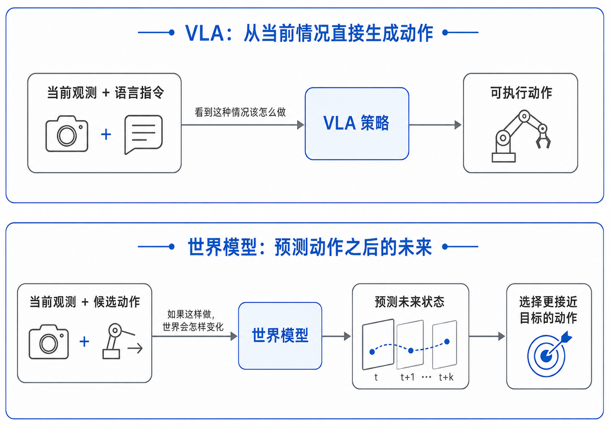
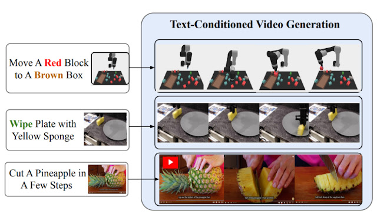
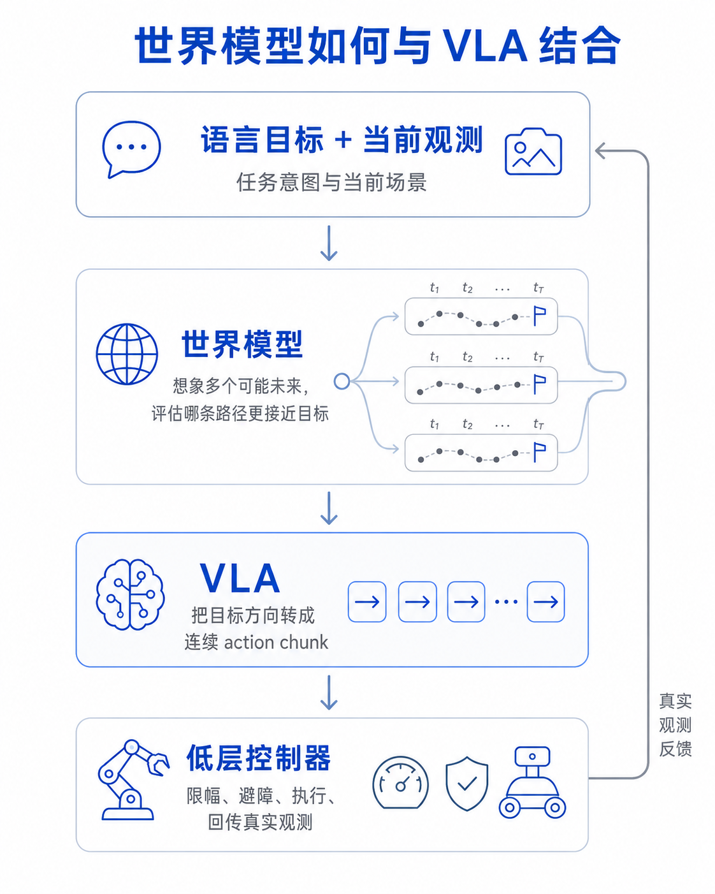

# 8.1.4 从 VLA 到世界模型：机器人需要先在脑中试一遍

到 OpenVLA、Octo 和 π0/OpenPI 这里，我们已经看到了 VLA 的几种核心能力：它能借用视觉语言模型理解任务，也能通过动作 token、diffusion 或 flow action head 生成动作片段。但这仍然没有回答一个更深的问题：机器人怎么知道**“如果我这样做，世界会怎样变化”**？

普通 VLA 大多像一个强行为克隆器。它看到当前图像和语言指令，然后预测专家在类似状态下会做什么。这当然有用，但它并不显式模拟动作后果。人类做很多操作时，会在脑中预演：如果从这个方向抓杯子，会不会碰到旁边的碗；如果先拉抽屉再拿物体，会不会更顺；如果布料这样折，下一步角会落在哪里。世界模型想给机器人补上的，正是这种**“先试一遍”**的能力。

## 本节目标

本节只做概念引入，不展开完整世界模型章节。读完后，你应该能回答：

1. 世界模型和 VLA 的核心区别是什么。
2. 世界模型试图解决 VLA 哪些局限。
3. UniPi 这类视频生成式规划为什么是一个有启发性的起点。
4. 未来世界模型和 VLA 可以怎样分工。

## VLA 的三类局限

第一类局限是**数据依赖**。VLA 学到的策略很大程度上来自机器人演示数据。数据覆盖过的物体、光照、姿态、操作顺序，模型更容易成功；数据没有覆盖的组合，就只能靠视觉语言预训练和有限泛化硬撑。VLM 知识能帮模型理解语义，但不能自动补齐所有物理交互经验。

第二类局限是**长视距规划**。很多 VLA 输出的是单步动作或短 action chunk。对“抓起杯子放到碗里”这种短任务还好；对“整理桌面”“折衣服”“组装盒子”这种多阶段任务，前面一点偏差会改变后面的观测，偏差会沿着真实世界累积。模型如果只是局部模仿专家动作，很容易在中途漂移。

第三类局限是**缺少反事实推理**。普通策略通常回答“当前状态下该做什么”，而不是“如果我做 A 会怎样，如果做 B 又会怎样”。没有动作后果预测，就很难比较候选方案，也很难在动作失败前提前避开明显风险。

## 世界模型的回答

世界模型的基本想法是学习环境如何变化。它不只学策略 `π(a|s)`，也学转移或未来观测 `p(s'|s,a)`。换句话说，VLA 更像**“看到这种情况该怎么做”**，世界模型更像**“如果这样做，世界会变成什么样”**。

VLA 更像直接回答“看到这种情况该怎么做”，世界模型则显式预测“如果这样做，世界会怎样变化”。

在机器人里，未来不一定要用低维状态表示。很多新工作选择预测视频、预测 latent dynamics，或者从视频模型中提取潜动作。这样做的直觉很强：互联网和机器人数据里有大量视频，视频天然记录了物体怎么动、接触怎么发生、场景如何变化。如果模型能学会这种动态，再把它和动作空间对齐，就可能减少对精确动作标注的依赖。

Google Research 的 UniPi 文章配图。UniPi 把策略学习转成文本条件的视频生成，再从生成的未来视觉轨迹中恢复动作。

## UniPi 的启发

UniPi 是一个很适合放在这里讲的先驱例子。它把任务描述和当前图像交给视频生成模型，让模型生成未来一段视觉轨迹，再通过 inverse dynamics 从视频变化中恢复动作。这个想法很大胆：如果一个模型能想象**“完成任务的视频”**，那么动作也许可以从这个想象过程里反推出。

先想象，再执行

它的历史意义在于把“规划”从动作空间挪到视频空间。传统规划常常要在状态和动作空间中搜索；UniPi 则问，能不能先生成一段看起来会完成任务的未来，然后再把它变成控制命令。这给后来的世界模型和 video-action model 提供了直觉：视频模型内部可能已经包含了大量物理动态和动作相关信息。

当然，UniPi 也暴露了问题。完整生成视频很慢，视频像素不等于精确 3D 控制，生成出来的画面看起来合理也不保证物理可执行。杯子在视频里移动了几厘米，真实机器人需要的是精确到控制接口的动作。世界模型要真正和 VLA 结合，不能停在“生成漂亮未来画面”，还要解决动作对齐、实时推理和安全约束。

## 未来如何和 VLA 结合

一种比较自然的分工是分层。世界模型做高层想象和评估：给定当前状态，预测几种候选动作或子任务会带来怎样的未来；VLA 做中层动作生成：把语言目标和世界模型选出的方向转成可执行 action chunk；低层控制器负责安全、限幅、碰撞检查和实时稳定。

一种自然的组合方式是让世界模型负责想象和评估未来，VLA 负责把目标方向转成连续 action chunk，低层控制器负责安全执行和真实观测反馈。

这种结构不要求世界模型完全替代 VLA。相反，它把 VLA 的优势保留下来：VLA 擅长把语言和视觉接到动作；世界模型补上**对未来后果的预测**；控制器守住**物理安全边界**。对于长期任务、稀有场景和需要反事实比较的操作，这种组合比单纯行为克隆更有想象空间。

## 小结

VLA 让机器人从“看图做动作”走向“看懂指令并生成动作”，但它仍然常常缺少对未来的显式建模。世界模型尝试让机器人在执行前先预测后果，把试错的一部分搬到模型内部。

对入门读者来说，不必急着把世界模型看成 VLA 的替代品。更稳妥的理解是：VLA 是把目标落到动作的执行器，世界模型是让执行前多一层想象和评估。未来真正可靠的具身系统，很可能同时需要这两者。

## 参考资料

- 【UniPi 论文，文本条件视频生成式机器人策略】[https://arxiv.org/abs/2302.00111](https://arxiv.org/abs/2302.00111)
- 【Google Research UniPi 博客，包含直观图示和方法解释】[https://research.google/blog/unipi-learning-universal-policies-via-text-guided-video-generation/](https://research.google/blog/unipi-learning-universal-policies-via-text-guided-video-generation/)
- 【Video Prediction Policy 论文，预测式视觉表征用于通用机器人策略】[https://arxiv.org/abs/2412.14803](https://arxiv.org/abs/2412.14803)
- 【DiT4DiT 论文，联合建模视频动态和动作的机器人控制路线】[https://arxiv.org/abs/2603.10448](https://arxiv.org/abs/2603.10448)
- 【World Models 论文，世界模型概念的经典入口】[https://arxiv.org/abs/1803.10122](https://arxiv.org/abs/1803.10122)
