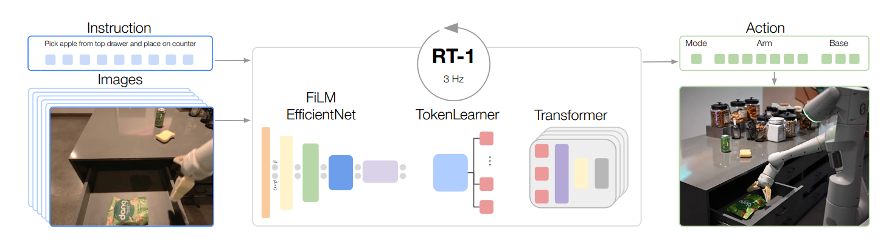

# RT-1

想象你对着一台机械臂说一句“把可乐罐拿起来”，它看一眼桌面，就伸手过去把罐子拿了起来。RT-1（Robotics Transformer）做的就是这件事：让机器人**结合指令理解画面，然后一步步把动作做出来**。它是 Google 提出的早期 Vision-Language-Action 机器人策略模型。思路仿照传统的 NLP 路线：把图像和语言指令转化成 token，从而完成对 action token 的序列预测。

RT-1 适合作为学习 VLA 的第一个模型。它把多任务机器人策略的几条主线放进了一个相对清楚的模板里：真实数据、语言条件、视觉特征、Transformer 时序建模、动作 token 化，以及闭环控制中的安全保护。后面的 Octo、OpenVLA 等模型，基本都是在这几条主线上继续扩展。

图：RT-1 的理论框架。模型根据当前图像和语言指令预测动作 token；动作 token 再被解码成机器人可以执行的连续动作。

## 阅读路线

| 章节 | 读完能回答 | 重点 |
|---|---|---|
| [RT-1 理论基础](01-rt1/01-theory.md) | FiLM EfficientNet / TokenLearner / Transformer 各自做什么？连续动作为什么要离散成 token？ | action tokenizer、裁剪损失与量化损失、RT-1 在 VLA 发展脉络里的位置 |
| [RT-1 实践：跑通 action tokenizer 最小源码测试](01-rt1/02-practice.md) | TF1 环境怎么搭？`t2r_pb2` 为什么要手动生成？`action_tokenizer_test` 跑通说明了什么？ | Python 3.7 + TF1.15 环境、proto 生成、最小链路验证 |

## References

- [google-research/robotics_transformer](https://github.com/google-research/robotics_transformer)

## 导航

- 上一节：[常用库](../03-common-libraries.md)
- 返回上级：[常用库](../03-common-libraries.md)
- 下一节：[RT-1 理论基础](01-rt1/01-theory.md)