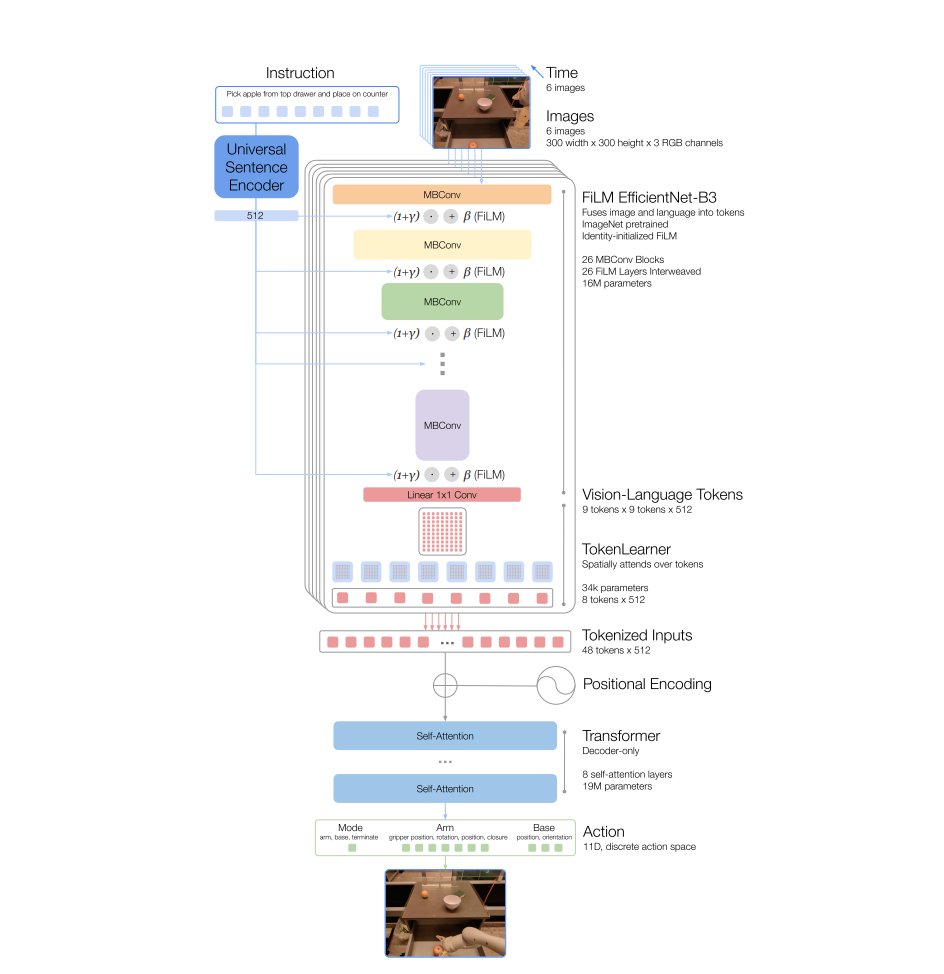

# RT-1 理论基础

## 本节目标

- 能画出 RT-1 从图像、语言指令到 action token、再到机器人动作的数据流。
- 能解释 FiLM EfficientNet、TokenLearner、Transformer、action tokenizer 各自的作用。
- 能说清 action token 化里的裁剪损失和量化损失，以及它们为什么影响控制精度。
- 能把 RT-1 放进 VLA 的发展脉络，知道它立起了哪几条主线、后续模型在沿着哪些方向扩展。

## 解决什么问题

RT-1 面对的是一个很现实的矛盾：机器人数据很贵，单个任务上训练一个策略并不难，但一旦换物体、换背景、换指令，策略就容易掉链子。RT-1 的回答是：**从单任务策略转向用大量真实机器人轨迹训练一个多任务策略**。

论文报告的训练数据规模大致是：

| 项目 | RT-1 的设置 | 理解 |
|---|---|---|
| 数据来源 | 真实机器人长期采集 | 来自真机操作，贴近真实物理与分布 |
| 任务数量 | 700+ tasks | 指令和场景足够多，模型才有机会学到可迁移模式 |
| 轨迹数量 | 约 130k episodes | 每条 episode 是一段完整执行过程 |
| 机器人 | 多台 Everyday Robots 移动机械臂 | 多机器人采集让数据覆盖更宽 |
| 学习方式 | Behavior Cloning | 模仿专家示范动作，用离线数据监督学习 |

RT-1 的核心价值，在于它把三件事顺畅地接到了一起：

- 大规模真实机器人数据；
- 可以吸收图像、语言和时间序列的 Transformer 架构；
- 能把连续机器人动作变成 token 的离散化接口。

## 整体结构

下面这张图是 RT-1 的主干结构。先看整体，再看每一块的职责。



从整体看，RT-1 结合图像输入、指令输入进行处理，输出 action token 再转化到现实世界的动作。细细看去，可以发现 RT-1 主体由三大组件组成——FiLM EfficientNet、TokenLearner、Transformer——外加一个输出动作分布的 action head。

其中：

- FiLM EfficientNet 负责提取语言条件化视觉特征
- TokenLearner 负责压缩成少量关键 token
- Transformer 负责做时序建模
- action head 负责输出动作 token 分布

### FiLM EfficientNet - 组合视觉与指令

RT-1 的输入主要有两类：

- 图像观测：机器人摄像头看到的当前画面，通常还会带一小段历史。
- 语言指令：自然语言任务描述，例如“把苹果放进抽屉”。

图像先经过 **FiLM EfficientNet**，再进入 Transformer。EfficientNet 负责提取视觉特征；FiLM（Feature-wise Linear Modulation）负责把语言信息注入视觉网络。具体来说，指令先由 Universal Sentence Encoder（USE）编码成句向量，再经 FiLM 注入 EfficientNet。

可以把它理解成：同一张图，在“拿杯子”和“打开抽屉”这两个指令下，模型关注的区域会不一样。FiLM 的作用是在视觉提取过程中持续注入“这次任务是什么”。

它输出的是一堆视觉 token，而不是直接给出动作。这些 token 数量还比较多，直接放进 Transformer 对计算负担会略大，于是引出了 TokenLearner。

### TokenLearner - 加速计算

Transformer 的计算量会随 token 数量快速增加，而真实机器人要闭环运行，推理速度必须够快。因此 RT-1 用 **TokenLearner** 从大量图像特征里压缩出少量关键 token。

TokenLearner 做的是学会抓重点：面对一张操作画面，模型不需要平均关注所有像素，它会更倾向于保留夹爪、目标物体、容器边缘、接触区域等关键线索。

一个极简版 TokenLearner 可以这样写：

```python
import torch
import torch.nn as nn
import torch.nn.functional as F


class TinyTokenLearner(nn.Module):
    """教学版 TokenLearner：从 feature map 中学出少量加权 token。"""

    def __init__(self, channels: int, num_tokens: int = 8):
        super().__init__()
        self.score = nn.Conv2d(channels, num_tokens, kernel_size=1)

    def forward(self, x: torch.Tensor) -> torch.Tensor:
        # x: (batch, channels, height, width)
        batch, channels, height, width = x.shape

        weights = self.score(x)                    # (batch, tokens, height, width)
        weights = weights.reshape(batch, -1, height * width)
        weights = F.softmax(weights, dim=-1)       # 每个 token 学一张注意力图

        pixels = x.reshape(batch, channels, height * width)
        tokens = torch.einsum("bth,bch->btc", weights, pixels)
        return tokens                              # (batch, tokens, channels)
```

这样后面的 Transformer 只需要处理这几个 token，就能省下处理整张图所有 patch 的开销。

### Transformer - 主训练流程

拿到视觉 token 之后，Transformer 要做的是时序建模和动作预测。它会看一段时间内的 token，并输出下一步动作 token 的分布。

具体来说，RT-1 用的是一个 decoder-only Transformer：

- **输入**：最近 6 帧图像的视觉 token。每帧先由 FiLM EfficientNet 产生 81 个 token（9×9 的 feature map），再由 TokenLearner 压缩成 8 个，所以 6 帧合计 48 个 token。
- **结构**：8 层自注意力，Transformer 主干参数量约 19M；加上前面 FiLM EfficientNet 图像 / 指令 tokenizer 的约 16M，整个 RT-1 约 35M——按今天大模型的标准，这是一个非常小的网络。
- **输出**：每个动作维度上 256 个离散桶的分布，逐维取概率最高的桶，就得到这一步的 action token。

模型做得这么小有现实理由：RT-1 要放在真实机器人上闭环运行，论文里的控制频率是 3 Hz，推理延迟必须压在预算内。TokenLearner 把每帧 81 个 token 压到 8 个，正是为这条延迟预算服务的。

训练方式是前面提到的 behavior cloning：把示范轨迹里的连续动作离散成 token 作为监督信号，让 Transformer 学着在当前观测序列下预测专家的下一步动作 token。这就自然引出下一个问题——连续动作是怎么变成 token 的。

## 动作 token 化

机器人动作原本是连续值，比如末端往 x 方向移动多少、往 z 方向抬多少、夹爪开合多少。Transformer 更擅长处理离散 token，所以 RT-1 把动作每一维离散成若干个桶（bucket / bin），再预测桶的编号。

官方 `RT1ActionTokenizer` 的注释里给了一个很清楚的动作顺序例子：

| 动作字段 | 含义 | 理解 |
|---|---|---|
| `terminate` | 是否结束当前 episode / 子任务 | “这步做完了吗？” |
| `world_vector` | 末端执行器在世界坐标中的平移增量 | “手往哪里挪？” |
| `rotation_delta` | 末端姿态变化 | “手腕怎么转？” |
| `gripper_closedness` | 夹爪开合 | “夹紧还是松开？” |

> 注：官方实现里 `terminate` 是 one-hot 形式（docstring 的例子是 `[0, 1]`），int32 类型的维度会被当作“已经是 token”直接使用。真实 RT-1 的完整动作共 11 维：机械臂占 7 维之外，还有底盘移动的 3 维；而这里的 `terminate` 在真实实现中其实是 arm / base / terminate 的三态模式切换维。本节的教学版把它简化成一个二值标量，并省略底盘部分，只保留机械臂，方便看清离散化思路。

下面是一个 NumPy 版教学 tokenizer。它展示的是思路：连续动作按最小值 / 最大值裁剪，再映射到 `0 ~ vocab_size-1` 的离散 token。

```python
from dataclasses import dataclass
import numpy as np


@dataclass
class FieldSpec:
    low: float
    high: float
    shape: tuple[int, ...]
    discrete: bool = False


ACTION_ORDER = [
    "terminate",
    "world_vector",
    "rotation_delta",
    "gripper_closedness",
]

ACTION_SPEC = {
    "terminate": FieldSpec(0, 1, (1,), discrete=True),
    "world_vector": FieldSpec(-1.0, 1.0, (3,)),
    "rotation_delta": FieldSpec(-1.0, 1.0, (3,)),
    "gripper_closedness": FieldSpec(0.0, 1.0, (1,)),
}


class SimpleRT1ActionTokenizer:
    def __init__(self, spec: dict[str, FieldSpec], vocab_size: int = 256):
        self.spec = spec
        self.vocab_size = vocab_size

    def encode(self, action: dict[str, np.ndarray]) -> np.ndarray:
        tokens: list[np.ndarray] = []
        for name in ACTION_ORDER:
            value = np.asarray(action[name], dtype=np.float32).reshape(-1)
            field = self.spec[name]

            if field.discrete:
                token = value.astype(np.int64)
            else:
                clipped = np.clip(value, field.low, field.high)
                ratio = (clipped - field.low) / (field.high - field.low)
                token = np.rint(ratio * (self.vocab_size - 1)).astype(np.int64)

            tokens.append(token)
        return np.concatenate(tokens)

    def decode(self, tokens: np.ndarray) -> dict[str, np.ndarray]:
        tokens = np.asarray(tokens, dtype=np.int64)
        out: dict[str, np.ndarray] = {}
        cursor = 0

        for name in ACTION_ORDER:
            field = self.spec[name]
            size = int(np.prod(field.shape))
            token = tokens[cursor : cursor + size]
            cursor += size

            if field.discrete:
                value = token.astype(np.float32)
            else:
                ratio = token.astype(np.float32) / (self.vocab_size - 1)
                value = field.low + ratio * (field.high - field.low)

            out[name] = value.reshape(field.shape)
        return out


tokenizer = SimpleRT1ActionTokenizer(ACTION_SPEC)

action = {
    "terminate": np.array([0]),
    "world_vector": np.array([0.10, -0.20, 0.05]),
    "rotation_delta": np.array([0.0, 0.1, -0.1]),
    "gripper_closedness": np.array([0.9]),
}

tokens = tokenizer.encode(action)
round_trip = tokenizer.decode(tokens)
print(tokens)
print(round_trip["world_vector"])
```

### 裁剪和量化误差

为了看清 action token 化对控制精度的影响，可以故意输入一个越界动作：

```python
action["world_vector"] = np.array([2.0, -2.0, 0.0])   # 故意越界
tokens = tokenizer.encode(action)
decoded = tokenizer.decode(tokens)
```

这里要分清两种信息损失。第一种是**裁剪损失**：如果 `world_vector` 的 action spec 规定范围是 `[-1, 1]`，那么输入里的 `2.0` 会先被裁剪成 `1.0`，`-2.0` 会先被裁剪成 `-1.0`，超出范围的幅度信息已经丢失。第二种是**量化损失**：裁剪后的连续值还要被映射到有限个离散 bin 里，例如 `vocab_size=256` 时每一维只有 256 个可选 token，decode 回来的值只能落在这些离散档位上，不一定精确等于裁剪后的连续值。

所以 `decoded` 还原的是“经过裁剪和量化后的动作”，原始动作 `[2.0, -2.0, 0.0]` 里超出范围的部分在第一步就已经丢失了。这就是 action token 化会影响控制精度的地方。

> 三个工程原则：
> 
> 1. **动作顺序必须固定。** token 化之后，字段名信息会消失，所以要维护清楚的 `ACTION_ORDER`。
> 2. **动作范围必须来自训练数据或 action spec。** 如果范围设错，token 能正常输出，但解码后的机器人动作会偏得很离谱。
> 3. **离散化精度会限制控制精度。** `vocab_size` 越小，模型越容易学，但 decode 回来的动作越粗糙。

### 动手练习

1. 把示例里的 `world_vector` 改成 `[2.0, -2.0, 0.0]`，运行 `encode` 再 `decode`，打印 `round_trip["world_vector"]`。对比输入和输出，说出哪一步发生了裁剪损失、哪一步发生了量化损失。
2. 把 `SimpleRT1ActionTokenizer(ACTION_SPEC, vocab_size=256)` 的 `vocab_size` 依次改成 `16`、`4`，每次运行 `encode -> decode` 并计算 `|decoded["world_vector"] - original|` 的最大误差。观察 `vocab_size` 减半时误差怎么变化，并解释为什么 token 总数（8 个）始终不随 `vocab_size` 改变。
3. 交换 `ACTION_ORDER` 里 `world_vector` 和 `rotation_delta` 的位置，保持 `action` 字典不变，重新 encode -> decode，对比解码出来的 `world_vector` 和原始值。用这个结果说明"动作顺序必须固定"这条工程原则的后果。

## 和后续模型的关系

RT-1 是 VLA / robot foundation model 发展链条里的早期关键节点。它比今天“大 VLM + action head”的形态要朴素一些，但已经把几条主线立了起来：

- 用自然语言作为任务条件；
- 用 Transformer 吸收多任务机器人数据；
- 把连续控制动作离散成 token；
- 把模型放进真实机器人闭环里评测。

后面的模型大多是在这些主线上继续扩展：

| 方向 | 后续代表 | 扩展了什么 |
|---|---|---|
| 更强语言和常识 | RT-2、OpenVLA | 引入更强 VLM / LLM 基座，让模型不只会匹配指令，还能利用视觉语言预训练知识 |
| 跨机器人泛化 | RT-X + Open X-Embodiment（模型+数据集）| 用多平台数据减少“换个机械臂就不会动”的问题 |
| 更灵活动作表示 | Octo、pi0、GR00T 等 | 从离散 token 走向扩散、流匹配或动作专家网络 |
| 更强空间理解 | SpatialVLA 等 | 把 2D 图像语义进一步接到 3D 空间和几何约束 |
| 更轻量部署 | SmolVLA、SwiftVLA 等 | 降低参数量和推理成本，让 VLA 更接近普通实验室设备 |

因此，RT-1 最适合作为读 VLA 的第一块积木：它足够早，结构相对清楚；又足够完整，已经覆盖了视觉、语言、动作、数据和闭环控制这几条主线。

## 小结

- RT-1 是早期 VLA，语言更多扮演任务条件的角色，模型真正输出的是动作 token；强常识推理和对话能力要到后来的 RT-2、OpenVLA 才补上。
- FiLM EfficientNet 负责提取带语言条件的视觉特征，TokenLearner 负责压缩 token，Transformer 负责时序动作预测。
- action tokenizer 是 RT-1 的关键接口：动作字段顺序、离散桶数量、动作范围都会直接影响控制结果。
- 读后续 RT-2、RT-X、OpenVLA、Octo 等模型时，可以从“语言基座、视觉基座、动作表示、训练数据、部署成本”五个维度和 RT-1 对照。

## References

- [RT-1: Robotics Transformer for Real-World Control at Scale](https://arxiv.org/abs/2212.06817)
- [Robotics Transformer 官方项目页](https://robotics-transformer.github.io/)
- [google-research/robotics_transformer](https://github.com/google-research/robotics_transformer)
- [Google Research Blog: RT-1](https://research.google/blog/rt-1-robotics-transformer-for-real-world-control-at-scale/)

## 导航

- 上一节：[RT-1](../01-rt1.md)
- 返回上级：[RT-1](../01-rt1.md)
- 下一节：[RT-1 实践：跑通 action tokenizer 最小源码测试](02-practice.md)
- 下一节：[RT-1 实践：跑通 action tokenizer 最小源码测试](02-practice.md)