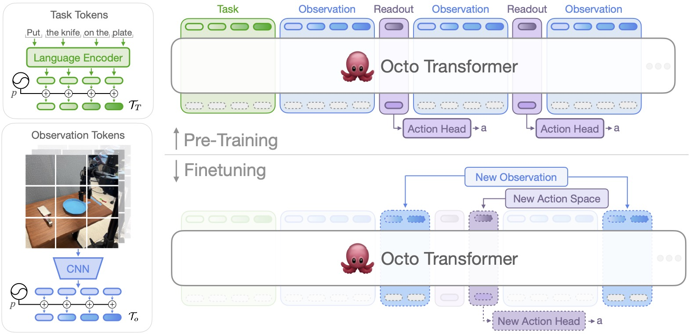

# Octo 理论基础

## 本节目标

- 能画出 Octo 从任务输入、观测输入到动作输出的数据流，说清每个环节的输入输出维度。
- 能解释 `task tokenizer`、`observation tokenizer`、`readout token`、`blockwise-causal Transformer` 和 `diffusion action head` 各自的作用。
- 能解释 `timestep_pad_mask` 和 `pad_mask_dict` 分别在什么情况下起作用，以及为什么缺少它们模型会误解输入。
- 能解释为什么 action readout token 不能简单理解成动作 token，以及它和 RT-1 action token 的本质区别。
- 能解释 diffusion action head 训练时预测的是什么（动作本身，还是加噪动作中的噪声），以及 `rng` 在推理时为什么是必要输入。

## 解决什么问题

Octo 主要目标是训练一个通用的机器人策略：用多源机器人轨迹预训练出可以处理图像、语言和目标图像的 Transformer policy，再在目标机器人或目标数据集上微调。官方对 Octo 的定位为：Octo 是 transformer-based diffusion policy，训练在约 800k 条机器人轨迹上，支持多个 RGB camera input，可以控制多种机械臂，并且可以用语言指令或目标图像作为任务条件。

## 输入和输出规格

Octo 的最小调用路径是：

```python
from octo.model.octo_model import OctoModel
import jax

model = OctoModel.load_pretrained("hf://rail-berkeley/octo-small-1.5")
task = model.create_tasks(texts=["pick up the spoon"])
action = model.sample_actions(observations, tasks, rng=jax.random.PRNGKey(0))
```

这里有三类对象：

| 对象 | 典型内容 | 作用 |
|---|---|---|
| `observations` | `image_primary`、`image_wrist`、`timestep_pad_mask`、`pad_mask_dict` | 当前或历史窗口里的机器人观测 |
| `tasks` | `language_instruction` 或目标图像，以及 `pad_mask_dict` | 本次任务条件 |
| `action` | shape 类似 `(batch, action_horizon, action_dim)` | 未来若干步动作 chunk |

Octo-1.5 的默认动作规格来自 checkpoint config：`action_dim=7`、`action_horizon=4`，也就是模型默认一次预测未来 4 个 7 维动作。部署时可以一次执行整个 action chunk，也可以只执行第一步后重新采样，后者就是 receding horizon control（滚动规划窗口）。

上表里的两个 mask，是为了让同一个模型能处理”不完整”的输入：有的机器人没有 wrist camera，有的数据没有语言标注，历史窗口开头也可能凑不齐足够的帧。这些缺失必须明确标出来。

| mask | 维度语义 | 什么时候起作用 |
|---|---|---|
| `timestep_pad_mask` | 哪些历史 timestep 是真实观测，哪些是 padding | 使用历史窗口时，开头可能没有足够历史帧 |
| `pad_mask_dict` | 某个 timestep 内哪些输入模态存在 | 数据集中没有 wrist camera、没有语言、没有目标图像时 |

如果不传这两个 mask，模型会把 padding 帧的无效数据当作真实观测处理，或者把缺失相机的零值张量当作真实图像输入，两种情况都会引入与任务无关的噪声，导致条件偏移、动作质量下降。

## 总体结构

下面是官方架构图:



图里左侧是两路 tokenizer：task tokens（语言经 Language Encoder）和 observation tokens（图像经 CNN）。中间是 Octo Transformer，序列按 `Task -> Observation -> Readout -> Observation -> Readout -> ...` 排布，每个 readout token 接一个 Action Head 然后输出动作 `a`。上半部分是预训练；下半部分是微调时的常见改法：换 New Observation、New Action Space、New Action Head，但 Transformer 主干基本复用。

Octo 的主干可以按下面的数据流理解：

```txt
语言指令 / 目标图像
  -> task tokens (through task tokenizers)

相机图像 / 低维状态
  -> observation tokens (through observation tokenizers)

task tokens + observation tokens + readout_action tokens
  -> blockwise-causal Transformer
  -> action readout embeddings
  -> diffusion action head
  -> 连续动作 chunk
```

源码里的核心类是 `OctoTransformer`。它的注释展现了一个典型序列如何组织：

```txt
[
  <task language tokens>,
  <t=0 image_primary tokens>, <t=0 image_wrist tokens>, <t=0 readout_action tokens>,
  <t=1 image_primary tokens>, <t=1 image_wrist tokens>, <t=1 readout_action tokens>,
  ...
]
```

可以看到序列中先放 task tokens，然后按时间步放 observation tokens 和 readout tokens。

Transformer 采用 blockwise-causal attention。观测 token 可以看 task prefix，也可以看当前和过去时间步的观测 token。readout token 可以理解成专门替下游任务开的一个提问槽：它去读 task token 和 observation token 里的信息，汇总成一个 embedding 交给 action head。action readout 只从别人那里取信息，不会反过来影响普通观测 token 的表示，所以加不加 readout 都不改变 Octo 对观测本身的理解。

这里很容易误解为readout token 就是动作 token，但两者本质不同：RT-1 的 action token 是模型直接输出的动作离散值，解码后就能还原机器人动作；Octo 的 readout token 输出的是一段 embedding，它本身不等于动作，只是作为条件送给 diffusion action head，再由 diffusion head 从高斯噪声采样生成动作。前者是分类输出，后者是条件向量。

用一个最小的 attention mask 把这条规则应用到矩阵上（`mask[i,j]=1` 表示 token i 可以 attend to token j）：

```python
import numpy as np

# 序列：[task, obs_t0, readout_t0, obs_t1, readout_t1]
labels = [“task”, “obs_t0”, “rdt_t0”, “obs_t1”, “rdt_t1”]
N = 5
mask = np.zeros((N, N), dtype=int)

mask[:, 0] = 1       # task 对所有 token 可见
mask[1, 1] = 1       # obs_t0 看 obs_t0
mask[2, 1] = 1       # rdt_t0 看 obs_t0
mask[2, 2] = 1       # rdt_t0 看自己（同组 CAUSAL，t=0<=0）
mask[3, 1] = 1       # obs_t1 看 obs_t0（obs_* CAUSAL，t=0<=1）
mask[3, 3] = 1       # obs_t1 看 obs_t1
# obs_t1 不看 rdt_t0：obs 的 attention_rules 里没有 readout_* 规则，默认 NEVER
mask[4, 1] = 1       # rdt_t1 看 obs_t0（obs_* CAUSAL）
mask[4, 2] = 1       # rdt_t1 看 rdt_t0（同组 readout_action CAUSAL，t=0<=1）
mask[4, 3] = 1       # rdt_t1 看 obs_t1（obs_* CAUSAL）
mask[4, 4] = 1       # rdt_t1 看自己

print(f”{'':8s}”, “  “.join(f”{l:6s}” for l in labels))
for i, l in enumerate(labels):
    print(f”{l:8s}”, mask[i])
```

输出：

```
         task    obs_t0  rdt_t0  obs_t1  rdt_t1
task     [1      0       0       0       0]
obs_t0   [1      1       0       0       0]
rdt_t0   [1      1       1       0       0]
obs_t1   [1      1       0       1       0]   # 跳过了 rdt_t0！
rdt_t1   [1      1       1       1       1]   # 能看 rdt_t0（同组 CAUSAL）
```

两条重要的原则为：**obs 不看 readout**（`obs_t1` 的列 2 为 0，obs 的 `attention_rules` 里没有 `readout_*` 条目，默认 `NEVER`）；**readout 可以看同组 readout 的历史**（`rdt_t1` 的列 2 为 1，`readout_action` 对自身同名 token 用 `CAUSAL` 规则）。这样 obs 的因果链路里永远没有 readout token，readout 只负责汇总、不污染观测表示。

## Tokenizer

Octo 的 tokenizer 是模块化的，配置文件会决定启用哪些输入。

### 语言任务

`LanguageTokenizer` 支持 Hugging Face 模型作为语言 encoder。Octo-1.5 的 checkpoint config 里使用 `t5-base`，并且 `finetune_encoder=false`。因此训练不更新文本 encoder 的参数，在 debug finetune 复现日志中也能看到实际冻结了 `*hf_model*` 参数。

这说明所谓 `full` finetuning 在这个脚本里不是“所有参数都训练”。如果 finetuning config 里没有显式覆盖 `optimizer.frozen_keys`，脚本会继承 checkpoint config 中的 frozen keys，实践篇的复现日志里就是冻结 Hugging Face text encoder。

### 图像观测

`ImageTokenizer` 会把符合规则的图像 key 取出来，沿 channel 维拼接后送入视觉 encoder。Octo-1.5 的 `octo-small-1.5` 配置里，`primary` 和 `wrist` 两个 observation tokenizer 都使用 `SmallStem16` encoder；输入 resize 设置通常是：

| 图像源 | 默认尺寸 |
|---|---:|
| primary / workspace camera | `256 x 256` |
| wrist camera | `128 x 128` |

官方实现还支持 optional TokenLearner：如果 `use_token_learner=True`，图像 token 会进一步压缩到指定数量。

### 低维观测

Octo 也提供 `LowdimObsTokenizer`，可以把 proprio / state 这类低维输入离散化后嵌入。官方 ALOHA 微调示例就展示了如何删除 wrist camera tokenizer，加入 proprio tokenizer，并把 action head 换成适配新动作空间的 head，这里不过多展开。

## Diffusion action head

Octo 的默认动作头是 `DiffusionActionHead`，跟 8.2 行为克隆里 Diffusion Policy 那套“学会去噪”的思路类似，只不过这里它在 Transformer 输出之后，专门用来生成动作。它并不是直接回归出一个动作，也不是像 RT-1 那样输出动作 token 的分类分布，而是学习一个条件扩散模型：

1. 先从 Transformer 的 `readout_action` embedding 得到条件表示。
2. 训练时随机采样 diffusion timestep，把真实动作加噪。
3. action head 预测噪声 `eps`。
4. 损失默认是 masked MSE，并按 action dimension 缩放。
5. 采样时从高斯噪声开始，按 diffusion schedule 逐步去噪，得到动作 chunk。

用伪代码呈现训练和采样如下，要理解预测噪声和从噪声中还原动作这两件事的对称关系：

```python
import numpy as np

# alpha_hats[t] = cumprod(1 - betas)[:t+1]，即前 t 步 beta 的累积压缩系数
# 源码：self.alpha_hats = jnp.cumprod(1 - betas)

# ---------- 训练 ----------
def diffusion_train_step(action_gt, readout_embed, t):
    """
    action_gt:     真实动作，shape (batch, horizon, action_dim)
    readout_embed: Transformer 输出的 readout embedding，作为条件
    t:             随机采样的 diffusion timestep（整数，0 ~ diffusion_steps-1）
    """
    noise = np.random.randn(*action_gt.shape)
    # 加噪：用累积系数 alpha_hat[t]，一步直接从 x_0 跳到 x_t
    noisy_action = np.sqrt(alpha_hats[t]) * action_gt + np.sqrt(1 - alpha_hats[t]) * noise

    eps_pred = action_head(readout_embed, noisy_action, t)  # 预测噪声
    loss = masked_mse(eps_pred, noise)                      # 对比真实噪声
    return loss

# ---------- 推理采样（20 步去噪）----------
def diffusion_sample(readout_embed, rng):
    x = np.random.randn(batch, horizon, action_dim)    # 从纯噪声出发
    for t in reversed(range(diffusion_steps)):         # t: 19 -> 0，共 20 步
        eps_pred = action_head(readout_embed, x, t)
        x = ddpm_step(x, eps_pred, t)                  # 按 schedule 更新，t>0 时加噪
    return x   # 最终得到干净动作 chunk
```

训练时用 `alpha_hats[t]`（累积乘积）一步就能从干净动作 `x_0` 跳到任意 `t` 时刻的带噪版本，不需要逐步模拟前向过程，这是 DDPM 训练效率高的原因。采样时必须老老实实走20步，每步都要预测一次噪声。

动作在训练前通常已经做过归一化；推理时如果传入 `unnormalization_statistics`，`sample_actions()` 会把动作反归一化回目标数据集的动作尺度。实际部署时不能只看模型输出，还要接 action adapter、安全限幅、机器人控制接口和急停保护。

## 小结

- Octo 是 transformer-based diffusion policy：主干用 Transformer 做上下文建模，但动作不离散成 token，而是由 diffusion action head 直接输出连续动作 chunk。
- 数据流是 task tokens + observation tokens + readout tokens -> blockwise-causal Transformer -> diffusion action head -> 连续动作 chunk；readout token 只读不写，专门替 action head 汇总信息。
- 两个 mask（`timestep_pad_mask`、`pad_mask_dict`）让同一个模型能处理缺帧、缺相机、缺语言的“不完整”输入，这是它支持多机器人、多模态数据的关键。
- diffusion action head 训练时预测加噪动作里的噪声 `eps`、用 masked MSE 监督，采样时从高斯噪声逐步去噪，所以推理依赖随机数 `rng`。
- 模块化 tokenizer + 可替换 action head 让 Octo 容易迁移到新机器人。

## References

- [Octo project page](https://octo-models.github.io/)

## 导航

- 上一节：[Octo](../02-octo.md)
- 返回上级：[Octo](../02-octo.md)
- 下一节：[Octo 实践：debug finetune 复现](02-practice.md)