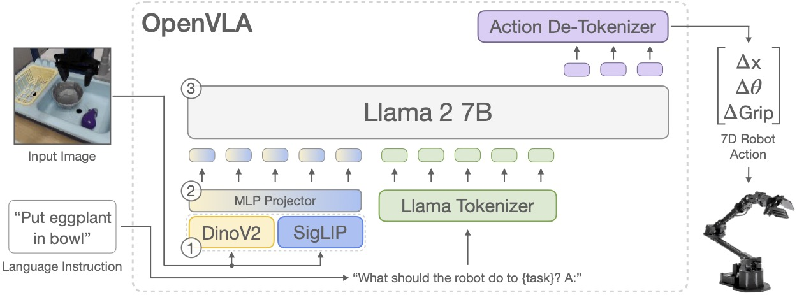

# Prismatic Backbone

目标：读懂 OpenVLA 主模型的 Prismatic 结构，以及视觉编码器、projector、LLM backbone 怎样接到动作预测上。

OpenVLA 主模型可以先按 Prismatic VLM 来读：图像进入 vision backbone，视觉特征经过 projector 映射到 LLM embedding space，语言指令进入同一个 LLM 上下文。OpenVLA 在这条 VLM 路径上加入动作预测训练目标，让 LLM 生成的后续 tokens 可以被解释成机器人动作。

这一页只讲模型结构和源码连接点。动作 token 的 256 bins、token id 映射和 `predict_action` 反归一化会放到后两页。

## OpenVLA 从哪个 Prismatic 模型出发

OpenVLA 主模型对应的 Prismatic 配置是 `prism-dinosiglip-224px+7b`。在训练配置里，最终主线使用 DINO-SigLIP 224px backbone，并接到 OpenX mixture：

```python
class Exp_DinoSigLIP_224px_OXE_Magic_Soup_Plus(Exp_SigLIP_224px_Bridge):
    vla_id: str = "prism-dinosiglip-224px+mx-oxe-magic-soup-plus"
    base_vlm: Union[str, Path] = "prism-dinosiglip-224px+7b"
    data_mix: str = "oxe_magic_soup_plus_minus"
```

这段配置说明两个事实。第一，OpenVLA 主模型从 Prismatic 的 DINO-SigLIP 7B VLM 出发；第二，`vla_id` 把 backbone 和数据 mixture 绑定成一个训练配置。后面看到 `prism-dinosiglip-224px+mx-...` 这类名字时，可以先拆成“base VLM + robot data mixture”来读。

## Vision Backbone：DINOv2 + SigLIP

OpenVLA 主模型使用 fused DINOv2 + SigLIP vision backbone。DINOv2 和 SigLIP 分别处理同一张图像，输出 patch features 后在通道维度拼接：

```python
DINOSigLIP_VISION_BACKBONES = {
    "dinosiglip-vit-so-224px": {
        "dino": "vit_large_patch14_reg4_dinov2.lvd142m",
        "siglip": "vit_so400m_patch14_siglip_224",
    },
}

dino_patches = self.dino_featurizer(pixel_values["dino"])
siglip_patches = self.siglip_featurizer(pixel_values["siglip"])

return torch.cat([dino_patches, siglip_patches], dim=2)
```

这里的 `pixel_values` 是一个 dict，包含 `dino` 和 `siglip` 两路图像张量。`dim=2` 表示拼接发生在 feature channel 上，patch 数量保持一致。这样得到的视觉表示仍然是一组 patch features，只是每个 patch 同时带有两路 encoder 的特征。

这也解释了后面排查图像输入时要分清 processor 和 vision backbone：输入图像会被处理成两路张量，模型结构里也会按两路特征读取。

## Projector：把视觉特征接到 LLM

Prismatic 的 projector 负责把 vision backbone 输出的 patch features 映射到 LLM 的 embedding space。连接顺序可以直接从代码看出来：先取视觉特征，再投影，再取文本 token embedding，最后把视觉 embedding 插到文本序列中。

```python
patch_features = self.vision_backbone(
    {k: pixel_values[k][multimodal_indices] for k in pixel_values}
)

projected_patch_embeddings = self.projector(patch_features)
input_embeddings = self.llm_backbone.embed_input_ids(input_ids)

multimodal_embeddings = torch.cat(
    [
        input_embeddings[multimodal_indices, :1, :],
        projected_patch_embeddings,
        input_embeddings[multimodal_indices, 1:, :],
    ],
    dim=1,
)
```

这段代码说明 projector 的位置在 vision backbone 和 LLM 之间。视觉特征不会直接送进 Llama 2；它们先被映射成和文本 token embedding 同维度的向量，再和文本 embedding 组成一个 multimodal sequence。

对 OpenVLA 来说，这一步决定了图像观测怎样进入后续 action token 生成。后面的 LLM 看到的是一串 embedding：开头 token、图像 patch embeddings、语言指令和输出提示。

## LLM Backbone：沿用生成接口

视觉 embedding 接入后，后续仍然走 LLM 的自回归生成接口。OpenVLA 没有为动作单独加一个连续动作 head；它把动作写成 Llama tokenizer 可以生成的 tokens，让 LLM 按 next-token prediction 的方式输出动作序列。

下面这张图可以按从左到右读：图像进入 DINOv2 + SigLIP，视觉特征经过 projector 接入 Llama 2，语言指令也进入同一个上下文；输出侧生成 action tokens，再交给后续页面介绍的 tokenizer 和 `predict_action` 处理。



这里要注意两个边界。视觉 encoder 和 projector 只负责把图像接入 LLM；动作尺度、`unnorm_key` 和数据集统计量不在这个阶段处理。它们会在 `predict_action` 的后处理阶段生效。

## OpenVLA 在 Prismatic 上增加了什么

OpenVLA 的训练路径把 `OpenVLA` 写成 `PrismaticVLM` 的子类。它保留 Prismatic 的视觉语言结构，同时加上动作 tokenizer 和动作统计量：

```python
class OpenVLA(PrismaticVLM):
    def __init__(
        self,
        *args,
        norm_stats: Dict[str, Dict[str, Dict[str, Dict[str, List[float]]]]],
        action_tokenizer: ActionTokenizer,
        **kwargs,
    ) -> None:
        super().__init__(*args, **kwargs)
        self.norm_stats = norm_stats
        self.action_tokenizer = action_tokenizer
```

这段继承关系是读源码时的分界线：PrismaticVLM 负责图像、文本和 LLM 生成主干；OpenVLA 负责把生成结果解释成动作，并保存反归一化需要的统计量。

`predict_action()` 的入口也能看到这条分工。图像预处理来自 `vision_backbone.image_transform`，文本 tokenizer 来自 `llm_backbone.tokenizer`：

```python
def predict_action(
    self, image: Image, instruction: str, unnorm_key: Optional[str] = None, **kwargs: str
) -> np.ndarray:
    image_transform, tokenizer = self.vision_backbone.image_transform, self.llm_backbone.tokenizer
```

这段入口说明 OpenVLA 推理仍然依赖 Prismatic 的两个 backbone：图像走 vision transform，语言指令走 LLM tokenizer。动作 token 的生成、decode 和反归一化在 `predict_action` 后半段继续完成，下一页会先拆 action tokenizer，第三页再拆完整推理流程。

## Checkpoint 变体怎么看

这一页只保留会影响 backbone 理解的结构差异。`openvla/openvla-7b` 对应当前主线的 Prismatic `prism-dinosiglip-224px`，视觉侧是 DINOv2 + SigLIP，语言侧是 Llama 2 7B。`openvla/openvla-7b-v01` 属于较早分支，视觉 backbone 和 prompt 处理都不同；同样叫 OpenVLA checkpoint，底层结构不一定相同。

更细的 checkpoint 用途、加载路径和训练入口，放在 setup 单元单独区分。这里先记住会影响结构理解的那部分差异：当前主线是 DINOv2 + SigLIP + Llama 2，旧版 v0.1 不是这一套组合。

## 本页小结

- OpenVLA 主模型从 Prismatic `prism-dinosiglip-224px+7b` 出发。
- DINOv2 和 SigLIP 分别提取 patch features，再在 channel 维度拼接。
- Projector 把视觉特征映射到 LLM embedding space，并插入文本 token embedding 序列。
- `OpenVLA` 继承 `PrismaticVLM`，增加 action tokenizer、动作统计量和 `predict_action()`。
- 同样叫 OpenVLA checkpoint，底层 backbone 仍可能不同。

## 导航

- 上一节：[模型结构与动作推理](../03-model-and-action-inference.md)
- 返回上级：[模型结构与动作推理](../03-model-and-action-inference.md)
- 下一节：[Action Tokenizer](02-action-tokenizer.md)
