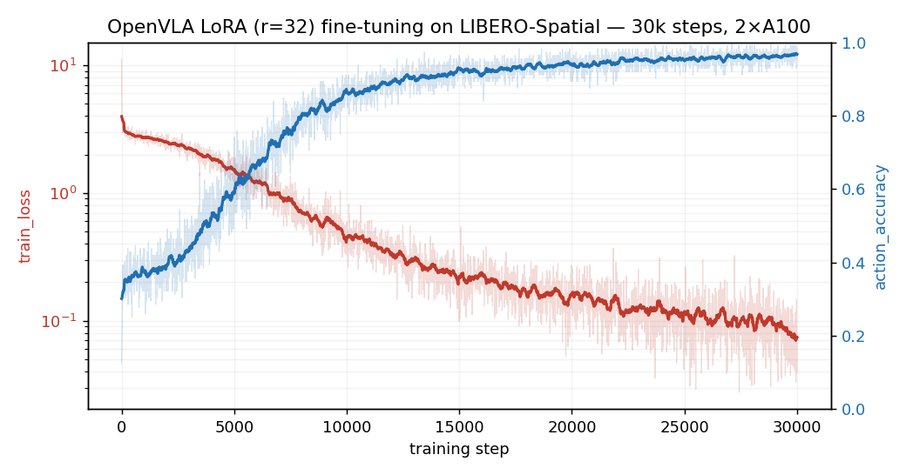

# LoRA 训练参考

目标：跑通 smoke run 和完整训练，分析训练日志、曲线和关键 step 指标。

LoRA 训练通常先跑 smoke run 验证训练和保存链路，再切到完整训练配置，最后结合训练曲线和关键 step 指标观察训练趋势。

本页命令和指标来自一套本地 LIBERO-Spatial LoRA 训练参考配置；换成不同机器、数据目录或 GPU 数量后，训练速度、显存占用和保存位置都有可能发生变化。

## Smoke Run

正式训练前，少量 step 的 smoke run 用来确认训练入口和保存链路。这里沿用正式训练的 LoRA 配方，只把训练步数压到 `150`，并把 checkpoint 保存间隔设为 `100`。

下面的命令保留本次 smoke run 的关键参数。目录用环境变量表示，运行前需要先把它们指向自己的 OpenVLA 仓库、base checkpoint、RLDS 数据和输出目录。

```bash
export OPENVLA_REPO="<openvla_repo>"
export VLA_PATH="<openvla_7b_or_local_checkpoint>"
export DATA_ROOT="<rlds_data_root>"
export RUN_ROOT="<run_output_root>"
export ADAPTER_TMP="<adapter_tmp_root>"

cd "${OPENVLA_REPO}"
WANDB_MODE=offline \
torchrun --standalone --nnodes 1 --nproc-per-node 2 vla-scripts/finetune.py \
  --vla_path "${VLA_PATH}" \
  --data_root_dir "${DATA_ROOT}" \
  --dataset_name libero_spatial_no_noops \
  --run_root_dir "${RUN_ROOT}" \
  --adapter_tmp_dir "${ADAPTER_TMP}" \
  --lora_rank 32 \
  --batch_size 16 \
  --grad_accumulation_steps 1 \
  --learning_rate 5e-4 \
  --image_aug True \
  --max_steps 150 \
  --save_steps 100 \
  --wandb_project openvla-libero-repro
```

这条 smoke run 主要看两个日志信号：

| 现象 | 说明 |
| --- | --- |
| step 100 保存成功 | LoRA adapter、processor、merged checkpoint 的保存链路可用。 |
| step 150 正常停止 | `max_steps` 生效，训练循环能按预期结束。 |

150 step 不足以讨论收敛和策略表现，但足够提前暴露数据读取、显存、反向传播、W&B / 离线日志和 checkpoint 保存问题。

## 从 Smoke Run 到完整训练

本次从 smoke run 切到完整训练时，LoRA 配方、数据集、batch 和训练进程数都保持不变，主要只改两项参数：

| 参数 | smoke run | 完整训练 |
| --- | --- | --- |
| `max_steps` | `150` | `30000` |
| `save_steps` | `100` | `2500` |

`max_steps` 拉长后，训练才会进入可观察的长程趋势；`save_steps` 放宽到 `2500`，可以减少频繁保存和 merge 对训练节奏的打断。smoke run 看的是链路是否跑通，完整训练看的才是曲线和指标是否进入稳定区间。

## 完整训练配置

下面这组配置可以作为 LIBERO-Spatial 上 OpenVLA LoRA 微调的参考。实际训练时，优先围绕 `batch_size`、`grad_accumulation_steps`、`--nproc-per-node` 和 checkpoint 路径做环境适配。

| 配置 | 取值 |
| --- | --- |
| dataset | `libero_spatial_no_noops` |
| LoRA rank | `32` |
| `batch_size` | `16` |
| `grad_accumulation_steps` | `1` |
| `learning_rate` | `5e-4` |
| `image_aug` | `True` |
| GPU 数量 | `2` |
| `max_steps` | `30000` |
| `save_steps` | `2500` |

下面保留这次正式训练命令的完整形状。它和 smoke run 的主要区别是 `max_steps=30000` 和 `save_steps=2500`；其余核心参数保持不变。

```bash
export OPENVLA_REPO="<openvla_repo>"
export VLA_PATH="<openvla_7b_or_local_checkpoint>"
export DATA_ROOT="<rlds_data_root>"
export RUN_ROOT="<run_output_root>"
export ADAPTER_TMP="<adapter_tmp_root>"

cd "${OPENVLA_REPO}"
WANDB_MODE=offline \
torchrun --standalone --nnodes 1 --nproc-per-node 2 vla-scripts/finetune.py \
  --vla_path "${VLA_PATH}" \
  --data_root_dir "${DATA_ROOT}" \
  --dataset_name libero_spatial_no_noops \
  --run_root_dir "${RUN_ROOT}" \
  --adapter_tmp_dir "${ADAPTER_TMP}" \
  --lora_rank 32 \
  --batch_size 16 \
  --grad_accumulation_steps 1 \
  --learning_rate 5e-4 \
  --image_aug True \
  --max_steps 30000 \
  --save_steps 2500 \
  --wandb_project openvla-libero-repro
```

训练启动后，先看模型加载、数据集构造和日志字段是否正常，再等第一个保存点和后续曲线趋势。

## 训练过程中会看到什么

完整训练时，重点看三类信号：

| 信号 | 说明 |
| --- | --- |
| 日志开始稳定写入 `train_loss`、`action_accuracy` 和 `l1_loss` | 训练循环已经进入正常记录状态。 |
| 到达保存点时触发 checkpoint 保存 | adapter 写入、processor 保存和 merge 链路在正式训练中仍然可用。 |
| 曲线整体向稳定区间收敛 | 训练集上的拟合趋势没有明显跑偏。 |

## 训练曲线

下面的曲线来自训练日志导出的 CSV。红色为 `train_loss`，蓝色为 `action_accuracy`；图里同时保留了原始记录和整理后的趋势线，重点看整体变化而不是单个 step 的抖动。



曲线的主要变化比较清楚：前 10000 step，`train_loss` 快速下降，`action_accuracy` 从约 0.12 升到 0.86 左右；15000 step 后，`action_accuracy` 进入 0.9 以上区间；25000 到 30000 step，曲线趋于平稳。

## 关键 Step 指标

| step | `train_loss` | `action_accuracy` | `l1_loss` |
| ---: | ---: | ---: | ---: |
| 0 | 11.179 | 0.125 | 0.383 |
| 2500 | 2.131 | 0.455 | 0.074 |
| 5000 | 1.547 | 0.589 | 0.050 |
| 10000 | 0.591 | 0.857 | 0.024 |
| 15000 | 0.237 | 0.911 | 0.006 |
| 20000 | 0.189 | 0.902 | 0.013 |
| 25000 | 0.099 | 0.946 | 0.004 |
| 30000 | 0.080 | 0.955 | 0.005 |

按训练日志每 10 step 的记录点统计，29000-30000 区间的平均值约为：

| 区间 | `train_loss` | `action_accuracy` | `l1_loss` |
| --- | ---: | ---: | ---: |
| 29000-30000 | 0.084 | 0.964 | 0.003 |

## 这一套参考结果能说明什么

这组结果说明训练入口、数据读取、反向传播、日志记录和 checkpoint 保存链路都已跑通。`train_loss` 下降、`action_accuracy` 提升、`l1_loss` 落到较低区间，说明模型在当前训练集上进入了较稳定的拟合阶段。

这里的指标都来自训练 batch，只适合判断训练侧状态。checkpoint 的任务表现还要到 LIBERO rollout 或 Bridge 评测中确认。

## 导航

- 上一节：[训练日志与 checkpoint](03-logs-and-checkpoints.md)
- 返回上级：[LoRA 微调](../05-finetuning.md)
- 下一节：[评测](../06-evaluation.md)
