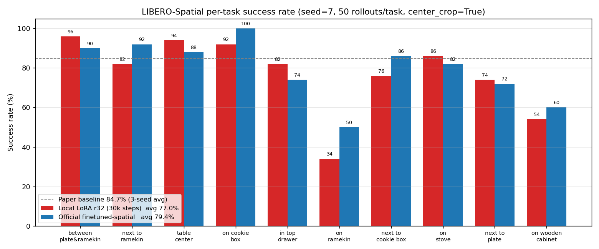

# 结果与失败记录

目标：把 OpenVLA 的官方报告值、本地单种子评测和失败观察分开记录，避免把不同证据混在一起。

本页整理 LIBERO-Spatial 评测结果。官方报告值、本地运行官方 checkpoint 的结果、本地 LoRA checkpoint 的结果需要分开看，它们的统计口径不同。

## 官方结果和本地结果

| 来源 | 统计口径 | 作用 |
| --- | --- | --- |
| 官方报告值 | 3 个随机种子，每个 seed 500 rollouts。 | 作为 OpenVLA 论文 / README 报告的参考水平。 |
| 本地官方 checkpoint | seed 7，500 rollouts。 | 检查当前本地环境下，官方 checkpoint 能跑到多少。 |
| 本地 LoRA checkpoint | seed 7，500 rollouts。 | 检查上一节 LoRA 微调产物在同环境下的表现。 |

本地两行结果目前覆盖 `libero_spatial` 一个 suite。它们适合比较同一环境下两个 checkpoint 的差距；官方多 seed 平均值适合做报告级参照。

## 总体结果

| Suite | Checkpoint | Seed | Rollouts | `center_crop` | Success rate |
| --- | --- | ---: | ---: | --- | ---: |
| `libero_spatial` | 官方报告值 | 3 seeds | 1500 | 见官方评测命令 | 84.7 +/- 0.9% |
| `libero_spatial` | 官方 checkpoint，本地运行 | 7 | 500 | True | 79.4% (397/500) |
| `libero_spatial` | 本地 LoRA checkpoint | 7 | 500 | True | 77.0% (385/500) |

官方报告值对应的 84.7% 来自论文 / README 的结果表；表中的 `center_crop` 口径则来自 OpenVLA README 发布的 LIBERO-Spatial 评测命令。

本地 LoRA checkpoint 比同环境下的官方 checkpoint 低 2.4 个百分点。是否对齐官方报告的 84.7%，还要按相同的 3 seed 口径继续评测。

## 每任务成功率

下面这张图把 `libero_spatial` 10 个任务的每任务成功率放在一起。红色是本地 LoRA checkpoint，蓝色是官方 checkpoint；每个任务 50 次 rollout。

表格中的原始计数如下：

| 任务位置 | 本地 LoRA | 官方 checkpoint |
| --- | ---: | ---: |
| between the plate and the ramekin | 48/50 (96%) | 45/50 (90%) |
| next to the ramekin | 41/50 (82%) | 46/50 (92%) |
| from table center | 47/50 (94%) | 44/50 (88%) |
| on the cookie box | 46/50 (92%) | 50/50 (100%) |
| in the top drawer of the wooden cabinet | 41/50 (82%) | 37/50 (74%) |
| on the ramekin | 17/50 (34%) | 25/50 (50%) |
| next to the cookie box | 38/50 (76%) | 43/50 (86%) |
| on the stove | 43/50 (86%) | 41/50 (82%) |
| next to the plate | 37/50 (74%) | 36/50 (72%) |
| on the wooden cabinet | 27/50 (54%) | 30/50 (60%) |

两个 checkpoint 的强弱分布比较接近：桌面开阔位置成功率较高，`on the ramekin` 和 `on the wooden cabinet` 明显更难。

## Rollout 视频

下面两个视频来自同一次本地 LoRA checkpoint 的 `libero_spatial` seed 7 评测。它们用于观察 rollout 过程：一个成功样本，一个失败样本。总体结果仍以 500 次 rollout 的日志统计为准。

成功样本来自 `between the plate and the ramekin` 任务。这是本地 LoRA 统计中成功率最高的一类任务。

<figure>
  <video src="../assets/libero-spatial-lora-success-between-plate-ramekin-episode-001.mp4" controls muted loop playsinline style="max-width:100%;height:auto;display:block;margin:0.75em 0"></video>
  <figcaption>视频 1：本地 LoRA checkpoint 在 between the plate and the ramekin 任务中的成功案例。</figcaption>
</figure>

失败样本来自 `on the ramekin` 任务，和下表中失败最多的任务一致。这个视频适合用来观察抓取阶段为什么容易受容器和邻近物体影响。

<figure>
  <video src="../assets/libero-spatial-lora-failure-ramekin-episode-271.mp4" controls muted loop playsinline style="max-width:100%;height:auto;display:block;margin:0.75em 0"></video>
  <figcaption>视频 2：本地 LoRA checkpoint 在 ramekin 任务中的失败案例。</figcaption>
</figure>

## 失败观察

本地 LoRA checkpoint 的 500 次 rollout 中有 115 次失败，失败最多的任务如下：

| 任务位置 | 本地成功率 | 官方成功率 | 本地失败次数 |
| --- | ---: | ---: | ---: |
| on the ramekin | 34% | 50% | 33 |
| on the wooden cabinet | 54% | 60% | 23 |
| next to the plate | 74% | 72% | 13 |
| next to the cookie box | 76% | 86% | 12 |

这些失败集中在抬高、堆叠或相邻物体干扰更明显的初始位置。`on the ramekin` 要从另一个容器上方抓起黑碗，抓取姿态更容易受干扰；`on the wooden cabinet` 的高度和接近方向也更敏感；`next to the plate` 和 `next to the cookie box` 则更容易受邻近物体影响。

这类归因来自任务布局和 rollout 视频观察。评测脚本记录成功与否、累计成功率和视频路径，不会自动判断失败发生在抓取、搬运还是放置阶段。需要更细的失败分类时，应逐条回看失败视频并单独记录。

## 本页小结

- 官方报告值、本地官方 checkpoint 和本地 LoRA checkpoint 属于三类证据，统计口径不同。
- 本地 LoRA checkpoint 在 `libero_spatial` seed 7 上达到 77.0%，同环境官方 checkpoint 为 79.4%。
- 单 seed 结果可以用于同环境对比，官方 3 seed 平均值适合作为报告级参照。
- 失败主要集中在抬高、堆叠和邻近干扰更明显的任务，具体原因需要结合视频观察。

## 导航

- 上一节：[Bridge WidowX 评测入口](02-bridge-widowx-eval.md)
- 返回上级：[评测](../06-evaluation.md)
- 下一节：[部署](../07-deployment.md)
