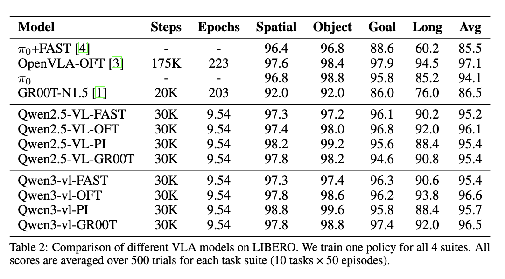

# 部署与评测

目标：用两个终端把 checkpoint 接到 LIBERO 环境，并从成功率和失败视频判断下一步怎么改。

## 两个终端的分工

LIBERO 评测用两个进程：StarVLA 推理服务（Terminal A）和 LIBERO 仿真环境（Terminal B）。两侧通过 websocket 通信，共享端口。

## Terminal A：启动推理服务

```bash
# StarVLA 环境
cd <STARVLA_ROOT>
conda activate starvla

python deployment/model_server/server_policy.py \
  --ckpt_path <RUN_DIR>/<run_id>/checkpoints/steps_30000_pytorch_model.pt \
  --port 10093 \
  --use_bf16
```

服务启动后日志会打印 `metadata`，应包含 `action_chunk_size` 和 `available_unnorm_keys`。如果 metadata 里缺少这些字段，先检查 `config.yaml` 和 `dataset_statistics.json` 是否在 checkpoint 同级运行目录里。

## Terminal B：启动评测

```bash
# LIBERO 环境
cd <STARVLA_ROOT>
conda activate libero

python examples/LIBERO/eval_files/eval_libero.py \
  --host 127.0.0.1 \
  --port 10093 \
  --task_suite_name libero_goal \
  --num_trials_per_task 50 \
  --video_out_path <RUN_DIR>/libero_eval_videos
```

快速验证时先用最小参数：

```bash
--num_trials_per_task 1 --max_tasks 1
```

## 环境适配细节

LIBERO 客户端有几个固定处理，直接来自官方评测代码：

图像翻转：

```python
img = np.ascontiguousarray(obs["agentview_image"][::-1, ::-1])
wrist_img = np.ascontiguousarray(obs["robot0_eye_in_hand_image"][::-1, ::-1])
```

动作拆分：

```python
world_vector_delta = raw_action[:3]
rotation_delta = raw_action[3:6]
open_gripper = raw_action[6:7]
```

gripper 还要二值化成 LIBERO 环境需要的格式。评测时动作异常，优先检查图像方向、动作维度和 gripper 语义。

## 官方结果



具体成功率会随 checkpoint 步数、训练配置、依赖版本和评测种子变化，复现时以自己的训练 checkpoint 和脚本为准。

## 读懂成功率

LIBERO 官方统计：

```text
10 tasks × 50 episodes = 500 trials per suite
```

比较结果时，要确认任务数、每任务 episode 数、随机种子和环境版本一致。

## 从失败视频定位问题

LIBERO 保存：

```text
rollout_<task>_episode<idx>_<success|failure>.mp4
```

按顺序判断：

1. 机器人是否朝正确物体移动。
2. 末端是否能到达目标附近。
3. gripper 是否在正确时机闭合/张开。
4. 动作幅度是否合理。
5. chunk 边界是否出现明显抖动。
6. 任务是否因环境初始化异常失败。

## 常见失败类型

| 失败类型 | 现象 | 优先检查 |
|---|---|---|
| 视觉输入错位 | 机器人动作看似随机 | 图像视角顺序、翻转、resize |
| 指令错位 | 操作了错误物体 | `lang` 字段、task description |
| 动作尺度错 | 动作过大/过小 | `dataset_statistics.json`、`unnorm_key` |
| gripper 反向 | 应抓时张开、应放时闭合 | gripper 后处理 |
| chunk 抖动 | 每隔几步动作跳变 | action ensemble、chunk size |
| horizon 不匹配 | 动作序列长度异常 | `action_horizon`、server metadata |
| 环境依赖问题 | 仿真崩溃或渲染错误 | benchmark 安装、GPU、numpy/MuJoCo 版本 |

## 调参优先级

先不要盲目调模型。推荐顺序：

1. 用少量 episode 确认 server/client 通信和动作 shape。
2. 保存模型输入图像，确认和训练数据一致。
3. 打印动作分布，确认反归一化后数值合理。
4. 检查 gripper 通道。
5. 再调学习率、冻结、训练步数、mixture 权重。
6. 最后比较不同 framework。

## 小结

- LIBERO 评测用两个终端：StarVLA 推理服务和 LIBERO 环境 client。
- server 启动时检查 metadata 中的 `action_chunk_size` 和 `available_unnorm_keys`。
- 失败视频比平均成功率更能指导排错。
- loss 下降不保证闭环成功，优先检查输入、动作尺度和 gripper。

## 动手练习

1. 在 server 和 LIBERO 环境都准备好后，用 `--max_tasks 1 --num_trials_per_task 1` 运行最小评测。成功输出应在 `--video_out_path` 下看到 rollout mp4。
2. 在 client 侧打印一次 server 返回的 `actions.min()` 和 `actions.max()`，和环境动作范围比较。
3. 运行 `rg -n "max_steps|libero_spatial|libero_object|libero_goal|libero_10" examples/LIBERO/eval_files/eval_libero.py`，找到不同 suite 的步数设置。

## 导航

- 上一节：[02 训练](02-training.md)
- 返回上级：[LIBERO 端到端实战](../07-libero-end-to-end.md)
- 下一节：[04 Qwen-OFT 实战](04-qwen-oft.md)
