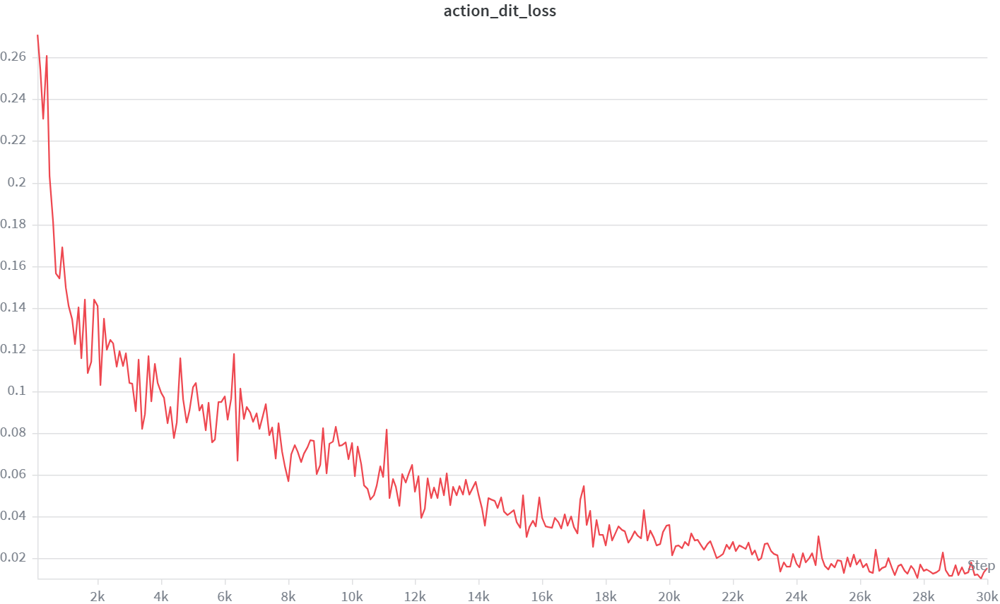
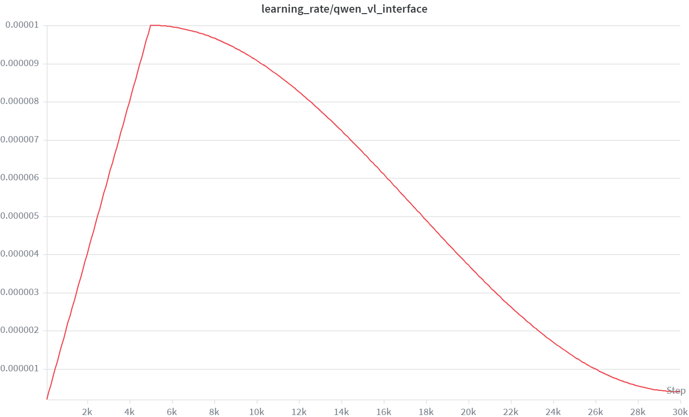
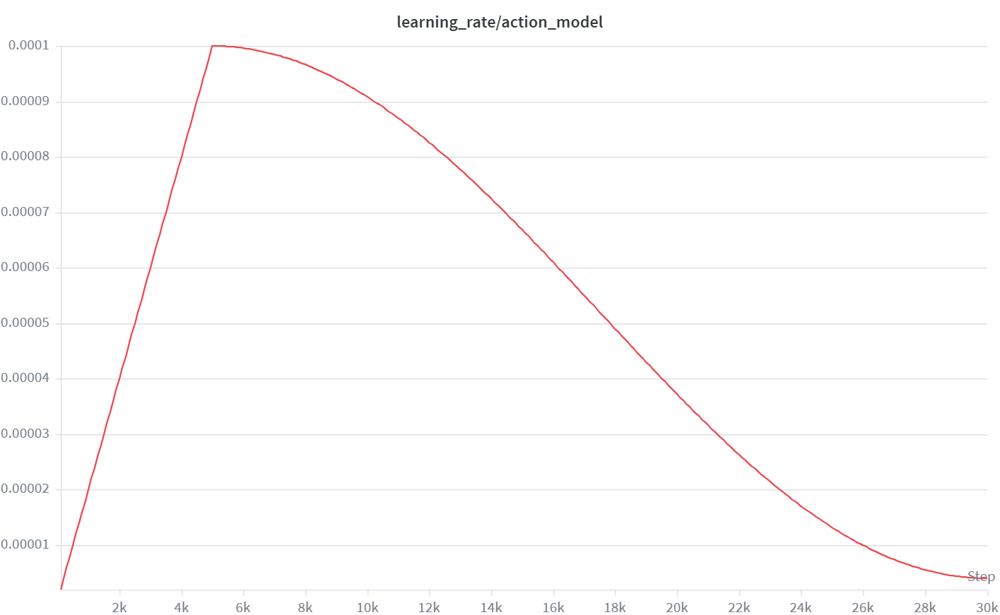

# Qwen-OFT LIBERO 实战

目标：用 `QwenOFT` 在 LIBERO 数据集上完成一次从训练、checkpoint 检查、policy server 部署到仿真评测的完整流程，并记录真实训练曲线与最小闭环评测结果。

本章把 `QwenOFT` 放在 LIBERO 实战第一步。它使用 Qwen-VL hidden state 加 MLP action head 直接回归连续动作，没有扩散采样，也不依赖动作 token 解码，调试难度最低。先把 OFT 跑通，基本就能确认数据、训练、checkpoint、server 和 LIBERO client 这整条链路没有断。

## 实验目标

本实验主要回答四个问题：

1. `QwenOFT` 能否在 `libero_all` 上稳定训练并保存 checkpoint？
2. `mse_score`、`action_dit_loss` 和学习率曲线是否体现出正常收敛？
3. 训练出的 checkpoint 能否启动 policy server，并被 LIBERO client 成功调用？
4. 最小评测中是否已经出现可复用的成功 rollout？

## 路径和模型准备

进入 StarVLA 仓库并设置环境：

```bash
cd ${STARVLA_DIR}
conda activate starVLA
export PYTHONPATH=${STARVLA_DIR}:${PYTHONPATH}
```

准备 Qwen-VL backbone。示例使用 Qwen2.5-VL-3B：

```bash
export BASE_VLM=${STARVLA_DIR}/playground/Pretrained_models/Qwen2.5-VL-3B-Instruct
```

如果使用 Qwen3-VL-4B，可以替换为：

```bash
export BASE_VLM=${STARVLA_DIR}/playground/Pretrained_models/Qwen3-VL-4B-Instruct
```

LIBERO 数据根目录需要包含四个 LeRobot 子数据集：

```text
libero_spatial_no_noops_1.0.0_lerobot
libero_object_no_noops_1.0.0_lerobot
libero_goal_no_noops_1.0.0_lerobot
libero_10_no_noops_1.0.0_lerobot
```

## WandB 记录方式

本实验使用 WandB 查看训练曲线。第一次使用前需要登录：

```bash
wandb login
```

训练命令中的下面两个参数决定日志写到哪里：

```bash
--wandb_project qwen_oft_train
--wandb_entity ${WANDB_ENTITY}
```

`${WANDB_ENTITY}` 可以是个人用户名，也可以是团队名。如果训练机器不能联网，可以切到离线模式：

```bash
export WANDB_MODE=offline
```

训练结束后再同步：

```bash
wandb sync wandb/offline-run-*
```

如果完全不想使用 WandB，也可以禁用：

```bash
export WANDB_MODE=disabled
```

即使禁用 WandB，checkpoint、`summary.jsonl`、配置文件和终端日志仍然会保留。本页中的曲线图片来自真实训练记录的导出结果。

## 数据接口检查

训练前先确认 dataloader 能正确读取 `libero_all`：

```bash
python starVLA/dataloader/lerobot_datasets.py \
  --config_yaml examples/LIBERO/train_files/starvla_cotrain_libero.yaml \
  --data_root_dir ${LIBERO_DATA_ROOT} \
  --data_mix libero_all
```

如果这一步失败，后续训练也不会成功，优先排查：

1. `LIBERO_DATA_ROOT` 是否正确；
2. `examples/LIBERO/train_files/modality.json` 是否和数据目录匹配；
3. `data_registry/data_config.py` 中是否已经注册 `libero_all`。

## framework 接口检查

正式分布式训练前，建议先单文件检查 `QwenOFT` 的构建和前向接口：

```bash
python starVLA/model/framework/VLM4A/QwenOFT.py \
  --config_yaml examples/LIBERO/train_files/starvla_cotrain_libero.yaml
```

这一步会加载 `QwenOFT`，构造随机输入并运行 `forward()` 与 `predict_action()`。如果这里出现 hidden state shape 错误、动作维度错误或 CUDA OOM，分布式训练通常也会失败。

## 训练配置

本次实战使用 `QwenOFT`、`libero_all`、4 张 GPU、总训练步数 30000。关键配置如下：

| 配置 | 含义 |
|---|---|
| `framework.name=QwenOFT` | 选择 OFT framework |
| `framework.qwenvl.base_vlm=${BASE_VLM}` | 指向本地 Qwen-VL backbone |
| `datasets.vla_data.data_root_dir=${LIBERO_DATA_ROOT}` | 指向 LIBERO LeRobot 数据根目录 |
| `datasets.vla_data.data_mix=libero_all` | 同时使用四个 LIBERO suite |
| `datasets.vla_data.per_device_batch_size=16` | 每卡 batch size |
| `trainer.freeze_modules=''` | 不额外冻结模块 |
| `trainer.max_train_steps=30000` | 总优化步数 |
| `trainer.save_interval=10000` | 每 10000 step 保存一次 checkpoint |
| `trainer.eval_interval=100` | 每 100 step 记录一次动作误差指标 |

`QwenOFT` 的动作头是 MLP，因此这是最直接的“视觉语言 backbone + 连续动作回归” baseline。

## 启动训练

本次实战使用 4 张 GPU，指定物理 GPU `4,5,6,7`：

```bash
CUDA_VISIBLE_DEVICES=4,5,6,7 accelerate launch \
  --config_file starVLA/config/deepseeds/deepspeed_zero2.yaml \
  --num_processes 4 \
  starVLA/training/train_starvla.py \
  --config_yaml examples/LIBERO/train_files/starvla_cotrain_libero.yaml \
  --framework.name QwenOFT \
  --framework.qwenvl.base_vlm ${BASE_VLM} \
  --datasets.vla_data.data_root_dir ${LIBERO_DATA_ROOT} \
  --datasets.vla_data.data_mix libero_all \
  --datasets.vla_data.per_device_batch_size 16 \
  --trainer.vla_data.video_backend torchvision_av \
  --trainer.freeze_modules '' \
  --trainer.max_train_steps 30000 \
  --trainer.save_interval 10000 \
  --trainer.logging_frequency 100 \
  --trainer.eval_interval 100 \
  --run_root_dir ${RUN_ROOT_DIR} \
  --run_id libero_qwenoft \
  --wandb_project qwen_oft_train \
  --wandb_entity ${WANDB_ENTITY}
```

这里有三个容易混淆的点：

| 参数 | 含义 |
|---|---|
| `CUDA_VISIBLE_DEVICES=4,5,6,7` | 当前训练进程只看到这 4 张物理 GPU |
| `--num_processes 4` | `accelerate` 启动 4 个训练进程 |
| `per_device_batch_size=16` | 每个进程处理 16 条样本，总 batch size 为 64 |

如果使用离线 WandB，在启动命令前加：

```bash
export WANDB_MODE=offline
```

如果禁用 WandB，在启动命令前加：

```bash
export WANDB_MODE=disabled
```

## 训练日志记录

训练开始后，通常会看到类似日志：

```text
INFO     | >> ***** Training Configuration *****
INFO     | >>   Total optimization steps = 30000
INFO     | >>   Per device batch size = 16
INFO     | >>   Gradient accumulation steps = 1
INFO     | >>   Total batch size = 64
```

这段日志说明几件事已经成立：

1. 配置文件读取成功；
2. 分布式进程启动成功；
3. dataloader 构建成功；
4. 模型已经进入正式训练循环。

对文档来说，训练日志不需要贴完整，只需要保留能证明链路已经跑起来的关键片段即可。

## loss 和学习率曲线

笔者复现实验时导出了三张曲线图：

1. `action_dit_loss`
2. `learning_rate/qwen_vl_interface`
3. `learning_rate/action_model`

### action_dit_loss



`action_dit_loss` 是训练器统一写入 WandB 的字段名；在 `QwenOFT` 中，它实际记录 MLP 动作头的 L1 回归损失，不代表 DiT 或 flow matching loss。

从曲线看，动作损失和 `mse_score` 一样都呈现出稳定下降趋势，说明动作头确实在学习连续动作映射，下降趋势不只出现在训练早期。

### learning_rate/qwen_vl_interface



这条曲线表示 Qwen-VL backbone 参数组的学习率。它在 warmup 后到达峰值，然后按照 cosine schedule 缓慢衰减。backbone 学习率明显低于动作头，是为了尽量保留预训练视觉语言能力，同时允许其适配 LIBERO 任务。

### learning_rate/action_model



这条曲线表示 MLP action head 参数组的学习率。峰值明显高于 backbone，符合“动作头学习更快、backbone 微调更稳”的常见配置逻辑。

### 训练曲线小结

本次 Qwen-OFT 在 `libero_all` 上训练到 30000 step。`action_dit_loss` 呈现清晰下降趋势，两条学习率曲线也符合 warmup 加 cosine 衰减的预期，因此这次 run 已经具备进入部署和闭环评测的条件。

## checkpoint 检查

训练的 checkpoint 保存在：

```text
${RUN_ROOT_DIR}/libero_qwenoft
```

部署前至少应确认下面这些文件存在：

```text
config.yaml
config.full.yaml
dataset_statistics.json
summary.jsonl
checkpoints/steps_10000_pytorch_model.pt
checkpoints/steps_20000_pytorch_model.pt
checkpoints/steps_30000_pytorch_model.pt
final_model/pytorch_model.pt
```

部署时优先使用：

```bash
export CKPT=${RUN_ROOT_DIR}/libero_qwenoft/checkpoints/steps_30000_pytorch_model.pt
```

不要只拷贝 `.pt` 权重文件。server 还需要 `config.yaml` 和 `dataset_statistics.json` 来恢复 framework 和动作反归一化逻辑。

## 启动 policy server

部署和评测分两个终端。第一个终端启动 StarVLA policy server：

```bash
cd ${STARVLA_DIR}
conda activate starVLA
export PYTHONPATH=${STARVLA_DIR}:${PYTHONPATH}
export CKPT=${RUN_ROOT_DIR}/libero_qwenoft/checkpoints/steps_30000_pytorch_model.pt
export PORT=10093
```

启动命令：

```bash
CUDA_VISIBLE_DEVICES=${SERVER_GPU_ID} python deployment/model_server/server_policy.py \
  --ckpt_path ${CKPT} \
  --port ${PORT} \
  --use_bf16
```

也可以使用官方封装脚本：

```bash
STARVLA_DIR=${STARVLA_DIR} \
CKPT=${RUN_ROOT_DIR}/libero_qwenoft/checkpoints/steps_30000_pytorch_model.pt \
GPU_ID=${SERVER_GPU_ID} \
PORT=10093 \
USE_BF16=1 \
bash examples/LIBERO/eval_files/run_policy_server.sh
```

server 成功启动后，不要关闭这个终端。它会一直监听 websocket 请求，等待 LIBERO client 连接。

## LIBERO 评测

第二个终端进入 StarVLA 环境，并设置 LIBERO 路径：

```bash
cd ${STARVLA_DIR}
conda activate starVLA
export LIBERO_HOME=/path/to/LIBERO
```

先做最小评测，确认 server/client 链路跑通：

```bash
LIBERO_HOME=${LIBERO_HOME} \
LIBERO_PYTHON=python \
CKPT=${RUN_ROOT_DIR}/libero_qwenoft/checkpoints/steps_30000_pytorch_model.pt \
HOST=127.0.0.1 \
PORT=10093 \
TASK_SUITE_NAME=libero_goal \
NUM_TRIALS_PER_TASK=1 \
bash examples/LIBERO/eval_files/eval_libero.sh
```

如果 LIBERO 安装在单独的环境中，把 `LIBERO_PYTHON=python` 换成该环境的 Python 路径。

最小评测通过后，再运行正式评测：

```bash
LIBERO_HOME=${LIBERO_HOME} \
LIBERO_PYTHON=python \
CKPT=${RUN_ROOT_DIR}/libero_qwenoft/checkpoints/steps_30000_pytorch_model.pt \
HOST=127.0.0.1 \
PORT=10093 \
TASK_SUITE_NAME=libero_goal \
NUM_TRIALS_PER_TASK=50 \
bash examples/LIBERO/eval_files/eval_libero.sh
```

评测输出会自动写到：

```text
${RUN_ROOT_DIR}/libero_qwenoft/results/libero_goal/
```

## 评测结果分析方式

本页记录的是最小评测结果：`libero_goal` 每个任务 1 个 episode，共 10 个 rollout。结果中 9 个成功、1 个失败，说明 `steps_30000_pytorch_model.pt` 已经能通过 policy server 和 LIBERO client 完成基本闭环控制。

下面是一个成功 rollout 示例，任务是把 bowl 放到 plate 上：


这个 GIF 展示完整闭环评测，和训练集可视化不同。只要这个 GIF 能正常生成，就说明 checkpoint 加载、图像预处理、动作预测、server/client 通信和仿真执行都已经跑通。

最小评测里，`open_the_top_drawer_and_put_the_bowl_inside` 失败，其余任务成功。对 OFT 来说，这类失败通常集中在更依赖多阶段抓取、容器对齐或精细放置的任务上。

分析失败视频时，优先看三件事：

1. 是否成功接近目标物体；
2. 抓取或开合动作是否时机错误；
3. 后半段动作是否开始漂移。

## 常见问题

| 现象 | 可能原因 | 处理 |
|---|---|---|
| dataloader 启动失败 | 数据根目录或 `data_mix` 配置错误 | 先跑 `lerobot_datasets.py` 检查 |
| `action_dit_loss` 名字看起来不像 OFT | 训练器统一日志字段复用 | 按 L1 动作损失理解 |
| server 启动失败 | checkpoint 目录缺配置或统计文件 | 保留完整 run 目录 |
| 最小评测通过但正式评测掉分 | 长 horizon 任务更难 | 回看失败视频，不只看平均成功率 |
| loss 降低但闭环不稳定 | 离线误差和闭环行为不完全等价 | 同时看 rollout 视频和 success rate |

## 小结

- 本章建议先用 `QwenOFT` 跑通 LIBERO 实战 baseline。
- 本次训练在 `libero_all` 上稳定收敛到 30000 step，并成功保存多个 checkpoint。
- 最小评测中，`libero_goal` 的 10 个 rollout 有 9 个成功，说明该 checkpoint 已具备基本闭环执行能力。
- 后续正式 benchmark 需要把 `NUM_TRIALS_PER_TASK` 提高到 50，并扩展到 `libero_spatial`、`libero_object` 和 `libero_10`。

## 导航

- 上一节：[03 部署与评测](03-deployment-eval.md)
- 返回上级：[LIBERO 端到端实战](../07-libero-end-to-end.md)
- 下一节：[05 Qwen-PI 实战](05-qwen-pi.md)
