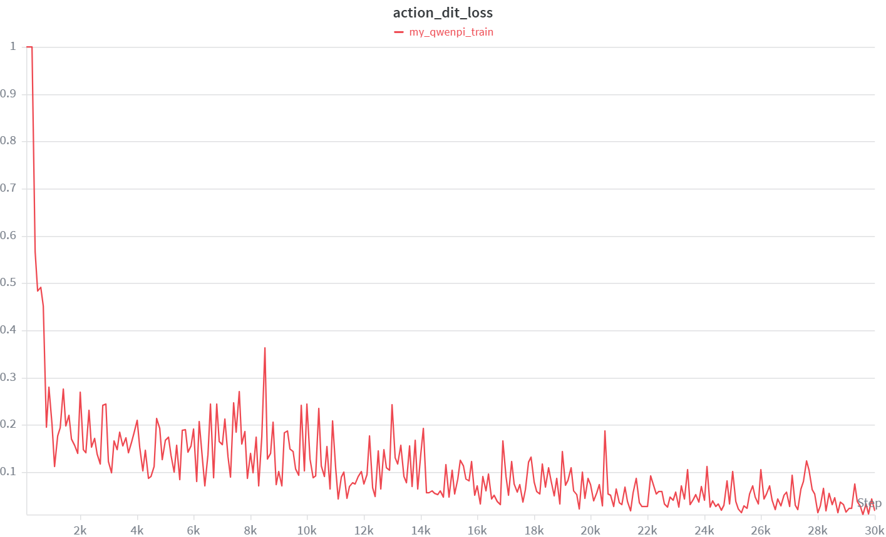
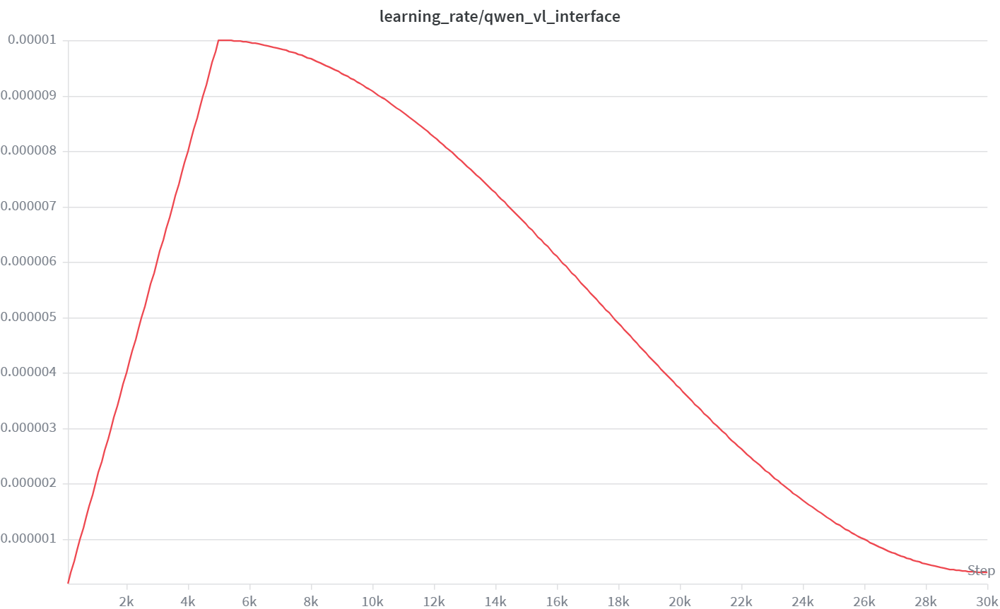
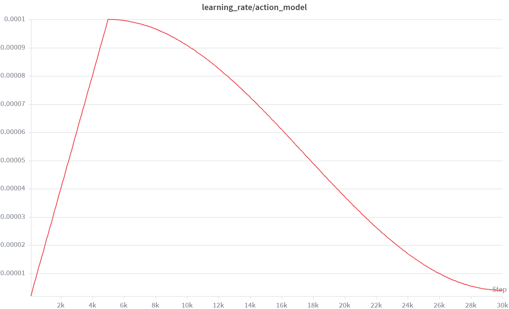
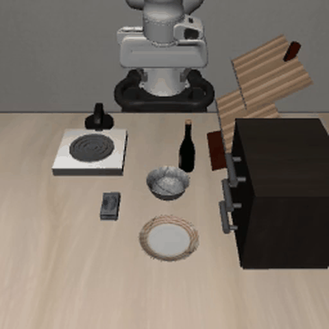

# Qwen-PI LIBERO 实战

目标：用 `QwenPI` 在 LIBERO 数据集上完成一次从训练、checkpoint 检查、policy server 部署到仿真评测的完整流程，并结合真实训练曲线理解 layer-wise flow matching action head 的训练现象。

`QwenPI` 是 StarVLA 中比 `QwenOFT` 更重的一条连续动作建模路线。它读取 Qwen-VL 的多层 hidden states，再用 `LayerwiseFlowmatchingActionHead` 预测动作生成过程中的速度场。这个设计能让 action head 使用更丰富的视觉语言层级信息，但也会带来更高的显存占用和更慢的训练速度。

## 实验目标

本实验主要回答四个问题：

1. `QwenPI` 能否在 `libero_all` 上稳定训练到 30000 step？
2. `mse_score`、`action_dit_loss` 和学习率曲线是否能进入稳定下降区间？
3. 训练出的 checkpoint 能否顺利启动 policy server 并完成最小闭环评测？
4. 和 OFT 相比，更复杂的 action head 是否带来了更高的闭环代价？

## 路径和模型准备

进入 StarVLA 仓库并设置环境：

```bash
cd ${STARVLA_DIR}
conda activate starVLA
export PYTHONPATH=${STARVLA_DIR}:${PYTHONPATH}
```

准备 Qwen-VL backbone。示例使用 Qwen2.5-VL-3B：

```bash
export BASE_VLM=${STARVLA_DIR}/playground/Pretrained_models/Qwen2.5-VL-3B-Instruct
```

如果使用 Qwen3-VL-4B，可以替换为：

```bash
export BASE_VLM=${STARVLA_DIR}/playground/Pretrained_models/Qwen3-VL-4B-Instruct
```

LIBERO 数据根目录需要包含四个 LeRobot 子数据集：

```text
libero_spatial_no_noops_1.0.0_lerobot
libero_object_no_noops_1.0.0_lerobot
libero_goal_no_noops_1.0.0_lerobot
libero_10_no_noops_1.0.0_lerobot
```

## WandB 记录方式

本实验使用 WandB 查看训练曲线。第一次使用前需要登录：

```bash
wandb login
```

训练命令中的下面两个参数决定日志写入位置：

```bash
--wandb_project qwen_pi_train
--wandb_entity ${WANDB_ENTITY}
```

如果训练机器不能联网，可以切到离线模式：

```bash
export WANDB_MODE=offline
```

训练结束后再同步：

```bash
wandb sync wandb/offline-run-*
```

如果完全不想使用 WandB，也可以禁用：

```bash
export WANDB_MODE=disabled
```

## 数据接口检查

训练前先确认 dataloader 能读取 `libero_all`：

```bash
python starVLA/dataloader/lerobot_datasets.py \
  --config_yaml examples/LIBERO/train_files/starvla_cotrain_libero.yaml \
  --data_root_dir ${LIBERO_DATA_ROOT} \
  --data_mix libero_all
```

这一步和 OFT 使用同一份数据接口，主要用于确认路径没有变化、统计信息能正常生成。

## framework 接口检查

正式训练前，建议先检查 `QwenPI` 的构建和前向接口：

```bash
python starVLA/model/framework/VLM4A/QwenPI.py \
  --config_yaml examples/LIBERO/train_files/starvla_cotrain_libero.yaml
```

这一步会加载 `QwenPI`，构造随机图像和动作，运行 `forward()` 与 `predict_action()`。如果这里出现 hidden state 层数不匹配、action shape 错误或 CUDA OOM，分布式训练通常也会失败。

## 训练配置

本次实战使用 `QwenPI`、`libero_all`、4 张 GPU、总训练步数 30000。关键配置如下：

| 配置 | 含义 |
|---|---|
| `framework.name=QwenPI` | 选择 PI framework |
| `framework.qwenvl.base_vlm=${BASE_VLM}` | 指向本地 Qwen-VL backbone |
| `datasets.vla_data.data_root_dir=${LIBERO_DATA_ROOT}` | 指向 LIBERO LeRobot 数据根目录 |
| `datasets.vla_data.data_mix=libero_all` | 同时使用四个 LIBERO suite |
| `datasets.vla_data.per_device_batch_size=8` | 每卡 batch size，PI 比 OFT 更吃显存 |
| `trainer.freeze_modules=''` | 不额外冻结模块 |
| `trainer.max_train_steps=30000` | 总优化步数 |
| `trainer.save_interval=10000` | 每 10000 step 保存一次 checkpoint |
| `trainer.eval_interval=100` | 每 100 step 记录一次动作评估指标 |

`QwenPI` 默认 action head 是 `LayerwiseFM`，这也是它和 `QwenOFT` 的核心差别。

## 启动训练

本次实战使用 4 张 GPU，指定物理 GPU `4,5,6,7`：

```bash
CUDA_VISIBLE_DEVICES=4,5,6,7 accelerate launch \
  --config_file starVLA/config/deepseeds/deepspeed_zero2.yaml \
  --num_processes 4 \
  starVLA/training/train_starvla.py \
  --config_yaml examples/LIBERO/train_files/starvla_cotrain_libero.yaml \
  --framework.name QwenPI \
  --framework.qwenvl.base_vlm ${BASE_VLM} \
  --datasets.vla_data.data_root_dir ${LIBERO_DATA_ROOT} \
  --datasets.vla_data.data_mix libero_all \
  --datasets.vla_data.per_device_batch_size 8 \
  --trainer.vla_data.video_backend torchvision_av \
  --trainer.freeze_modules '' \
  --trainer.max_train_steps 30000 \
  --trainer.save_interval 10000 \
  --trainer.logging_frequency 100 \
  --trainer.eval_interval 100 \
  --run_root_dir ${RUN_ROOT_DIR} \
  --run_id libero_qwenpi \
  --wandb_project qwen_pi_train \
  --wandb_entity ${WANDB_ENTITY}
```

这里有三个关键点：

| 参数 | 含义 |
|---|---|
| `CUDA_VISIBLE_DEVICES=4,5,6,7` | 当前训练进程只看到这 4 张物理 GPU |
| `--num_processes 4` | `accelerate` 启动 4 个训练进程 |
| `per_device_batch_size=8` | 每个进程处理 8 条样本，总 batch size 为 32 |

PI 的 action head 会读取多层 hidden states，并在动作头中执行 layer-wise cross-attention，因此速度慢于 OFT 是正常现象。

## 训练日志记录

训练开始后，通常会看到类似日志：

```text
INFO     | >> ***** Training Configuration *****
INFO     | >>   Total optimization steps = 30000
INFO     | >>   Per device batch size = 8
INFO     | >>   Gradient accumulation steps = 1
INFO     | >>   Total batch size = 32
```

这说明配置已经被正确读取，训练器、分布式进程和 dataloader 都已经进入正式训练状态。

## loss 和学习率曲线

本次实验导出了三张曲线图：

1. `action_dit_loss`
2. `learning_rate/qwen_vl_interface`
3. `learning_rate/action_model`

### action_dit_loss



`action_dit_loss` 是训练器统一记录的字段名，但在 `QwenPI` 中它实际对应的是 layer-wise flow matching 的动作损失。曲线在最初有一个较高尖峰，随后快速下降到低位，并在中后期保持稳定。这说明 action head 已经学会从多层 hidden states 中提取足够的动作信息。

### learning_rate/qwen_vl_interface



这条曲线表示 backbone 参数组的学习率。它先 warmup，再按 cosine 衰减。对 PI 来说，backbone 学习率较小是合理的，因为模型更依赖多层 hidden states 的稳定语义结构。

### learning_rate/action_model



这条曲线表示 `LayerwiseFlowmatchingActionHead` 参数组的学习率。峰值明显高于 backbone，符合“动作头需要更快适配，backbone 尽量稳”的训练逻辑。

### 训练曲线小结

本次 Qwen-PI 在 `libero_all` 上训练到 30000 step。`action_dit_loss` 在早期尖峰后进入稳定下降区间，两条学习率曲线也符合 warmup 加 cosine 衰减的预期，因此这次 run 已具备进入部署和闭环评测的条件。

## checkpoint 检查

本次训练的 checkpoint 保存在：

```text
${RUN_ROOT_DIR}/libero_qwenpi
```

部署前至少应确认下面这些文件存在：

```text
config.yaml
config.full.yaml
dataset_statistics.json
summary.jsonl
checkpoints/steps_10000_pytorch_model.pt
checkpoints/steps_20000_pytorch_model.pt
checkpoints/steps_30000_pytorch_model.pt
final_model/pytorch_model.pt
```

部署时优先使用：

```bash
export CKPT=${RUN_ROOT_DIR}/libero_qwenpi/checkpoints/steps_30000_pytorch_model.pt
```

## 启动 policy server

部署和评测分两个终端。第一个终端启动 StarVLA policy server：

```bash
cd ${STARVLA_DIR}
conda activate starVLA
export PYTHONPATH=${STARVLA_DIR}:${PYTHONPATH}
export CKPT=${RUN_ROOT_DIR}/libero_qwenpi/checkpoints/steps_30000_pytorch_model.pt
export PORT=10093
```

启动命令：

```bash
CUDA_VISIBLE_DEVICES=${SERVER_GPU_ID} python deployment/model_server/server_policy.py \
  --ckpt_path ${CKPT} \
  --port ${PORT} \
  --use_bf16
```

也可以使用官方封装脚本：

```bash
STARVLA_DIR=${STARVLA_DIR} \
CKPT=${RUN_ROOT_DIR}/libero_qwenpi/checkpoints/steps_30000_pytorch_model.pt \
GPU_ID=${SERVER_GPU_ID} \
PORT=10093 \
USE_BF16=1 \
bash examples/LIBERO/eval_files/run_policy_server.sh
```

## LIBERO 评测

第二个终端进入 StarVLA 环境，并设置 LIBERO 路径：

```bash
cd ${STARVLA_DIR}
conda activate starVLA
export LIBERO_HOME=/path/to/LIBERO
```

先做最小评测：

```bash
LIBERO_HOME=${LIBERO_HOME} \
LIBERO_PYTHON=python \
CKPT=${RUN_ROOT_DIR}/libero_qwenpi/checkpoints/steps_30000_pytorch_model.pt \
HOST=127.0.0.1 \
PORT=10093 \
TASK_SUITE_NAME=libero_goal \
NUM_TRIALS_PER_TASK=1 \
bash examples/LIBERO/eval_files/eval_libero.sh
```

链路正常后，再做正式评测：

```bash
LIBERO_HOME=${LIBERO_HOME} \
LIBERO_PYTHON=python \
CKPT=${RUN_ROOT_DIR}/libero_qwenpi/checkpoints/steps_30000_pytorch_model.pt \
HOST=127.0.0.1 \
PORT=10093 \
TASK_SUITE_NAME=libero_goal \
NUM_TRIALS_PER_TASK=50 \
bash examples/LIBERO/eval_files/eval_libero.sh
```

评测输出会自动写到：

```text
${RUN_ROOT_DIR}/libero_qwenpi/results/libero_goal/
```

## 评测结果分析方式

本页记录的是最小评测结果：`libero_goal` 每个任务 1 个 episode，共 10 个 rollout。结果中 8 个成功、2 个失败，成功率为 80%。这说明 `steps_30000_pytorch_model.pt` 不只是离线 loss 收敛，也已经能通过 policy server 和 LIBERO client 完成闭环控制。

下面是一个成功 rollout 示例，任务是把 bowl 放到 plate 上：



两个失败任务分别是：

1. `open_the_top_drawer_and_put_the_bowl_inside`
2. `put_the_cream_cheese_in_the_bowl`

这类任务通常比简单放置或推盘子更依赖精细抓取、容器对齐和多阶段动作衔接。分析失败视频时，重点看抓取是否成功、姿态是否漂移，以及 gripper 开合时机是否正确。

## 常见问题

| 现象 | 可能原因 | 处理 |
|---|---|---|
| 训练启动后立刻 CUDA OOM | 多层 hidden states 和 action head 显存开销太大 | 先把 `per_device_batch_size` 降到 4 |
| `hidden_states` 层数不匹配 | backbone 层数与 action head 预期不一致 | 先做 framework 单文件检查 |
| `action_dit_loss` 初始值很高 | flow matching 早期速度场预测误差大 | 观察后续是否快速下降 |
| server 响应慢 | 推理路径比 OFT 更重 | 先做最小评测，不要直接跑正式 benchmark |
| 最小评测通过但正式评测掉分 | 闭环任务更长更难 | 回看失败视频，不只看平均成功率 |

## 小结

- `QwenPI` 的核心是多层 VLM hidden states 加 `LayerwiseFlowmatchingActionHead`，不是简单 MLP 回归。
- 本次训练使用 4 张 GPU、每卡 batch size 8、总 batch size 32，训练到 30000 step。
- 最小评测中，`libero_goal` 的 10 个 rollout 有 8 个成功，说明该 checkpoint 已具备基本闭环执行能力。
- 相比 OFT，PI 的表达能力更强，但训练和推理成本也更高。

## 导航

- 上一节：[04 Qwen-OFT 实战](04-qwen-oft.md)
- 返回上级：[LIBERO 端到端实战](../07-libero-end-to-end.md)
- 下一节：[06 WM4A 实战](06-wm4a.md)
