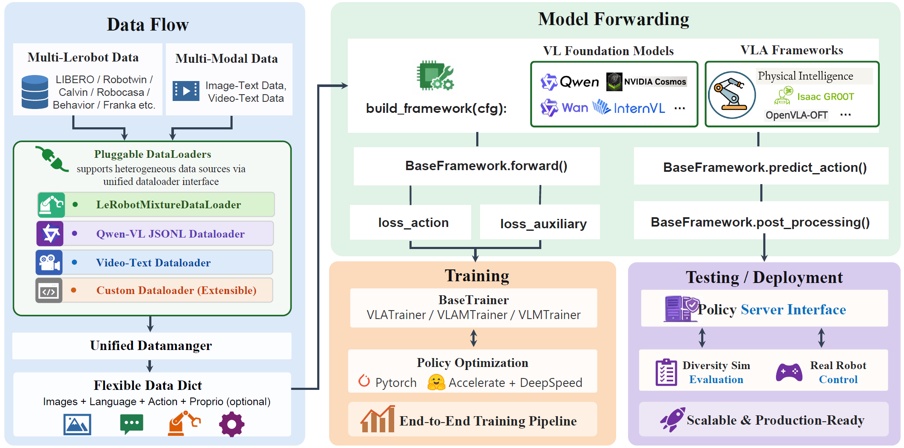
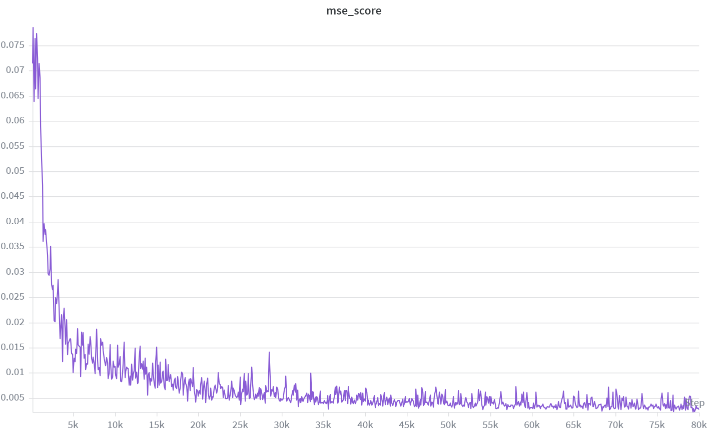
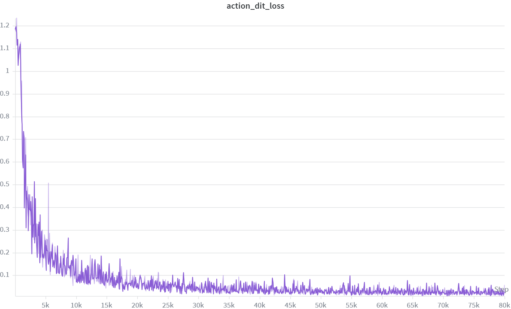
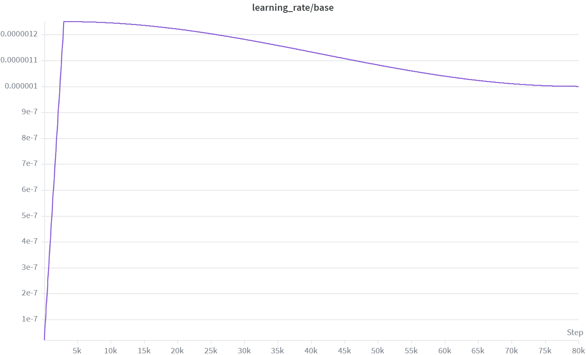
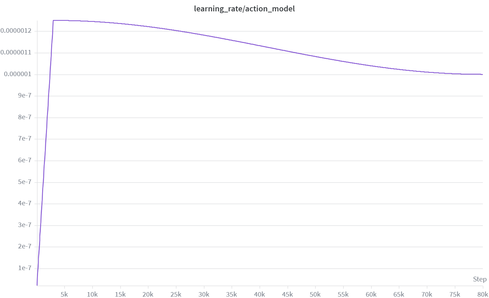
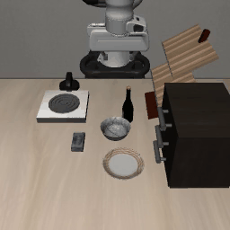

# WM4A LIBERO 实战

目标：用 `CosmoPredict2GR00T` 在 LIBERO 数据集上完成一次从训练、checkpoint 检查到 policy server 部署与仿真评测的完整流程，并结合真实训练曲线和闭环结果理解 world model backbone 加 flow matching action head 的效果。

WM4A 指把 StarVLA 的 backbone 从 VLM 换成 pretrained video-generation world model 的路线。本次实战使用的是 `Cosmos-Predict2-2B-Video2World` 作为 backbone，`CosmoPredict2GR00T` 作为 framework，动作头则是单层 flow matching 路线。

和前两节的主要区别在 backbone 来源：Qwen-OFT、Qwen-PI 使用 Qwen-VL hidden states；WM4A 则从 Cosmos world model 中提取时空表征，再映射为连续动作。



## 实验目标

本实验主要回答四个问题：

1. `Cosmos-Predict2-2B-Video2World` 权重能否被 StarVLA 正确加载并用于动作训练？
2. `CosmoPredict2GR00T` 能否在 `libero_goal` 上稳定训练到 80000 step，并保存完整 checkpoint？
3. `mse_score`、`action_dit_loss` 和学习率曲线是否体现出持续收敛？
4. `steps_80000_pytorch_model.pt` 是否已经具备较好的最小闭环评测能力？

## 路径和模型准备

进入 StarVLA 仓库并设置环境：

```bash
cd ${STARVLA_DIR}
conda activate starVLA
export PYTHONPATH=${STARVLA_DIR}:${PYTHONPATH}
```

设置 Cosmos 权重目录：

```bash
export BASE_WM=${STARVLA_DIR}/playground/Pretrained_models/nvidia/Cosmos-Predict2-2B-Video2World
```

如果本地还没有权重，可以先下载：

```bash
huggingface-cli download nvidia/Cosmos-Predict2-2B-Video2World \
  --local-dir ${STARVLA_DIR}/playground/Pretrained_models/nvidia/Cosmos-Predict2-2B-Video2World
```

## WandB 记录方式

本实验使用 WandB 查看训练曲线。第一次使用前需要登录：

```bash
wandb login
```

训练命令中的下面两个参数决定日志写入位置：

```bash
--wandb_project wm4a_cosmos_gr00t_bs4
--wandb_entity ${WANDB_ENTITY}
```

如果训练机器不能联网，可以切到离线模式：

```bash
export WANDB_MODE=offline
```

训练结束后再同步：

```bash
wandb sync wandb/offline-run-*
```

如果完全不想使用 WandB，也可以禁用：

```bash
export WANDB_MODE=disabled
```

## 数据接口检查

正式训练前，先确认 dataloader 能读取 `libero_goal`：

```bash
python starVLA/dataloader/lerobot_datasets.py \
  --config_yaml examples/LIBERO/train_files/starvla_cotrain_libero.yaml \
  --data_root_dir ${LIBERO_DATA_ROOT} \
  --data_mix libero_goal
```

WM4A 和前面的 Qwen-OFT/Qwen-PI 使用的是同一套 LIBERO LeRobot 数据接口，所以这里主要确认三件事：

1. `libero_goal` 数据是否存在；
2. `starvla_cotrain_libero.yaml` 是否能正确读取它；
3. `dataset_statistics.json` 是否能正常生成。

## framework 接口检查

正式分布式训练前，建议先单文件检查 `CosmoPredict2GR00T` 能否构建并跑通一次前向：

```bash
python starVLA/model/framework/WM4A/CosmoPredict2GR00T.py \
  --config_yaml examples/LIBERO/train_files/starvla_cotrain_libero.yaml
```

这一步能帮助你尽早发现：

1. world model 权重路径错误；
2. hidden state 维度不匹配；
3. action head 构建失败；
4. 单卡调试阶段的 OOM。

## 训练配置

本次真实有效的 WM4A 实战使用的是 `CosmoPredict2GR00T`，不是之前较轻的 `CosmoPredict2OFT`。关键配置如下：

| 配置 | 含义 |
|---|---|
| `framework.name=CosmoPredict2GR00T` | 选择 WM4A-GR00T framework |
| `framework.world_model.base_wm=${BASE_WM}` | 指向本地 Cosmos-Predict2 权重 |
| `framework.world_model.extract_layers='[-1]'` | 只取最后一层 hidden state |
| `framework.action_model.action_horizon=8` | 一次预测 8 个未来动作 |
| `datasets.vla_data.data_mix=libero_goal` | 使用 Goal suite |
| `datasets.vla_data.per_device_batch_size=4` | 每卡 batch size 为 4 |
| `trainer.freeze_modules='backbone.vae,backbone.text_encoder'` | 冻结 VAE 和文本编码器，保留 transformer 可训练 |
| `trainer.learning_rate.base=1.25e-6` | base 参数组学习率 |
| `trainer.learning_rate.action_model=1.25e-6` | action head 学习率 |
| `trainer.max_train_steps=80000` | 总优化步数 |
| `trainer.save_interval=10000` | 每 10000 step 保存一次 checkpoint |

这组配置反映了一个很明确的训练策略：

1. `data_mix` 先收缩到 `libero_goal`，降低任务分布复杂度；
2. world model 只做稳定微调，不做大幅更新；
3. 用更强的 GR00T 动作头替代 OFT 的 MLP 回归头。

## 启动训练

本次实战使用 4 张 GPU，指定物理 GPU `4,5,6,7`：

```bash
CUDA_VISIBLE_DEVICES=4,5,6,7 accelerate launch \
  --config_file starVLA/config/deepseeds/deepspeed_zero2.yaml \
  --num_processes 4 \
  starVLA/training/train_starvla.py \
  --config_yaml examples/LIBERO/train_files/starvla_cotrain_libero.yaml \
  --framework.name CosmoPredict2GR00T \
  --framework.world_model.base_wm ${BASE_WM} \
  --framework.world_model.extract_layers '[-1]' \
  --framework.action_model.action_horizon 8 \
  --datasets.vla_data.data_root_dir ${LIBERO_DATA_ROOT} \
  --datasets.vla_data.data_mix libero_goal \
  --datasets.vla_data.per_device_batch_size 4 \
  --trainer.vla_data.video_backend torchvision_av \
  --trainer.freeze_modules 'backbone.vae,backbone.text_encoder' \
  --trainer.learning_rate.base 1.25e-6 \
  --trainer.learning_rate.action_model 1.25e-6 \
  --trainer.num_warmup_steps 3000 \
  --trainer.lr_scheduler_type cosine_with_min_lr \
  --trainer.max_train_steps 80000 \
  --trainer.save_interval 10000 \
  --trainer.logging_frequency 50 \
  --trainer.eval_interval 100 \
  --run_root_dir ${RUN_ROOT_DIR} \
  --run_id wm4a_cosmos_gr00t_bs4 \
  --wandb_project wm4a_cosmos_gr00t_bs4 \
  --wandb_entity ${WANDB_ENTITY}
```

这里有三个关键点：

| 参数 | 含义 |
|---|---|
| `CUDA_VISIBLE_DEVICES=4,5,6,7` | 当前训练进程只看到这 4 张物理 GPU |
| `--num_processes 4` | `accelerate` 启动 4 个训练进程 |
| `per_device_batch_size=4` | 每个进程处理 4 条样本，总 batch size 为 16 |

## 训练日志记录

训练开始后，通常会看到类似日志：

```text
INFO     | >> ***** Training Configuration *****
INFO     | >>   Total optimization steps = 80000
INFO     | >>   Per device batch size = 4
INFO     | >>   Gradient accumulation steps = 1
INFO     | >>   Total batch size = 16
```

这说明配置、world model 权重、dataloader 和训练循环都已经正确进入工作状态。

## loss 和学习率曲线

本次实验导出了四张曲线图：

1. `mse_score`
2. `action_dit_loss`
3. `learning_rate/base`
4. `learning_rate/action_model`

### mse_score



`mse_score` 来自训练器的 `eval_action_model()`。从曲线看，它在训练初期较高，随后快速下降，并在中后期进入低位稳定波动区间。这说明 `CosmoPredict2GR00T` 已经能把 Cosmos 的时空表征转化为更准确的动作预测。

### action_dit_loss



`action_dit_loss` 在本页对应的是 `CosmoPredict2GR00T.forward()` 返回的 action loss，也就是 flow matching 动作头的训练损失。从曲线看，它在训练初期较高，随后快速下降，并在长步数训练中持续保持稳定，说明 GR00T 动作头已经进入可用区间。

### learning_rate/base



`learning_rate/base` 对应未被单独分组的可训练参数。曲线先 warmup，再按 cosine 逐步衰减，说明 scheduler 和 warmup 设置已经按预期生效。

### learning_rate/action_model



`learning_rate/action_model` 和 `learning_rate/base` 基本重合，因为本次显式把两者都设置为 `1.25e-6`。这是一种偏保守、以稳定为主的长期训练策略。

### 训练曲线小结

本次 `CosmoPredict2GR00T` 在 `libero_goal` 上训练到 80000 step，`mse_score`、`action_dit_loss` 和学习率曲线都表现出明确且稳定的收敛趋势。这也是本页以 GR00T 作为 WM4A 主线，而不再沿用 OFT 作为最终结果页的原因。

## checkpoint 检查

本次训练的 checkpoint 保存在：

```text
${RUN_ROOT_DIR}/wm4a_cosmos_gr00t_bs4
```

部署前至少应确认下面这些文件存在：

```text
config.yaml
config.full.yaml
dataset_statistics.json
summary.jsonl
checkpoints/steps_10000_pytorch_model.pt
checkpoints/steps_20000_pytorch_model.pt
checkpoints/steps_30000_pytorch_model.pt
checkpoints/steps_40000_pytorch_model.pt
checkpoints/steps_50000_pytorch_model.pt
checkpoints/steps_60000_pytorch_model.pt
checkpoints/steps_70000_pytorch_model.pt
checkpoints/steps_80000_pytorch_model.pt
final_model/pytorch_model.pt
```

部署时优先使用：

```bash
export CKPT=${RUN_ROOT_DIR}/wm4a_cosmos_gr00t_bs4/checkpoints/steps_80000_pytorch_model.pt
```

## 启动 policy server

部署和评测分两个终端。第一个终端启动 StarVLA policy server：

```bash
cd ${STARVLA_DIR}
conda activate starVLA
export PYTHONPATH=${STARVLA_DIR}:${PYTHONPATH}
export CKPT=${RUN_ROOT_DIR}/wm4a_cosmos_gr00t_bs4/checkpoints/steps_80000_pytorch_model.pt
export PORT=10093
```

启动命令：

```bash
CUDA_VISIBLE_DEVICES=${SERVER_GPU_ID} python deployment/model_server/server_policy.py \
  --ckpt_path ${CKPT} \
  --port ${PORT} \
  --use_bf16
```

也可以使用官方封装脚本：

```bash
STARVLA_DIR=${STARVLA_DIR} \
CKPT=${RUN_ROOT_DIR}/wm4a_cosmos_gr00t_bs4/checkpoints/steps_80000_pytorch_model.pt \
GPU_ID=${SERVER_GPU_ID} \
PORT=10093 \
USE_BF16=1 \
bash examples/LIBERO/eval_files/run_policy_server.sh
```

## LIBERO 评测

第二个终端进入 StarVLA 环境，并设置 LIBERO 路径：

```bash
cd ${STARVLA_DIR}
conda activate starVLA
export LIBERO_HOME=/path/to/LIBERO
```

先做最小评测：

```bash
LIBERO_HOME=${LIBERO_HOME} \
LIBERO_PYTHON=python \
CKPT=${RUN_ROOT_DIR}/wm4a_cosmos_gr00t_bs4/checkpoints/steps_80000_pytorch_model.pt \
HOST=127.0.0.1 \
PORT=10093 \
TASK_SUITE_NAME=libero_goal \
NUM_TRIALS_PER_TASK=1 \
bash examples/LIBERO/eval_files/eval_libero.sh
```

链路正常后，再做正式评测：

```bash
LIBERO_HOME=${LIBERO_HOME} \
LIBERO_PYTHON=python \
CKPT=${RUN_ROOT_DIR}/wm4a_cosmos_gr00t_bs4/checkpoints/steps_80000_pytorch_model.pt \
HOST=127.0.0.1 \
PORT=10093 \
TASK_SUITE_NAME=libero_goal \
NUM_TRIALS_PER_TASK=50 \
bash examples/LIBERO/eval_files/eval_libero.sh
```

评测输出会自动写到：

```text
${RUN_ROOT_DIR}/wm4a_cosmos_gr00t_bs4/results/libero_goal/
```

## 评测结果分析方式

本页记录的是最小评测结果：`libero_goal` 每个任务 1 个 episode，共 10 个 rollout。结果中 9 个成功、1 个失败，成功率为 90%。唯一失败的任务是：

```text
open_the_top_drawer_and_put_the_bowl_inside
```

其余 9 个任务全部成功。这说明 `steps_80000_pytorch_model.pt` 不只是离线曲线收敛，也已经能在 LIBERO 环境中完成较好的闭环控制。

下面是一个成功 rollout 示例，任务是把 bowl 放到 stove 上：



对 WM4A-GR00T 来说，这次最小评测结果说明两件事：

1. world model backbone 并没有破坏部署链路；
2. 在本页这次记录中，更复杂的动作头对应了较好的闭环结果；正式结论仍需要更多任务和 episode 支撑。

## 常见问题

| 现象 | 可能原因 | 处理 |
|---|---|---|
| world model 权重加载失败 | `BASE_WM` 路径错误或目录不完整 | 先做 framework 单文件检查 |
| 训练能跑但收敛很慢 | 学习率过低或 task suite 过大 | 先用 `libero_goal`，再扩到更大任务集 |
| server 启动后显存不足 | world model backbone 推理开销更大 | 让 server 独占一张 GPU |
| 离线曲线好看但闭环一般 | 抓取和长 horizon 控制更难 | 结合 rollout 视频分析失败阶段 |
| 最小评测只有单次 episode | 方差较大 | 正式报告仍应使用 `NUM_TRIALS_PER_TASK=50` |

## 小结

- 本次 WM4A 实战的真实有效结果来自 `CosmoPredict2GR00T`，不是之前较轻的 OFT 变体。
- 训练配置为 `libero_goal`、每卡 batch size 4、总训练步数 80000、冻结 `backbone.vae` 和 `backbone.text_encoder`、低学习率稳定微调。
- 最小评测中，`libero_goal` 的 10 个 rollout 有 9 个成功，说明该 checkpoint 已具备较强的闭环执行能力。
- 这页也说明了 WM4A 的真正价值：不仅换了 backbone，而且在闭环结果上确实体现出 world model 表征和更强动作头的收益。

## 导航

- 上一节：[05 Qwen-PI 实战](05-qwen-pi.md)
- 返回上级：[LIBERO 端到端实战](../07-libero-end-to-end.md)
- 下一节：[其他 Benchmark](../08-other-benchmarks.md)
