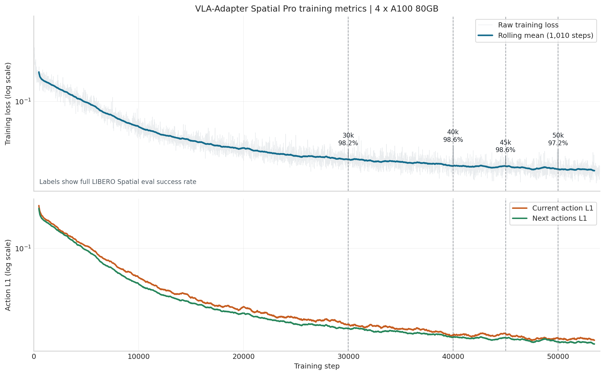

# 训练日志

目标：读懂 VLA-Adapter LoRA 微调日志里的 loss、action L1、checkpoint 文件和曲线证据。

训练日志的作用有两个：第一，确认训练链路是否健康；第二，给后续评测提供解释线索。VLA 训练的 loss 下降不等于 rollout 成功率一定高，因此训练日志和 checkpoint eval 放在一起看会更可靠。

## 日志路径

前面的训练命令会把输出写到 `$ARTIFACT_ROOT/logs/VLA-Adapter--libero_spatial_no_noops--<time>.log`。训练开始后，可以从前 100 行了解启动状态：

```bash
head -100 "$ARTIFACT_ROOT"/logs/VLA-Adapter--libero_spatial_no_noops--*.log
```

建议关注：

| 检查项 | 预期现象 |
| --- | --- |
| 当前 Python 环境 | 没有 import error。 |
| 数据集名称 | 日志里能对应 `libero_spatial_no_noops`。 |
| LIBERO 常量 | 能看到 `ACTION_DIM=7`、`PROPRIO_DIM=8`、`NUM_ACTIONS_CHUNK=8`。 |
| LoRA 配置 | `use_lora=True`、`lora_rank=64` 与命令一致。 |
| 输出目录 | run id 和 `$ARTIFACT_ROOT/runs` 路径符合预期。 |

## loss 怎么看

`finetune.py` 里会计算动作相关的 L1 loss，并区分当前动作和后续动作 mask。读日志时至少记录：

| 指标 | 含义 | 注意 |
| --- | --- | --- |
| training loss | 当前 batch 的训练目标 | 短期波动正常，单点数值的解释力有限。 |
| current action L1 | 当前动作预测误差 | 更贴近立即控制动作。 |
| next action L1 | action chunk 中后续动作误差 | 影响 open-loop 执行的稳定性。 |
| learning rate | 当前学习率 | 到衰减点后应变化。 |
| step time | 每 step 耗时 | 显存紧张或 I/O 慢时会异常。 |

训练结束后，可以保留本地日志或 W&B 中的 loss 曲线；曲线只作为训练健康证据，不等同于 rollout 成功率。

## 4×A100 实测 loss 曲线

下面的曲线来自本次 Spatial Pro 正式训练的 W&B offline history。训练使用 4×A100-80GB，W&B 每 10 step 记录一次；history 覆盖 step `0` 到 `53970`，共 `5398` 条，三个指标都没有 NaN 或记录断档。`53970` 只说明本次日志实际覆盖到哪里；图中真正用于 checkpoint 对比的是 `30000`、`40000`、`45000`、`50000` 这些保存点。图中的浅色线是原始 training loss，深色线和两个 action L1 使用 101 个记录点的 rolling mean，相当于约 `1010` steps 的滑动平均。

<figure>
  
  <figcaption>图 1：Spatial Pro 正式训练指标。上图是 training loss，下图是 current action L1 和 next actions L1；虚线标出做过完整 LIBERO Spatial eval 的 checkpoint，百分比是对应的 500 episodes 成功率。</figcaption>
</figure>

training loss、current action L1 和 next actions L1 都持续下降，说明训练过程本身稳定，动作误差仍在减小。本次在约 54k steps 内 learning rate 始终是 `2e-4`，没有进入 `num_steps_before_decay=400000` 对应的衰减阶段，因此图中没有单独绘制 learning rate。

但 loss 更低不等于 rollout 更好：`40000_chkpt` 和 `45000_chkpt` 的完整 eval 都是 `493/500 = 98.6%`，而训练更久、loss 更低的 `50000_chkpt` 回落到 `486/500 = 97.2%`。因此本轮最终选择较早达到平台区的 `40000_chkpt`。这张图适合用来确认训练是否收敛、是否出现 NaN 或异常震荡；它同时提醒读者把训练健康和最终策略表现分开判断，checkpoint 选择仍然要以完整 rollout eval 为准。

## checkpoint 文件怎么看

`save_freq=5000` 表示每 5000 steps 保存一次。`save_latest_checkpoint_only=False` 表示保留多个 checkpoint。常见文件包括 action head、proprio projector、LoRA 权重或 merge 后权重，具体以输出目录为准。

训练中可以定期查看：

```bash
find "$ARTIFACT_ROOT/runs" -maxdepth 3 -type f | sort | tail -40
```

预期现象：step 数会随训练推进增加；如果很久没有新 checkpoint，可以看看是否还没到 `save_freq`，还是训练已经卡住。

## W&B 和本地日志

W&B 是可选项。即使用了 W&B，本地日志也很值得保留，因为本地日志更容易复查启动命令、异常堆栈和 checkpoint 路径。复查一次训练时，可以把本地训练 log、训练命令、GPU / batch 配置和 checkpoint 列表放在一起看；W&B 曲线适合作为 loss 变化的辅助证据。

有条件的话，可以在训练启动后保存一次 `nvidia-smi` 输出或监控曲线截图。重点不是截图形式，而是能说明这次运行实际用了哪些 GPU、每张卡大约占用多少显存、是否接近 OOM。

## 实测 warning 怎么看

本次 4×A100 Spatial Pro 正式训练超过 5 万 step 后，日志中出现过类似 warning：

```text
Length of IterableDataset ... was reported to be 52970,
but 53xxx samples have been fetched.
```

这个提示来自 PyTorch 对 `IterableDataset` 报告长度和实际 fetch 数量的检查。出现它时，训练进程、DDP worker 和 GPU 计算仍在正常推进，日志中也没有 traceback，因此不能直接判断为训练崩溃。

更稳妥的判断方式是同时看：

| 信号 | 判断 |
| --- | --- |
| `ps` / `torchrun` 进程 | worker 是否还在。 |
| GPU 利用率 | 目标 GPU 是否仍有显存和计算占用。 |
| 日志 step | step 是否继续增加。 |
| checkpoint | 最近一个 `...--N_chkpt` 是否完整保存。 |

如果目标 checkpoint 已经保存，且完整 eval 已经达到平台区或开始回落，就可以手动停止训练；不需要因为 `max_steps` 还没跑满而继续消耗 GPU。

## loss 下降但评测失败怎么办

更稳妥的做法不是马上调整模型结构，而是按顺序核对：

1. 训练和评测的 `use_proprio`、`num_images_in_input`、`use_pro_version` 是否一致。
2. 评测 checkpoint 路径是否指向刚训练出来的目录。
3. 数据集 suite 是否匹配，例如 Spatial 数据训练后优先评测 Spatial。
4. rollout 视频失败模式是不是动作尺度异常。
5. loss 曲线是否只在很短 steps 内下降，还没有充分训练。

## 本页小结

- loss 是训练健康信号，不是最终成功率。
- checkpoint 文件、日志路径、启动命令、GPU 配置放在一起保存会更便于复查。
- warning 需要结合进程、GPU、step 和 checkpoint 一起判断。
- 训练成功和 checkpoint 选择的最终验证仍然是 LIBERO rollout eval。

## 回看问题

1. 为什么 current action L1 和 next action L1 都值得记录？
2. `save_freq=5000` 但没有 checkpoint，可能有哪些原因？
3. loss 正常下降但 rollout 失败时，哪三个配置最值得优先核对？

## 导航

- 上一节：[Checkpoint 保存与合并](05-checkpoint-save-and-merge.md)
- 返回上级：[LoRA 微调训练](../05-training.md)
- 下一节：[评测](../06-evaluation.md)
