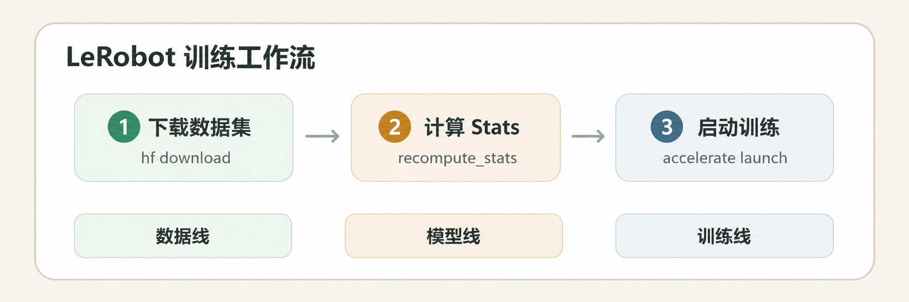

# LeRobot
> 先修：[07 数据类型和收集](../../06-data-teleoperation-and-imitation-learning/README.md)

LeRobot 不是某一个模型，而是一个**贯穿机器人学习全流程的工程框架**。它像一条流水线，把数据集读取、归一化统计、模型训练、checkpoint 管理、HuggingFace Hub 上传下载这些环节用统一的接口串起来。

对初学者最大的价值是"统一"：你不需要每换一个模型就重新设计数据格式和训练脚本。但统一不等于黑盒——训练前仍然要检查 `stats.json` 是否匹配当前数据、相机 key 是否和 policy 期望一致、action 维度是否正确。这些问题 LeRobot 不会帮你自动修正，需要你自己确认。

图 8.5.2 LeRobot 训练工作流全景。数据从 HuggingFace Hub 或本地路径进入，经过 stats 归一化、policy 训练，产出 checkpoint。

## 阅读路线

本教程按照"**先了解框架，再动手训练**"的顺序组织，建议按编号依次阅读。每个模型章节是独立的，你可以根据需求跳读到感兴趣的模型。

### 基础篇：了解框架

在动手训练之前，先理解 LeRobot 是什么、如何安装、数据格式是怎样的：

| 章节 | 内容 |
|---|---|
| [LeRobot 整体介绍](08-lerobot/01-overview.md) | LeRobot 解决了什么问题、支持哪些 policy、完整的训练流程概览 |
| [环境安装与 Policy 选择](08-lerobot/02-setup.md) | clone 源码、创建 conda 环境、按需安装依赖、根据目标选择模型 |
| [数据格式及转换](08-lerobot/03-data-format.md) | LeRobotDataset v2.1 与 v3.0 的结构对比、格式转换、stats 计算 |

### 模型复现：从入门到进阶

每个章节是独立的，包含该模型的简介、环境安装、数据与模型下载、完整训练脚本和参数详解。

**传统模仿学习**

| 章节 | 模型 | 适合人群 |
|---|---|---|
| [ACT 复现](08-lerobot/04-act.md) | Action Chunking Transformer | LeRobot 入门首选，理解 chunked action prediction |
| [Diffusion Policy 复现](08-lerobot/05-diffusion-policy.md) | Diffusion Policy | 理解去噪扩散在动作生成中的应用 |

**VLA（视觉-语言-动作）模型**

| 章节 | 模型 | 亮点 |
|---|---|---|
| [SmolVLA 复现](08-lerobot/06-smolvla.md) | SmolVLA | 轻量级 VLA，显存友好，VLA 入门推荐 |
| [X-VLA 训练](08-lerobot/07-xvla.md) | X-VLA（Soft-Prompted Transformer） | 跨 embodiment 的 soft prompt 机制 |
| [π0 复现](08-lerobot/08-pi0.md) | π0（PaliGemma + Flow Matching） | Flow Matching 动作生成，Action Expert 架构 |
| [PI0-FAST 复现](08-lerobot/09-pi0fast.md) | PI0-FAST（FAST tokenizer） | π0 的快速变体，自回归解码替代去噪 |
| [π0.5 复现](08-lerobot/10-pi05.md) | π0.5（AdaRMS + Quantiles） | π0 升级版，离散状态输入，200 tokens |

## References

[https://github.com/huggingface/lerobot](https://github.com/huggingface/lerobot)
