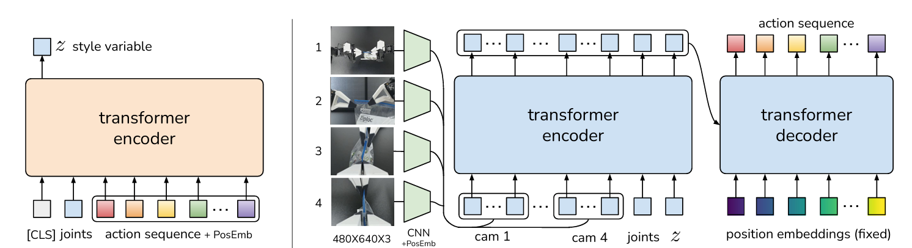
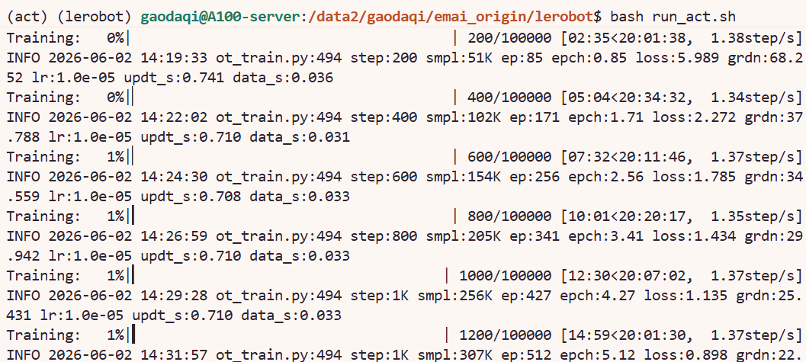

# 8.5.2.4 ACT 复现

## 学习目标

- 解释 ACT 的 Action Chunking 机制和 CVAE（架构。
- 使用 LeRobot 的 ACT policy 完成训练，掌握 `lerobot-train` 的命令行参数配置。
- 理解 `chunk_size`、`n_action_steps` 和 temporal ensembling 对推理行为的影响。

## ACT 简介

ACT（Action Chunking Transformer）是 ALOHA 机器人系统提出的模仿学习算法，核心思想是将单步动作预测扩展为**一次性预测未来一段连续动作序列**，从而缓解分布偏移问题并提升操作的时序一致性。

ACT 采用 CVAE 架构，包含三个关键组件：

1. **VAE Encoder**：将动作序列和机器人状态编码为隐变量，捕捉动作的多模态分布。
2. **Transformer Encoder**：将隐变量、机器人状态、环境状态和图像特征（ResNet 提取）编码为上下文表示。
3. **Transformer Decoder**：通过 cross-attention 查询 encoder 输出，生成 chunk_size 长度的动作序列。

训练时，VAE Encoder 以真实动作序列为输入，通过 KL 散度约束隐变量分布趋近标准正态分布。推理时，VAE Encoder 被丢弃，直接从零隐变量出发，由 Transformer Decoder 生成动作 chunk。执行时可配合 **temporal ensembling** 对重叠预测的 chunk 做指数加权平均，进一步提升动作平滑性。

 论文：[Learning Fine-Grained Bimanual Manipulation with Low-Cost Hardware](https://arxiv.org/abs/2304.13705)




## 环境与数据准备

### 环境配置

首先进入 LeRobot 仓库并创建 conda 环境（`xxx` 替换为你自定义的环境名）：

```bash
cd lerobot
conda create -y -n xxx python=3.12
conda activate xxx
```

然后安装 LeRobot：

```bash
# 安装基础依赖
pip install -e .
```

ACT 使用 ResNet 作为视觉骨干，除 LeRobot 基础依赖外无需额外安装包。：

```bash
pip install -e ".[training]"
```

### 数据下载

本教程使用 aloha_static_fork_pick_up数据集，下载命令如下：

```bash
export HF_ENDPOINT=https://hf-mirror.com

hf download lerobot/aloha_static_fork_pick_up \
  --repo-type dataset \
  --local-dir /path/to/aloha_static_fork_pick_up
```


## 训练脚本与参数详解

### 完整训练命令

以下脚本使用 4 张 GPU 在数据集上从头训练 ACT，可在lerobot目录下保存为.sh脚本运行：

```bash
# 1. 任务名称（对应数据集名称的后半部分）
TASK_NAME="aloha_static_fork_pick_up"

# 2. 端口号（避免冲突）
MASTER_PORT=29513

# 3. 缓存目录设置（与 run_smolvla.sh 保持一致）
export TRANSFORMERS_OFFLINE=1
export HF_LEROBOT_HOME="/path/to/lerobot/.cache"

# 4. 指定使用的 GPU
export CUDA_VISIBLE_DEVICES=4,5,6,7

# ===========================================

echo "🚀 开始训练 ACT..."

# 自动清理旧输出目录（resume=false 时必须删除）
OUTPUT_DIR="./outputs/act_$TASK_NAME"
if [ -d "$OUTPUT_DIR" ]; then
    echo "清理旧输出目录: $OUTPUT_DIR"
    rm -rf "$OUTPUT_DIR"
fi

# 启动训练
# ACT 使用 --policy.type=act 而非 --policy.path
# ACT 是从零训练的模型，不需要预训练权重
accelerate launch \
    --num_processes=4 \
    --num_machines=1 \
    --mixed_precision=bf16 \
    --dynamo_backend=no \
    --main_process_port $MASTER_PORT \
    $(which lerobot-train) \
    --dataset.repo_id=/data2/gaodaqi/emai_origin/data/$TASK_NAME \
    --dataset.root=/data2/gaodaqi/emai_origin/data/$TASK_NAME \
    --output_dir=./outputs/act_$TASK_NAME \
    --job_name=act_$TASK_NAME \
    --policy.type=act \
    --batch_size=64 \
    --steps=100000 \
    --save_checkpoint=true \
    --save_freq=20000 \
    --policy.device=cuda \
    --wandb.enable=false \
    --wandb.disable_artifact=true \
    --rename_map='{"observation.images.cam_high": "observation.images.camera1", "observation.images.cam_left_wrist": "observation.images.camera2", "observation.images.cam_right_wrist": "observation.images.camera3", "observation.images.cam_low": "observation.images.camera4"}' \
    --policy.push_to_hub=false \
    --resume=false

```

### 核心参数说明

#### ① 启动前必须修改的路径

以下参数与你本机路径强相关，直接复制脚本前务必检查：

| 参数 | 说明 |
|---|---|
| `TASK_NAME` | 数据集名称，对应 `lerobot/xxx` 的后半部分，需与数据路径一致 |
| `DATA_PATH`（`--dataset.repo_id`） | 数据集本地路径，指向 `hf download` 下载到的目录 |
| `HF_LEROBOT_HOME` | LeRobot 缓存目录，含数据集和模型缓存 |
| `CUDA_VISIBLE_DEVICES` | 使用的 GPU，单卡时同时将 `--num_processes` 改为 `1` |
| `MASTER_PORT` | 多卡通信端口，如冲突则更换 |

#### ② 关键参数：`batch_size` 与 `--rename_map`

`batch_size`：当前配置 `--batch_size=64`，4 卡训练时总 batch = 256。ACT 使用 ResNet 作为视觉骨干，显存占用适中，可设置较大的 batch_size。显存不足时适当减小，同时可能需要相应增加 `--steps`。

`--rename_map`：ACT 的相机 key 使用 `camera1`/`camera2`/`camera3`/`camera4` 的序号命名。ALOHA 数据集使用 4 路相机：

| 数据集原始 key | 模型 key | 对应相机 |
|---|---|---|
| `observation.images.cam_high` | `observation.images.camera1` | 俯视全局相机 |
| `observation.images.cam_left_wrist` | `observation.images.camera2` | 左腕相机 |
| `observation.images.cam_right_wrist` | `observation.images.camera3` | 右腕相机 |
| `observation.images.cam_low` | `observation.images.camera4` | 低位前视相机 |

#### ③ 关键参数：`chunk_size` 与 `n_action_steps`

这是 ACT 最核心的两个参数，直接决定"预测多少步"和"执行多少步"。脚本中未显式指定时使用默认值：

- `chunk_size`：模型单次预测的动作序列长度。更大的 chunk 能提供更长的时序上下文，但也增加计算量。
- `n_action_steps`：每次推理后实际在环境中执行的动作步数。当 `n_action_steps < chunk_size` 时，只取前 n_action_steps 步执行，剩余部分丢弃，下次推理会重新预测。

#### ④ 其余参数速览

| 参数 | 作用 |
|---|---|
| `--num_processes` | GPU 数量，与 `CUDA_VISIBLE_DEVICES` 一致 |
| `--mixed_precision=bf16` | bf16 混合精度，节省显存 |
| `--dynamo_backend=no` | 必须为 `no`，与 torchdynamo 不兼容 |
| `--steps=100000` | 总训练步数（ |
| `--save_freq=20000` | 每 20k 步保存一次 checkpoint |
| `--policy.type=act` | 指定使用 ACT policy |
| `--policy.vision_backbone` | ResNet 变体，可选 `resnet18`/`resnet34`/`resnet50`，默认 `resnet18` |
| `--policy.use_vae` | 是否开启 VAE，默认 `true`。关闭后退化为确定性 Transformer |
| `--policy.kl_weight` | KL 散度权重，默认 `10.0` |
| `--policy.latent_dim` | VAE 隐变量维度，默认 `32` |
| `--policy.dropout` | Transformer dropout 率，默认 `0.1` |
| `--policy.temporal_ensemble_coeff` | 时序集成系数，默认 `null`。设为 `0.01` 时启用，但需 `n_action_steps=1` |
| `--optimizer.type` | ACT 自动选用 `adamw` |
| `--wandb.enable=false` | 关闭 wandb 日志，按需开启 |
| `--wandb.disable_artifact=true` | 禁止 wandb 上传模型 artifact，节省存储 |
| `--resume=false` | 断点续训开关，设为 `true` 时从 `output_dir` 恢复。注意 `resume=true` 时不要删除旧 `output_dir` |


### 运行成功截图



## 导航

- 返回父页：[LeRobot](../08-lerobot.md)
- 上一节：[数据格式及转换](03-data-format.md)
- 下一节：[Diffusion Policy 复现](05-diffusion-policy.md)
