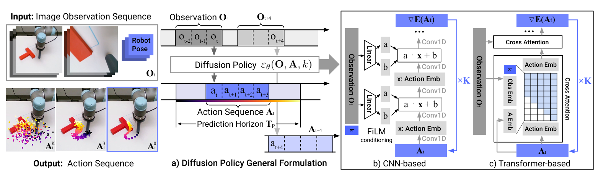
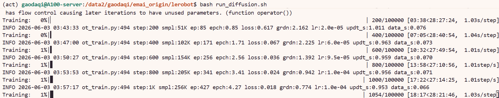

# 8.5.2.5 Diffusion Policy 复现

## 学习目标

- 解释 Diffusion Policy 如何将动作生成建模为条件去噪扩散过程。
- 使用 LeRobot 的 Diffusion Policy 完成训练，掌握 `lerobot-train` 的命令行参数配置。
- 理解 `num_inference_steps` 对推理速度与动作质量的权衡，以及 DDPM 与 DDIM 的区别。

## Diffusion Policy 简介

Diffusion Policy 是哥伦比亚大学提出的基于**去噪扩散概率模型（DDPM）**的机器人模仿学习算法。其核心思想是将动作序列生成建模为一个条件去噪过程：从纯噪声出发，以观测（图像 + 机器人状态）为条件，迭代去噪逐步恢复出完整的动作序列。

Diffusion Policy 的架构由三个关键模块组成：

1. **视觉编码器（RGB Encoder）**：使用 ResNet 骨干提取图像特征，通过 SpatialSoftmax 将 2D 特征图转换为关键点坐标，得到紧凑的视觉表示。
2. **条件 U-Net（ConditionalUnet1d）**：1D 卷积 U-Net，以扩散时间步和全局条件（机器人状态 + 视觉特征）为输入，通过 FiLM调制每个残差块，逐步从噪声中恢复动作序列。
3. **噪声调度器（Noise Scheduler）**：控制前向加噪和反向去噪过程。支持 DDPM和 DDIM两种调度器。

推理时，模型从纯高斯噪声开始，在观测条件的引导下，经过 `num_inference_steps` 步迭代去噪，生成 `horizon` 步的动作序列，然后取前 `n_action_steps` 步执行。与 ACT 的 CVAE 方案不同，Diffusion Policy 天然支持多模态动作分布，对复杂操作任务的建模能力更强。

> 论文：[Diffusion Policy: Visuomotor Policy Learning via Action Diffusion](https://arxiv.org/abs/2303.04137)




## 环境与数据准备

### 环境配置

首先进入 LeRobot 仓库并创建 conda 环境（`xxx` 替换为你自定义的环境名）：

```bash
cd lerobot
conda create -y -n xxx python=3.12
conda activate xxx
```

然后安装 LeRobot：

```bash
# 安装基础依赖
pip install -e .

pip install -e ".[training]"

pip install diffusers

```

### 数据下载

本教程使用 aloha_static_fork_pick_up数据集，下载命令如下：

```bash
export HF_ENDPOINT=https://hf-mirror.com

hf download lerobot/aloha_static_fork_pick_up \
  --repo-type dataset \
  --local-dir /path/to/aloha_static_fork_pick_up
```


## 训练脚本与参数详解

### 完整训练命令

以下脚本使用 4 张 GPU 在数据集上从头训练 Diffusion Policy，可在lerobot目录下保存为.sh脚本运行：

```bash
# 1. 任务名称（对应数据集名称的后半部分）
TASK_NAME="aloha_static_fork_pick_up"

# 2. 端口号（避免冲突）
MASTER_PORT=29514

# 3. 缓存目录设置
export TRANSFORMERS_OFFLINE=1
export HF_LEROBOT_HOME="/path/to/lerobot/.cache"

# 4. 指定使用的 GPU
export CUDA_VISIBLE_DEVICES=4,5,6,7

# ===========================================

echo "🚀 开始训练 Diffusion Policy..."

# 自动清理旧输出目录（resume=false 时必须删除）
OUTPUT_DIR="./outputs/diffusion_$TASK_NAME"
if [ -d "$OUTPUT_DIR" ]; then
    echo "清理旧输出目录: $OUTPUT_DIR"
    rm -rf "$OUTPUT_DIR"
fi

# 启动训练
# Diffusion Policy 使用 --policy.type=diffusion 而非 --policy.path
# 是从零训练的模型，不需要预训练权重
accelerate launch \
    --num_processes=4 \
    --num_machines=1 \
    --mixed_precision=bf16 \
    --dynamo_backend=no \
    --main_process_port $MASTER_PORT \
    $(which lerobot-train) \
    --dataset.repo_id=/data2/gaodaqi/emai_origin/data/$TASK_NAME \
    --dataset.root=/data2/gaodaqi/emai_origin/data/$TASK_NAME \
    --output_dir=./outputs/diffusion_$TASK_NAME \
    --job_name=diffusion_$TASK_NAME \
    --policy.type=diffusion \
    --batch_size=64 \
    --steps=100000 \
    --save_checkpoint=true \
    --save_freq=20000 \
    --policy.device=cuda \
    --wandb.enable=false \
    --wandb.disable_artifact=true \
    --rename_map='{"observation.images.cam_high": "observation.images.camera1", "observation.images.cam_left_wrist": "observation.images.camera2", "observation.images.cam_right_wrist": "observation.images.camera3", "observation.images.cam_low": "observation.images.camera4"}' \
    --policy.push_to_hub=false \
    --resume=false

```

### 核心参数说明

#### ① 启动前必须修改的路径

以下参数与你本机路径强相关，直接复制脚本前务必检查：

| 参数 | 说明 |
|---|---|
| `TASK_NAME` | 数据集名称，对应 `lerobot/xxx` 的后半部分，需与数据路径一致 |
| `DATA_PATH`（`--dataset.repo_id`） | 数据集本地路径，指向 `hf download` 下载到的目录 |
| `HF_LEROBOT_HOME` | LeRobot 缓存目录，含数据集和模型缓存 |
| `CUDA_VISIBLE_DEVICES` | 使用的 GPU，单卡时同时将 `--num_processes` 改为 `1` |
| `MASTER_PORT` | 多卡通信端口，如冲突则更换 |

#### ② 关键参数：`batch_size` 与 `--rename_map`

`batch_size`：当前配置 `--batch_size=64`，4 卡训练时总 batch = 256。显存不足时适当减小，同时可能需要相应增加 `--steps`。

`--rename_map`：Diffusion Policy 的相机 key 使用 `camera1`/`camera2`/`camera3`/`camera4` 的序号命名。ALOHA 数据集使用 4 路相机：

| 数据集原始 key | 模型 key | 对应相机 |
|---|---|---|
| `observation.images.cam_high` | `observation.images.camera1` | 俯视全局相机 |
| `observation.images.cam_left_wrist` | `observation.images.camera2` | 左腕相机 |
| `observation.images.cam_right_wrist` | `observation.images.camera3` | 右腕相机 |
| `observation.images.cam_low` | `observation.images.camera4` | 低位前视相机 |

#### ③ 关键参数：`horizon`、`n_obs_steps` 与 `n_action_steps`

这三个参数共同控制 Diffusion Policy 的时序建模范围和执行行为。脚本中未显式指定时使用默认值：

| 参数 | 默认值 | 含义 |
|---|---|---|
| `n_obs_steps` | 2 | 输入的历史观测步数，使用最近 2 步观测作为条件 |
| `horizon` | 16 | 模型预测的动作序列总长度 |
| `n_action_steps` | 8 | 每次推理后实际执行的动作步数 |


#### ④ 关键参数：`num_train_timesteps` 与 `num_inference_steps`

这两个参数决定了扩散过程的粒度和推理效率。脚本中未显式指定时使用默认值：

- `num_train_timesteps`：训练时的扩散步数。步数越多，噪声调度越精细。
- `num_inference_steps`：推理时的去噪步数，直接影响推理速度。


| 配置 | 训练步数 | 推理步数 | 相对速度 | 适用场景 |
|---|---|---|---|---|
| DDPM 全量（默认） | 100 | 100 | 1× | 最高质量，离线评估 |
| DDPM 加速 | 100 | 25 | ~4× | 质量略有下降 |
| DDIM 加速 | 100 | 16 | ~6× | 推荐方案，速度与质量兼得 |

#### ⑤ 其余参数速览

| 参数 | 作用 |
|---|---|
| `--num_processes` | GPU 数量，与 `CUDA_VISIBLE_DEVICES` 一致 |
| `--mixed_precision=bf16` | bf16 混合精度，节省显存 |
| `--dynamo_backend=no` | 必须为 `no`，与 torchdynamo 不兼容 |
| `--steps=100000` | 总训练步数（Diffusion Policy 从零训练，100k 步通常可获得较好效果） |
| `--save_freq=20000` | 每 20k 步保存一次 checkpoint |
| `--policy.type=diffusion` | 指定使用 Diffusion Policy（注意与 SmolVLA 的 `--policy.path` 不同） |
| `--policy.vision_backbone` | ResNet 变体，可选 `resnet18`/`resnet34`/`resnet50`，默认 `resnet18` |
| `--policy.crop_shape` | 图像裁剪尺寸 `(H, W)`，默认 `(84, 84)` |
| `--policy.down_dims` | U-Net 各层特征维度，默认 `(512, 1024, 2048)` |
| `--policy.kernel_size` | 1D 卷积核大小，默认 `5` |
| `--policy.n_groups` | GroupNorm 分组数，默认 `8` |
| `--policy.diffusion_step_embed_dim` | 扩散时间步嵌入维度，默认 `128` |
| `--policy.spatial_softmax_num_keypoints` | SpatialSoftmax 关键点数，默认 `32` |
| `--policy.prediction_type` | U-Net 预测目标，默认 `epsilon`（预测噪声），可选 `sample` |
| `--optimizer.type` | Diffusion Policy 自动选用 `adam`（lr=1e-4，注意不是 `adamw`） |
| `--wandb.enable=false` | 关闭 wandb 日志，按需开启 |
| `--wandb.disable_artifact=true` | 禁止 wandb 上传模型 artifact，节省存储 |
| `--resume=false` | 断点续训开关，设为 `true` 时从 `output_dir` 恢复。注意 `resume=true` 时不要删除旧 `output_dir` |


### 运行成功截图



## 导航

- 返回父页：[LeRobot](../08-lerobot.md)
- 上一节：[ACT 复现](04-act.md)
- 下一节：[SmolVLA 复现](06-smolvla.md)
