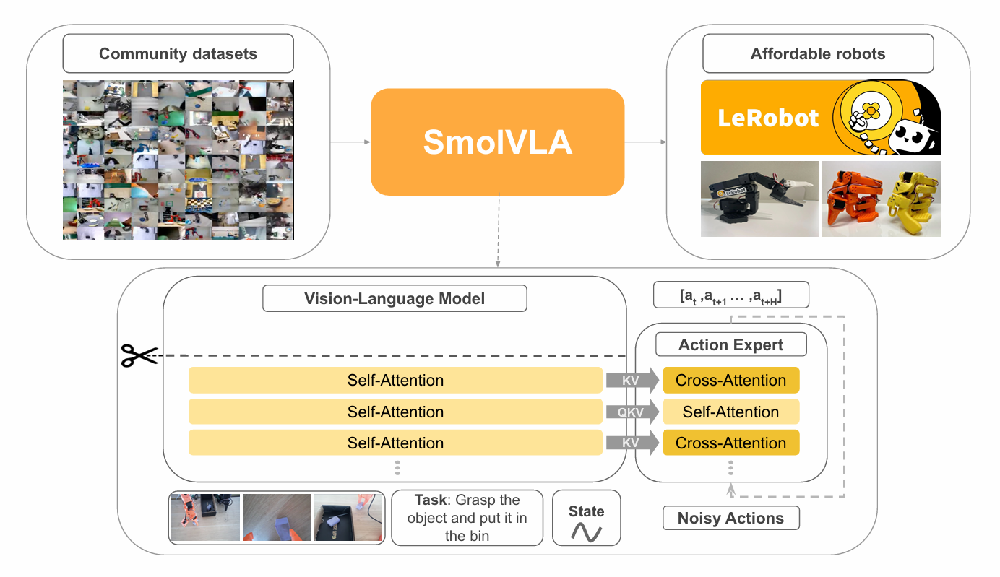
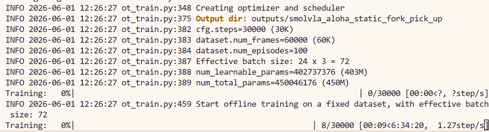

# 8.5.2.6 SmolVLA 复现

## 学习目标

- 解释 SmolVLA 的模型架构和训练策略。
- 使用 LeRobot 的 SmolVLA policy 完成训练，掌握 `lerobot-train` 的完整参数配置。
- 理解 `--rename_map` 的作用和多相机场景下的配置方法。

## SmolVLA 简介

SmolVLA 是 Hugging Face 推出的轻量级 Vision-Language-Action 模型，面向资源受限场景设计。它在保持 VLA 多模态能力的同时，显著降低了模型参数量、显存占用和训练开销，适合入门 VLA 或在消费级 GPU 上进行快速实验。

与 XVLA 的 soft prompt 跨 embodiment 方案不同，SmolVLA 更聚焦于**单任务微调**的简洁性和易用性，训练参数更少，收敛更快，是 VLA 入门的推荐选择。

> 论文：[SmolVLA: A Vision-Language-Action Model for Affordable and Efficient Robotics](https://arxiv.org/abs/2506.01844)



## 环境与数据、模型准备
### 环境配置

首先进入 LeRobot 仓库并创建 conda 环境（`xxx` 替换为你自定义的环境名）：

```bash
cd lerobot
conda create -y -n xxx python=3.12
conda activate xxx
```

然后安装 LeRobot 及 SmolVLA 相关依赖：

```bash
# 安装基础依赖
pip install -e .

# 安装 SmolVLA + 训练扩展
pip install -e ".[smolvla,training]"

# FFmpeg（视频解码用）
conda install -c conda-forge ffmpeg -y
```

### 数据下载

本教程使用 ALOHA 数据集，下载命令如下：

```bash
export HF_ENDPOINT=https://hf-mirror.com

hf download lerobot/aloha_static_fork_pick_up \
  --repo-type dataset \
  --local-dir /path/to/aloha_static_fork_pick_up
```


### 模型下载

SmolVLA 的预训练基础模型 `lerobot/smolvla_base` ，下载命令如下：

```bash
export HF_ENDPOINT=https://hf-mirror.com
hf download lerobot/smolvla_base --local-dir /path/to/smolvla_base
```

### SmolVLM2（VLM 骨干）

SmolVLA 使用 SmolVLM2-500M-Video-Instruct 作为视觉语言骨干，需单独下载：

```bash
hf download HuggingFaceTB/SmolVLM2-500M-Video-Instruct --local-dir /path/to/SmolVLM2-500M-Video-Instruct
```

### 下载后修改配置

模型下载完成后，需修改 SmolVLA 模型目录中的 `config.json`，将 `vlm_model_name` 指向本地 SmolVLM2 路径：

```json
{
  "vlm_model_name": "/path/to/SmolVLM2-500M-Video-Instruct"
}
```

## 训练脚本与参数详解

### 完整训练命令

以下脚本使用 3 张 GPU 在 ALOHA 静态叉子拾取数据集上微调 SmolVLA，可在lerobot目录下保存为.sh脚本运行：

```bash
#!/bin/bash

# ======================== 基础配置 ========================
TASK_NAME="aloha_static_fork_pick_up"
DATA_PATH="/path/to/aloha_static_fork_pick_up"         # 替换为你的数据路径
MODEL_PATH="/path/to/smolvla_base"                     # 替换为你的模型路径
MASTER_PORT=29502                                      # 多卡通信端口，如冲突则更换

export HF_LEROBOT_HOME=/path/to/lerobot/.cache         # 替换为你的缓存路径
export CUDA_VISIBLE_DEVICES=1,2,3                      # 指定使用的 GPU

# ======================== 启动训练 ========================
accelerate launch \
    --num_processes=3 \
    --num_machines=1 \
    --mixed_precision=bf16 \
    --dynamo_backend=no \
    --main_process_port $MASTER_PORT \
    $(which lerobot-train) \
    --dataset.repo_id=$DATA_PATH \
    --dataset.root=$DATA_PATH \
    --output_dir=./outputs/smolvla_$TASK_NAME \
    --job_name=smolvla_$TASK_NAME \
    --policy.path=$MODEL_PATH \
    --batch_size=24 \
    --steps=30000 \
    --policy.scheduler_decay_steps=30000 \
    --save_checkpoint=true \
    --save_freq=10000 \
    --policy.device=cuda \
    --policy.freeze_vision_encoder=false \
    --policy.train_expert_only=false \
    --policy.train_state_proj=true \
    --rename_map='{"observation.images.cam_high": "observation.images.camera1", "observation.images.cam_left_wrist": "observation.images.camera2", "observation.images.cam_right_wrist": "observation.images.camera3"}' \
    --optimizer.type=adamw \
    --wandb.enable=false \
    --policy.push_to_hub=false \
    --resume=false
```

> `batch_size=24` 是每张卡的 batch size，3 卡总 batch = 72。

### 核心参数说明

#### ① 启动前必须修改的路径

以下参数与你本机路径强相关，直接复制脚本前务必检查：

| 参数 | 说明 |
|---|---|
| `DATA_PATH` | 数据集本地路径，指向 `hf download` 下载到的目录 |
| `MODEL_PATH`（`--policy.path`） | SmolVLA 预训练模型路径，指向 `smolvla_base` 下载目录 |
| `HF_LEROBOT_HOME` | LeRobot 缓存目录，含数据集和模型缓存 |
| `CUDA_VISIBLE_DEVICES` | 使用的 GPU，单卡时同时将 `--num_processes` 改为 `1` |

此外，`config.json` 中的 `vlm_model_name` 必须指向本地 SmolVLM2 路径。

#### ② 关键参数：`batch_size` 与 `--rename_map`

`batch_size`：当前配置 `--batch_size=24`，3 卡训练时总 batch = 72。SmolVLA 显存占用较小，可设置较大的 batch_size。显存不足时适当减小，同时可能需要相应增加 `--steps`。

`--rename_map`：SmolVLA 的相机 key 使用 `camera1`/`camera2`/`camera3` 的序号命名，与 π0 风格一致。ALOHA 数据集仅使用 3 路相机：

| 数据集原始 key | 模型 key | 对应相机 |
|---|---|---|
| `observation.images.cam_high` | `observation.images.camera1` | 俯视全局相机 |
| `observation.images.cam_left_wrist` | `observation.images.camera2` | 左腕相机 |
| `observation.images.cam_right_wrist` | `observation.images.camera3` | 右腕相机 |

> **注意**：SmolVLA 仅使用 3 路相机，无需映射 `cam_low` 或占位槽位。

#### ③ 其余参数速览

| 参数 | 作用 |
|---|---|
| `--num_processes` | GPU 数量，与 `CUDA_VISIBLE_DEVICES` 一致 |
| `--mixed_precision=bf16` | bf16 混合精度，节省显存 |
| `--dynamo_backend=no` | 必须为 `no`，与 torchdynamo 不兼容 |
| `--steps=30000` | 总训练步数（SmolVLA 收敛较快，30k 步通常足够） |
| `--policy.scheduler_decay_steps=30000` | lr 衰减步数，与 `--steps` 一致 |
| `--save_freq=10000` | 每 10k 步保存一次 checkpoint |
| `--policy.freeze_vision_encoder=false` | 解冻 VLM 视觉编码器 |
| `--policy.train_expert_only=false` | 训练整个模型，不限于 Action Expert |
| `--policy.train_state_proj=true` | 训练状态投影层（SmolVLA 保留 state_proj） |
| `--optimizer.type=adamw` | 标准 AdamW 优化器 |
| `--wandb.enable=false` | 关闭 wandb 日志，按需开启 |
| `--resume=false` | 断点续训开关，设为 `true` 时从 `output_dir` 恢复 |


### 运行成功截图



## 导航

- 返回父页：[LeRobot](../08-lerobot.md)
- 上一节：[Diffusion Policy 复现](05-diffusion-policy.md)
- 下一节：[X-VLA 复现](07-xvla.md)
