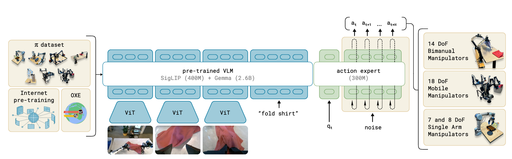
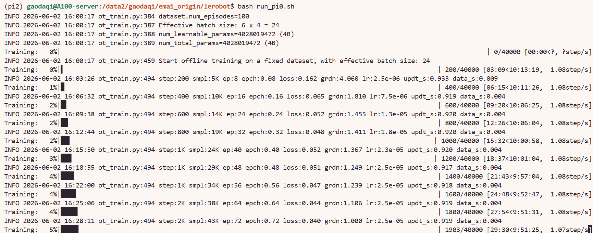

# 8.5.2.8 π0 复现

## 学习目标

- 解释 π0 的架构设计和工作原理。
- 使用 LeRobot 下载 π0 预训练模型和数据集。
- 修改训练脚本并完成 π0 微调训练。

## π0 简介

π0 是 Physical Intelligence 开发的视觉语言动作（VLA）模型。VLM 骨干使用 **PaliGemma**（gemma_2b），动作生成采用 **Flow Matching** + 独立 Gemma 300M Action Expert。与 XVLA 的 soft prompt 方案不同，π0 通过 Flow Matching 在连续动作空间上建模，支持灵活的训练策略：可冻结视觉编码器或仅训练 Action Expert。
> 论文：[π0: A Vision-Language-Action Flow Model for General Robot Control](https://arxiv.org/abs/2410.24164)



## 环境与数据、模型准备

### 环境安装

注：pi0、pi0fast、pi05共用同一环境

首先进入 LeRobot 仓库并创建 conda 环境（`xxx` 替换为你自定义的环境名）：

```bash
cd lerobot
conda create -y -n xxx python=3.12
conda activate xxx
```

然后安装 LeRobot 及 PI 相关依赖：

```bash
# 安装基础依赖
pip install -e .

# 安装 PI + 训练扩展
pip install -e ".[pi,training]"

# FFmpeg（视频解码用）
conda install -c conda-forge ffmpeg -y
```

### 数据下载

注：其他章节下载过可跳过此部分

本教程使用 ALOHA 静态叉子拾取数据集（约 1.53 GB），下载命令如下：

```bash
export HF_ENDPOINT=https://hf-mirror.com

hf download lerobot/aloha_static_fork_pick_up \
  --repo-type dataset \
  --local-dir /path/to/aloha_static_fork_pick_up
```


### 模型下载

首先下载 π0 预训练模型：

```bash
export HF_ENDPOINT=https://hf-mirror.com
hf download lerobot/pi0 --local-dir /path/to/pi0
```

π0 依赖 PaliGemma 作为 VLM 骨干，需单独下载：

```bash
hf download google/paligemma-3b-pt-224 --local-dir /path/to/paligemma-3b-pt-224
```

下载完成后，需修改 π0 模型目录中的 `policy_preprocessor.json`，将 `tokenizer_name` 指向本地 PaliGemma 路径：

```json
{
  "tokenizer_name": "/path/to/paligemma-3b-pt-224"
}
```

## 训练脚本与参数详解

### 完整训练命令

以下脚本使用 4 张 GPU 在 ALOHA 数据集上微调 π0，可在lerobot目录下保存为.sh脚本运行：

```bash
#!/bin/bash

# ======================== 基础配置 ========================
TASK_NAME="aloha_static_fork_pick_up"
DATA_PATH="/path/to/aloha_static_fork_pick_up"        # 替换为你的数据路径
MODEL_PATH="/path/to/pi0"                              # 替换为你的 π0 模型路径
MASTER_PORT=23332                                      # 多卡通信端口，如冲突则更换

export HF_HOME=/path/to/lerobot/.cache                # 替换为你的缓存路径
export HF_LEROBOT_HOME=/path/to/lerobot/.cache
export TRANSFORMERS_OFFLINE=1                          # 禁止联网下载模型
export TRANSFORMERS_VERBOSITY=error                    # 抑制 transformers 冗余警告
export CUDA_VISIBLE_DEVICES=4,5,6,7                    # 指定使用的 GPU

# ======================== 启动训练 ========================
accelerate launch \
    --num_processes=4 \
    --num_machines=1 \
    --mixed_precision=bf16 \
    --dynamo_backend=no \
    --main_process_port $MASTER_PORT \
    $(which lerobot-train) \
    --dataset.repo_id=$DATA_PATH \
    --dataset.root=$DATA_PATH \
    --output_dir=./outputs/pi0_$TASK_NAME \
    --job_name=pi0_$TASK_NAME \
    --policy.path=$MODEL_PATH \
    --policy.dtype=bfloat16 \
    --batch_size=6 \
    --steps=40000 \
    --policy.scheduler_decay_steps=40000 \
    --save_checkpoint=true \
    --save_freq=10000 \
    --policy.device=cuda \
    --policy.freeze_vision_encoder=false \
    --policy.train_expert_only=false \
    --policy.empty_cameras=1 \
    --rename_map='{"observation.images.cam_high": "observation.images.camera0", "observation.images.cam_left_wrist": "observation.images.camera1", "observation.images.cam_right_wrist": "observation.images.camera2", "observation.images.cam_low": "observation.images.empty_camera_0"}' \
    --wandb.enable=false \
    --wandb.disable_artifact=false \
    --policy.push_to_hub=false \
    --resume=false
```

> `batch_size=6` 是**每张卡**的 batch size，4 卡总 batch = 24。

### 核心参数说明

#### ① 启动前必须修改的路径

| 参数 | 说明 |
|---|---|
| `DATA_PATH` | 数据集本地路径 |
| `MODEL_PATH`（`--policy.path`） | π0 预训练模型路径，指向 `hf download lerobot/pi0` 的目录 |
| `HF_HOME` / `HF_LEROBOT_HOME` | HuggingFace 缓存目录 |
| `CUDA_VISIBLE_DEVICES` | 根据你的 GPU 情况调整 |


#### ② `batch_size` 设置

`batch_size`：π0 显存占用较大，A100 80G 场景下建议 `batch_size=6`，可根据实际情况调整。


#### ③ `--rename_map` 说明

π0 的相机 key 命名与 XVLA 不同，使用 `camera0`/`camera1`/`camera2` 的序号命名：

| 数据集原始 key | 模型 key | 对应相机 |
|---|---|---|
| `observation.images.cam_high` | `observation.images.camera0` | 俯视全局相机 |
| `observation.images.cam_left_wrist` | `observation.images.camera1` | 左腕相机 |
| `observation.images.cam_right_wrist` | `observation.images.camera2` | 右腕相机 |
| `observation.images.cam_low` | `observation.images.empty_camera_0` | 低位相机（占位） |

`--policy.empty_cameras`：告知模型数据集中有多少个占位相机槽位。当前设置为 `1`，对应 rename_map 中映射到 `empty_camera_0` 的 `cam_low`。

#### ④ 其余参数速览

| 参数 | 作用 |
|---|---|
| `--num_processes` | GPU 数量，与 `CUDA_VISIBLE_DEVICES` 一致 |
| `--mixed_precision=bf16` | bf16 混合精度，节省显存 |
| `--dynamo_backend=no` | 必须为 `no`，π0 与 torchdynamo 不兼容 |
| `--policy.freeze_vision_encoder` |  `false` 解冻 PaliGemma 视觉编码器，令其参与训练 |
| `--policy.train_expert_only` | 训练整个模型；设为 `true` 则仅训练 Action Expert |
| `--policy.dtype=bfloat16` | 模型加载精度 |
| `--steps=40000` | 总训练步数 |
| `--policy.scheduler_decay_steps=40000` | lr 衰减步数，与 `--steps` 一致 |
| `--save_freq=10000` | 每 10k 步保存一次 checkpoint |
| `--wandb.enable=false` | 关闭 wandb 日志，按需开启 |
| `--resume=false` | 断点续训，设为 `true` 时从 `output_dir` 恢复 |

### 运行成功截图



## 导航

- 返回父页：[LeRobot](../08-lerobot.md)
- 上一节：[X-VLA 复现](07-xvla.md)
- 下一节：[PI0-FAST 复现](09-pi0fast.md)
