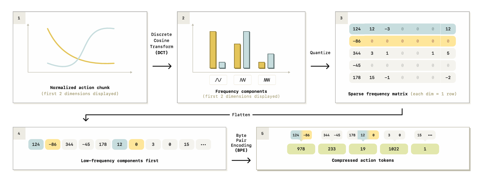
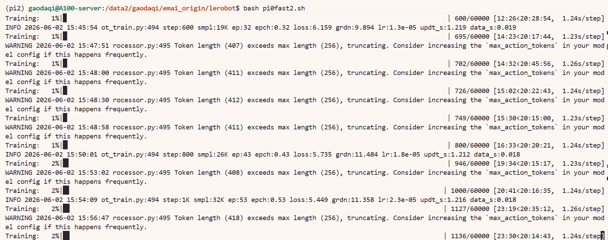

# 8.5.2.9 π0-FAST 复现

## 学习目标

- 解释 π0-FAST 的模型架构和工作原理。
- 对比 π0 与 π0-FAST 的训练效率和显存占用。
- 使用 LeRobot 完成 π0-FAST 微调训练。

## π0-FAST 简介

π0-FAST 是 π0 的快速变体，核心差异在于动作生成方式：π0 使用 Flow Matching多步去噪，π0-FAST 使用 **FAST tokenizer** 将连续动作离散化为 token 序列，通过自回归解码直接生成动作 token。这使得训练速度更快、显存占用更小，且推理时单次前向即可输出动作，无需迭代去噪。

> 论文：[FAST: Efficient Action Tokenization for Vision-Language-Action Models](https://arxiv.org/abs/2501.09747)



###  π0 与 π0-FAST 关键差异对比

| 维度 | π0 | π0-FAST |
|---|---|---|
| 动作生成 | Flow Matching（多步去噪） | FAST tokenizer（自回归解码） |
| 训练参数控制 | `freeze_vision_encoder` + `train_expert_only` | 无此参数，默认全参数训练 |
| 推理速度 | 较慢（迭代去噪） | 较快（单次前向） |


## 模环境与数据、模型准备

### 环境安装

注：pi0、pi0fast、pi05共用同一环境

首先进入 LeRobot 仓库并创建 conda 环境（`xxx` 替换为你自定义的环境名）：

```bash
cd lerobot
conda create -y -n xxx python=3.12
conda activate xxx
```

然后安装 LeRobot 及 PI 相关依赖：

```bash
# 安装基础依赖
pip install -e .

# 安装 PI + 训练扩展
pip install -e ".[pi,training]"

# FFmpeg（视频解码用）
conda install -c conda-forge ffmpeg -y
```

### 数据下载

注：其他章节下载过可跳过此部分

本教程使用 ALOHA 静态叉子拾取数据集，下载命令如下：

```bash
export HF_ENDPOINT=https://hf-mirror.com

hf download lerobot/aloha_static_fork_pick_up \
  --repo-type dataset \
  --local-dir /path/to/aloha_static_fork_pick_up
```


### π0-FAST 预训练模型

```bash
export HF_ENDPOINT=https://hf-mirror.com
hf download lerobot/pi0fast-base --local-dir /path/to/pi0fast-base
```

### PaliGemma（VLM 骨干，与 π0 通用）

如果已为 π0 下载过 PaliGemma，可跳过此步骤：

```bash
hf download google/paligemma-3b-pt-224 --local-dir /path/to/paligemma-3b-pt-224
```

### FAST Action Tokenizer

π0-FAST 额外依赖 FAST tokenizer 完成动作离散化与解码：

```bash
hf download physical-intelligence/fast --local-dir /path/to/pi_fast
```

### 下载后修改配置

三个模型都下载完成后，需修改 π0-FAST 模型目录中的以下文件：

`config.json`：

```json
{
  "text_tokenizer_name": "/path/to/paligemma-3b-pt-224",
  "action_tokenizer_name": "/path/to/pi_fast"
}
```

`policy_preprocessor.json`：

```json
{
  "tokenizer_name": "/path/to/paligemma-3b-pt-224",
  "action_tokenizer_processor": "/path/to/pi_fast"
}
```

## 训练脚本与参数详解

### 完整训练命令

以下脚本使用 2 张 GPU 在 ALOHA 数据集上微调 PI0-FAST，可在lerobot目录下保存为.sh脚本运行：

```bash
#!/bin/bash

# ======================== 基础配置 ========================
TASK_NAME="aloha_static_fork_pick_up"
DATA_PATH="/path/to/aloha_static_fork_pick_up"             # 替换为你的数据路径
MODEL_PATH="/path/to/pi0fast-base"                         # 替换为你的 PI0-FAST 模型路径
MASTER_PORT=29511                                          # 多卡通信端口

export HF_HOME=/path/to/lerobot/.cache                     # 替换为你的缓存路径
export HF_LEROBOT_HOME=/path/to/lerobot/.cache
export TRANSFORMERS_VERBOSITY=error                        # 抑制冗余警告
export CUDA_VISIBLE_DEVICES=0,1                            # 指定使用的 GPU

# ======================== 启动训练 ========================
accelerate launch \
    --num_processes=2 \
    --num_machines=1 \
    --mixed_precision=bf16 \
    --dynamo_backend=no \
    --main_process_port $MASTER_PORT \
    $(which lerobot-train) \
    --dataset.repo_id=$DATA_PATH \
    --dataset.root=$DATA_PATH \
    --output_dir=./outputs/pi0fast_$TASK_NAME \
    --job_name=pi0fast_$TASK_NAME \
    --policy.path=$MODEL_PATH \
    --policy.dtype=bfloat16 \
    --batch_size=8 \
    --steps=60000 \
    --policy.scheduler_decay_steps=60000 \
    --save_checkpoint=true \
    --save_freq=10000 \
    --policy.device=cuda \
    --rename_map='{"observation.images.cam_high": "observation.images.base_0_rgb", "observation.images.cam_left_wrist": "observation.images.left_wrist_0_rgb", "observation.images.cam_right_wrist": "observation.images.right_wrist_0_rgb"}' \
    --wandb.enable=false \
    --wandb.disable_artifact=true \
    --policy.push_to_hub=false \
    --resume=false
```

> `batch_size=8` 是每张卡的 batch size，2 卡总 batch = 16。

### 核心参数说明

#### ① 启动前必须修改的路径

| 参数 | 说明 |
|---|---|
| `DATA_PATH` | 数据集本地路径 |
| `MODEL_PATH`（`--policy.path`） | PI0-FAST 预训练模型路径 |
| `HF_HOME` / `HF_LEROBOT_HOME` | HuggingFace 缓存目录 |
| `CUDA_VISIBLE_DEVICES` | GPU 配置，单卡时同时将 `--num_processes` 改为 `1` |


#### ② 关键参数：`batch_size` 与 `--rename_map`

`batch_size`：PI0-FAST 显存占用比 π0 低，80GB A100 场景下可设置 `batch_size=8` ，可根据实际显存调整。

`--rename_map`：PI0-FAST 的相机 key 使用语义化命名（`base_0_rgb`、`left_wrist_0_rgb` 等），与 π0 的序号命名不同。ALOHA 数据集的映射关系如下：

| 数据集原始 key | 模型 key | 对应相机 |
|---|---|---|
| `observation.images.cam_high` | `observation.images.base_0_rgb` | 俯视全局相机 |
| `observation.images.cam_left_wrist` | `observation.images.left_wrist_0_rgb` | 左腕相机 |
| `observation.images.cam_right_wrist` | `observation.images.right_wrist_0_rgb` | 右腕相机 |

> 注意：PI0-FAST 的 ALOHA 数据集中仅使用 3 路相机，因此 rename_map 中无需映射第四路。


#### ④ 其余参数速览

| 参数 | 作用 |
|---|---|
| `--num_processes` | GPU 数量，与 `CUDA_VISIBLE_DEVICES` 一致 |
| `--mixed_precision=bf16` | bf16 混合精度 |
| `--dynamo_backend=no` | 必须为 `no`，与 torchdynamo 不兼容 |
| `--policy.dtype=bfloat16` | 模型加载精度 |
| `--steps=60000` | 总训练步数（PI0-FAST 建议比 π0 多训 50%） |
| `--policy.scheduler_decay_steps=60000` | lr 衰减步数，与 `--steps` 一致 |
| `--save_freq=10000` | 每 10k 步保存一次 checkpoint |
| `--wandb.enable=false` | 关闭 wandb 日志 |

### 运行成功截图



## 导航

- 返回父页：[LeRobot](../08-lerobot.md)
- 上一节：[π0 复现](08-pi0.md)
- 下一节：[π0.5 复现](10-pi05.md)
