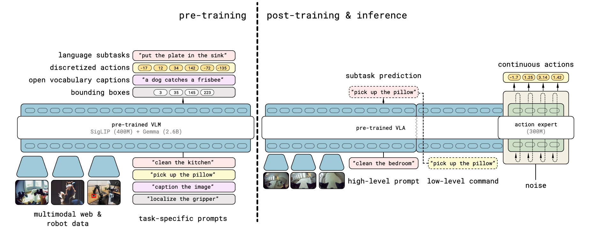
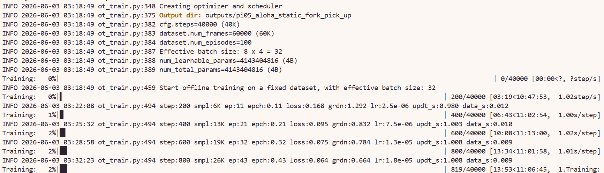

# 8.5.2.10 π0.5 复现


## 学习目标

- 解释 π0.5 与 π0 的架构差异。
- 掌握 π0.5 的多相机配置方法和 `--rename_map`。
- 使用 LeRobot 完成 π0.5 微调训练。

## π0.5 简介

π0.5 是 Physical Intelligence 在 π0 基础上推出的升级版 VLA 模型。它延续了 π0 的 PaliGemma + Flow Matching 架构，同时引入了三项关键改进：

- **AdaRMS（Adaptive RMS Normalization）条件化**：替代传统 RMS Norm，根据输入特征动态调整归一化参数，增强模型对多 embodiment 的适应能力
- **Quantiles 归一化**：对连续动作空间做分位数归一化，提升训练稳定性，缓解连续值回归中的长尾分布问题
- **200 token 长度输入**：将输入序列长度扩展至 200 tokens，支持更长的多模态上下文和多帧历史

与 π0 的关键架构差异：π0.5 使用**离散状态输入**，去掉了 `state_proj` 层，机器人状态直接以 token 形式注入 Transformer 而非通过投影层映射。这使得模型能更自然地融合状态、视觉和语言三种模态。

> 论文：[π0.5: A Vision-Language-Action Model with Open-World Generalization](https://arxiv.org/abs/2504.16054)



## 环境与数据、模型准备

### 环境安装

> 注：π0、PI0-FAST、π0.5 共用同一环境，如已安装可跳过。

首先进入 LeRobot 仓库并创建 conda 环境（`xxx` 替换为你自定义的环境名）：

```bash
cd lerobot
conda create -y -n xxx python=3.12
conda activate xxx
```

然后安装 LeRobot 及 PI 相关依赖：

```bash
# 安装基础依赖
pip install -e .

# 安装 PI + 训练扩展
pip install -e ".[pi,training]"

# FFmpeg（视频解码用）
conda install -c conda-forge ffmpeg -y
```

### 数据下载

> 注：其他章节下载过可跳过。

本教程使用 ALOHA 数据集，下载命令如下：

```bash
export HF_ENDPOINT=https://hf-mirror.com

hf download lerobot/aloha_static_fork_pick_up \
  --repo-type dataset \
  --local-dir /path/to/aloha_static_fork_pick_up
```

### π0.5 预训练模型

```bash
export HF_ENDPOINT=https://hf-mirror.com
hf download lerobot/pi05_base --local-dir /path/to/pi05_base
```

### PaliGemma（VLM 骨干，与 π0 / PI0-FAST 通用）

如果已为 π0 或 PI0-FAST 下载过 PaliGemma，可跳过此步骤：

```bash
hf download google/paligemma-3b-pt-224 --local-dir /path/to/paligemma-3b-pt-224
```

### 下载后修改配置

模型下载完成后，需修改 π0.5 模型目录中的 `policy_preprocessor.json`，将 `tokenizer_name` 指向本地 PaliGemma 路径：

```json
{
  "tokenizer_name": "/path/to/paligemma-3b-pt-224"
}
```

### 数据集归一化
PI05 模型默认用 QUANTILES 归一化，但数据集只有 MEAN_STD stats。需要给数据集补充 quantile stats

```
python src/lerobot/scripts/augment_dataset_quantile_stats.py \
    --repo-id=aloha_static_fork_pick_up \
    --root=/data2/gaodaqi/emai_origin/data/aloha_static_fork_pick_up
```

## 训练脚本与参数详解

### 完整训练命令

以下脚本使用 2 张 GPU 在 ALOHA 数据集上微调 π0.5，可在lerobot目录下保存为.sh脚本运行：

```bash
#!/bin/bash

# ======================== 基础配置 ========================
TASK_NAME="aloha_static_fork_pick_up"
DATA_PATH="/path/to/aloha_static_fork_pick_up"             # 替换为你的数据路径
MODEL_PATH="/path/to/pi05_base"                            # 替换为你的 π0.5 模型路径
MASTER_PORT=29992                                          # 多卡通信端口

export HF_HOME=/path/to/lerobot/.cache                     # 替换为你的缓存路径
export HF_LEROBOT_HOME=/path/to/lerobot/.cache
export TRANSFORMERS_OFFLINE=1                              # 禁止联网下载模型
export TRANSFORMERS_VERBOSITY=error                        # 抑制冗余警告
export CUDA_VISIBLE_DEVICES=4,5                            # 指定使用的 GPU

# ======================== 启动训练 ========================
accelerate launch \
    --num_processes=2 \
    --num_machines=1 \
    --mixed_precision=bf16 \
    --dynamo_backend=no \
    --main_process_port $MASTER_PORT \
    $(which lerobot-train) \
    --dataset.repo_id=$DATA_PATH \
    --dataset.root=$DATA_PATH \
    --output_dir=./outputs/pi05_$TASK_NAME \
    --job_name=pi05_$TASK_NAME \
    --policy.path=$MODEL_PATH \
    --policy.dtype=bfloat16 \
    --batch_size=8 \
    --steps=40000 \
    --policy.scheduler_decay_steps=30000 \
    --save_checkpoint=true \
    --save_freq=10000 \
    --policy.device=cuda \
    --policy.freeze_vision_encoder=false \
    --policy.train_expert_only=false \
    --rename_map='{"observation.images.cam_high": "observation.images.base_0_rgb", "observation.images.cam_left_wrist": "observation.images.left_wrist_0_rgb", "observation.images.cam_right_wrist": "observation.images.right_wrist_0_rgb"}' \
    --wandb.enable=false \
    --wandb.disable_artifact=false \
    --policy.push_to_hub=false \
    --resume=false
```

> `batch_size=8` 是每张卡的 batch size，2 卡总 batch = 16。

### 核心参数说明

#### ① 启动前必须修改的路径

| 参数 | 说明 |
|---|---|
| `DATA_PATH` | 数据集本地路径 |
| `MODEL_PATH`（`--policy.path`） | π0.5 预训练模型路径，指向 `hf download lerobot/pi05_base` 的目录 |
| `HF_HOME` / `HF_LEROBOT_HOME` | HuggingFace 缓存目录 |
| `CUDA_VISIBLE_DEVICES` | GPU 配置，单卡时同时将 `--num_processes` 改为 `1` |


#### ② `batch_size`

`batch_size`：π0.5 显存占用与 π0 相近，80GB A100 可设置 `batch_size=8`，其他可根据实际显存调整。


#### ③ `--rename_map` 说明

π0.5 的相机 key 使用语义化命名（`base_0_rgb`、`left_wrist_0_rgb` 等），与 PI0不同，但与 PI0-FAST 一致：

| 数据集原始 key | 模型 key | 对应相机 |
|---|---|---|
| `observation.images.cam_high` | `observation.images.base_0_rgb` | 俯视全局相机 |
| `observation.images.cam_left_wrist` | `observation.images.left_wrist_0_rgb` | 左腕相机 |
| `observation.images.cam_right_wrist` | `observation.images.right_wrist_0_rgb` | 右腕相机 |

> 注意：当前 ALOHA 数据集中仅使用 3 路相机，因此 rename_map 中无需映射第四路。


#### ⑤ 其余参数速览

| 参数 | 作用 |
|---|---|
| `--num_processes` | GPU 数量，与 `CUDA_VISIBLE_DEVICES` 一致 |
| `--mixed_precision=bf16` | bf16 混合精度，节省显存 |
| `--dynamo_backend=no` | 必须为 `no`，与 torchdynamo 不兼容 |
| `--policy.dtype=bfloat16` | 模型加载精度 |
| `--policy.freeze_vision_encoder` | `false`解冻 PaliGemma 视觉编码器 |
| `--policy.train_expert_only` | `false`训练整个模型；设为 `true` 则仅训练 Action Expert |
| `--steps=40000` | 总训练步数 |
| `--policy.scheduler_decay_steps=40000` | lr 衰减步数 |
| `--save_freq=10000` | 每 10k 步保存一次 checkpoint |
| `--wandb.enable=false` | 关闭 wandb 日志，按需开启 |
| `--resume=false` | 断点续训，设为 `true` 时从 `output_dir` 恢复 |

### 运行成功截图


## 导航

- 返回父页：[LeRobot](../08-lerobot.md)
- 上一节：[PI0-FAST 复现](09-pi0fast.md)

