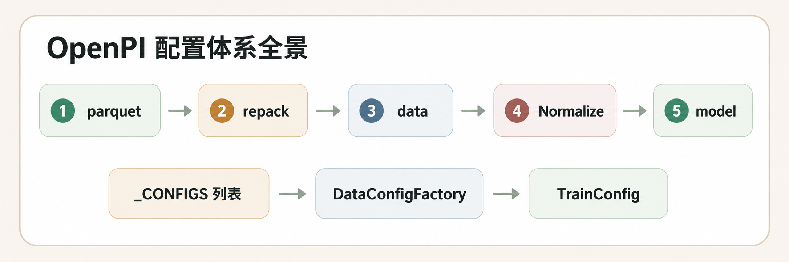

# OpenPI

> 先修：[07 数据类型和收集](../../06-data-teleoperation-and-imitation-learning/README.md)

OpenPI 是 Physical Intelligence（π）开源的机器人基础模型库，提供了 π0、PI0-FAST 和 π0.5 三个 VLA 模型的完整训练、微调和部署代码。它的核心架构基于 PaliGemma（Gemma-2B）作为 VLM 骨干、SigLIP 作为视觉编码器，以及独立的 Action Expert 负责动作生成。

与 LeRobot 不同的是，OpenPI 的定位更"上层"——它不是通用机器人学习框架，而是专门为大规模 VLA 模型设计的训练和推理框架。OpenPI 的数据层依赖 LeRobot 格式，但其配置系统、模型架构和部署方式都围绕 Physical Intelligence 的 π 模型家族设计。

图 8.5.1 OpenPI 配置体系全景。数据从 Parquet 出发，依次经过 repack_transforms、data_transforms、Normalize、model_transforms，最终进入模型。

## 阅读路线

| 章节 | 内容 |
|---|---|
| [OpenPI 整体介绍](09-openpi/01-overview.md) | OpenPI 是什么、解决什么问题、支持的模型变体、硬件要求 |
| [环境安装](09-openpi/02-setup.md) | `uv` 环境搭建、JAX/PyTorch 后端、git submodule |
| [π0 训练](09-openpi/03-pi0.md) | LIBERO 数据集、TrainConfig 配置详解、Flow Matching 微调 |
| [PI0-FAST 训练](09-openpi/04-pi0fast.md) | FAST tokenizer 替换 Flow Matching、与 π0 的差异 |
| [π0.5 训练](09-openpi/05-pi05.md) | AdaRMS + Quantiles 归一化、离散状态输入 |
| [自定义数据集训练](09-openpi/06-custom-dataset.md) | 两种方案：LeRobotDataConfig 直接配置 / 新建 policy + DataConfigFactory |

## References

[https://github.com/Physical-Intelligence/openpi](https://github.com/Physical-Intelligence/openpi)
