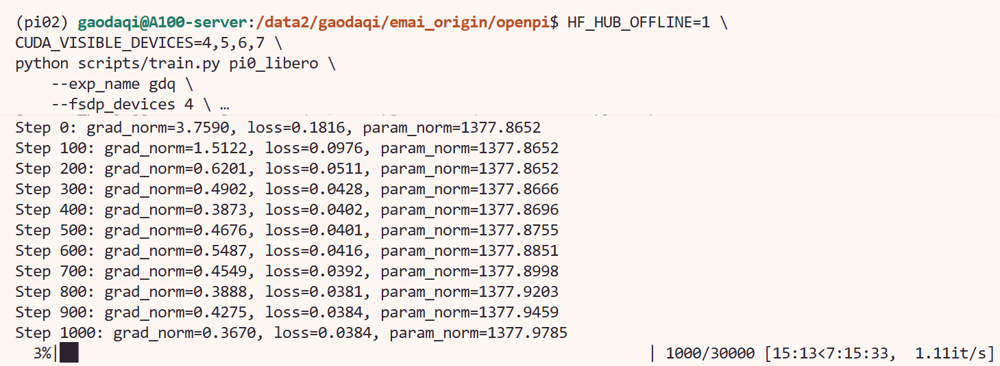

# 8.5.1.3 π0 训练

## 学习目标

- 理解 π0 的 Flow Matching 架构和训练策略。
- 使用 OpenPI TrainConfig 完成 π0 微调训练，掌握配置驱动的训练流程。
- 理解 `weight_loader`、`repo_id` 等关键配置字段的含义和用法。

## π0 简介

π0 是 Physical Intelligence 开发的 VLA 基础模型，也是 OpenPI 的核心模型之一。它基于 PaliGemma（Gemma-2B）作为 VLM 骨干、SigLIP 作为视觉编码器，动作生成采用 **Flow Matching** 机制——通过 10 步反向 ODE 从噪声逐步去噪得到动作序列。

在 OpenPI 中使用 π0 的优势在于：预置的 `pi0_libero` 等 TrainConfig 已经封装好了模型架构、数据加载和训练超参数，你只需要准备好数据集和预训练权重，通过 CLI override 即可启动训练。

> 论文：[π0: A Vision-Language-Action Flow Model for General Robot Control](https://arxiv.org/abs/2410.24164)


## 环境变量

后续所有命令需要在 OpenPI 仓库根目录下执行，并预先设置以下环境变量：

```bash
cd /path/to/openpi

export HF_ENDPOINT=https://hf-mirror.com
export HF_DATASETS_CACHE=/path/to/.cache/datasets
export HF_LEROBOT_HOME=/path/to/lerobot/.cache
```
这里的缓存需要设置成你的位置，比如在我的服务器上，我可以设置为
export HF_ENDPOINT=https://hf-mirror.com
export HF_LEROBOT_HOME=/data2/gaodaqi/emai_origin/lerobot/.cache
export HF_DATASETS_CACHE=/data2/gaodaqi/.cache/datasets


| 变量 | 作用 |
|---|---|
| `HF_ENDPOINT` | 让 HF API 请求走镜像站，避免直连 `huggingface.co` 导致网络不可达 |
| `HF_DATASETS_CACHE` | HuggingFace datasets 库的缓存目录，归一化计算时在该目录下读写缓存 |
| `HF_LEROBOT_HOME` | LeRobot 的数据集查找路径，训练脚本从 `$HF_LEROBOT_HOME/lerobot/<repo_id>/` 加载数据 |


## 数据与模型准备

### 数据下载

本教程使用 LIBERO 数据集，但是目前LeRobot官方数据集已更新至v3.0版本，所以使用physical-intelligence团队的数据集，下载到 LeRobot 缓存路径下：

```bash
hf download physical-intelligence/libero \
    --local-dir /path/to/lerobot/.cache/lerobot/physical-intelligence/libero \
    --repo-type dataset
```

### 模型下载

```python
可以直接在命令行中用这行代码进行下载：

OPENPI_DATA_HOME=/data2/gaodaqi/emai_origin/openpi/models uv run python -c "
import os
os.environ['OPENPI_DATA_HOME'] = '/data2/gaodaqi/emai_origin/openpi/models'
from openpi.shared import download
print(download.maybe_download('gs://openpi-assets/checkpoints/pi0_base'))
"

```

## 训练脚本与参数详解

### TrainConfig 配置

下面是在 `config.py` 中已预置的 `pi0_libero` 完整配置，它在 LIBERO 数据集上全参数微调 π0 模型：

```python
TrainConfig(
        # Change the name to reflect your model and dataset.
        name="pi0_libero",
        # Here you define the model config -- In this example we use pi0 as the model
        # architecture and perform *full* finetuning. in the examples below we show how to modify
        # this to perform *low-memory* (LORA) finetuning and use pi0-FAST as an alternative architecture.
        model=pi0_config.Pi0Config(),
        # Here you define the dataset you are training on. In this example we use the Libero
        # dataset. For your own dataset, you can change the repo_id to point to your dataset.
        # Also modify the DataConfig to use the new config you made for your dataset above.
        data=LeRobotLiberoDataConfig(
            repo_id="physical-intelligence/libero",
            base_config=DataConfig(
                # This flag determines whether we load the prompt (i.e. the task instruction) from the
                # ``task`` field in the LeRobot dataset. If set to True, the prompt will show up in
                # a field called ``prompt`` in the input dict. The recommended setting is True.
                prompt_from_task=True,
            ),
            extra_delta_transform=True,
        ),
        # Here you define which pre-trained checkpoint you want to load to initialize the model.
        # This should match the model config you chose above -- i.e. in this case we use the pi0 base model.
        weight_loader=weight_loaders.CheckpointWeightLoader("gs://openpi-assets/checkpoints/pi0_base/params"),
        # Below you can define other hyperparameters like the learning rate, number of training steps, etc.
        # Check the base TrainConfig class for a full list of available hyperparameters.
        num_train_steps=30_000,
    ),
```

各字段含义：

| 字段 | 作用 | 说明 |
|---|---|---|
| `name` | 配置名称 | `"pi0_libero"` 是全局唯一标识，CLI 通过 `--config_name` 或位置参数引用 |
| `model` | 模型架构 | `Pi0Config()` 使用标准 π0 架构 |
| `data` | 数据集配置 | `LeRobotLiberoDataConfig` 封装了 LIBERO 的数据路径、预处理和归一化逻辑 |
| `data.repo_id` | 数据集 Hub ID | 训练时从 `$HF_LEROBOT_HOME/lerobot/<repo_id>/` 加载本地副本 |
| `data.prompt_from_task` | 语言指令来源 | `True` 时从每条 episode 的 `task` 字段自动提取（如 "pick up the black bowl"） |
| `data.extra_delta_transform` | 动作差分变换 | `True` 时额外计算 delta 表示，适合 LIBERO 这种绝对位置控制任务 |
| `weight_loader` | 预训练权重加载器 | `CheckpointWeightLoader` 默认指向 GCS，训练时通过 CLI `--weight_loader.load_path` 覆盖为本地路径 |
| `num_train_steps` | 总训练步数 | 30000 步，CLI 可通过 `--num_train_steps` 覆盖 |

### 完整训练流程

```bash
# 1. 计算归一化统计量（约 70 分钟，具体耗时取决于数据量）
python scripts/compute_norm_stats.py --config_name pi0_libero

# 2. 启动训练（CLI 覆盖 weight_loader 路径）

HF_HUB_OFFLINE=1 \
CUDA_VISIBLE_DEVICES=4,5,6,7 \
python scripts/train.py pi0_libero \
    --exp_name gdq \
    --fsdp_devices 4 \
    --weight_loader.params_path=/data2/gaodaqi/emai_origin/models/openpi/pi0_base/params \
    --overwrite
```


 `--weight_loader.load_path` 通过 tyro 的 CLI override 机制覆盖了 `config.py` 中的 GCS 路径，无需修改源码。归一化统计量会写入 `assets/pi0_libero/physical-intelligence/libero/` 目录，训练时自动加载。

### CLI 参数速览

| 参数 | 作用 |
|---|---|
| `--exp_name` | 实验名称，决定 checkpoint 输出目录 |
| `--fsdp_devices` | FSDP 分片设备数，与 `CUDA_VISIBLE_DEVICES` 一致 |
| `--weight_loader.load_path` | 覆盖 `config.py` 中的预训练权重路径（tyro `.` 语法） |
| `--num_train_steps` | 可覆盖 `config.py` 中的训练步数，用于快速验证 |


### 运行成功截图


## 导航

- 返回父页：[OpenPI](../09-openpi.md)
- 上一节：[环境安装](02-setup.md)
- 下一节：[π0-FAST 训练](04-pi0fast.md)
