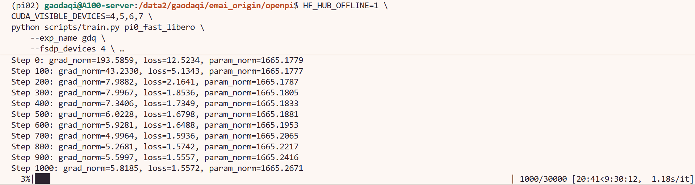

# 8.5.1.4 π0-FAST 训练

## 学习目标

- 理解 π0-FAST 的架构特点（FAST tokenizer 替代 Flow Matching）。
- 使用 OpenPI TrainConfig 完成 π0-FAST 微调训练。
- 对比 π0 和 π0-FAST 的训练效率和显存占用。

## π0-FAST 简介

π0-FAST 是 π0 的快速变体，核心差异在于动作生成方式：π0 使用 Flow Matching（10 步反向 ODE 迭代去噪），π0-FAST 使用 **FAST tokenizer** 将连续动作离散化为 token 序列，通过自回归解码直接生成动作 token。这使得训练速度更快、显存占用更小，推理时单次前向即可输出动作，无需迭代去噪。

在 OpenPI 中，π0-FAST 共享 π0 的训练基础设施（环境变量、数据格式、CLI 入口），仅需切换配置名称和预训练权重即可。

> 论文：[FAST: Efficient Action Tokenization for Vision-Language-Action Models](https://arxiv.org/abs/2501.09747)


## 环境变量

与 π0 完全相同，参见 [π0 训练 — 环境变量](03-pi0.md)。关键变量：

```bash
cd /path/to/openpi

export HF_ENDPOINT=https://hf-mirror.com
export HF_DATASETS_CACHE=/path/to/.cache/datasets
export HF_LEROBOT_HOME=/path/to/lerobot/.cache
```

| 变量 | 作用 |
|---|---|
| `HF_ENDPOINT` | HF API 请求走镜像站 |
| `HF_DATASETS_CACHE` | HuggingFace datasets 缓存目录 |
| `HF_LEROBOT_HOME` | LeRobot 数据集查找路径 |

## 数据与模型准备

### 数据下载

与 π0 使用同一份 LIBERO 数据集，如已下载可跳过：

```bash
hf download physical-intelligence/libero \
    --local-dir /path/to/lerobot/.cache/lerobot/physical-intelligence/libero \
    --repo-type dataset
```

### 模型下载

可以直接在命令行中用这行代码进行下载：
```python
OPENPI_DATA_HOME=/data2/gaodaqi/emai_origin/openpi/models uv run python -c "
import os
os.environ['OPENPI_DATA_HOME'] = '/data2/gaodaqi/emai_origin/openpi/models'
from openpi.shared import download
print(download.maybe_download('gs://openpi-assets/checkpoints/pi0_fast_base'))
"
```
## 训练脚本与参数详解

### TrainConfig 配置

下面是 `config.py` 中已预置的 `pi0_fast_libero` 完整配置：

```python
TrainConfig(
        name="pi0_fast_libero",
        # Here is an example of loading a pi0-FAST model for full finetuning.
        # Modify action_dim and action_horizon to match your dataset (action horizon is equal to
        # the desired action chunk length).
        # The max_token_len is the maximum number of (non-image) tokens the model can handle.
        # This includes the tokenized prompt, proprioceptive state, and (FAST-tokenized) action tokens.
        # Choosing this value too small may chop off tokens at the end of your sequence (the code will throw
        # a warning), while choosing it too large will waste memory (since we pad each batch element to the
        # max_token_len). A good rule of thumb is to use approx 180 for single-arm robots, and approx 250 for
        # two-arm robots. Generally, err on the lower side here first, and potentially increase the value if
        # you see many warnings being thrown during training.
        model=pi0_fast.Pi0FASTConfig(action_dim=7, action_horizon=10, max_token_len=180),
        data=LeRobotLiberoDataConfig(
            repo_id="physical-intelligence/libero",
            base_config=DataConfig(prompt_from_task=True),
            extra_delta_transform=True,
        ),
        # Note that we load the pi0-FAST base model checkpoint here.
        weight_loader=weight_loaders.CheckpointWeightLoader("gs://openpi-assets/checkpoints/pi0_fast_base/params"),
        num_train_steps=30_000,
    ),
```

各字段含义：

| 字段 | 作用 | 说明 |
|---|---|---|
| `name` | 配置名称 | `"pi0_fast_libero"` 是全局唯一标识 |
| `model` | 模型架构 | `Pi0FastConfig()` 使用 FAST tokenizer + 自回归解码替代 Flow Matching |
| `data` | 数据集配置 | 与 π0 共用同一份 `LeRobotLiberoDataConfig` |
| `data.repo_id` | 数据集 Hub ID | 训练时从 `$HF_LEROBOT_HOME/lerobot/<repo_id>/` 加载本地副本 |
| `data.prompt_from_task` | 语言指令来源 | `True` 时从每条 episode 的 `task` 字段自动提取 |
| `data.extra_delta_transform` | 动作差分变换 | `True` 时额外计算 delta 表示 |
| `weight_loader` | 预训练权重加载器 | 默认指向 GCS，训练时通过 `--weight_loader.load_path` 覆盖 |
| `num_train_steps` | 总训练步数 | 30000 步，CLI 可覆盖 |

### 完整训练流程

```bash
# 1. 计算归一化统计量
HF_HUB_OFFLINE=1 \
python scripts/compute_norm_stats.py --config-name pi0_fast_libero


# 2. 启动训练
HF_HUB_OFFLINE=1 \
CUDA_VISIBLE_DEVICES=4,5,6,7 \
python scripts/train.py pi0_fast_libero \
    --exp_name xxx \
    --fsdp_devices 4 \
    --weight_loader.params_path=/path/to/models/openpi/pi0_fast_base
    --overwrite
```

> PI0-FAST 推断速度更快、显存占用更小，相同硬件下可尝试比 π0 更大的 batch size 或更少的 FSDP 分片。

### CLI 参数速览

| 参数 | 作用 |
|---|---|
| `--exp_name` | 实验名称，决定 checkpoint 输出目录 |
| `--fsdp_devices` | FSDP 分片设备数，与 `CUDA_VISIBLE_DEVICES` 一致 |
| `--weight_loader.load_path` | 覆盖 `config.py` 中的预训练权重路径 |
| `--num_train_steps` | 可覆盖训练步数，用于快速验证 |

### 与 π0 的关键差异

| 维度 | π0 | PI0-FAST |
|---|---|---|
| 模型配置 | `pi0_config.Pi0Config()` | `pi0_fast_config.Pi0FastConfig()` |
| 动作生成 | Flow Matching（10 步 ODE） | FAST tokenizer（自回归解码） |
| 推理速度 | 较慢（迭代去噪） | 较快（单次前向） |
| 显存占用 | 较高 | 较低 |
| 预训练权重 | `pi0_base` | `pi0_fast_base` |
| 配置名称 | `pi0_libero` | `pi0_fast_libero` |

### 运行成功截图


## 导航

- 返回父页：[OpenPI](../09-openpi.md)
- 上一节：[π0 训练](03-pi0.md)
- 下一节：[π0.5 训练](05-pi05.md)
