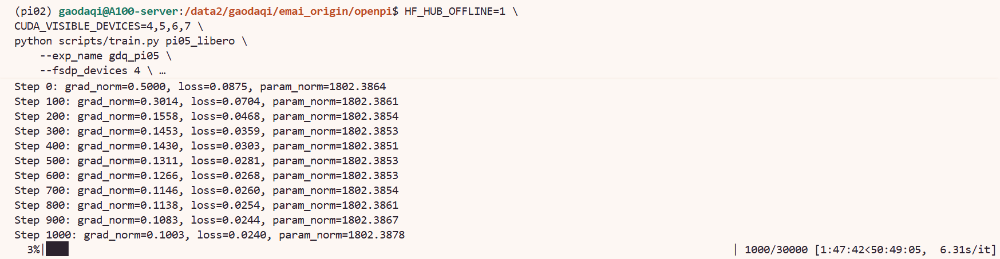

# 8.5.1.5 π0.5 训练

## 学习目标

- 理解 π0.5 与 π0 的架构差异（AdaRMS、Quantiles 归一化、离散状态输入）。
- 使用 OpenPI TrainConfig 完成 π0.5 微调训练。
- 掌握不同模型间的 weight_loader 和 assets 配置差异。

## π0.5 简介

π0.5 是 Physical Intelligence 在 π0 基础上推出的升级版 VLA 模型。它延续了 π0 的 PaliGemma + Flow Matching 架构，同时引入了三项关键改进：

- **AdaRMS（Adaptive RMS Normalization）条件化**：替代传统 RMS Norm，根据输入特征动态调整归一化参数，增强模型对多 embodiment 的适应能力
- **Quantiles 归一化**：对连续动作空间做分位数归一化，提升训练稳定性
- **离散状态输入**：去掉了 `state_proj` 层，机器人状态直接以 token 形式注入 Transformer，使模型更自然地融合状态、视觉和语言三种模态

在 OpenPI 中，π0.5 的训练流程与 π0 完全一致，仅需切换配置名称和预训练权重。

> 论文：[π0.5: A Vision-Language-Action Model with Open-World Generalization](https://arxiv.org/abs/2504.16054)


## 环境变量

与 π0 完全相同，参见 [π0 训练 — 环境变量](03-pi0.md)。关键变量：

```bash
cd /path/to/openpi

export HF_ENDPOINT=https://hf-mirror.com
export HF_DATASETS_CACHE=/path/to/.cache/datasets
export HF_LEROBOT_HOME=/path/to/lerobot/.cache
```

| 变量 | 作用 |
|---|---|
| `HF_ENDPOINT` | HF API 请求走镜像站 |
| `HF_DATASETS_CACHE` | HuggingFace datasets 缓存目录 |
| `HF_LEROBOT_HOME` | LeRobot 数据集查找路径 |

## 数据与模型准备

### 数据下载

与 π0 使用同一份 LIBERO 数据集，如已下载可跳过：

```bash
hf download physical-intelligence/libero \
    --local-dir /path/to/lerobot/.cache/lerobot/physical-intelligence/libero \
    --repo-type dataset
```

### 模型下载

π0.5 基座权重约 14 GB，可以直接在命令行中用这行代码进行下载：

```python
OPENPI_DATA_HOME=/data2/gaodaqi/emai_origin/openpi/models uv run python -c "
import os
os.environ['OPENPI_DATA_HOME'] = '/data2/gaodaqi/emai_origin/openpi/models'
from openpi.shared import download
print(download.maybe_download('gs://openpi-assets/checkpoints/pi05_base'))
```
## 训练脚本与参数详解

### TrainConfig 配置

下面是 `config.py` 中已预置的 `pi0_5_libero` 完整配置：

```python
TrainConfig(
        name="pi05_libero",
        model=pi0_config.Pi0Config(pi05=True, action_horizon=10, discrete_state_input=False),
        data=LeRobotLiberoDataConfig(
            repo_id="physical-intelligence/libero",
            base_config=DataConfig(prompt_from_task=True),
            extra_delta_transform=False,
        ),
        batch_size=256,
        lr_schedule=_optimizer.CosineDecaySchedule(
            warmup_steps=10_000,
            peak_lr=5e-5,
            decay_steps=1_000_000,
            decay_lr=5e-5,
        ),
        optimizer=_optimizer.AdamW(clip_gradient_norm=1.0),
        ema_decay=0.999,
        weight_loader=weight_loaders.CheckpointWeightLoader("gs://openpi-assets/checkpoints/pi05_base/params"),
        pytorch_weight_path="/path/to/your/pytorch_weight_path",
        num_train_steps=30_000,
    ),
```

各字段含义：

| 字段 | 作用 | 说明 |
|---|---|---|
| `name` | 配置名称 | `"pi0_5_libero"` 是全局唯一标识 |
| `model` | 模型架构 | `Pi0_5Config()` 使用 AdaRMS + Quantiles 归一化 + 离散状态输入 |
| `data` | 数据集配置 | 与 π0 / PI0-FAST 共用同一份 `LeRobotLiberoDataConfig` |
| `data.repo_id` | 数据集 Hub ID | 训练时从 `$HF_LEROBOT_HOME/lerobot/<repo_id>/` 加载本地副本 |
| `data.prompt_from_task` | 语言指令来源 | `True` 时从每条 episode 的 `task` 字段自动提取 |
| `data.extra_delta_transform` | 动作差分变换 | `True` 时额外计算 delta 表示 |
| `weight_loader` | 预训练权重加载器 | 默认指向 GCS，训练时通过 `--weight_loader.load_path` 覆盖 |
| `num_train_steps` | 总训练步数 | 30000 步，CLI 可覆盖 |

### 完整训练流程

```bash
# 1. 计算归一化统计量
python scripts/compute_norm_stats.py --config_name pi0_5_libero

# 2. 启动训练
HF_HUB_OFFLINE=1 \
CUDA_VISIBLE_DEVICES=4,5,6,7 \
python scripts/train.py pi0_5_libero \
    --exp_name gdq \
    --fsdp_devices 4 \
    --weight_loader.load_path=/path/to/models/openpi/pi0_5_base
```

> π0.5 使用 Quantiles 归一化，其归一化统计量与 π0 独立管理，存放在 `assets/pi0_5_libero/` 目录下。

### CLI 参数速览

| 参数 | 作用 |
|---|---|
| `--exp_name` | 实验名称，决定 checkpoint 输出目录 |
| `--fsdp_devices` | FSDP 分片设备数，与 `CUDA_VISIBLE_DEVICES` 一致 |
| `--weight_loader.load_path` | 覆盖 `config.py` 中的预训练权重路径 |
| `--num_train_steps` | 可覆盖训练步数，用于快速验证 |

### 与 π0 / PI0-FAST 的关键差异

| 维度 | π0 | PI0-FAST | π0.5 |
|---|---|---|---|
| 模型配置 | `Pi0Config()` | `Pi0FastConfig()` | `Pi0_5Config()` |
| 动作生成 | Flow Matching | FAST tokenizer（自回归） | Flow Matching |
| 归一化方式 | RMS Norm | RMS Norm | AdaRMS + Quantiles |
| 状态输入 | 连续（state_proj 投影） | 连续（state_proj 投影） | 离散（token 注入） |
| 预训练权重 | `pi0_base` | `pi0_fast_base` | `pi0_5_base` |
| 配置名称 | `pi0_libero` | `pi0_fast_libero` | `pi0_5_libero` |


### 运行成功截图



## 导航

- 返回父页：[OpenPI](../09-openpi.md)
- 上一节：[PI0-FAST 训练](04-pi0fast.md)
- 下一节：[自定义数据集训练](06-custom-dataset.md)
