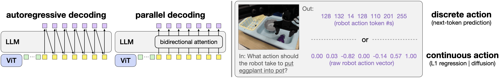

# 架构

OpenVLA-OFT 沿用 OpenVLA 的 backbone，改动集中在动作生成段：解码方式从自回归换成并行，动作表示从离散 token 换成连续值，动作头从复用 LLM 词表换成一个独立的回归 MLP。下图在解码方式（自回归 / 并行）和动作表示（离散 token / 连续值）两个维度上对比这些选择。

<figure>
  
  <figcaption>OpenVLA-OFT 在动作解码方式（自回归 / 并行）与动作表示（离散 token / 连续值）两个维度上的选择。</figcaption>
</figure>

## 输入

最小输入和 OpenVLA 一致：一张第三人称图像加一条语言指令。OFT 在此之上放开两类可选输入，由微调配置的 `num_images_in_input` 和 `use_proprio` 控制：

- 腕部相机图像：`num_images_in_input` 从 1 增到 2 时，加入一路腕部视角，视觉 patch 数相应增加。
- 本体状态：`use_proprio` 为真时，把机器人本体状态（如关节角、夹爪状态）投影后拼进输入序列。

并行解码省下的延迟留出了余量，让这些额外输入接进来仍能维持高频。论文报告里把视觉 patch 从 256 增到 512 后，完整 OFT 仍达到约 71.4 Hz、约 0.112 秒延迟。

## 主体

主体是 OpenVLA 的 Prismatic backbone：融合 DINOv2 与 SigLIP 的视觉编码器把图像映射成 patch embedding，projector 接到 Llama 2 7B 的输入空间，语言指令进入同一个上下文。这一部分 OFT 不改。

改动在动作生成段。原始 OpenVLA 用因果注意力逐 token 自回归解出离散动作 token；OFT 把动作位置之间的注意力改成双向，一次前向解出整段动作，再交给一个连续动作头回归出动作值，不经过词表、不取 argmax。并行解码怎么在一次前向里去掉串行依赖，是下一节的正题；这里先交代动作头。

## 动作头：连续回归替代离散 token

原始 OpenVLA 把每一维动作量化进 256 个分箱，解码时取分布的 argmax 落到某个箱中心，再反量化成连续值。分箱本身就引入误差：真实动作落在两个箱中心之间时只能就近取一个箱，分辨率被 256 个箱卡死。OFT 去掉这层离散化，让主干输出的 hidden states 经一个动作头直接回归出连续动作，省掉分箱再反量化的来回，精度不再受箱数限制。

动作头有两个变体，都定义在 `prismatic/models/action_heads.py`：

- `L1RegressionActionHead`：结构很轻，一个两层 block 的 `MLPResNet`，把整段动作的 hidden states 一次映射成连续动作，以 L1 损失训练。它是默认变体，相对 7B 主干计算量可忽略，吞吐和纯并行解码几乎一样。
- `DiffusionActionHead`：不直接回归，而是从噪声出发做条件去噪，用 `DDIMScheduler`，训练时设 50 个扩散步。推理时每个去噪步都要做一次主干前向，50 步意味着 50 次前向，单次推理延迟被拉到约 1.9 秒，动作生成吞吐回落到约 4.2 Hz，和原始 OpenVLA 相当。

论文报告里 L1 回归和 50 步 diffusion 的任务成功率相当，说明 7B 主干用简单的 L1 回归就足以拟合多任务的动作分布，不必靠 diffusion 的多步采样。以提速为目标时，默认选 L1：它拿到并行解码的全部吞吐收益，又避免了多步去噪的延迟。diffusion 头更适合愿意用延迟换取去噪式生成、或需要建模多峰动作分布的场景。

## 与原始 OpenVLA 的差异

同一个 7B backbone 和同一份预训练权重下，OFT 相对原始 OpenVLA 的架构差异集中在三处：动作位置的注意力从因果改成双向，动作表示从离散 token 改成连续值，动作输出从复用 LLM 词表改成一个独立的回归 MLP 头。视觉编码器、projector、语言主干这些部分不动。

## 本页小结

- OFT 在 OpenVLA 的 Prismatic backbone 上只改动作生成段，视觉与语言主体不动。
- 动作头用连续回归替代离散 token，去掉 256 分箱的离散化误差；默认 `L1RegressionActionHead`，另有更慢的 `DiffusionActionHead`。
- L1 与 50 步 diffusion 成功率相当，但 diffusion 每步一次前向、吞吐回落到 ~4.2 Hz，所以提速场景默认用 L1。

## 导航

- 上一节：[OpenVLA-OFT 是什么](01-what-is-openvla-oft.md)
- 返回上级：[OpenVLA-OFT](../01-openvla-oft.md)
- 下一节：[并行解码](03-parallel-decoding.md)
