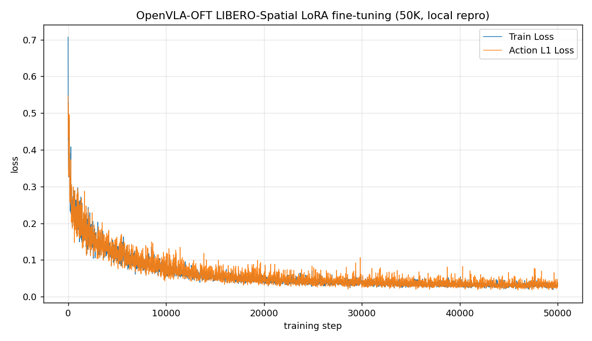

# 训练

OFT 配方通过 `vla-scripts/finetune.py` 对 `openvla-7b` 做 LoRA 微调，产出自训 checkpoint 和一条 loss 曲线。本页先给出官方微调配置与各开关含义、收敛判据，再说明本地这次相对官方调整了哪些参数，并给出对应的训练曲线。

## 微调配置

```bash
torchrun --standalone --nnodes 1 --nproc-per-node <GPU 数> vla-scripts/finetune.py \
  --vla_path openvla/openvla-7b \
  --data_root_dir /PATH/TO/RLDS \
  --dataset_name libero_spatial_no_noops \
  --run_root_dir /PATH/TO/RUNS \
  --use_l1_regression True \
  --use_diffusion False \
  --use_film False \
  --num_images_in_input 2 \
  --use_proprio True \
  --batch_size 8 \
  --learning_rate 5e-4 \
  --num_steps_before_decay 100000 \
  --max_steps 150005 \
  --save_freq 10000 \
  --save_latest_checkpoint_only False \
  --image_aug True \
  --lora_rank 32
```

各开关对应 OFT 配方的组成部分：

| 开关 | 取值 | 作用 |
| --- | --- | --- |
| `use_l1_regression` | True | 用 L1 回归动作头，OFT 默认路径 |
| `use_diffusion` | False | 关闭 diffusion 头；启用会退回多步去噪、延迟升高 |
| `num_images_in_input` | 2 | 第三人称加腕部相机两路图像 |
| `use_proprio` | True | 拼入本体状态 |
| `lora_rank` | 32 | LoRA 秩 |
| `batch_size` | 8 | 每卡批大小 |
| `learning_rate` | 5e-4 | 学习率 |
| `num_steps_before_decay` | 100000 | 到此步后学习率做 10× 衰减 |
| `max_steps` | 150005 | 总步数 |
| `image_aug` | True | 训练时 90% 面积随机裁剪增强 |

`--nproc-per-node` 填 GPU 数，论文用 8 卡、每卡批大小 8、总批 64。显存上，每卡批大小 8 约需 62 GB，降到每卡 1 约需 25 GB（论文与仓库口径）。把 `--dataset_name` 换成 `libero_object_no_noops`、`libero_goal_no_noops` 或 `libero_10_no_noops` 即切换套件。只训练单图、不带本体状态的轻量版（对应论文 95.3% 的单图 L1 变体），设 `--num_images_in_input 1` 和 `--use_proprio False`。

## 收敛判据

训练目标是 L1 loss 降到 0.01 以下并趋平。上面配置在 LIBERO-Spatial 上跑满 150K 步、100K 步后做 10× 学习率衰减，L1 loss 约到 0.006，取 150K 步的 checkpoint 评测。例外是 LIBERO-Goal，50K 步的 checkpoint（L1 约 0.02）反而表现最好；其余套件取 150K 步。以上为论文与仓库口径。

## 本地这次的调整

本地可用 4 张 A100（80GB）。在此规模下，相对官方配置调整了以下几项，OFT 配方的核心开关保持不变：

| 参数 | 官方 | 本地 |
| --- | --- | --- |
| GPU 数 | 8 | 4 |
| 总批大小 | 64 | 32 |
| `--max_steps` | 150005 | 50005 |
| 学习率衰减 | 100K 步后 10× | 不触发 |

4 张卡对应总批 32（每卡批大小 8，未用梯度累积补偿）。总步数取 50005，小于 `--num_steps_before_decay` 的 100000，学习率因此全程不衰减，与论文对 LIBERO-Goal 套件用 50K、无衰减的设置一致。L1 回归头、双路图像、本体状态、K=8 动作 chunk、LoRA 秩 32、学习率 5e-4、随机裁剪增强与官方相同。本次训练约 21 小时。

## 训练曲线

下面是这次 50K 本地训练的 loss 曲线，仅作参考，不代表官方 150K 配置的收敛水平。

<figure>
  
  <figcaption>本地 50K 微调在 LIBERO-Spatial 上的训练曲线。上方 Train Loss，下方 Action L1 Loss，横轴为训练步数。</figcaption>
</figure>

| 指标 | 起点 | 终点（50K） | 最低 |
| --- | --- | --- | --- |
| Train Loss | 0.707 | 0.028 | 0.019 |
| Action L1 Loss | 0.547 | 0.0265 | 0.0177 |

曲线形态是先快后慢：0 到 10K 步从 0.7 快速下降到 0.08 附近，10K 到 30K 步缓降到 0.043 左右，30K 步之后在 0.03 附近趋平，学习率全程保持 5e-4 未衰减。按论文标准（L1 < 0.01）这版属于欠训，缺的正是 100K 步后 10× 衰减那段继续降低 loss 的过程，但趋势健康、已经趋平。

## device 一致性与合并

LoRA 微调默认在训练过程中就把 adapter 合并进 base 模型保存，每个 checkpoint 是一份合并后的完整 7B 模型。训练和评测要用同款 GPU，否则成功率会明显下降。若训练与评测在不同设备上，用 `vla-scripts/merge_lora_weights_and_save.py` 在评测设备上重新把 LoRA adapter 合进 base 模型，再评测。

## 导航

- 上一节：[环境与数据准备](05-environment-and-data.md)
- 返回上级：[OpenVLA-OFT](../01-openvla-oft.md)
- 下一节：[评测](07-evaluation.md)
