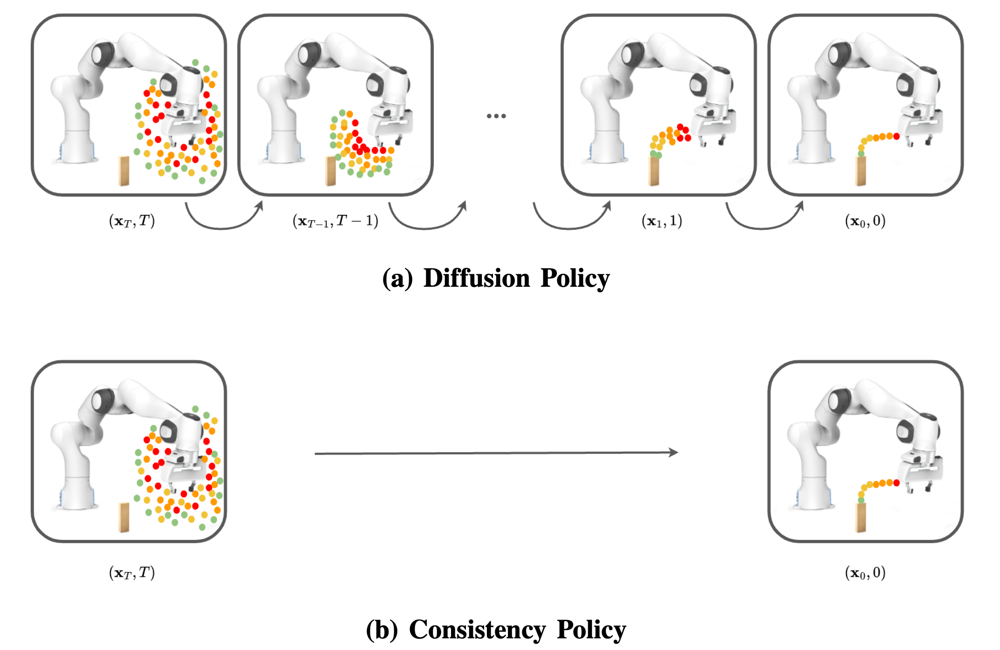

# Consistency Policy 是什么

Consistency Policy 是一套给 Diffusion Policy 加速的方法，主干沿用 Diffusion Policy 的动作生成结构，只把去噪过程从多步压成一步或少数几步。它针对的是 Diffusion Policy 的一个具体短板：动作生成要沿去噪轨迹迭代很多步，在缺少高端 GPU 的移动机械臂、无人机等平台上，这样的速度无法满足实时控制的延迟预算。

## 采样步数与动作生成延迟

Diffusion Policy 把一段动作表示成从高斯噪声出发、沿一条轨迹逐步去噪得到的结果。每去噪一步都要执行一次去噪网络前向，一次前向就是一次函数求值（NFE），推理成本几乎全部集中在 NFE 的个数上。Diffusion Policy 采用的 DDPM 框架把这条轨迹离散成约 100 步，DDiM 能降到约 15 步，仍是十几次串行前向。

延迟集中在动作生成这一段，而非视觉编码。视觉编码器对一帧观测只运行一次，开销固定；随步数放大的是去噪网络的重复前向。步数越多动作越精确，延迟也随之上升。准静态的抓取、装配能容忍这样的反应时间；动态平衡、移动导航需要更高的控制频率，机载算力受限的机器人也难以承担这样的单步开销。目标因此明确：保持 Diffusion Policy 的精度，同时大幅削减去噪步数。

## 教师、蒸馏与少步推理

Consistency Policy 借用了图像生成领域的一类蒸馏思路：一个训练好的 diffusion 模型对应在求解一条常微分方程（ODE），同一条 ODE 轨迹上的不同点都应还原到同一个起点。让学生学会这种自洽关系，它就能从轨迹上任意一点直接得到终点，而不必沿轨迹逐步积分。整套方法分三段：

- **EDM 教师**：先训练一个多步教师，采用 EDM 框架，使去噪过程对应一条确定性 ODE 轨迹。轨迹确定是后续能做蒸馏的前提。
- **一致性蒸馏**：在同一条轨迹上采两个点，借教师提供的轨迹信息，约束学生把这两个点都还原到同一个更靠近终点的位置。蒸馏得到的学生就是 Consistency Policy。
- **少步推理**：学生从噪声一次前向得到动作；需要更高精度时，把输出重新加噪、再去噪，链式多做两步，共三步。

<figure>
  
  <figcaption>上半部分是 Diffusion Policy 沿轨迹多步去噪，下半部分是 Consistency Policy 一次前向从噪声得到整段动作。两者都把随机动作还原成对专家动作的预测，区别在于去噪要走多少步。</figcaption>
</figure>

## 提速与精度（论文报告）

步数的压缩直接反映在 NFE 上：动作生成从 DDiM 的十几步、DDPM 的上百步降到 1 步或 3 步。Robomimic Square 上按墙钟时间测（NVIDIA P5000，论文报告）：DDPM 100 步约 110 ms，DDiM 15 步约 11 ms，单步 Consistency Policy 约 1 ms，三步约 2 ms，比两个 diffusion 基线快一到两个数量级。

提速没有换来成功率的明显下降。Robomimic Square 上（200 次在线 rollout 的均值，论文报告），DDPM 成功率 0.93、DDiM 0.85，单步 Consistency Policy 0.92、三步 0.96。单步通常介于 DDPM 与 DDiM 之间，三步则能达到甚至超过 DDPM。真实机器人的垃圾清理、插头插接任务中，Consistency Policy 与 15 步 DDiM 成功率相当，端到端推理延迟约为其九分之一（3070 Ti 笔记本 GPU，论文报告）。

## 本页小结

- Diffusion Policy 的动作生成延迟集中在去噪网络的重复前向，步数（DDPM 约 100、DDiM 约 15）直接决定这一段的耗时。
- Consistency Policy 分三段：EDM 教师给出一条确定性 ODE 轨迹，一致性蒸馏把多步压成学生的一步跳跃，推理时用单步或三步生成动作。
- 论文报告去噪步数降到 1 或 3，Robomimic Square 墙钟时间下降约一到两个数量级，成功率与 Diffusion Policy 基线基本持平。

## 导航

- 章节入口：[Consistency Policy](../02-consistency-policy.md)
- 返回上级：[Consistency Policy](../02-consistency-policy.md)
- 下一节：[架构](02-architecture.md)
