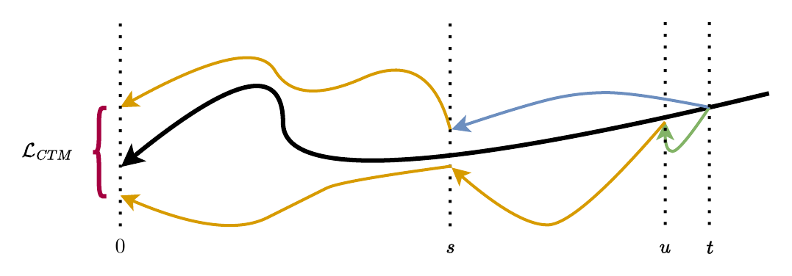

# 一致性蒸馏

教师只能估计轨迹的局部导数，仍要沿轨迹逐步积分。一致性蒸馏训练学生跨过这些积分步：给定轨迹上任意一点，直接输出更靠近终点的位置。学生用两个目标一起训练，一个是与教师相同的去噪目标（DSM），把加噪动作还原回干净动作；另一个是一致性目标（CTM），约束学生在同一条轨迹上保持自洽。这两个目标如何构造、为什么需要一个反直觉的 dropout，是本页的正题。

## 学生的一步跳跃目标

学生 `g_θ(x_t, t, s; o)` 接收轨迹上时间 `t` 处的位置，输出更早时间 `s` 处的位置。它要学会的关系是：同一条 ODE 轨迹上的任意一点，都能一步还原到指定的更早位置，而不必逐步积分。单步推理就是 `s=0` 的特例，一次前向从噪声得到干净动作。

学生的输出不是网络的原始预测，而是一次插值。网络先给出去噪预测 `g_θ`，最终输出 `G_θ` 在输入位置 `x_t` 与 `g_θ` 之间按 `ratio = s/t` 插值：

```
G_θ = (s/t)·x_t + (1 − s/t)·g_θ(x_t, t, s; o)
```

`s=t` 时 `ratio=1`，`G_θ=x_t`，停在原地；`s=0` 时 `ratio=0`，`G_θ=g_θ`，完全去噪到动作。`s` 因此控制这一步到达轨迹上多靠前的位置。这段参数化在 `consistency_policy/diffusion.py` 的 `CTM_calc_out`：

```python
out = model_output * c_out + trajectory * c_skip   # g_theta
ratio = (stops / times).unsqueeze(-1).unsqueeze(-1).expand(*out.shape)
out = trajectory * ratio + out * (1 - ratio)       # G_theta
```

`model_output` 是网络原始输出，`c_out`、`c_skip` 是 EDM 的预处理缩放系数，组合成去噪预测 `g_theta`；`trajectory` 是 `x_t`、`times` 是 `t`、`stops` 是 `s`，`ratio` 即 `s/t`。

## CTM 损失：同一轨迹的两点还原到同一终点

CTM 的核心是自洽：同一条 ODE 轨迹上的两个不同点 `(x_t, t)` 和 `(x_u, u)`（`0 ≤ s < u < t ≤ T`），各自还原到时间 `s`，理应得到同一个位置。做法是先分别计算 `x_s^{(t)} = g_θ(x_t, t, s; o)` 和 `x_s^{(u)} = g_θ(x_u, u, s; o)`，再用学生把这两个中间结果都还原到时间 0，在完全去噪的动作空间里比较二者的距离：

```
L_CTM = d(g_θ(x_s^{(t)}, s, 0; o), g_θ(x_s^{(u)}, s, 0; o))
```

<figure>
  
  <figcaption>在轨迹上取 s、u、t 三点：教师在 stopgrad 下把 t 还原到 u（绿），学生把 t 还原到 s（蓝），学生在 stopgrad 下把 u 还原到 s（橙），再用 stopgrad 学生把 s 处两个结果都还原到时间 0（橙），二者之差即 L_CTM（红）。整个式子里只有 t→s 这条蓝色路径参与求梯度。</figcaption>
</figure>

两个采样点里，`x_t` 由干净动作按 `N(0, t²I)` 直接加噪得到；`x_u` 则用教师从 `x_t` 沿 ODE 积分 `t−u` 步得到。蒸馏信号正是从这里进入：教师对 `x_u` 的预测告诉学生这条确定性轨迹的形状。除 t→s 这一步外，其余路径都在 stopgrad 下计算，梯度只回传到学生对 t→s 的预测；把每一步都放进计算图会使训练不稳定，甚至不收敛。

学生的最终目标把一致性项和 DSM 项加权求和：

```
L_CP = α · L_CTM + β · L_DSM
```

`ctmp_square.yaml` 里 `losses: [["ctm", "dsm"], [1, 1]]`，即 α、β 都取 1。这一步的实现是 `student/ctm_policy.py` 的 `compute_loss()`，CTM 分支先采出 `t, s, u`，把干净动作加噪到 `t`，用教师沿 Heun 求解从 `t` 推进到 `u`，再计算两条路径的一致性损失（略去 `local_cond` / `global_cond` 参数）：

```python
# t -> s
pred   = self._forward(self.model,     noise_traj,   times,   stops)
# u -> s
target = self._forward(self.model_ema, u_noise_traj, u_times, stops)
# now we take both back to 0
start = torch.tensor([self.noise_scheduler.time_min], device=trajectory.device).expand(times.shape)
pred   = self._forward(self.model_ema, pred,   stops, start)
target = self._forward(self.model_ema, target, stops, start)
loss = Huber_Loss(pred, target, delta=self.delta, weights=weights)
```

`self.model` 带梯度、`self.model_ema` 是 stopgrad 的 EMA 权重，`_forward` 内部调用上文的 `CTM_calc_out` 完成一次跳跃。`noise_traj` 是加噪到 `t` 的动作，`u_noise_traj` 由教师从 `t` 沿 ODE 推进到 `u` 得到；t→s 用主模型保留梯度，u→s 用 EMA 权重，两个结果再都用 EMA 权重还原到时间 0（`start=time_min`），最后取 Huber 距离。用 EMA 权重承担 stopgrad 的路径，正好对应图里只有 t→s 参与梯度。

## 相邻时刻的 CTM-local

`t` 和 `u` 的取法有三种。取相邻且 `s=0`，退回最早的 Consistency Distillation；取任意间隔的 `t`、`u` 和任意 `s`，是原始 CTM；取相邻的 `t`、`u`（`u = t−1`）但保留任意 `s`，是 Consistency Policy 采用的 CTM-local。论文报告的对照中，三者在 Robomimic Square 上的成功率分别为 0.88、0.91、0.92，CTM-local 略优。训练成本的差距更明显：原始 CTM 要让教师从 `t` 积分到相隔较远的 `u`，即便限制 `t−u ≤ 10`，也比另外两种慢 40% 以上；CTM-local 只跨相邻一步，与 Consistency Distillation 一样快。配置里 `ode_steps_max: 1` 让教师的去噪循环只迭代一步，正是相邻时刻的写法。

## DSM 辅助与对教师质量的鲁棒性

DSM 项不依赖教师，直接监督学生把加噪动作还原到干净动作，对应 `compute_loss()` 的 DSM 分支：另采一组时间，把加噪动作还原到 `time_min` 处，与干净动作取 Huber 距离。这一项使学生在教师质量不高时仍能达到较好的成功率。论文报告的对照中，教师成功率从 0.92 降到 0.88，蒸馏出的学生都稳定在 0.92（Robomimic Square）；教师降到 0.84 时学生仍有 0.88，说明学生对教师质量有相当的鲁棒性。

## s→0 dropout 与一致性信号

一个反直觉的现象是：学生用教师权重 warm-start 后，若不加 dropout，`L_CTM` 会趋近于零，几乎不提供训练信号。原因在最后还原到时间 0 那一步。DSM 训练让网络学会把任意噪声加出的 `x_s` 都还原到同一个干净动作，于是即便 `x_s^{(t)}` 和 `x_s^{(u)}` 相差很大，`g_θ(·, s, 0; o)` 也会把它们映射到几乎相同的结果。论文报告中，不加 dropout 时 `x_s^{(t)}` 与 `x_s^{(u)}` 的距离比它们各自还原到 0 之后的距离大至少两个数量级，一致性损失因此被这一步吸收。

在 s→0 这一步加 dropout 就打破了它的确定性：学生无法再借这一步把不同轨迹的点映射到相近位置，一致性压力回到 `x_s^{(t)}` 与 `x_s^{(u)}` 本身，直接训练 t→s 与 u→s 的自洽。`ctmp_square.yaml` 里 `dropout_rate: 0.2`。论文报告的对照中，仅在 s→0 两步关闭 dropout，Robomimic Square 成功率就从 0.92 降到 0.86。

## warm-start 与 EMA

学生的权重从训练好的教师 warm-start，网络结构上为停止时间 `s` 新扩的 FiLM 层零初始化，避免它们在训练初期干扰教师权重。warm-start 通过在配置里给 `policy.edm` 指向教师 checkpoint 打开，`student/ctm_workspace.py` 的 `CTMWorkspace` 负责加载并冻结教师、用其权重初始化学生。承担 stopgrad 路径的 EMA 权重由学生自身维护，`initial_ema_decay: 0.0` 让 EMA 权重在起步阶段紧跟主模型。

## 本页小结

- 学生用 CTM 一致性项加 DSM 去噪项联合训练：CTM 约束同一轨迹两点还原到同一终点，DSM 提供不依赖教师的去噪监督。
- CTM-local 取相邻 `t`、`u` 但保留任意 `s`，成功率略优于另两种取法，且训练成本与最快的一档持平（论文报告 0.88 / 0.91 / 0.92）。
- s→0 这一步必须加 dropout，否则一致性损失被去噪的确定性吸收（论文报告关闭后 0.92 降到 0.86）；DSM 项让学生对教师质量鲁棒。

## 导航

- 上一节：[架构](02-architecture.md)
- 返回上级：[Consistency Policy](../02-consistency-policy.md)
- 下一节：[少步推理](04-few-step-inference.md)
