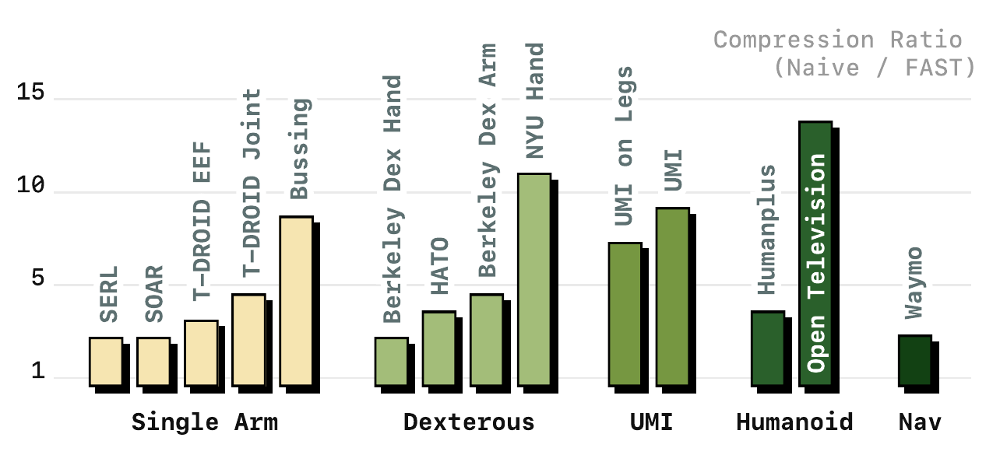
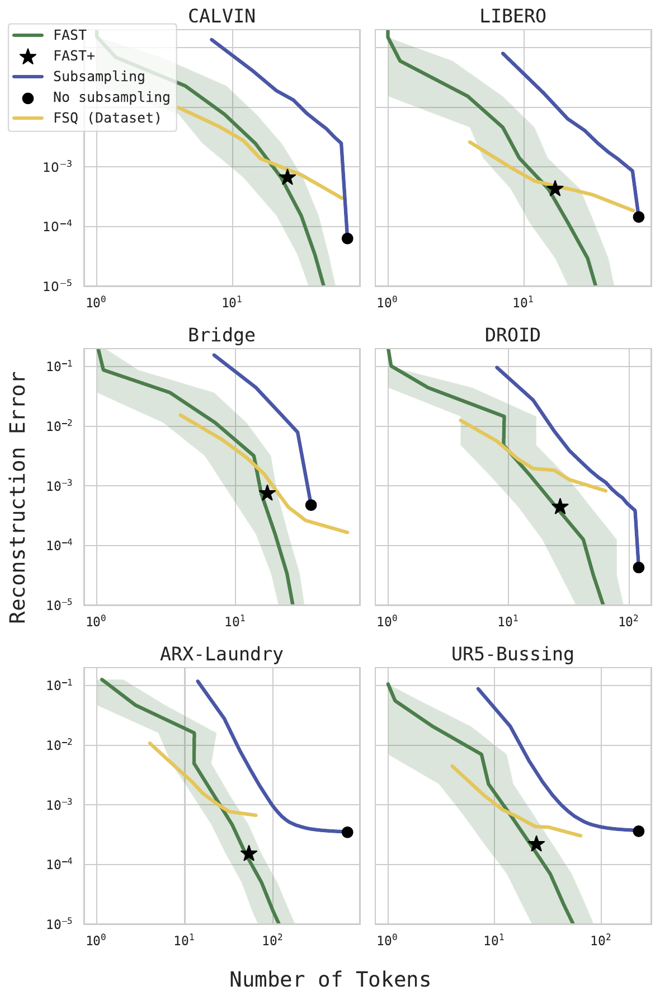

# 通用分词器 FAST+

FAST 流水线里 DCT、量化、展平都是固定操作，归一化只从数据算一遍分位，唯一要在数据上训练的部件是 BPE 词表，而它要对每个新数据集单独训练一次。这个过程只需几分钟，但仍是使用前额外的一步准备。FAST+ 免去这一步：用同一套流水线在约一百万条一秒动作块上训练出一个通用词表，训练完成后可直接作为分词器用在任意机器人的一秒动作序列上，无需按新数据重训。本页交代 FAST+ 的训练覆盖，以及分词器层面的压缩结果、跨本体泛化、与向量量化的对比和 BPE 消融。

## 训练覆盖

FAST+ 的通用性来自训练数据的广度。约一百万条一秒动作块横跨多种本体：ARX、AgileX、Franka FR3、UR5、Trossen、ALOHA 等单臂、双臂与移动操作机器人。动作参数化也不统一，既有关节空间，也有世界系与相机系下的末端执行器控制，控制频率从 5 Hz 到 50 Hz 不等。

不同本体的动作维度不同，分词前统一补零到 32 维，让同一套 DCT 加 BPE 流程能接收任意维度的动作而无需改结构；归一化的分位又把各本体的动作尺度拉到同一量纲。两者叠加，一个词表就能覆盖差异很大的机器人。在此之上训练出的通用词表，在未见数据上仍能有效压缩，可作为跨本体的强默认值，压缩效果接近为该数据集单独训练的 FAST。

## 词表怎么训练

通用词表由 `UniversalActionProcessor.fit` 训出。先把每条动作块做 DCT、展平、量化，得到一串整数系数；这些系数的全局最小、最大值定出一张字母表，覆盖所有可能出现的系数取值。随后在把系数逐个转成字符的语料上训练 BPE，迭代合并高频共现的相邻符号，直到凑够词表大小：

```python
# UniversalActionProcessor.fit（官方实现，示意精简）
tokens = [np.around(dct(a, axis=0, norm="ortho").flatten() * scale) for a in action_data]
min_token = int(min(t.min() for t in tokens))
max_token = int(max(t.max() for t in tokens))
alphabet = [chr(i) for i in range(max_token - min_token + 1)]      # 字母表覆盖全部系数值
trainer = BpeTrainer(vocab_size=vocab_size, min_frequency=2, initial_alphabet=alphabet)
bpe.train_from_iterator(token_iter, trainer)                       # 在字符串语料上合并高频对
```

`initial_alphabet` 先把每个可能的量化系数各设成一个基础符号，保证合并前任何系数都可表示；`min_frequency=2` 要求一个组合至少共现两次才合并。这些是固定的实现设定，可调的仍只有量化缩放 `γ` 与词表大小 `vocab_size` 两个，且都不敏感。FAST+ 就是把 `action_data` 换成约一百万条跨本体动作块训练出的一张词表。

## 压缩比与 token 数

FAST 在各数据集上都缩短 token 序列，频率越高压缩比越大。同样一秒的动作块：

| 数据集 | 动作维度 | 频率 | 逐维分箱 token | FAST token | 压缩比 |
| --- | --- | --- | --- | --- | --- |
| BridgeV2 | 7 | 5 Hz | 35 | 20 | 1.75× |
| DROID | 7 | 15 Hz | 105 | 29 | 3.6× |
| Bussing | 7 | 20 Hz | 140 | 28 | 5.0× |
| Shirt Fold（双臂）| 14 | 50 Hz | 700 | 53 | 13.2× |

逐维分箱的 token 数是 H×D，随频率线性膨胀，从 35 一路到 700。FAST 的 token 数却稳定在每条机械臂约 30 个（双臂约 60），基本与控制频率无关。这个近乎恒定的量级说明它找到的表示接近动作信号本身的复杂度：频率再高，一秒动作里真正的信息量并没有等比增加，只是被更密的采样重复表达，FAST 把这层重复压掉了。

## 跨未见数据集的泛化

<figure>
  
  <figcaption>FAST+ 在训练时完全未见的数据集上相对逐维分箱的压缩比，覆盖单臂、灵巧手、UMI、人形、导航等形态。跨形态、动作空间和控制频率都取得有效压缩。数据为论文报告。</figcaption>
</figure>

FAST+ 的泛化在一组训练时完全未见的数据集上测试，跨度比训练集更大：动作维度从 2 维到 40 维，频率从 5 Hz 到 60 Hz，形态涵盖单臂、灵巧手、UMI 手持夹爪、人形，甚至自动驾驶（Waymo 的二维平面动作）这种远离机械臂的场景。在这些数据上，FAST+ 的 token 数相对逐维分箱平均压到原来的一半，部分数据集压缩更多。训练时没见过的本体和动作空间也能压，说明频域加 BPE 抓住的是平滑动作信号的普遍冗余，而非某个数据集的特定分布。

## 与向量量化的重建-压缩权衡

向量量化（VQ、FSQ 等）是另一类离散化思路：学习一个码本把动作编码成 token。要公平比较，得同时看用了多少 token 和还原得多准。论文在六个数据集上扫超参，画出每种方法的 token 数与重建误差的权衡曲线。

<figure>
  
  <figcaption>横轴是一个动作块用的 token 数，纵轴是重建误差，两轴都取对数；同一 token 数下曲线越低越好。绿线是 FAST（扫缩放 γ），蓝线是逐维分箱加下采样（扫采样率），黄线是逐数据集 FSQ（扫潜码数），星号是通用词表 FAST+。FAST 曲线在各数据集都压在最下方，向低误差方向延伸时优势更明显；FAST+ 星号贴近对应的逐数据集 FAST。数据为论文报告。</figcaption>
</figure>

同一 token 预算下 FAST 的重建误差普遍最低。低保真的粗重建区间 FSQ 与 FAST 接近、偶尔更省 token，但向高保真扩展时 FAST 的伸缩明显更好，更适合需要精细动作的控制任务。向量量化的重建质量还对超参和网络结构敏感，要逐数据集调，并且要额外训练一个编码网络；FAST 只有 `γ` 和词表两个不敏感的超参，编解码本身也快。图中 FAST+ 星号落在各数据集 FAST 曲线附近，印证通用词表几乎不牺牲压缩质量。

## BPE 是否可省

BPE 消融显示这一步不可省。DCT 加量化已经把信息集中到少数系数，但量化后的稀疏序列里留着大量重复的 0。不接 BPE 直接分词，这些 0 也要各占一个 token，一个动作块又回到要预测数百个 token 的规模。后果有两面：自回归解码长度重新拉长，推理变慢；重复 0 占多数使学习信号被稀释，训练也更难。消融里去掉 BPE 后策略 rollout 明显变差（仍优于逐维分箱）。这条正说明 BPE 承担了把稀疏系数真正压成短序列的职责，是缩短自回归解码长度的关键一步。

## 本页小结

- FAST+ 在约一百万条一秒动作块上训练通用词表，横跨 ARX、Franka、UR5、ALOHA 等单/双/移动臂，关节与世界系、相机系末端执行器，5–50 Hz；动作补零到 32 维，一个词表覆盖差异很大的本体，免逐集重训。
- 压缩比随频率升高（1.75× 到 13.2×），FAST token 数稳定在每臂约 30 个、近乎与频率无关；在 2–40 维、5–60 Hz 乃至自动驾驶的未见数据上平均减半。
- 在 token 数与重建误差的权衡上 FAST 普遍优于向量量化，高保真区间伸缩更好、超参更少；BPE 消融显示去掉它会留下大量 0-token，拉长解码、使 rollout 变差。

## 导航

- 上一节：[DCT 与 BPE 编解码](02-dct-bpe-codec.md)
- 返回上级：[FAST](../03-fast.md)
- 下一节：[Spec-VLA](../04-spec-vla.md)
