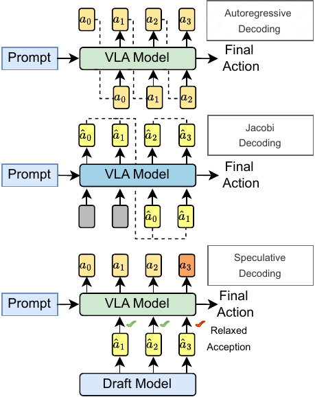

# Spec-VLA 是什么

Spec-VLA 是首个把投机解码用于 VLA 动作生成的框架。它不改动 VLA 网络本身，而是在推理时加一个双模型装置：一个小的 draft 模型快速草拟动作 token，原有的大模型作验证模型，一次前向并行验证草稿并接受正确前缀。骨干全程冻结、不重训，加速来自把原本逐 token 的串行解码，换成草拟加并行验证的循环。

## 本节目标

建立对 Spec-VLA 的整体认识：它在 VLA 加速里的定位、投机解码的基本盘、动作 token 的离散结构，以及提速的整体量级。

## 在 VLA 加速里的定位

VLA 从视觉语言骨干继承了很大的参数量，自回归逐 token 解出动作又让每一步控制的延迟居高不下。围绕这层开销，已有几条加速路线：早退（如 DeeR）按输入难度动态跳过层，Jacobi 解码把串行解码改写成并行迭代，TinyVLA、RoboMamba 重新设计更小的骨干结构，量化与剪枝压低单次前向的成本。这些路线大多要微调甚至重训骨干，改动落在模型本身。

投机解码走的是另一条路：不动骨干，只在外面加一个解耦的 draft 模型来草拟、由原模型验证。标准投机解码要求 draft token 与大模型逐 token 完全相等才接受，因此默认无损，最终输出与大模型单独解码严格一致。免重训、可叠加在已训好的模型上，是这条路线相对上述方法的区别，也是 Spec-VLA 选它的出发点。

<figure>
  
  <figcaption>三种动作解码方式的对比：自回归逐 token 串行解出；Jacobi 把解码写成并行迭代；投机解码由 draft 模型草拟、VLA 一次前向验证，Spec-VLA 在验证时采用松弛接受。图为论文示意。</figcaption>
</figure>

## 投机解码的基本盘

OpenVLA 这类模型把一次控制的动作预测成 7 个动作 token，按 next-token 逐个自回归解出：后一个 token 要等前一个算完，一个动作就要 7 次串行前向，token 越多越慢。

投机解码用一次草拟加一次验证替换这条串行链。draft 模型先自回归地连续草拟出若干个动作 token，成本远低于大模型；验证模型再把这串草稿并入一次前向并行核验，从头逐个比对，接受与自己预测一致的前缀，在第一个分歧处停下、由验证模型重算该位置。一次前向因此能确认多个 token，每次前向确认的 token 数（接受长度）越高，提速越明显。draft 草拟得越准，接受长度越长，这就是投机解码提速的来源。

## 动作 token 的 bin 结构

动作 token 的离散方式决定了后面能不能放宽接受判定。OpenVLA 把每个连续动作维度的取值范围切成 256 个等宽区间（bin），每个 bin 对应词表里一个动作 token，解码时取概率最大的 bin（贪心 argmax）。

这套编码的关键性质是有序：token 之间的序号之差，直接对应动作幅度之差。相邻 bin 代表数值相近的动作，序号相隔越远，动作差异越大。严格接受只认序号完全相等的 token，但两个相邻 bin 对应的动作在连续空间里几乎无法区分。松弛接受正是利用这一点，把接受窗口从单个 bin 放宽到相邻若干个 bin。

## 提速的整体量级（论文报告）

Spec-VLA 在 LIBERO 四套件（Goal、Object、Spatial、Long）上评测，验证模型是各套件微调后的 OpenVLA-7B。严格接受下提速有限，只有 1.08× 到 1.15×，因为动作 token 的接受率不高。换成松弛接受后提速升到 1.22× 到 1.42×，其中 LIBERO-Goal 最高 1.42×；接受长度相对严格接受提升约 25% 到 44%，成功率基本持平，个别套件甚至略高于自回归基线。

## 本页小结

- Spec-VLA 是首个把投机解码用于 VLA 动作生成的框架，加一个解耦的 draft 模型草拟、原模型验证，骨干冻结不重训，这是它相对早退、Jacobi、结构重设计、量化剪枝等路线的区别。
- 投机解码用一次草拟加一次并行验证替换逐 token 串行解码，一次前向确认的 token 数（接受长度）决定提速幅度。
- 动作维度被离散成 256 个有序 bin，token 序号之差对应动作幅度之差，这是松弛接受能成立的前提。
- LIBERO 上严格接受提速 1.08–1.15×，松弛接受升到 1.22–1.42×，接受长度提升约 25–44%，成功率基本持平（论文报告）。

## 导航

- 返回上级：[Spec-VLA](../04-spec-vla.md)
- 下一节：[验证模型与 draft 模型](02-architecture.md)
