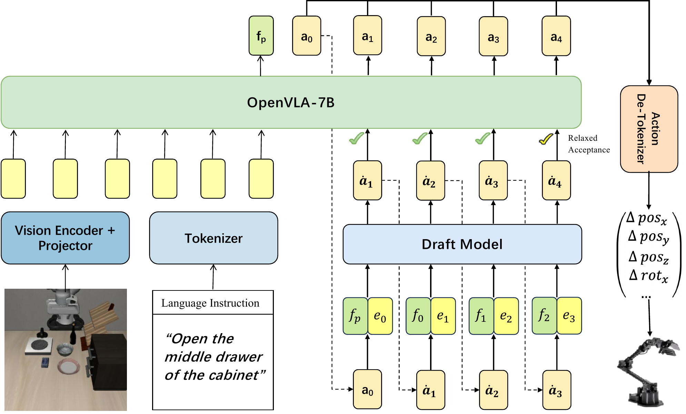

# 验证模型与 draft 模型

Spec-VLA 的架构由两个模型加一条连接二者的草稿数据流组成：验证模型是原样冻结的 OpenVLA-7B，draft 模型是 Eagle-2 风格的一个轻量网络，草稿以动作 token 的形式在两者之间流动。

## 本节目标

理解 Spec-VLA 的架构：验证模型与 draft 模型各是什么、draft 模型怎么接入验证模型的中间状态，以及 draft 怎么训出来。

<figure>
  
  <figcaption>Spec-VLA 架构。左侧视觉编码器加投影层、文本 tokenizer 的输出送入 OpenVLA-7B 作验证模型。右侧 draft 模型逐位吃验证模型的隐藏状态 f 与上一个动作 token 的 embedding e，自回归草拟动作 token，验证模型对草稿做松弛接受，接受的 token 经反分词还原成 Δpos、Δrot 等连续动作。图为论文框架示意。</figcaption>
</figure>

## 验证模型：原样的 OpenVLA-7B

验证模型直接用微调后的 OpenVLA-7B，全程冻结，不做任何重训或结构改动。它在整个框架里承担两个角色。推理时它是被加速的对象，也是投机解码里的验证方：接收视觉编码器加投影层、文本 tokenizer 的输入，对 draft 草拟的动作 token 做一次前向并行核验。训练前它还负责给 draft 造训练数据。

保持验证模型不动，是投机解码这条路线的前提。它保证被加速的模型和原始 OpenVLA 是同一个，接受判定严格时输出与原模型逐 token 一致，加速不以改动骨干为代价。

## draft 模型的组成

draft 模型要在草拟阶段代替大模型快速出 token，因此做得很轻：一个 Llama decoder layer 加一个融合线性层。它接入的信息有两路，融合线性层把两路拼到一起再送进 decoder layer：

- 特征级：验证模型输出的隐藏状态 f，携带大模型对当前上下文的理解。
- token 级：上一个动作 token 的 embedding e，提供已生成动作的离散信息。

除这两路外，prefill 阶段 draft 模型还接入视觉 embedding e_v 与文本 embedding e_p，二者拼接后作为条件，对齐 OpenVLA 融合视觉与语言的方式。draft 由此在每一步预测下一个动作 token：`â_i = M_D(f_{1:t}, concat(e_v, e_p), â_{t+1:i-1})`。这套设计沿用 Eagle / Eagle-2 的 draft 结构，把它从自然语言迁移到 VLA 的动作 token 上。

只用单个 decoder layer，是让 draft 的一次前向远快于验证模型的关键；参数少、又能读到验证模型的隐藏状态，draft 才能在低成本下草拟出与大模型接近的 token。

## draft 模型怎么训出来

draft 模型要学的是模仿验证模型在动作 token 上的输出。它的训练数据由验证模型自己生成：用微调后的 OpenVLA-7B 在 LIBERO 上重新跑一遍，记录每一步的隐藏状态和解出的动作 token，作为 draft 的监督信号。draft 在这份数据上以蒸馏方式训练，学着从验证模型的隐藏状态预测出同样的动作 token。

训练只更新 draft 模型，验证模型的 OpenVLA-7B 权重全程冻结。四个 LIBERO 套件各训一份对应的 draft，推理时按套件加载。整套加速因此只多出一个小模型的训练与存储，骨干不受影响，这也解释了为什么加一个 draft 就能提速而不必碰原模型。draft 训练的损失权重、学习率等超参以仓库脚本为准，这里不展开。

## 本页小结

- 验证模型是冻结的 OpenVLA-7B，既是被加速的对象与投机解码的验证方，也用来给 draft 生成训练数据；保持它不动是投机解码免重训的前提。
- draft 模型是 Eagle-2 风格的单个 Llama decoder layer 加融合线性层，融合验证模型的隐藏状态 f 与动作 token embedding e，prefill 时再接入视觉与文本 embedding，据此自回归草拟动作 token。
- draft 用验证模型重新生成的动作数据蒸馏训练，四个 LIBERO 套件各一份，训练只更新 draft、骨干冻结。

## 导航

- 上一节：[Spec-VLA 是什么](01-what-is-spec-vla.md)
- 返回上级：[Spec-VLA](../04-spec-vla.md)
- 下一节：[投机解码流水线](03-speculative-decoding-pipeline.md)
