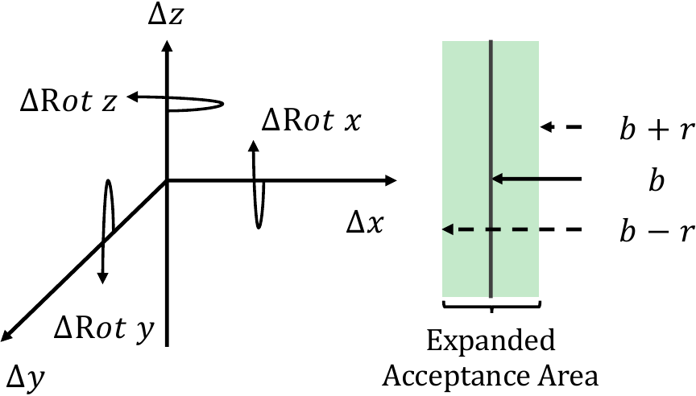
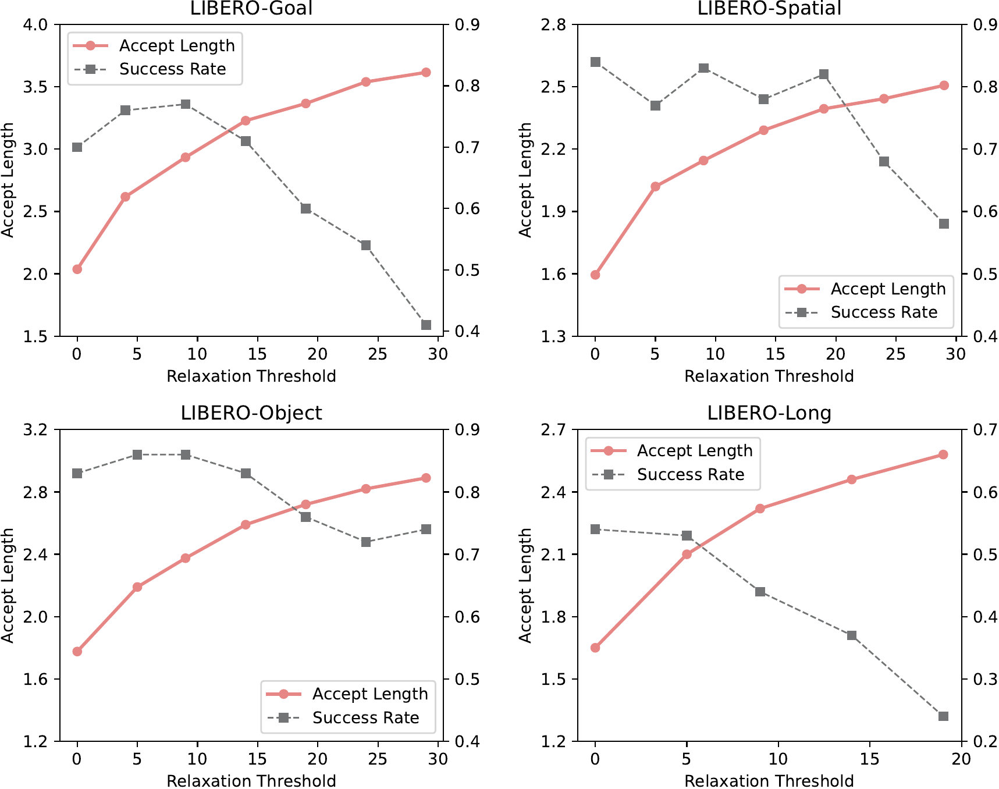

# 松弛接受

严格接受要求 draft 与验证模型逐 token 序号相等，动作 token 上命中率低，接受长度贴近 0 到 1。松弛接受放宽这条判定，把接受窗口从单个 bin 扩到相邻若干个 bin，接受率随之提高。

## 本节目标

理解松弛接受：它的判定与解码算法、带来的提速与接受长度，以及阈值在接受率和动作精度之间的取舍。

## 松弛接受判定

松弛接受引入一个松弛阈值 r，衡量允许的 draft token 与验证 token 之间的距离 D。判定从严格相等改为：距离 D ≤ r 就接受，否则在该位置回退，用验证模型的输出替换。

动作 bin 的有序性让这个距离几乎零成本可算。每个动作维度离散成 256 个有序 bin，token 序号之差直接等于动作幅度之差，所以 D 就是两个 token 的 bin 序号绝对差。设验证模型给出的 bin 为 b，接受窗口从严格的单个 b 放宽到区间 (b−r, b+r)，即接受序号落在 b 附近共约 2r 个近邻的 draft token。这些 token 对应的动作与 b 在连续空间里几乎一致，等于接受了近义的动作。

<figure>
  
  <figcaption>松弛接受示意。左侧是动作的位姿维度（Δpos 与 Δrot）。右侧以验证模型给出的 bin 为中心 b，接受窗口从严格的单个 b 放宽到 b−r 到 b+r 的绿色区间，落在这个扩大接受区里的 draft token 都被接受。图为论文示意。</figcaption>
</figure>

区别于 Lantern 从 embedding 里推算 token 相似度，bin 的有序表示让距离直接由序号相减得到，无需额外计算。

## 解码算法

一次松弛投机解码循环按以下顺序走，直到动作 token 达到目标长度：

1. draft 模型自回归草拟 d 个动作 token。
2. 验证模型一次前向并行算出这 d 个位置的参考 token。
3. 从头逐个比对，只要 draft token 与参考 token 的 bin 距离 D ≤ r 就接受，在第一个越界处停下，用参考 token 替换该位置。
4. 若 d 个 token 全部被接受，验证模型再多采一个 token，本轮多确认一步。

接受的前缀进入下一轮草拟的上下文，循环继续。整条算法与严格接受只差第 3 步的判定条件，接受窗口放宽，其余流程不变。

## 提速与接受长度（论文报告）

松弛接受在 LIBERO 四套件上都拉高了接受长度和提速。以 LIBERO-Goal 为例，接受长度从严格接受的 2.04 升到 2.94，提速从 1.09× 升到 1.42×，成功率 74.2% 对 74.4% 基本持平。四套件的提速落在 1.22× 到 1.42×，接受长度相对严格接受提升约 25% 到 44%。成功率整体持平，LIBERO-Spatial 与 LIBERO-Long 上松弛接受的成功率还略高于自回归基线（85.8% 对 85.0%，55.0% 对 52.0%）。

接受长度的分布也从短段向长段迁移。严格接受下大量样本停在长度 0 到 1，松弛接受把概率质量推向更长的前缀，例如 LIBERO-Object 接受长度为 4 的样本占比从 0.56% 升到 6.22%。更长的前缀意味着等量动作 token 需要的验证前向更少，这正是提速的直接来源。

## 阈值与精度的取舍

阈值 r 决定接受窗口的宽度，也就决定了接受率与动作精度之间的平衡。r 增大，接受长度进一步上升（论文报告增幅约 50% 到 70%），但接受窗口越宽，被接受的 draft token 与验证结果的偏离越大，动作精度的风险也越高。

r 能开多大和任务相关。LIBERO-Goal、Object、Spatial 上 r 从 5 加到 9 成功率基本不掉，Goal 甚至到 r=15 仍稳定；LIBERO-Long 一旦 r 超过 5，成功率明显下降。规律是模型在某个任务上做得越好，越能容忍更大的 r。论文实际取值为 Goal、Object、Spatial 用 r=9，LIBERO-Long 用 r=5。

<figure>
  
  <figcaption>四个 LIBERO 套件上，接受长度（实线）随松弛阈值单调上升，成功率（虚线）在阈值增大到一定程度后开始下降。Goal、Object、Spatial 在中等阈值处成功率仍稳定，LIBERO-Long 的成功率对阈值最敏感。数据为论文报告。</figcaption>
</figure>

松弛接受的代价也在这里：它不再保证输出与大模型单独解码严格一致，而是允许在动作空间的容差范围内偏离，用一点动作精度换更高的接受率。阈值取多大，就是在这条容差线上做权衡。

## 与量化叠加

松弛接受还能叠加在量化后的验证模型上。单看量化，int8、int4 的 OpenVLA 因为量化与反量化的额外开销，单次前向反而比 bf16 更慢。但把 Spec-VLA 叠上去后，投机解码的提速仍然成立：LIBERO-Goal 上 int8 验证模型配松弛接受达到 1.61×，高于 bf16 的 1.42×。量化压低单次前向的绝对成本，投机解码减少前向次数，两者作用在不同环节，可以叠加。

## 本页小结

- 松弛接受把接受判定从逐 token 相等改为 bin 距离 D ≤ r，接受窗口从单个 bin 放宽到 (b−r, b+r)，接受近义动作；bin 有序，D 由序号相减直接得到，无额外计算。
- 解码算法与严格接受只差判定条件：草拟 d 个 token、并行验证、按 D ≤ r 逐个接受到首个越界、全接受则多采一个 token。
- LIBERO 上提速 1.22–1.42×、接受长度提升约 25–44%，成功率基本持平，接受长度分布向长段迁移（论文报告）。
- 阈值 r 在接受率与动作精度间权衡，越强的任务越能容忍更大的 r；松弛接受放弃与大模型解码的严格一致。叠加在量化验证模型上仍能提速（Goal int8 达 1.61×）。

## 导航

- 上一节：[投机解码流水线](03-speculative-decoding-pipeline.md)
- 返回上级：[Spec-VLA](../04-spec-vla.md)
