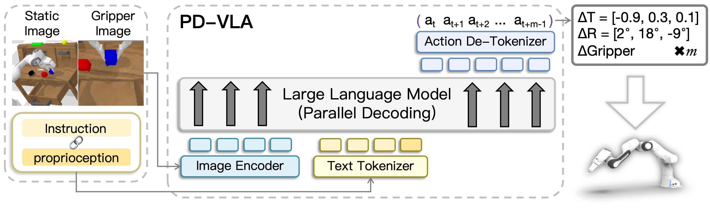

# 底座 VLA 与动作编码

PD-VLA 只替换解码循环，它并行解出的那串 token 由底座 VLA 决定。这个底座是作者基于 LLaVA 搭的 LLaVA-VLA：把两路图像和文本指令编码进大模型，输出一串离散动作 token，再反分词还原成连续动作。动作 token 的离散方式和 action chunking 的响应长度，正是并行解码要一次性求解的对象。

## 本节目标

理解 PD-VLA 操作的底座：LLaVA-VLA 的输入与主体、动作怎么被离散成 token，以及 action chunking 把一次响应的长度定成多少。

<figure>
  
  <figcaption>PD-VLA 的底座数据流。左侧 static image 与 gripper image 经 Image Encoder 出视觉 token，Instruction 与 proprioception 拼成字符串经 Text Tokenizer 出文本 token；两路一起送入大模型，以并行解码方式输出一段动作 token，经 Action De-Tokenizer 还原成 Δ 平移、Δ 旋转、夹爪状态，一次得到 m 步动作。图为论文架构示意。</figcaption>
</figure>

## LLaVA-VLA 的输入与主体

LLaVA-VLA 的骨干是 vicuna-7b-v1.5，视觉编码器是 clip-vit-large-patch14-336，即 LLaVA-7b-v1.5 的组合。输入有两路：static image 与 gripper image 经视觉编码器得到视觉 token `h_I`；文本指令与本体感知（proprioception）拼成字符串 `S`，经 tokenizer `T` 得到文本 token `h_S`。大模型自回归地生成动作 token `h_act`，再反分词成 7 维动作。整条数据流写成：

```
a = Detokenize(h_act) = Detokenize(LLM(h_I, h_S))
  = Detokenize(f_encoder(I_static, I_gripper), T(S))
```

PD-VLA 不改动这套输入与主体，它替换的只是其中 `LLM(...)` 生成 `h_act` 这一步的解码方式。

## 动作怎么离散成 token

一步动作是 7 维 `a = [X, Y, Z, φ, θ, ψ, G]`：前三维平移、中三维旋转、最后一维夹爪。每一维的取值范围切成 256 个等宽区间（bin），每个 bin 用词表里 256 个最低频 token 中的一个表示。7 个维度按顺序拼成一段空格分隔的字符串，作为训练标签。

用最低频 token 承载动作，是为了尽量不占用原词表里高频的自然语言 token。这套编码有一个后面会用到的性质：夹爪维只有开、合两种状态，对应的 token 取值几乎二值，这让它在并行解码里很容易提前定下来。

## action chunking 与响应长度

PD-VLA 采用 action chunking：在时刻 `t` 一次预测 m 步动作 `A_t = [a_t, a_{t+1}, ..., a_{t+m-1}]`，执行完这一段再重新规划。论文取 chunk size `m = 5`。

一次响应的 token 长度因此是 `l = 7m + 2`：每步动作 7 个 token，共 m 步，再加一个起始空 token 和一个结束 token。`m = 5` 时 `l = 37`。这个 37 就是自回归解码要串行解出的 token 数，也是并行解码一次要并行求解的整串长度，后面 decoding horizon 的取值都围绕它展开。

需要区分的是评测配置的差异：CALVIN 上用的是上述 256-bin 离散 tokenizer，LIBERO 上则改接了一个 OpenVLA-OFT 式的连续动作头，而非离散 token。结果页的两组数字对应的是这两种配置。

## 本页小结

- 底座 LLaVA-VLA 由 vicuna-7b-v1.5 加 clip-vit-large-patch14-336 组成，吃 static/gripper 两路图像与文本+proprioception，自回归生成动作 token 再反分词成 7 维动作。
- 每个动作维度离散成 256 个等宽 bin，用词表最低频 token 表示；夹爪维近乎二值，这一点在并行解码里会被利用。
- action chunking 取 m=5，一次响应长度 `l = 7m + 2 = 37`，这是并行解码一次要求解的整串 token 数。
- CALVIN 用离散 tokenizer、LIBERO 改接 OpenVLA-OFT 式连续动作头，对应结果页的两组数字。

## 导航

- 上一节：[PD-VLA 是什么](01-what-is-pd-vla.md)
- 返回上级：[PD-VLA](../05-pd-vla.md)
- 下一节：[Jacobi 并行解码](03-parallel-decoding.md)
