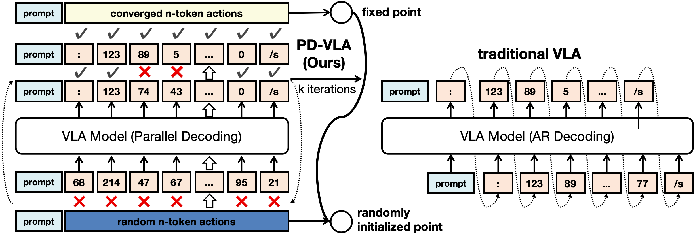
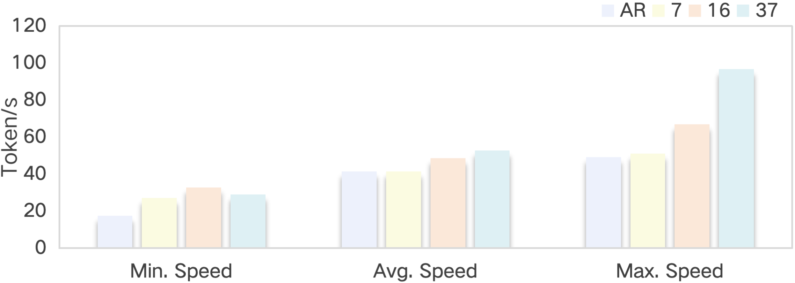

# Jacobi 并行解码

PD-VLA 的加速核心是把逐 token 自回归解码改写成一组非线性方程，用 Jacobi 式不动点迭代并行求解。关键改动有两处：一次前向同时更新整串动作 token，以及把 causal attention 换成 bidirectional attention，让每个 token 都能看到整串当前结果。迭代到不动点时，输出与逐 token 贪心解一致。

## 本节目标

理解并行解码这一步：自回归解码怎么被写成非线性方程组、标准 Jacobi 迭代与 PD-VLA 改法的差别、bidirectional attention 和 fixed token 为什么能加速收敛、decoding horizon 怎么取又如何影响速度，以及为什么这一步几乎不损精度。

<figure>
  
  <figcaption>左侧 PD-VLA 从随机初始化的 n 个动作 token 出发，每次前向并行更新全部 token，经 k 次迭代收敛到不动点，即 converged n-token actions；中间某些位置的正确 token 会在前序 token 仍出错时提前定下（fixed token）。右侧传统 VLA 逐 token 串行解出，后一个 token 要等前一个算完。图为论文示意。</figcaption>
</figure>

## 自回归解码的瓶颈

贪心自回归解码逐个解出 token：第 i 个 token 取在前缀 `Y_i = {y_1,...,y_{i-1}}` 和 prompt `x`（文本加视觉）条件下概率最大的那个。

```
y_i = argmax_y  p(y | Y_i, x)      i = 1,...,n
```

要解 n 个 token 就要 n 次串行前向，后一次依赖前一次的结果，无法并行。这里 `n` 是这一轮要解的 token 数，即 decoding horizon。token 越多、串行链越长，这是自回归解码慢的根源。

## 写成非线性方程组

把上式移项，定义每个位置的残差：

```
f(y_i, Y_i, x) = y_i − argmax_y p(y | Y_i, x)
```

自回归解码等价于求解下面这组方程，让每个位置的残差都为零：

```
f(y_i, Y_i, x) = 0      i = 1,...,n
```

n 个方程、n 个未知 token。这类非线性方程组可以用 Jacobi 不动点迭代求解：给一组初值，反复代入更新，直到不再变化。解码由此从逐个生成转为迭代求解，一次前向可以同时更新多个位置。

## Jacobi 迭代与 PD-VLA 的改法

标准 Jacobi 迭代仍保留 causal 结构：第 j+1 轮里，token i 依据的是上一轮结果中它前面的那些 token `Y_i^{(j)}`，注意力用 causal mask。它虽然一次前向更新全部位置，但每个位置只看得到自己前面的 token。

PD-VLA 在此基础上做了两处改动。一是初始化：直接给一串随机的动作 token `Y^{(0)}`，长度等于 decoding horizon `n`，和 prompt 一起送进模型。二是注意力：把 causal mask 换成 bidirectional mask，于是每个 token 都对整串当前迭代结果 `Y^{(j)}` 求 argmax，而不只是看前缀：

```
y_1^{(j+1)} = argmax_y p(y | Y^{(j)}, x)
y_2^{(j+1)} = argmax_y p(y | Y^{(j)}, x)
   ...
y_n^{(j+1)} = argmax_y p(y | Y^{(j)}, x)
```

一次前向即更新全部 n 个 token。当某一轮结果与上一轮相同，即 `Y^{(k)} = Y^{(k−1)}`，迭代停在这个不动点 `Y*`。换成 bidirectional attention 是 PD-VLA 区别于普通 Jacobi 解码的地方：普通 Jacobi 保留 causal mask，每个 token 只能参考前缀，PD-VLA 让每个 token 都能参考整串，收敛更快。

## fixed token 与收敛

并行解码为什么迭代次数少，可以从 fixed token 看。每次前向可能一下子定对多个位置的 token，这些 token 在后续迭代里不再变化，称为 fixed token。它们不必连续：即使前面的 token 还在出错，后面某个位置的正确 token 也能被提前锁定。fixed token 越多，离不动点越近，收敛越快，迭代数 `k` 因此远小于 token 数 `n`。

夹爪 token 是最典型的 fixed token：它近乎二值（0 为合、1 为开），取值空间极小，几乎一步就能定下。这类结构上容易确定的位置越多，整串收敛得越快。

## decoding horizon 怎么取

decoding horizon `n` 是并行解码里唯一要调的参数，它决定一次 Jacobi 迭代同时求解多少个 token。若 `n` 小于响应总长 `l`，就分段解：先解前 n 个，再解下一段，等价于若干次 Jacobi 迭代配合 Gauss-Seidel 步。`n` 常被取成 2 的幂，但 `l` 不是 2 的幂时，末段会解出一些多余的 token，反而压低频率。

论文比较了三种取法。`n = l = 37`（`m = 5`）把整串放进一次 Jacobi 解码，最贴合原本对动作分布的建模；`n = 7` 对齐单个动作的 7 维物理结构；`n = 16` 是 2 的幂，但 16 不能整除 37，会留下多余 token。

## 速度与频率的消融（CALVIN，论文报告）

| decoding horizon n | fixed token 数 | 平均完成长度 | 平均速度（tok/s） | 频率（Hz） |
| --- | --- | --- | --- | --- |
| 7 | 5.17 | 3.24 | 41.48 | 3.60 |
| 16 | 6.75 | 3.19 | 48.74 | 3.25 |
| 37 | 8.75 | 3.64 | 52.84 | 4.56 |

`n` 越大，fixed token 越多，平均速度越高（41.48 提到 52.84 tok/s）。`n = 37` 在完成长度、速度、频率上都最好。频率并不随 `n` 单调：`n = 16` 频率最低（3.25 Hz），因为 16 不整除 37 留下多余 token；`n = 7` 虽速度最低，但对齐单动作结构、没有多余 token，频率反而高于 16。因此 horizon 取 `n = l` 或能对齐动作结构的值，避免留下多余 token 的取法。

<figure>
  
  <figcaption>自回归（AR）与三种 horizon 的解码速度分布。平均速度上 n=37 最高；差距在最大速度处最明显，n=37 的峰值速度约为 AR 与 n=7 的两倍，来自迭代次数更少。图为论文示意。</figcaption>
</figure>

## 为什么几乎不损精度

Jacobi 迭代收敛到的不动点 `Y*`，按不动点理论与逐 token 贪心解一致，也就是说并行解码原则上不改变输出、只改变得到输出的过程。论文据此称其为有数学保证，但正文并未给出独立的形式化证明，措辞按此对待更稳妥。

实际数字也支持这一点：CALVIN 上并行解码使平均完成长度从 3.61 略降到 3.54，差异很小，PD-VLA 仍优于所有基线；LIBERO 上甚至取得当时最好成绩。需要区分的是精度增益的来源：真正把成功率抬起来的是 action chunking，并行解码的职责是去掉 chunking 本会带来的速度代价，而不是自己贡献精度。

## 本页小结

- 自回归解码要 n 次串行前向；PD-VLA 把它写成 n 个残差为零的非线性方程组，用 Jacobi 不动点迭代求解。
- 相对普通 Jacobi，PD-VLA 从随机初始化整串 token 出发，并把 causal mask 换成 bidirectional mask，使每个 token 都对整串当前结果求 argmax，一次前向更新全部 token。
- fixed token 让不连续位置的正确 token 提前锁定，夹爪这类近二值的位置尤其容易定下，迭代数 k 远小于 token 数 n。
- decoding horizon `n` 决定一次迭代求解多少 token；`n` 越大 fixed token 越多、速度越高，但频率不单调，`n = 37` 全面最好，`n = 16` 因不整除 37 留下多余 token 频率最低（论文报告）。
- 不动点与贪心解一致，并行解码几乎不损精度（CALVIN avg len 3.61→3.54）；精度增益主要来自 action chunking（论文报告）。

## 导航

- 上一节：[底座 VLA 与动作编码](02-architecture.md)
- 返回上级：[PD-VLA](../05-pd-vla.md)
- 下一节：[整体加速效果与评测](04-results.md)
