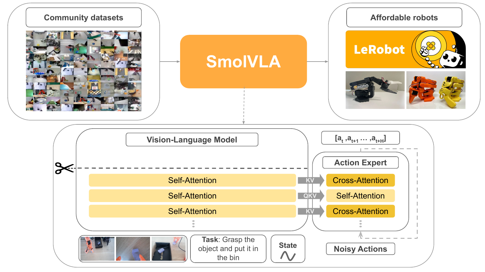

# 整体架构

SmolVLA 由两部分组成：一个负责感知的预训练 VLM，和一个负责生成动作的 action expert。VLM 把多路图像、语言指令和本体状态编码成特征，action expert 读这些特征、用 flow matching 生成一段连续动作块；生成的动作改变机器人状态，新的观测再回到 VLM，形成闭环。

## 本节目标

理解 SmolVLA 的架构：VLM 侧怎么把多模态输入拼成条件序列、action expert 侧怎么组织、两者靠什么连接，以及一段动作从噪声到输出的生成路径。

<figure>
  
  <figcaption>SmolVLA 架构。下半部分左侧是 VLM，多路图像、任务指令与本体状态拼成条件序列，经若干自注意力层编码；虚线剪刀表示只保留前一半层。右侧是 action expert，从噪声动作出发，交替用交叉注意力读 VLM 的 K/V、用自注意力在动作 token 间传递信息，输出一段动作块 [a_t, …, a_{t+H}]。图为论文框架示意。</figcaption>
</figure>

## VLM 侧：把多模态输入拼成条件序列

VLM 用的是 SmolVLM2，它由 SigLIP 视觉编码器和 SmolLM2 语言解码器组成。感知的三路输入在这里汇成一条序列：

- 视觉：多路 RGB 图像经 SigLIP 编码，再用一次 token 压缩把每帧的 token 数降到 64。
- 语言：任务指令按普通文本 tokenizer 切成文本 token。
- 本体状态：关节等状态量经一个线性层 `state_proj` 投影到语言模型的 token 维度，成为一个 prefix token。

视觉、语言、状态 token 拼接后送进 SmolLM2 的解码层。解码层输出的特征就是 action expert 的条件，动作生成全程读这份特征。把本体状态放在序列前缀，而不是接在动作端，是消融验证过更好的接入方式。

## action expert 侧：flow matching 条件 Transformer

action expert 记作 `v_θ`，是一个 flow matching 的条件 Transformer，任务是从 VLM 特征预测一段动作块 `A_t = (a_t, …, a_{t+n})`。它和 VLM 之间靠几个线性投影层对齐维度：`state_proj` 把状态投到 VLM 维度，`action_in_proj` 把动作投到 expert 维度，`action_out_proj` 再把 expert 输出投回动作维度，另有一路把 VLM 特征适配到 expert 的宽度。flow matching 的时间步 τ 经 `action_time_mlp` 编码后注入，时间步用 sine-cosine 位置编码，敏感区间由 `min_period` 和 `max_period` 界定。

expert 的每个 block 只含一种注意力，交叉注意力（CA）和自注意力（SA）交替排布，而不是像标准 VLM 解码块那样每层都同时有两种。CA 层让动作 token 去 cross-attend VLM 输出的 K/V，把感知信息引入；SA 层让动作 token 在块内互相注意，且加因果掩码，每个动作 token 只能看到块内更早的动作，避免依赖未来动作。为压低前向成本，expert 的隐藏维度取 VLM 的 0.75 倍。交替注意力与减窄的收益在[压缩单次前向](03-compress-single-forward.md)展开。

## 一段动作的生成路径

flow matching 学的是一个把噪声搬向动作的向量场。训练时在动作和噪声之间线性插值 `A_t^τ = τ·ε + (1-τ)·A_t`（τ=1 是纯噪声、τ=0 是动作），`v_θ` 从 VLM 特征和带噪动作预测向量场 `u = ε - A_t`，τ 从 Beta 分布采样（代码取 Beta(1.5, 1.0)）。

推理时不再采样 τ，而是从纯噪声出发做固定步数的数值积分。采样入口 `sample_actions` 里，起点 `x_t` 是标准正态噪声（对应 τ=1），步数取 `num_steps=10`，步长 `dt = -1/num_steps`，每步用 `v_θ` 算一次向量场再走一步欧拉 `x_t = x_t + dt·v_t`，把 τ 从 1 推向 0。VLM 前缀（视觉与语言 token）在进入积分循环前只前向一次，把 K/V 写入缓存；这 10 步只重复 action expert 的前向，交叉注意力层直接读缓存中的前缀 K/V，不再重算 VLM。整段 50 步的动作块在这一轮预测里一起得到，而非逐 token 解码。

训练只更新 action expert，VLM 骨干保持冻结，视觉编码器也冻结。骨干只用社区数据训练、不做机器人预训练，训练与数据的细节不在本页展开。

## 本页小结

- SmolVLA 分感知的 VLM 和生成动作的 action expert 两部分：VLM 把视觉、语言、状态拼成条件序列，action expert 读特征生成动作块。
- VLM 是 SmolVLM2（SigLIP 加 SmolLM2），视觉 token 压缩到 64/帧，本体状态经 `state_proj` 作 prefix token。
- action expert 是 flow matching 条件 Transformer，交替用 CA 读 VLM 的 K/V、用因果 SA 在动作块内传递信息，隐藏维度取 VLM 的 0.75 倍。
- 推理从噪声出发做 10 步欧拉积分，VLM 前缀编码一次并缓存 K/V、仅 action expert 逐步迭代，输出 50 步动作块；训练只更新 action expert，骨干冻结。

## 导航

- 上一节：[SmolVLA 是什么](01-what-is-smolvla.md)
- 返回上级：[SmolVLA](../01-smolvla.md)
- 下一节：[压缩单次前向](03-compress-single-forward.md)
